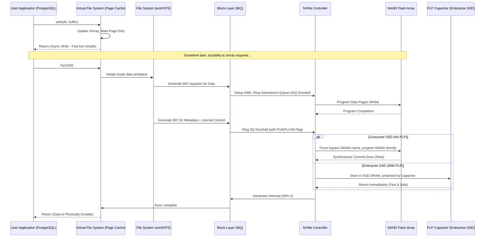

# `fsync()` and Data Durability: Anatomizing the Life-and-Death War Between Performance and Data Integrity

## Summary and Core Problem Statement

Anyone building distributed systems, relational databases, or applications where data integrity is non-negotiable — core banking transaction systems being the obvious example — eventually runs into the same wall: **data durability, the "D" in ACID**, isn't a nice-to-have. It's the whole point.

**The core problem:** how can software be certain that a row of data a user just saved will still be there even if someone yanks the power cord out of the server a millisecond later?

Sitting right at that boundary is the POSIX system call `fsync()`, along with its leaner sibling `fdatasync()`. This call marks a hard line between volatile memory (RAM) and non-volatile physical storage (HDD/SSD).

Calling `fsync()` forces the OS kernel to flush every dirty page from the page cache down to the storage device, and also tells the device controller to flush its own hardware cache down to the actual storage medium.

- **The illusion of speed:** skip `fsync()` and throughput looks fantastic. Writing to RAM takes a microsecond. But if power drops, that data is gone for good, and the database is left corrupted.
- **The performance tax:** call `fsync()` too often and performance collapses. The CPU thread has to block for milliseconds — thousands of times slower than a RAM write — waiting for electrons to actually get trapped inside the floating gates of a NAND flash chip. That creates a serious I/O bottleneck and chews through SSD lifespan via write amplification.

This article walks through the full storage stack — from user space, through the Linux kernel (VFS, block layer), down to the transistor level — to explain what `fsync()` actually does and how the databases you rely on every day manage to survive it.

---

## The Layered Storage Architecture and Caching

Modern computer architecture is built around a memory hierarchy, precisely because there's such a massive latency gap between the processor (operating near the speed of light) and secondary storage (which, by comparison, moves at a crawl).

### The Life of an Asynchronous `write()` Call

When an application — say, something written in Node.js or Python — calls `write()`, the data doesn't fly straight to the disk. It lands in the **page cache** first.

The page cache is managed by Linux's Virtual File System (VFS) and behaves like a sponge that soaks up write operations. The memory pages holding the new data get marked "dirty."

The `write()` call then returns success immediately. The application thinks the data is safe, but really it's just sitting in RAM. Kernel background threads (like `bdi_writeback`) will eventually gather up those dirty pages and flush them to disk, governed by tunables like `vm.dirty_ratio` and `vm.dirty_expire_centisecs`.

### Breaking Down the Latency

The latency of an asynchronous write ($L_{async}$) is made up of just a few cheap steps:
$$L_{async} = L_{syscall} + L_{copy\_to\_kernel} + L_{page\_cache\_update} + L_{lock\_contention}$$
That whole chain costs somewhere around 1 to 5 microseconds.

Call `fsync()`, though, and the thread is stuck. The synchronous latency ($L_{sync}$) has to travel through dozens of layers before it can return:
$$L_{sync} = L_{syscall} + L_{vfs\_flush} + L_{fs\_journal} + L_{block\_queue} + L_{pcie\_tlp} + L_{nvme\_ctrl} + L_{ftl\_mapping} + L_{nand\_prog}$$

The $L_{nand\_prog}$ term — the actual physical programming of the flash chip — alone costs anywhere from 200 microseconds on SLC chips to over 1500 microseconds on QLC, which is 300 to 1500 times slower than a plain RAM write. Add in building PCIe Transaction Layer Packets and contention in the block I/O scheduler, and the total adds up fast.

### The Enterprise Trick: PLP Capacitors and the FUA Flag

An SSD controller has its own onboard RAM to act as a disk write cache. When the OS issues `fsync()`, it attaches a specific flag to the PCIe command — either a `FLUSH` command or the `FUA` (Force Unit Access) bit.

`FUA` essentially tells the SSD: don't you dare park this in your internal RAM to fool me — write it into the NAND chip right now. That forced direct write is what makes plain SSDs painfully slow under sync-heavy workloads.

The enterprise answer is **PLP (Power Loss Protection) capacitors**. Enterprise-grade SSDs ship with onboard super-capacitors, which let the drive effectively ignore the FUA flag: it stashes the data in its own fast internal RAM and reports success back to the OS immediately. If power actually drops, the capacitor's stored charge buys the drive an extra 50-100 milliseconds to calmly flush whatever's left in RAM down to NAND. That single design difference is the main reason a database running on enterprise SSDs can be up to 50 times faster than the same workload on a consumer drive like a Samsung EVO, in write-heavy benchmarks.

---

## `fsync()` vs `fdatasync()` at the Micro-Architecture Level

Deep in the filesystem, calling `fsync()` doesn't just persist your data — it also has to persist metadata: file size, permissions, modification time, access time.

Say you append 10 bytes to a log file.
- Call `fsync()`, and the OS has to perform two separate physical I/O operations: one for the 10 bytes of data, one for the updated `mtime` in the file's inode.
- Constantly updating `mtime` on every write turns into wasted I/O amplification for no real benefit.

`fdatasync()` exists as a pragmatic compromise: it **only guarantees the durability of the data that makes up the file's actual content**, plus metadata *only when that metadata actually matters for reading the data back correctly* — like a change in file size. If all that changed was `mtime`, `fdatasync()` skips flushing it.

The relationship in terms of physical I/O requests ($N_{io}$):
$$N_{io}(\text{fdatasync}) \le N_{io}(\text{fsync})$$

Most serious database engines — MySQL's InnoDB, PostgreSQL's WAL — lean heavily on `fdatasync()` to protect throughput. Skipping one unnecessary metadata write per transaction commit can roughly double overall performance.

---

## Write Amplification Factor (WAF): The Silent Killer of NAND Flash

Calling `fsync()` too often doesn't just slow things down — it actively burns through your SSD.

NAND flash can't do in-place overwrites the way a spinning hard drive can. Every update has to go to a fresh, empty physical page (typically 16KB). The old page gets marked as garbage, and once free space runs low, the FTL controller kicks off garbage collection.

Here's the architectural catch: erasure happens at the block level (4MB to 16MB), while writes happen at the page level (16KB). Garbage collection has to pull an entire block into the SSD's RAM, pick out the pages still in use, relocate them elsewhere, then apply a high-voltage erase to wipe the whole block clean.

Picture a naive application writing a 100-byte log entry and calling `fsync()` on every single one. At the hardware level, the SSD can't just write 100 bytes — it has to burn an entire 16KB physical page to hold those 100 bytes, just to satisfy the FUA guarantee.

The write amplification factor equation:
$$WAF = \frac{\text{Total bytes of actual data flushed to NAND Flash}}{\text{Total bytes of data the Host OS requested to be written}} \approx \frac{S_{page}}{S_{payload}} + WAF_{GC\_overhead}$$

Write $S_{payload} = 100$ bytes into a $S_{page} = 16384$-byte page and your baseline WAF is already **163.8x** — for every 1GB you ask to write, the SSD physically writes about 163GB. The drive's TBW rating burns down that much faster, and GC has to run constantly, locking up the controller and creating tail-latency spikes that push p99 latency into the hundreds of milliseconds.

---

## How Database Engines Bend the Rules

Facing this seemingly impossible tradeoff between durability and throughput, database architects came up with a handful of clever, now-standard tricks.

### Group Commit

This is the mathematical sleight of hand that saved the entire industry from this problem. Instead of every transaction calling `fsync()` on its own, the engine does the following:
1. Transaction threads push their log entries into a memory ring buffer and go to sleep.
2. A leader flusher thread wakes up and collects everything currently waiting in that buffer — often hundreds of pending transactions.
3. The leader issues a single, large `fdatasync()` call covering all of them at once.
4. Once that physical I/O completes, the leader wakes every waiting thread and reports success to all of them simultaneously.

The naive throughput ceiling, without batching:
$$ \lambda_{naive} \approx \frac{1}{L_{fsync}} $$
If `fsync()` takes 1ms, you're capped at roughly 1000 TPS no matter how many CPU cores you throw at it.

With group commit, the ceiling changes shape entirely:
$$ \lambda_{group\_commit} = \min\left( \lambda_{max\_hardware\_io\_bandwidth}, \frac{\bar{N}_{batch}}{L_{fsync}} \right) $$
Batching ($\bar{N}_{batch}$) means throughput is no longer bound by seek latency — it approaches the raw bandwidth of the PCIe bus instead. And there's a nice self-correcting property here: the busier the system gets, the more threads pile up waiting, the larger the batch grows, and the more efficient the whole system becomes automatically.

### The `io_uring` Shift

The Linux kernel's `io_uring` interface replaces the old blocking `fsync()` model outright. Its two mmap'd queues shared between kernel and userspace — the submission queue (SQ) and completion queue (CQ) — eliminate a lot of the context-switching overhead that used to dominate.

Modern engines like ScyllaDB stuff tens of thousands of I/O commands tagged with `IORING_OP_FSYNC` into the SQ without ever parking a CPU thread to wait. Everything becomes event-driven — the CPU is free to do other work while the drive finishes writing.

### Direct I/O (`O_DIRECT`) vs Buffered I/O + `fsync()`

There's another fork in the road here: use the page cache and call `fsync()`, or bypass the page cache entirely with `O_DIRECT` and manage memory yourself, the way MySQL's InnoDB manages its own buffer pool?

- **`O_DIRECT`:** the application builds its own buffer pool and takes full responsibility for flushing dirty data. The upside is total control over the I/O lifecycle — the kernel can't second-guess you. Paired with `fsync()` (behavior varies by filesystem), this tends to deliver the most predictable performance for large-scale databases.
- **Buffered I/O:** much simpler to program against, and reads benefit from the OS cache automatically. The tradeoff shows up when `fsync()` is called — the application thread ends up absorbing whatever I/O storm the kernel's `bdi_writeback` decides to trigger at that moment.

---

## Looking Ahead: Storage-Class Memory and NVDIMM

As the underlying materials keep improving, storage-class memory (Intel Optane, NVDIMM) is starting to blur the line between RAM and SSD entirely. SCM plugs directly into a RAM slot — the DDR bus instead of PCIe — giving you non-volatile storage with nanosecond-scale access.

The key piece here is **DAX (Direct Access)**. Memory-map a DAX file and the filesystem skips the page cache and the block layer entirely. The whole `fsync()` machinery becomes irrelevant. Instead, the CPU just issues a `CLWB` (Cache Line Write Back) instruction paired with an `SFENCE` barrier, and data moves straight from a CPU register down to the SCM module — power-safe, in a few dozen nanoseconds. Databases using NVDIMM as their log tier sidestep the durability bottleneck completely, along with every headache around WAF and `fsync()` tuning.

---

## Lessons Learned and Best Practices

1. **Know the hardware you're actually running on.** Never put a write-heavy database on a consumer-grade SSD. The PLP capacitor on an enterprise drive is the one piece of "hardware magic" standing between `fsync()` and your system's performance.
2. **Reach for `fdatasync()` over `fsync()`.** In the vast majority of custom log/WAL implementations, you care about the data, not the `mtime` timestamp. Switching cuts out a meaningful chunk of wasted I/O.
3. **Batch, always.** Following the group commit principle, gather writes into reasonably large chunks (16KB, 64KB) in memory before flushing. Don't call `fsync()` after every few-byte log line — that's the fastest way to wreck both latency and SSD lifespan.
4. **Keep an eye on the kernel's dirty ratio.** If your application generates dirty pages faster than they get flushed, tune `vm.dirty_background_ratio` down (5% is a reasonable starting point) so the kernel cleans up gradually instead of letting pressure build to 20% and then stalling everything at once.
5. **Don't try to build your own database engine.** Reconciling ACID guarantees against the physical realities of I/O is genuinely hard. Lean on the work already done in InnoDB, RocksDB, or PostgreSQL.
