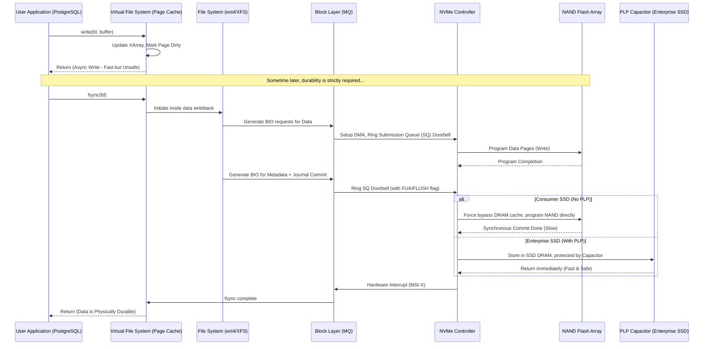

# 42: `fsync()` と Data Durability: パフォーマンスとデータ整合性がぶつかる場所

## 要約と中核となる問題

分散システムやRDBMS、あるいはコアバンキングのように一切のデータ欠損が許されないアプリケーションにとって、**データ耐久性(Data Durability, ACIDの"D")** は妥協できる領域ではない。

問うべき問いはシンプルだ。ユーザーが「保存」を押した瞬間のデータが、サーバーの電源プラグをその直後に誰かが乱暴に抜いたとしても本当に消えないと、ソフトウェアはどうやって保証できるのか。

その答えの中心にあるのが、POSIX標準のシステムコール`fsync()`と、その軽量版である`fdatasync()`だ。両者は揮発性メモリ(RAM)と不揮発性ストレージ(HDD/SSD)の境界線そのものを表している。`fsync()`を呼ぶと、OSカーネルはPage Cache上のダーティページをすべてストレージへフラッシュし、さらにデバイスコントローラーに対してもハードウェアキャッシュを物理メディアへ吐き出すよう命令する。

- **速度の錯覚:** `fsync()`を省くと体感スループットは非常に高くなる。RAMへの書き込みは1マイクロ秒で終わるからだ。しかし電源が落ちればデータは消え、データベースは構造的に破損する。
- **性能への代償:** `fsync()`を乱発すると性能は急落する。電子がNANDフラッシュのフローティングゲートに実際に捕捉されるまで、CPUスレッドは数ミリ秒――RAMの何千倍もの時間――ブロックされる。これが巨大なI/Oボトルネックを生み、Write Amplificationを通じてSSDの寿命も削っていく。

この記事ではユーザー空間からLinuxカーネル(VFS、Block Layer)、そして物理トランジスタのレベルまでストレージスタックを掘り下げ、`fsync()`のメカニズムと、主要なデータベースエンジンがこれにどう対処しているかを見ていく。

---

## ストレージシステムの階層構造とキャッシュの仕組み

現代のコンピュータアーキテクチャは、プロセッサと二次記憶装置の間にある桁違いのレイテンシ差を吸収するために、メモリ階層という原理の上に成り立っている。

### 非同期`write()`のライフサイクル

アプリケーション(NodeJSでもPythonでも構わない)が`write()`を呼んだとき、データがそのままディスクに書き込まれることはない。まず**Page Cache**へ入る。Page CacheはLinuxのVirtual File System(VFS)が管理しており、書き込みを一旦吸収するスポンジのような役割を果たす。新しいデータを含むメモリページは「ダーティ」としてマークされる。

`write()`はほぼ即座に`Success`を返す。アプリケーションはデータが安全だと思い込むが、実際はまだRAM上に浮いたままだ。カーネルのバックグラウンドワーカー(`bdi_writeback`など)が`vm.dirty_ratio`や`vm.dirty_expire_centisecs`といったパラメータに基づき、ダーティページを少しずつディスクへ流していく。

### レイテンシの分解

非同期書き込みのレイテンシ($L_{async}$)は次の要素だけで構成される。
$$L_{async} = L_{syscall} + L_{copy\_to\_kernel} + L_{page\_cache\_update} + L_{lock\_contention}$$
所要時間はわずか1〜5マイクロ秒だ。

ところが`fsync()`が呼ばれた瞬間、スレッドは足止めを食らう。同期レイテンシ($L_{sync}$)は何十もの層を通過することになる。
$$L_{sync} = L_{syscall} + L_{vfs\_flush} + L_{fs\_journal} + L_{block\_queue} + L_{pcie\_tlp} + L_{nvme\_ctrl} + L_{ftl\_mapping} + L_{nand\_prog}$$

中でも$L_{nand\_prog}$(NANDチップへの物理的な書き込み時間)は、SLCチップで200マイクロ秒、QLCチップだと1500マイクロ秒を超える――RAM書き込みに対して**300倍から1500倍**遅い計算になる。加えてPCIeのTransaction Layer Packet(TLP)の構築やBlock I/Oスケジューラでの競合も、このレイテンシに上乗せされる。

### エンタープライズの切り札: PLPキャパシタとFUAフラグ

SSDのコントローラーには、バッファ(Disk Write Cache)として使う専用のRAMが搭載されている。OSが`fsync()`を呼ぶと、PCIeコマンドに`FLUSH`フラグまたは`FUA`(Force Unit Access)ビットを付与しなければならない。

`FUA`フラグが伝えているのは、要するに「内部RAMに逃げ込ませるな、今すぐNANDチップに書き込め」ということだ。この強制的な直接書き込みによってSSDの速度は目に見えて落ちる。

エンタープライズ向けの解決策が**PLP(Power Loss Protection)キャパシタ**だ。大容量キャパシタを搭載したエンタープライズSSDは、FUAフラグを安全に「無視」できる。データを内部RAM(超高速)に置いた時点でOSへ成功を報告し、電源が落ちても、キャパシタに蓄えられたエネルギーが50〜100ミリ秒ほどの猶予を与え、その間にRAM上の残りデータをNANDへ書き切る。書き込み負荷の高いベンチマークで、エンタープライズSSD上のデータベースがコンシューマー向けSamsung EVOの50倍速いという結果が出るのは、この仕組みが理由だ。

---

## `fsync()`と`fdatasync()`のマイクロアーキテクチャ比較

ファイルシステムの内部では、`fsync()`はデータを書くだけでは済まない。ファイルサイズ、パーミッション、mtime、atimeといったメタデータも書き込む必要がある。

ログファイルの末尾に10バイト追記する場面を考えてみよう。
- `fsync()`を呼ぶと、OSは物理I/Oを2回実行する。1回は10バイトのデータのため、もう1回は`inode`構造体の`mtime`を更新するためだ。
- `mtime`をそのたびに更新するこの律儀さが、実質的には無駄なI/Oの増幅を生む。

`fdatasync()`はこの無駄を省くために生まれた。ファイルの内容そのものを構成するデータ部分の整合性だけを保証し、メタデータについては*ファイルサイズの拡張のように読み出しに影響する変更がある場合*にのみ書き込む。`mtime`だけが変わったケースでは、`fdatasync()`はメタデータのフラッシュをサボる。

物理I/O要求数($N_{io}$)の関係を式にすると次のようになる。
$$N_{io}(\text{fdatasync}) \le N_{io}(\text{fsync})$$

MySQLのInnoDBやPostgreSQLのWALなど、現代の主要なデータベース管理システムの多くはスループットを守るため`fdatasync()`を好む。トランザクションのコミットごとに不要なメタデータI/Oを1回減らせるだけで、全体の性能が2倍近く向上することも珍しくない。

---

## Write Amplification Factor(WAF): NANDフラッシュを蝕む存在

`fsync()`の乱用はシステムを遅くするだけでなく、SSDそのものを消耗させていく。

NANDフラッシュはHDDのようなインプレース上書きをサポートしない。データを更新するたびに、SSDは完全に空いている物理ページ(通常16KB)へ書き込む必要があり、古いページはゴミとしてマークされる。空き容量が尽きると、FTLがガベージコレクション(GC)を起動する。

ここに構造的な皮肉がある。書き込みはページ単位(16KB)で行われるのに、ゴミの消去はブロック単位(4MBから16MB程度)でしか行えない。GCはブロック全体をSSD内のRAMに読み込み、まだ使えるページを別の場所へ移してから、高電圧をかけてブロックごと消去する。

素朴な例で考えてみよう。ログを100バイト書くたびに`fsync()`を1回呼ぶアプリケーションがあるとする。ハードウェアレベルではSSDは100バイトだけを書くことができず、FUAの要求を満たすために16KBの物理ページをまるごと割り当てざるを得ない。

Write Amplification Factor(WAF)の式は次のとおりだ。
$$WAF = \frac{\text{Flash NANDにフラッシュされる実際のデータの合計バイト数}}{\text{Host OSが書き込みを要求したデータ構造の合計バイト数}} \approx \frac{S_{page}}{S_{payload}} + WAF_{GC\_overhead}$$

$S_{payload} = 100\text{ bytes}$を$S_{page} = 16384\text{ bytes}$のページに書き込む場合、基礎WAFだけですでに**163.8倍**になる。つまり1GBの書き込み要求に対し、SSDは実際には163GB相当を書き込むことになる。TBW(Terabytes Written)の消耗は急速に進み、GCが際限なく走ってコントローラーをロックし、p99レイテンシが数百ミリ秒に跳ね上がるテールレイテンシのピークも発生しやすくなる。

---

## データベースエンジンが編み出した回避策

durabilityとthroughputという二律背反に向き合う中で、ソフトウェアエンジニアたちはいくつかの定番手法を生み出してきた。

### Group Commit

データベース業界を救ったと言ってもいい仕組みだ。各トランザクションが個別に`fsync()`を呼ぶ代わりに、DBエンジンは次のように動く。
1. 各トランザクションスレッドはログをMemory Ring Bufferに積んでスリープする。
2. Leader Flusherと呼ばれるスレッドが起き、バッファに溜まった何百ものトランザクションをまとめて回収する。
3. Leaderがそれら全部を代表して、たった一度の`fdatasync()`を呼ぶ。
4. 物理I/Oが完了すると、Leaderは待機していた全スレッドを一斉に起こし、成功を報告する。

グループ化しない場合のスループット上限:
$$ \lambda_{naive} \approx \frac{1}{L_{fsync}} $$
`fsync()`に1ミリ秒かかるなら、CPUがいくつあろうと系全体では最大1000TPSしか出ない。

Group Commitを使った場合のスループット上限:
$$ \lambda_{group\_commit} = \min\left( \lambda_{max\_hardware\_io\_bandwidth}, \frac{\bar{N}_{batch}}{L_{fsync}} \right) $$
バッチ化($\bar{N}_{batch}$)することで、スループットはディスクのシークレイテンシに縛られなくなり、PCIeバスの帯域に近づいていく。おもしろいことに、システムが混雑して待機スレッドが増えるほど$N_{batch}$は大きくなり、結果として系はむしろ効率的に動くようになる。

### `io_uring`という転換点

Linuxカーネルに追加された`io_uring`は、従来のブロッキング型`fsync()`モデルを置き換える。カーネルとユーザー空間で共有される2つのmmapキュー――Submission Queue(SQ)とCompletion Queue(CQ)――により、コンテキストスイッチのコストがほぼ消える。

ScyllaDBのような現代のデータベースは、`IORING_OP_FSYNC`フラグを付けた数万件のI/OをCPUスレッドを待たせることなくSQに詰め込む。すべてがイベント駆動になり、ディスクが書き込みを進めている間もCPUは他の仕事に専念できる。

### `O_DIRECT`とBuffer I/O + `fsync()`

もう一つの設計上の分かれ道が、Page Cacheを使って`fsync()`を呼ぶか、`O_DIRECT`でPage Cacheを迂回し自前でメモリ管理をする(MySQLのInnoDB Buffer Poolのように)かという選択だ。
- `O_DIRECT`: アプリケーション自身がBuffer Poolを構築し、ダーティデータのフラッシュに責任を持つ。その代わりI/Oのライフサイクルを完全に掌握でき、OSカーネルに横取りされない。ファイルシステム次第だが、`O_DIRECT`と`fsync()`を組み合わせると大規模データベースで最も予測可能な性能が得られやすい。
- `Buffer I/O`: 実装は容易で、読み取り時にOSキャッシュの恩恵も受けられる。ただし`fsync()`を呼んだ瞬間、`bdi_writeback`が引き起こすI/Oの急増をアプリケーション側が丸ごと引き受けることになる。

---

## この先の姿: Storage-Class Memory(SCM)とNVDIMM

半導体技術の進化とともに、SCM(Intel OptaneやNVDIMMなど)がRAMとSSDの境界をどんどん曖昧にしている。SCMはRAMスロット(PCIeバスではなくDDRバス)に直接刺さり、不揮発性でありながらナノ秒単位のアクセス速度を持つ。

その中心にあるのが**DAX(Direct Access)**インターフェースだ。DAX対応のファイルをmmapすると、Page CacheもBlock Layerも完全に迂回される。かつて主役だった`fsync()`はほぼ出番を失う。代わりにCPUは`SFENCE`バリアを伴う`CLWB`(Cache Line Write Back)命令を発行するだけでいい。データはCPUのL1キャッシュからSCMモジュールへ、わずか数十ナノ秒で不揮発領域に到達する。NVDIMMをログキャッシュ層に使うデータベースは、durabilityのボトルネックをほぼ根本から解消し、WAFや`fsync()`にまつわる悩みを過去のものにできる。

---

## システムエンジニアへの教訓

1. **足元のハードウェアを理解する:** 書き込み負荷の高いデータベースをコンシューマー向けSSDの上で動かしてはいけない。エンタープライズSSDのPLPキャパシタこそが、`fsync()`が性能を殺さないようにする唯一無二の仕掛けだ。
2. **`fsync()`より`fdatasync()`を優先する:** 自前のログやWALを書く場合、多くはコンテンツそのものにしか関心がなく`mtime`はどうでもいい。`fdatasync()`に切り替えるだけで無駄なI/Oをかなり削れる。
3. **常にバッチ処理する:** Group Commitの考え方どおり、永続化が必要なログは16KBや64KBといった大きなチャンクにまとめてから`fsync`でディスクへ落とす。数バイトのログ行ごとにfsyncするのは避けたい。
4. **カーネルのDirty Ratioを制御する:** fsync前のダーティページが大量に溜まるアプリケーションなら、`vm.dirty_background_ratio`を低め(5%程度)に設定し、カーネルに少しずつ静かに掃除させる。20%まで放置してから一気に掃除させると、システムはI/O stallで完全に固まる。
5. **データベースエンジンを自作しようとしない:** 物理I/Oの上でACIDを成立させる難易度は非常に高い。InnoDB、RocksDB、PostgreSQLといった既存の巨人の肩に乗るのが賢明だ。

---
