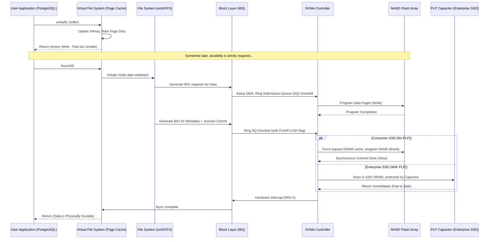

# 42: `fsync()` và Data Durability: Khi Hiệu Năng Và Toàn Vẹn Dữ Liệu Đối Đầu Nhau

## Tóm Tắt & Vấn Đề Cốt Lõi

Với các hệ phân tán, RDBMS, và những ứng dụng không được phép sai sót về dữ liệu — điển hình là hệ thống core banking — khái niệm **data durability (chữ "D" trong ACID)** là thứ không thể mặc cả.

Vấn đề nghe thì đơn giản: làm sao phần mềm chắc chắn được rằng dữ liệu vừa lưu sẽ không mất, kể cả khi máy chủ bị cúp điện đột ngột ngay sau đó? Nhưng để trả lời cho trọn vẹn lại kéo theo cả một chuỗi đánh đổi phức tạp.

Trung tâm của câu chuyện này là system call `fsync()` theo chuẩn POSIX, cùng biến thể nhẹ hơn của nó là `fdatasync()`. Đây chính là ranh giới giữa bộ nhớ dễ bay hơi (RAM) và thiết bị lưu trữ không bay hơi (HDD/SSD). Khi gọi `fsync()`, kernel buộc phải đẩy toàn bộ các trang dữ liệu bẩn (dirty pages) từ Page Cache xuống thiết bị lưu trữ, đồng thời yêu cầu bộ điều khiển của thiết bị xả nốt bộ đệm phần cứng của nó xuống bề mặt lưu trữ vật lý.

- **Cái bẫy tốc độ:** Không gọi `fsync()` cho cảm giác thông lượng rất cao — ghi vào RAM chỉ mất 1 micro-giây. Nhưng mất điện là dữ liệu bốc hơi, và cơ sở dữ liệu rơi vào trạng thái hỏng cấu trúc ngay lập tức.
- **Cái giá phải trả:** Gọi `fsync()` quá thường xuyên thì hiệu năng tụt không phanh. CPU bị chặn lại, đợi hàng mili-giây — chậm hơn RAM cả nghìn lần — cho tới khi electron thực sự nằm yên trong cổng nổi của chip NAND flash. Kết quả là một nút thắt I/O rõ rệt, cộng thêm SSD hao mòn nhanh hơn do Write Amplification.

Bài viết này sẽ đi từ user space, qua nhân Linux (VFS, Block Layer), xuống tận cấp transistor vật lý, để mổ xẻ cơ chế `fsync()` và cách các database engine lớn xoay xở với nó.

---

## Kiến Trúc Phân Tầng Lưu Trữ Và Bộ Nhớ Đệm

Máy tính hiện đại phân tầng bộ nhớ chính vì khoảng cách tốc độ giữa CPU và thiết bị lưu trữ thứ cấp là quá lớn để bỏ qua.

### Vòng Đời Một Lệnh `write()` Bất Đồng Bộ

Khi ứng dụng (NodeJS, Python...) gọi `write()`, dữ liệu không đi thẳng xuống đĩa. Nó dừng ở **Page Cache** — do Virtual File System (VFS) của Linux quản lý, đóng vai trò như một lớp đệm hấp thụ các thao tác ghi. Các trang chứa dữ liệu mới được gắn cờ "bẩn" (dirty).

`write()` trả về `Success` gần như tức thì. Ứng dụng tin rằng dữ liệu đã an toàn, nhưng thực ra nó vẫn còn nằm trong RAM. Các worker ngầm của kernel (như `bdi_writeback`) sẽ gom dần các trang bẩn và ghi xuống đĩa, dựa trên các tham số như `vm.dirty_ratio` hoặc `vm.dirty_expire_centisecs`.

### Mổ Xẻ Độ Trễ

Độ trễ ghi bất đồng bộ ($L_{async}$) gồm:
$$L_{async} = L_{syscall} + L_{copy\_to\_kernel} + L_{page\_cache\_update} + L_{lock\_contention}$$
Toàn bộ chỉ mất 1-5 micro-giây.

Nhưng ngay khi `fsync()` được gọi, luồng thực thi bị giữ lại chờ. Độ trễ đồng bộ ($L_{sync}$) phải đi qua hàng chục tầng:
$$L_{sync} = L_{syscall} + L_{vfs\_flush} + L_{fs\_journal} + L_{block\_queue} + L_{pcie\_tlp} + L_{nvme\_ctrl} + L_{ftl\_mapping} + L_{nand\_prog}$$

Thành phần $L_{nand\_prog}$ (thời gian lập trình vật lý của chip flash) tốn từ 200 micro-giây (SLC) đến hơn 1500 micro-giây (QLC) — chậm hơn ghi RAM từ **300 đến 1500 lần**. Cộng thêm chi phí đóng gói TLP của PCIe và tranh chấp tại Block I/O Scheduler, độ trễ tổng còn phình to hơn nữa.

### Tụ Điện PLP Và Cờ FUA: Vũ Khí Của SSD Doanh Nghiệp

Bộ điều khiển SSD có một thanh RAM riêng làm bộ đệm ghi (Disk Write Cache). Khi OS gọi `fsync()`, nó phải kèm theo cờ `FLUSH` hoặc bit `FUA` (Force Unit Access) trong lệnh PCIe.

Cờ `FUA` nói với SSD đại loại: "Đừng giữ dữ liệu trong RAM nội bộ nữa, ghi thẳng xuống NAND ngay đi." Việc ép ghi trực tiếp kiểu này làm tốc độ SSD giảm rõ rệt.

Cách mà SSD doanh nghiệp giải quyết là gắn **tụ điện PLP (Power Loss Protection)**. Nhờ nguồn năng lượng dự phòng này, SSD được phép "phớt lờ" cờ FUA một cách an toàn: nó ghi vào RAM nội bộ (rất nhanh) rồi báo thành công ngay lập tức. Nếu mất điện, tụ điện cấp thêm khoảng 50-100 mili-giây để SSD kịp xả nốt dữ liệu từ RAM xuống NAND. Đó là lý do vì sao một database chạy trên SSD Enterprise có thể nhanh hơn tới 50 lần so với chạy trên một ổ Samsung EVO tiêu dùng, trong các bài benchmark ghi nặng.

---

## So Sánh Chi Tiết: `fsync()` Và `fdatasync()`

Bên dưới lớp file system, `fsync()` không chỉ ghi mỗi dữ liệu. Nó còn phải ghi cả metadata: kích thước file, quyền hạn, mtime, atime.

Ví dụ bạn ghi thêm 10 byte vào cuối một file log:
- Với `fsync()`, hệ điều hành phải thực hiện 2 lần I/O vật lý riêng biệt — một để ghi 10 byte, một để cập nhật `mtime` trong `inode`.
- Cứ cập nhật `mtime` liên tục như vậy sẽ tạo ra một khoản khuếch đại I/O gần như thừa thãi.

`fdatasync()` ra đời để tránh đúng khoản phí này: nó chỉ đảm bảo phần dữ liệu thực sự cấu thành nội dung file, cộng thêm metadata *chỉ khi metadata đó ảnh hưởng đến việc đọc lại dữ liệu sau này* (ví dụ tăng kích thước file). Nếu chỉ `mtime` thay đổi, `fdatasync()` không buồn đẩy metadata xuống đĩa.

Về số I/O vật lý ($N_{io}$):
$$N_{io}(\text{fdatasync}) \le N_{io}(\text{fsync})$$

Đa số hệ quản trị cơ sở dữ liệu hiện đại — InnoDB của MySQL, WAL của PostgreSQL — chọn `fdatasync()` để giữ throughput. Chỉ cần cắt được một I/O metadata dư thừa mỗi lần commit, hiệu năng tổng thể có thể tăng gấp đôi.

---

## Write Amplification Factor (WAF): Kẻ Bào Mòn NAND Flash

Lạm dụng `fsync()` không chỉ làm chậm hệ thống — nó còn đốt tuổi thọ SSD một cách âm thầm.

NAND flash không hỗ trợ ghi đè tại chỗ như HDD. Mỗi lần cập nhật dữ liệu, SSD phải ghi vào một trang vật lý trống hoàn toàn (thường 16KB). Trang cũ trở thành rác. Khi ổ hết chỗ trống, FTL kích hoạt Garbage Collection (GC).

Điều trớ trêu là: GC buộc phải xóa ở cấp Block (4-16MB), trong khi ghi diễn ra ở cấp Page (16KB). GC phải nạp cả block lên RAM của SSD, chọn ra các trang còn dùng được để ghép sang chỗ khác, rồi dùng điện áp cao xóa trắng cả block đó.

Thử hình dung một ứng dụng thiếu kinh nghiệm, cứ ghi 100 byte log lại gọi `fsync()`. Ở cấp phần cứng, SSD không thể ghi đúng 100 byte — nó buộc phải cấp phát cả một trang vật lý 16KB, chỉ để thỏa mãn yêu cầu FUA.

Công thức WAF:
$$WAF = \frac{\text{Tổng Bytes dữ liệu thực tế đẩy xuống Flash NAND}}{\text{Tổng Bytes cấu trúc dữ liệu Host OS yêu cầu ghi}} \approx \frac{S_{page}}{S_{payload}} + WAF_{GC\_overhead}$$

Với $S_{payload} = 100\text{ bytes}$ ghi vào trang $S_{page} = 16384\text{ bytes}$, WAF cơ sở đã là **163.8 lần**. Ghi 1GB dữ liệu, SSD thực chất phải ghi khoảng 163GB. TBW (Terabytes Written) tụt nhanh, GC chạy liên tục, khóa cứng bộ điều khiển, khiến p99 latency có lúc vọt lên hàng trăm mili-giây.

---

## Những Cách "Lách Luật" Của Các Database Engine

Đứng giữa nghịch lý durability và throughput, kỹ sư database đã tìm ra vài cơ chế đáng chú ý.

### Group Commit

Có thể coi đây là phát minh cứu cả ngành database. Thay vì mỗi transaction tự gọi `fsync()`, engine sẽ:
1. Các luồng giao dịch đẩy log vào một Memory Ring Buffer rồi ngủ.
2. Một luồng Leader Flusher thức dậy, gom hết các giao dịch đang chờ trong buffer.
3. Leader gọi một lệnh `fdatasync()` duy nhất, đại diện cho tất cả.
4. Khi I/O hoàn tất, Leader đánh thức toàn bộ các luồng khách hàng cùng lúc.

Giới hạn thông lượng khi không gom nhóm:
$$ \lambda_{naive} \approx \frac{1}{L_{fsync}} $$
Nếu `fsync()` mất 1ms, hệ thống chỉ đạt tối đa 1000 TPS, bất kể có bao nhiêu CPU rảnh rỗi.

Giới hạn thông lượng với Group Commit:
$$ \lambda_{group\_commit} = \min\left( \lambda_{max\_hardware\_io\_bandwidth}, \frac{\bar{N}_{batch}}{L_{fsync}} \right) $$
Khi gom nhóm ($\bar{N}_{batch}$), thông lượng thoát khỏi giới hạn của độ trễ seek, tiệm cận băng thông của bus PCIe. Có một nghịch lý thú vị ở đây: hệ thống càng bận, số luồng chờ càng nhiều, $N_{batch}$ càng lớn, và hệ thống lại càng chạy hiệu quả hơn.

### `io_uring` Và Sự Thay Đổi

Linux Kernel bổ sung `io_uring`, thay thế mô hình `fsync()` chặn truyền thống. Hai hàng đợi mmap chia sẻ giữa kernel và user-space — Submission Queue (SQ) và Completion Queue (CQ) — giúp loại bỏ chi phí context switching.

Các database hiện đại như ScyllaDB đẩy hàng vạn lệnh I/O kèm cờ `IORING_OP_FSYNC` vào SQ mà CPU không phải đứng chờ chút nào. Toàn bộ mô hình chuyển sang event-driven — CPU rảnh tay làm việc khác trong khi ổ cứng vẫn đang xử lý phía sau.

### `O_DIRECT` So Với Buffer I/O + `fsync()`

Một lựa chọn kiến trúc khác: dùng Page Cache rồi gọi `fsync()`, hay bỏ qua Page Cache bằng `O_DIRECT` và tự quản lý bộ nhớ (như InnoDB Buffer Pool)?
- `O_DIRECT`: ứng dụng phải tự dựng Buffer Pool, tự chịu trách nhiệm flush dữ liệu bẩn. Đổi lại là kiểm soát toàn bộ vòng đời I/O, không bị kernel can thiệp bất ngờ. Kết hợp `O_DIRECT` với `fsync()` (tùy file system) thường cho hiệu năng dự đoán được tốt nhất ở quy mô lớn.
- `Buffer I/O`: dễ lập trình hơn, tận dụng OS cache khi đọc. Nhưng khi gọi `fsync()`, ứng dụng phải chịu hậu quả của làn sóng I/O do `bdi_writeback` gây ra.

---

## Tương Lai: Storage-Class Memory (SCM) Và NVDIMM

Khi công nghệ bán dẫn tiến bộ, SCM (Intel Optane, NVDIMM) đang làm mờ ranh giới giữa RAM và SSD. SCM cắm trực tiếp vào khe RAM (bus DDR thay vì PCIe), lưu trữ không bay hơi nhưng truy xuất nhanh cỡ nano-giây.

Công cụ trung tâm là giao diện **DAX (Direct Access)**. Khi mmap một file DAX, hệ thống tệp bỏ qua hoàn toàn cả Page Cache lẫn Block Layer. `fsync()` gần như không còn cần thiết. Thay vào đó, CPU chỉ cần gọi lệnh `CLWB` (Cache Line Write Back) kèm hàng rào `SFENCE`. Dữ liệu đi thẳng từ thanh ghi CPU (L1 Cache) xuống module SCM, an toàn với điện năng chỉ trong vài chục nano-giây. Các database dùng NVDIMM làm log cache gần như giải quyết trọn vẹn bài toán durability, không còn phải lo về WAF hay `fsync()` nữa.

---

## Bài Học Cho Kỹ Sư Hệ Thống

1. **Hiểu rõ phần cứng đang chạy bên dưới:** đừng triển khai một hệ database ghi nặng trên SSD tiêu dùng. Tụ điện PLP trên SSD Enterprise là thứ duy nhất giúp `fsync()` không phá hủy hiệu năng hệ thống.
2. **Chọn `fdatasync()` thay vì `fsync()`:** đa số trường hợp viết log/WAL tùy chỉnh chỉ cần nội dung dữ liệu, không cần `mtime`. `fdatasync()` cắt bớt một lượng I/O thừa đáng kể.
3. **Luôn gom nhóm dữ liệu:** áp dụng tinh thần Group Commit — gom dữ liệu thành chunk lớn (16KB hoặc 64KB) trên RAM trước khi flush bằng `fsync`. Đừng fsync cho từng dòng log vài byte.
4. **Kiểm soát Dirty Ratio của kernel:** nếu ứng dụng sinh nhiều dirty pages chưa kịp fsync, hạ `vm.dirty_background_ratio` xuống thấp (khoảng 5%) để kernel dọn dần. Để nó dồn lên 20% mới dọn một lượt, hệ thống dễ bị I/O stall.
5. **Đừng tự viết database engine nếu không thật sự cần:** việc dung hòa ACID với I/O vật lý phức tạp hơn nhiều so với vẻ ngoài. Hãy tận dụng những gì InnoDB, RocksDB, hay PostgreSQL đã xây sẵn.

---
