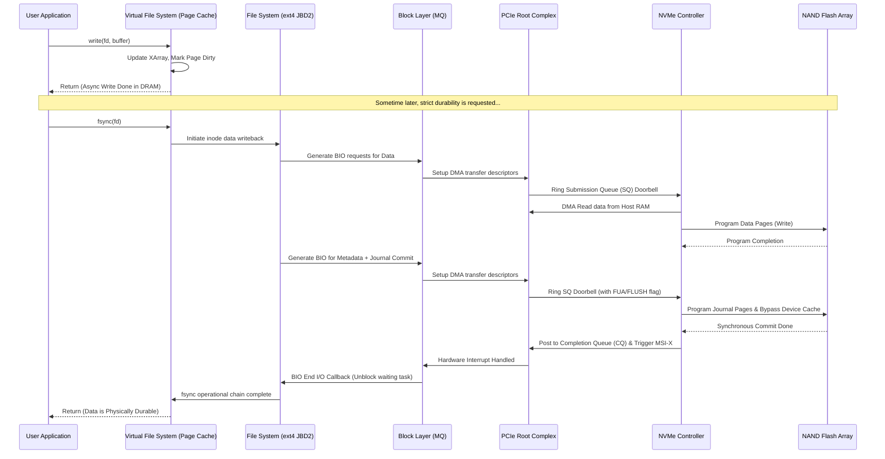

# 42: fsync() và Data Durability: Cuộc chiến giữa Hiệu năng và An toàn

Trong các hệ thống phân tán, cơ sở dữ liệu quan hệ, và các ứng dụng đòi hỏi tính toàn vẹn dữ liệu nghiêm ngặt, khái niệm tính bền bỉ của dữ liệu (data durability) đóng vai trò nền tảng không thể thỏa hiệp. Trung tâm của cuộc tranh luận học thuật và kỹ thuật xoay quanh tính bền bỉ chính là lời gọi hệ thống (system call) `fsync()` trong tiêu chuẩn POSIX, cùng với biến thể của nó là `fdatasync()`. Lời gọi hệ thống này đại diện cho một ranh giới kiến trúc rõ ràng giữa trạng thái bộ nhớ dễ bay hơi (volatile memory) và thiết bị lưu trữ vật lý không bay hơi (non-volatile storage). Việc thực thi `fsync()` đòi hỏi hệ điều hành phải đẩy (flush) toàn bộ các trang dữ liệu bẩn (dirty pages) liên kết với một tệp tin cụ thể từ bộ đệm trang (page cache) xuống thiết bị lưu trữ, đồng thời phát lệnh yêu cầu bộ điều khiển thiết bị (device controller) xả bộ đệm phần cứng (hardware cache) của chính nó xuống phương tiện lưu trữ từ tính hoặc bán dẫn tĩnh. Cuộc chiến giữa hiệu năng và an toàn xuất phát từ việc quá trình đồng bộ hóa này phá vỡ hoàn toàn các cơ chế tối ưu hóa độ trễ mà hệ điều hành và vi điều khiển ổ đĩa đã dày công xây dựng, buộc luồng thực thi phải chặn (block) và chờ đợi hàng triệu chu kỳ xung nhịp CPU cho đến khi các electron thực sự được bẫy thành công bên trong các cổng nổi (floating gates) của bộ nhớ NAND flash hoặc các domain từ tính trên đĩa từ được sắp xếp ổn định. Việc không sử dụng `fsync()` mang lại ảo giác về thông lượng (throughput) cực cao thông qua các thao tác ghi bất đồng bộ vào bộ nhớ RAM, nhưng lại mở ra một lỗ hổng nghiêm trọng về khả năng mất mát hoặc hỏng hóc dữ liệu (data corruption) trong trường hợp mất điện đột ngột hoặc hệ thống gặp sự cố hoảng loạn nhân (kernel panic). Ngược lại, việc lạm dụng `fsync()` dẫn đến hiện tượng suy thoái hiệu năng nghiêm trọng, khuếch đại hiện tượng ghi (write amplification) trên ổ cứng thể rắn (SSD), và tạo ra các điểm nghẽn (bottlenecks) khổng lồ trong đường ống nhập xuất (I/O pipeline). Do đó, việc hiểu rõ vi kiến trúc, hành vi của hệ điều hành, và các giới hạn phần cứng khi xử lý lệnh đồng bộ hóa dữ liệu là điều kiện tiên quyết để các kỹ sư phần mềm thiết kế được các hệ thống lưu trữ đạt được sự cân bằng tối ưu theo định lý CAP hoặc PACELC. Bài viết kỹ thuật này sẽ tiến hành giải phẫu chi tiết toàn bộ kiến trúc ngăn xếp (stack) lưu trữ từ không gian người dùng (user space) xuống tận cấp độ bóng bán dẫn (transistor level) để làm sáng tỏ cơ chế hoạt động thực sự của `fsync()`.

## Kiến trúc phân tầng của hệ thống lưu trữ và cơ chế bộ nhớ đệm

Kiến trúc máy tính hiện đại được xây dựng dựa trên nguyên lý phân tầng bộ nhớ nhằm dung hòa sự chênh lệch độ trễ khổng lồ giữa vi xử lý (nhanh nhưng dung lượng nhỏ) và thiết bị lưu trữ thứ cấp (chậm nhưng dung lượng lớn). Khi một ứng dụng thực hiện lời gọi `write()`, dữ liệu không di chuyển trực tiếp đến ổ đĩa vật lý. Thay vào đó, dữ liệu được nhân bản từ không gian địa chỉ ảo của tiến trình vào không gian bộ nhớ hạt nhân (kernel space), cụ thể là vào cấu trúc dữ liệu Page Cache do hệ thống tệp ảo (Virtual File System - VFS) quản lý thông qua đối tượng `address_space`. Page Cache hoạt động như một lớp đệm hấp thụ các thao tác ghi nhỏ lẻ và ngẫu nhiên, cho phép ứng dụng tiếp tục thực thi ngay lập tức với độ trễ chỉ ở mức microsecond. Các trang bộ nhớ (memory pages) chứa dữ liệu mới được đánh dấu là trạng thái "bẩn" (dirty). Hạt nhân Linux sử dụng một cấu trúc dữ liệu XArray (trước đây là Radix Tree) tinh vi kết hợp với cơ chế khóa toàn cục và khóa theo trang (`page_lock`) để theo dõi, đồng thời tra cứu các trang bẩn này một cách cực kỳ hiệu quả, với độ phức tạp thời gian tiệm cận $O(1)$ cho các thao tác tìm kiếm mảng phân tán. Hàng đợi đệm ghi lại (writeback daemon), điển hình là các luồng worker `bdi_writeback` trong Linux, sẽ chạy ngầm theo chu kỳ hoặc khi tỷ lệ bộ nhớ bẩn vượt quá một ngưỡng cấu hình nhất định (như `vm.dirty_ratio` hoặc `vm.dirty_background_ratio`), để tiến hành gom nhóm và đẩy dữ liệu xuống các lớp thấp hơn. Tuy nhiên, sự tiện lợi này ẩn chứa một rủi ro chí mạng: toàn bộ khối lượng dữ liệu nằm trong Page Cache tồn tại hoàn toàn trong môi trường DRAM dễ bay hơi. Bất kỳ sự cố gián đoạn cung cấp điện nào xảy ra trước khi `bdi_writeback` hoàn thành nhiệm vụ đều sẽ dẫn đến việc mất vĩnh viễn các giao dịch chưa được đồng bộ, phá vỡ tính chất Durability trong mô hình ACID của cơ sở dữ liệu. 

Để mô hình hóa độ trễ tổng thể của một thao tác ghi, chúng ta cần xem xét độ tinh lưu của từng tầng logic. Độ trễ của một thao tác ghi bất đồng bộ (chỉ chạm tới Page Cache) có thể được biểu diễn thông qua phương trình: $$L_{async} = L_{syscall} + L_{copy\_to\_kernel} + L_{page\_cache\_update} + L_{lock\_contention}$$ Trong trường hợp này, $L_{async}$ thường nằm trong khoảng từ 1 đến 5 microsecond trên các vi xử lý hiện đại, phần lớn phụ thuộc vào tốc độ bộ nhớ RAM và băng thông bus nội bộ. Tuy nhiên, khi một lời gọi `fsync()` được kích hoạt một cách tường minh, luồng thực thi bị tước đi quyền sử dụng cơ chế đệm này. Độ trễ đồng bộ hóa toàn diện được tính bằng tổng hợp độ trễ của tất cả các tầng kiến trúc vật lý và logic bên dưới, được mô tả bởi công thức phức tạp hơn rất nhiều: $$L_{sync} = L_{syscall} + L_{vfs\_flush} + L_{fs\_journal} + L_{block\_queue} + L_{pcie\_tlp} + L_{nvme\_ctrl} + L_{ftl\_mapping} + L_{nand\_prog}$$ Sự khác biệt về mặt độ lớn giữa $L_{async}$ và $L_{sync}$ không phải là vài phần trăm, mà là nhiều bậc độ lớn (orders of magnitude). Đặc biệt, cấu phần $L_{nand\_prog}$ đại diện cho thời gian lập trình vật lý của các cell NAND flash, thao tác này có thể tốn từ 200 microsecond đối với các thiết bị chip SLC (Single-Level Cell) lên đến con số khủng khiếp là hơn 1500 microsecond (1.5 millisecond) đối với nền tảng chip QLC (Quad-Level Cell). Thêm vào đó, việc đẩy dữ liệu thông qua hạt nhân còn phải đi qua hàng đợi lập lịch I/O của khối (Block Layer I/O Scheduler, chẳng hạn như MQ-Deadline, BFQ hoặc Kyber). Tại đây, các yêu cầu cấu trúc I/O block (Bio) có thể bị đình trệ do tranh chấp tài nguyên (resource contention) với các tiến trình nhập xuất nền khác. Các rào cản từ giao thức PCIe (Peripheral Component Interconnect Express) thông qua các Gói Lớp Giao Dịch (Transaction Layer Packets - TLP) cũng đóng góp một khoảng trễ không nhỏ vào tổng số $L_{pcie\_tlp}$, đặc biệt là chi phí quá giang tại Root Complex của bộ xử lý trung tâm.



Không dừng lại ở lớp hệ điều hành, bản thân ổ đĩa vật lý cũng tích hợp một bộ đệm DRAM bên trong (Disk Write Cache) nhằm tối ưu hóa thông lượng IOPS ngẫu nhiên và ngụy trang đi độ trễ nội tại chậm chạp của phương tiện lưu trữ flash. Khi khối dữ liệu thực hiện hành trình vượt qua bus PCIe và đến được bộ điều khiển NVMe (NVMe Controller), bộ điều khiển này thường quyết định lưu trữ khối dữ liệu đó tạm thời vào DRAM nội bộ của thiết bị và báo cáo trạng thái hoàn thành ngay lập tức thông qua hàng đợi CQ (Completion Queue) trở lại cho hệ điều hành. Kỹ thuật này được biết đến dưới tên gọi write-back caching ở cấp độ thiết bị (device-level write-back). Mặc dù làm tăng thông lượng cục bộ một cách đáng ngạc nhiên, trạng thái này là cực kỳ nguy hiểm về mặt toàn vẹn. Để đảm bảo dữ liệu thực sự đến được NAND flash (vượt qua bộ đệm tạm) khi có yêu cầu `fsync()` khẩn cấp, hệ điều hành thiết lập các cờ phát hành các lệnh rào chắn ghi (write barriers), cụ thể như lệnh `FLUSH` tiêu chuẩn trong đặc tả ATA hoặc cờ bit `FUA` (Force Unit Access) được quy định chặt chẽ trong chuẩn NVMe. Việc kích hoạt cờ lệnh `FUA` trong các gói TLP chỉ thị ép buộc bộ điều khiển SSD bỏ qua hoàn toàn cơ chế đệm DRAM nội bộ hoặc buộc nó phải thực hiện xả (flush) ngay lập tức toàn bộ hàng đợi dữ liệu đang mắc kẹt trong RAM vi điều khiển xuống chip flash trước khi được phép kích hoạt ngắt MSI-X trả về tín hiệu hoàn thành. Trong thị trường doanh nghiệp, các thiết bị SSD Enterprise giải quyết bài toán nút thắt hiệu năng này thông qua việc tích hợp các tụ điện siêu dung lượng bảo vệ khi mất điện (Power Loss Protection - PLP capacitors). Nhờ có hệ thống PLP, SSD doanh nghiệp hoàn toàn có khả năng phớt lờ chi phí độ trễ của cờ FUA và tiếp tục sử dụng DRAM nội bộ để phản hồi lời gọi `fsync()` ở tốc độ tối đa của bus PCIe. Luận điểm kỹ thuật ở đây là tụ điện PLP đảm bảo cung cấp đủ mức năng lượng dự phòng (hold-up time) để bộ điều khiển thiết bị hoàn tất việc sao chép nốt lượng dữ liệu từ DRAM vào NAND flash an toàn trong khoảng thời gian cửa sổ chết (dying gasp) kéo dài vài chục mili-giây khi nguồn điện máy chủ chính bị cắt đột ngột. Đây là khác biệt cốt lõi sinh ra khoảng cách hiệu năng khổng lồ lên tới hàng trăm lần của cơ sở dữ liệu khi triển khai trên phần cứng SSD tiêu dùng so với SSD cấu hình doanh nghiệp dưới bài kiểm tra ghi đồng bộ.

## Phân tích vi kiến trúc của fsync() và các thuật toán đồng bộ hóa dữ liệu

Sâu bên trong lớp cấu trúc hệ thống tệp (file system layout), việc thực thi hệ thống `fsync()` không đơn giản chỉ là thao tác sao chép byte thô. Nó đóng vai trò như một tác nhân đánh thức chuỗi các thuật toán đồng bộ hóa trạng thái vô cùng phức tạp liên quan mật thiết đến tính toàn vẹn của siêu dữ liệu (metadata integrity) và cơ chế vận hành ghi nhật ký (journaling). Các hệ thống tệp cấp phát động tiên tiến như ext4, XFS hay Btrfs không chỉ chịu trách nhiệm quản lý trực tiếp dữ liệu thô của người dùng mà còn phải bảo trì một cách đồng thời một tập hợp lớn các cấu trúc dữ liệu tổ chức nội bộ đa chiều bao gồm cấu trúc inode, dentry, allocation bitmaps (bản đồ cấp phát khối), và extent trees (cây phân mảnh không gian). Giả thuyết hệ thống bị mất năng lượng ngay giữa quá trình ghi, trong khi một số block dữ liệu đã hạ cánh xuống đĩa nhưng siêu dữ liệu inode tương ứng lại chưa kịp được cập nhật trạng thái đồng bộ (ví dụ: kích thước metadata của tệp chưa phản ánh đúng chiều dài mới, hoặc các block mới được cấp phát chưa được đánh dấu là không còn trống trong bitmap), hệ thống tệp sẽ rơi thẳng vào trạng thái bất đồng bộ vĩnh viễn (inconsistent state). Hậu quả là phân vùng lưu trữ bắt buộc phải trải qua quá trình quét lỗi thảm họa tốn kém hàng giờ đồng hồ bởi các công cụ phục hồi ngoại tuyến như `fsck`. Để triệt tiêu rủi ro thảm họa này, nền tảng ext4 vận hành một hệ thống ghi nhật ký khối (block journaling system) nội bộ dưới tên mã JBD2 (Journaling Block Device 2). JBD2 hoạt động tuân thủ nguyên tắc cơ chế commit hai giai đoạn (two-phase commit) kết hợp chặt chẽ cùng mô hình giao dịch nguyên tử (atomic transactions). Dưới chế độ định tuyến mặc định phổ biến nhất là `data=ordered`, khi `fsync()` được ứng dụng gọi, hệ thống tệp trước tiên bắt buộc phải điều phối đẩy các trang dữ liệu thô (data payload blocks) xuống thiết bị đĩa vật lý. Yêu cầu tiên quyết là chỉ sau khi phần cứng ngắt xác nhận bằng I/O interrupt rằng dữ liệu thô đã thực sự được lưu hóa, hệ thống tệp mới tiếp tục giai đoạn hai: đóng gói siêu dữ liệu cùng với một khối mô tả chuyên dụng (descriptor block) và tiến hành ghi chúng vào phân vùng không gian vòng tròn của vùng nhật ký (journal area). Cuối cùng, một khối cấu trúc cam kết (commit block) mang theo cờ đồng bộ FUA được ghi một cách độc lập để đánh dấu chốt lại toàn bộ giao dịch nguyên tử. Toàn bộ chuỗi quy trình nhiều bước này sinh ra hàng loạt rào chắn vòng lặp phản hồi (feedback loop barriers) liên tục đòi hỏi xác nhận đắt đỏ đối với thiết bị vật lý, trực tiếp nhân hệ số số lần thao tác chuyển đổi ngữ cảnh và làm trầm trọng thêm áp lực vào hàng đợi phần cứng.

Trong khi `fsync()` đòi hỏi quy chuẩn khắt khe, một sự khác biệt vô cùng tinh tế nhưng mang tính quyết định to lớn về mặt hiệu năng tồn tại ở dạng lệnh song sinh của nó là `fdatasync()`. Dựa trên đặc tả giao diện POSIX tiêu chuẩn, hàm `fsync()` bị ràng buộc nghiêm ngặt trong việc yêu cầu đồng bộ hóa không những toàn bộ khối dữ liệu tệp mà còn bắt buộc hạ cánh toàn bộ các thay đổi thông tin siêu dữ liệu (thường xuyên nhất là trường thời gian truy cập `atime` hay thời gian chỉnh sửa lần cuối `mtime`). Sự ngặt nghèo trong việc liên tục cập nhật trường thời gian `mtime` chỉ vì một vài byte dữ liệu mới được ghi thêm vào tệp sẽ ép hệ thống tệp phải thực hiện thêm thao tác vật lý đẩy khối metadata inode liên đới xuống đĩa trong mỗi một vòng lặp gọi hàm, tạo ra một mức độ khuếch đại tác vụ I/O hoàn toàn vô bổ đối với tính toàn vẹn của nội dung. Chiều ngược lại, chỉ thị `fdatasync()` được cấu trúc để cung cấp sự nhượng bộ an toàn: nó chỉ đảm bảo phần dữ liệu trực tiếp cấu thành nội dung cốt lõi của tệp tin có thể được tái cấu trúc và truy xuất an toàn nguyên vẹn sau chu kỳ sập nguồn. Đặc biệt hơn, hàm này áp dụng nguyên tắc lười biếng (lazy metadata sync) bằng cách chỉ ép buộc các thao tác đồng bộ hóa siêu dữ liệu diễn ra khi và chỉ khi những biến đổi siêu dữ liệu đó có tính chất phá vỡ (breaking changes) nếu không được lưu lại để phục vụ quá trình định vị dữ liệu ở lần khởi động sau. Một ví dụ tiêu biểu là khi thao tác ghi làm gia tăng đột biến kích thước tệp (file size extension), đòi hỏi hệ thống phải cập nhật sơ đồ phân bổ extent allocation tree mới để định danh block. Nếu cấu trúc extent bị mất, dữ liệu mới dù đã nằm trên đĩa cũng trở thành các khối mồ côi (orphan blocks) vô giá trị. Bằng cách lược bỏ tối đa số lượng các thao tác I/O thừa thải liên đới tới việc xoay vòng con trỏ thời gian cập nhật timestamp, lệnh `fdatasync()` cung cấp một lợi thế hiệu năng IOPS áp đảo ở cấp số nhân cho các nền tảng kiến trúc lưu trữ nối đuôi cường độ cao như Write-Ahead Log (WAL) của PostgreSQL hay quá trình ghi commit log của Apache Kafka. Mối tương quan toán học chặt chẽ biểu diễn số lượng yêu cầu I/O lệnh vật lý (I/O physical requests - $N_{io}$) bộc phát ra hệ thống có thể được thiết lập như một bất đẳng thức: $$N_{io}(\text{fdatasync}) \le N_{io}(\text{fsync})$$ Hệ quả của sự bảo toàn băng thông I/O thao tác siêu dữ liệu này trực tiếp kéo theo sự suy giảm khổng lồ trong tỷ lệ độ hao mòn vật lý cho các cell lưu trữ NAND flash. Biến số đại diện cho hiện tượng tổn thương vật lý này được chuyên ngành định lượng hóa thông qua hệ số cực kỳ quan trọng: Hệ số khuếch đại ghi (Write Amplification Factor - WAF).

Mô hình hóa sâu hơn về hệ số khuếch đại ghi (WAF) là một bài toán giải phẫu không thể bỏ qua khi đánh giá mức độ phá hoại của việc lạm dụng lệnh `fsync()`. Đặc tính vật lý bán dẫn của cổng nổi trong chip NAND flash hoàn toàn không hỗ trợ cơ chế ghi đè cập nhật tại chỗ (in-place update) như từ trường truyền thống; mỗi khi một dữ liệu mới được cập nhật, vi điều khiển phải đánh dấu (invalidate) bản sao cũ, rồi tiến hành nạp điện lập trình tín hiệu vào các trang vật lý (physical pages) còn hoàn toàn trống. Khi chu kỳ nạp đẩy ổ đĩa SSD tiến tới giới hạn hết dung lượng trống có sẵn, một siêu thuật toán phần sụn phức tạp mang tên Thu gom Rác (Garbage Collection - GC) nằm bên trong phân khu Lớp Dịch Flash (Flash Translation Layer - FTL) tự động thức giấc. Thuật toán này thi hành một chu trình đọc-sửa-ghi đắt đỏ: đọc hàng loạt các khối lớn (blocks - tập hợp của hàng trăm pages), di dời lọc lại các trang dữ liệu vẫn còn giá trị hợp lệ sang không gian khác, sau đó tiến hành kích hoạt dòng điện cao áp nhằm xóa sạch toàn bộ khối vật lý đó để giải phóng. Bi kịch về kiến trúc sinh ra từ sự lệch pha về giới hạn vật lý: thao tác xóa bắt buộc diễn ra ở đơn vị cấp độ siêu khối (ví dụ từ 4MB đến 16MB), trong khi thao tác lập trình ghi lại chỉ diễn ra ở phân mảnh cấp độ trang (điển hình kích thước 16KB). Hãy mô phỏng một ứng dụng cơ sở dữ liệu định tuyến nghèo nàn liên tục gõ nhịp gọi lệnh `fsync()` để bảo vệ an toàn cho từng mẩu giao dịch cực nhỏ bé, ví dụ 1KB dữ liệu log. Ở cấp độ phần cứng, bộ điều khiển FTL không có cách nào chia nhỏ hơn nữa vật lý bán dẫn; nó bắt buộc phải thiêu rụi (phân bổ) toàn bộ một trang 16KB vật lý nguyên vẹn duy nhất chỉ để chứa 1KB giá trị cốt lõi đó nhằm đảm bảo rào chắn FUA ghi tệp không bị suy thoái. Sự chênh lệch tỷ lệ này sinh ra tổn hao không gian lưu trữ vật lý nghiêm trọng tột độ. Phương trình tổng quát định lượng chính xác hệ số WAF trong điều kiện nền tảng đối diện sự tra tấn bằng `fsync()` tần số cao được xấp xỉ một cách trực quan thông qua hàm: 
$$WAF = \frac{\text{Tổng Bytes dữ liệu thực tế đẩy xuống Flash NAND}}{\text{Tổng Bytes cấu trúc dữ liệu Host OS yêu cầu ghi}} \approx \frac{S_{page}}{S_{payload}} + WAF_{GC\_overhead}$$ 
Nhìn vào công thức, khi kích thước payload của ứng dụng cần đồng bộ $S_{payload}$ quá khiêm tốn so với tham số vật lý của chip $S_{page}$ (kích thước trang NAND cố định), tỷ số thứ nhất trong phương trình tiến tới một giới hạn không tưởng, phản ánh sự lãng phí tài nguyên khủng khiếp. Song hành cùng đó, khi không gian LBA (Logical Block Address) bị phân mảnh như mảnh vụn thủy tinh một cách quá nhanh chóng, biến số $WAF_{GC\_overhead}$ đại diện cho gánh nặng của tác vụ dọn rác nền bùng nổ theo hàm mũ. Hậu quả tức thì đối với hệ thống là hệ điều hành bị giam lỏng (stall), dẫn đến các đỉnh độ trễ I/O đuôi (tail latency peaks) tăng vọt. Các điểm phân vị bách phân độ trễ ngưỡng giới hạn như mức p99 hoặc p99.9 có khả năng đội sổ lên hàng chục, thậm chí hàng trăm mili-giây cho một I/O, trực tiếp làm tê liệt toàn diện năng lực phản hồi của các nền tảng ứng dụng nhạy cảm với giao dịch thời gian thực.

Dưới đây là một mô hình mã giả (pseudocode) học thuật ngôn ngữ C++ minh họa chi tiết cách một động cơ cơ sở dữ liệu tối giản có thể kiến trúc một quy trình Write-Ahead Logging (WAL). Quy trình này cung cấp sự tối ưu hóa tính toán không gian nhằm dung hòa tính bền bỉ tối đa mà vẫn giảm thiểu tối đa hệ số WAF thông qua việc tận dụng quản lý vùng đệm bộ nhớ ở cấp độ không gian người dùng.

```cpp
#include <unistd.h>
#include <fcntl.h>
#include <vector>
#include <cstring>
#include <stdexcept>

class DurableOptimizedWAL {
private:
    int fd_;
    std::vector<uint8_t> buffer_;
    size_t offset_;
    // Cấu hình tối ưu với Physical Page Size 16KB để giảm thiểu WAF
    const size_t ALIGNMENT_SIZE = 16384; 

public:
    DurableOptimizedWAL(const char* filepath) {
        // Áp dụng cơ chế I/O tiêu chuẩn với O_APPEND. 
        // Triệt để không sử dụng O_DIRECT nhằm bảo vệ chiến lược Batching
        // của luồng và vẫn tận hưởng Page Cache hệ điều hành xử lý tạm.
        fd_ = open(filepath, O_WRONLY | O_CREAT | O_APPEND, 0644);
        if (fd_ < 0) throw std::runtime_error("Kernel rejected WAL FD creation");
        buffer_.resize(ALIGNMENT_SIZE);
        offset_ = 0;
    }

    void append_log_transaction_record(const uint8_t* payload_data, size_t size) {
        if (offset_ + size > buffer_.size()) {
            // Buffer saturation (Đã bão hòa bộ đệm), tiến hành thao tác Spill.
            flush_to_kernel_page_cache();
        }
        std::memcpy(buffer_.data() + offset_, payload_data, size);
        offset_ += size;
    }

    void flush_to_kernel_page_cache() {
        if (offset_ > 0) {
            // Đẩy luồng bit từ User-space DRAM sang Kernel-space Page Cache DRAM
            ssize_t written_bytes = write(fd_, buffer_.data(), offset_);
            if (written_bytes != static_cast<ssize_t>(offset_)) {
                throw std::runtime_error("Encountered I/O partial write fragmentation");
            }
            offset_ = 0;
        }
    }

    // Cam kết tính bền bỉ tuyệt đối: Vượt rào Kernel Cache và Hardware Device Cache
    void commit_durable_checkpoint() {
        flush_to_kernel_page_cache();
        // Thuật toán tối ưu: Triển khai fdatasync() chặn luồng để né tránh 
        // luồng siêu dữ liệu metadata flush overhead do lệnh fsync() gây ra.
        if (fdatasync(fd_) != 0) {
            throw std::runtime_error("Hardware boundary crossing failed (fdatasync)");
        }
    }

    ~DurableOptimizedWAL() {
        // Flush dọn dẹp dư thừa và ngắt FD
        commit_durable_checkpoint();
        close(fd_);
    }
};
```

Nghiên cứu đoạn kiến trúc mã trên cho thấy rõ một triết lý thiết kế đệm (buffer orchestration): thay vì ngay lập tức gọi hệ thống hàm `write()` xen kẽ với `fdatasync()` cho từng byte logic thay đổi riêng lẻ, tiến trình duy trì vùng nhớ cục bộ để gom tụ (batching) và bảo vệ I/O. Dù vậy, tại điểm chuyển giao ranh giới, bất kỳ cuộc triệu hồi hàm `commit_durable_checkpoint()` nào đều là một sự thỏa hiệp hy sinh đắt đỏ: tiến trình lập tức đánh mất băng thông CPU trong toàn bộ thời gian luồng hạt nhân bị đóng băng, luồng hiện tại buộc phải chuyển sang trạng thái TASK_UNINTERRUPTIBLE cho đến khi bộ điều khiển FTL của ổ cứng thông báo hoàn tất bẫy electron thành công vào NAND flash thông qua ngắt cứng (Hardware Interrupt).

## Tối ưu hóa hiệu năng và chiến lược giảm thiểu độ trễ trong tính toán bền bỉ

Đối diện trực tiếp với nghịch lý bất khả thi nhằm dung hòa giữa việc bảo vệ không làm mất bất kỳ một bit dữ liệu nào và việc giữ vững hiệu suất hoạt động thông lượng cao khủng khiếp, các kỹ sư kiến trúc sư hệ thống từ cả hai lĩnh vực phần mềm nhân Kernel và vi mạch phần cứng đã liên tục thử nghiệm hàng loạt các chiến thuật thông minh. Trọng tâm của các chiến thuật này là phân tán, che giấu, hoặc tiến hành song song hóa toàn bộ chi phí thực thi của quá trình đồng bộ hóa đắt đỏ của lệnh `fsync()`. Nổi bật và mang tính cách mạng nhất trong việc định hình lại thiết kế động cơ cơ sở dữ liệu cốt lõi là thuật toán Cam kết Nhóm (Group Commit Algorithm). Thay vì xây dựng thiết kế theo đó ưu tiên cho phép mỗi tiểu trình (client thread) sở hữu đặc quyền gọi lệnh `fsync()` ngay lập tức một cách độc lập ngay sau khi logic nghiệp vụ trên RAM của chúng vừa hoàn tất, hệ thống cơ sở dữ liệu sẽ áp dụng cơ chế thiết lập một mô hình hàng đợi trung chuyển đồng bộ. Khi một luồng giao dịch được hệ thống đánh dấu sẵn sàng cam kết, tiểu trình đại diện tương ứng sẽ sao chép cấu trúc bản ghi nhật ký (log record format) vào một siêu cấu trúc dữ liệu đệm vòng (ring buffer) hỗ trợ tính chất an toàn luồng (thread-safe synchronization). Ngay sau thao tác sao chép nhanh như chớp đó, tiểu trình sẽ chủ động nhường lại chu kỳ CPU bằng cách tự đưa bản thân vào trạng thái ngủ đông (sleep/wait condition). Tại đây, một tiểu trình xử lý nền tảng chuyên biệt được bầu cử làm luồng Dẫn dắt (Leader thread / Flusher) sẽ gánh vác trách nhiệm gom cụm nhóm (batch processing) toàn bộ khối lượng các bản ghi nhật ký xuất phát từ vô số các giao dịch của các luồng khác nhau đang ùn ứ trong một khung thời gian vi mô định cấu hình trước (ví dụ: chu kỳ tick 500 microsecond) hoặc tiến hành xả ngay khi bộ đệm chạm ngưỡng kích thước tối ưu (ví dụ: đủ lấp đầy một block 16KB). Kết thúc chu kỳ gom cụm, lúc này và chỉ lúc này, tiểu trình Leader chuyên trách duy nhất mới đại diện khởi chạy một lời gọi hệ thống `fsync()` khổng lồ duy nhất cho tất cả các giao dịch. Khi thiết bị lưu trữ truyền tín hiệu MSI-X ngắt cứng xác nhận lệnh thao tác I/O đã hoàn toàn toàn vẹn bền bỉ thành công, Leader thread sẽ thao tác đảo ngược lại cờ đồng bộ và đồng loạt phát lệnh thức tỉnh (wake up broadcast) tất cả các tiểu trình đang bị đóng băng chờ kết quả thông qua cơ chế biến điều kiện (Condition Variable). 

Tác động bùng nổ hiệu quả của chiến lược Group Commit hoàn toàn có thể được chứng minh định lượng một cách chuẩn xác bằng nền tảng của Lý thuyết hàng đợi (Queueing Theory) kết hợp cùng Định luật Little (Little's Law). Giới hạn thông lượng trần (maximum throughput boundary) của một hệ thống xử lý giao dịch ngây thơ (naive engine) không có áp dụng cơ chế Group Commit bị siết chặt nghiêm ngặt tuyệt đối bởi đường cong độ trễ của một thao tác I/O đơn lẻ: $$ \lambda_{naive} \approx \frac{1}{L_{fsync}} $$ Đưa vào các tham số thực tế, nếu độ trễ vòng `fsync()` vật lý trên một thiết bị NVMe trung bình ngốn 1 mili-giây (0.001s), thì giới hạn toán học cho biết hệ thống đó dù có được trang bị cụm siêu máy tính sở hữu hàng ngàn nhân CPU, mức độ xử lý tối đa của nó mãi mãi chỉ lẹt đẹt ở mức 1000 giao dịch mỗi giây (TPS). Ngược lại, thông qua kiến trúc chèn Group Commit, mô hình thông lượng xử lý của nền tảng được định dạng lại hoàn toàn: $$ \lambda_{group\_commit} = \min\left( \lambda_{max\_hardware\_io\_bandwidth}, \frac{\bar{N}_{batch}}{L_{fsync}} \right) $$ Theo công thức này, đại lượng $\bar{N}_{batch}$ cấu thành yếu tố số lượng trung bình các giao dịch được hệ thống gộp nhồi lại chung trong một lần chờ I/O. Triết lý sức mạnh thể hiện qua việc bằng cách mạnh dạn tăng áp lực tải hệ thống (chủ động hy sinh chấp nhận độ trễ phản hồi trung bình latency per transaction cao hơn đôi chút), đại lượng kích thước nhóm $N_{batch}$ sẽ đột ngột mở rộng và tăng trưởng theo dạng tuyến tính. Tác dụng phụ này biến điểm yếu thành lợi thế tuyệt đối khi nó cho phép thông lượng xử lý tổng thể $\lambda_{group\_commit}$ thổi bay giới hạn chật hẹp của độ trễ truy xuất ngẫu nhiên I/O vật lý, tiếp cận tiệm cận đến mức trần giới hạn tối đa của băng thông luồng dữ liệu (bandwidth) được thiết kế trên kiến trúc bus siêu tốc PCIe Gen4 hoặc Gen5. Sự thú vị của cơ chế toán học này nằm ở hệ thống tự động kiểm soát điều chỉnh phản hồi tuyến tính: khi hệ thống rơi vào trạng thái bão hòa quá tải tải trọng (overload condition), số lượng luồng chờ tăng lên, dẫn đến kích thước nhóm cam kết (commit batch size) mặc nhiên tự động phình to cực độ. Sự phình to này trực tiếp làm triệt tiêu bớt rào cản IOPS lắt nhắt, gia tăng tỷ trọng hiệu quả trọng tải I/O khối lượng lớn cho phần cứng vật lý và giảm áp lực sinh nhiệt trên bộ điều khiển lưu trữ.

```mermaid
graph TD
    subgraph Client Application Space Threads
        T1((Thread Session 1))
        T2((Thread Session 2))
        T3((Thread Session 3))
        TN((Thread Session N))
    end

    subgraph Log Buffer Manager & Synchronization Primitives
        Buffer[In-Memory Concurrent Log Ring Buffer]
        Lock[System Mutex / User-Space Spinlock]
        CV[Kernel Condition Variable Wait Queue]
    end

    subgraph Storage I/O Subsystem
        Leader[Leader Flusher Background Thread]
        Disk[(Hardware Persistent Storage Media)]
    end

    T1 -->|Append Transaction Log| Buffer
    T2 -->|Append Transaction Log| Buffer
    T3 -->|Append Transaction Log| Buffer
    TN -->|Append Transaction Log| Buffer

    T1 -.->|Wait/Block on CV| CV
    T2 -.->|Wait/Block on CV| CV
    T3 -.->|Wait/Block on CV| CV
    TN -.->|Wait/Block on CV| CV

    Buffer -->|Extract & Compress Large Batch| Leader
    Leader -->|Single Unified fsync() system call| Disk
    Disk -->|Hardware MSI-X Interrupt Ack| Leader
    Leader -.->|Broadcast Wakeup Signal| CV
    CV -.->|Resume Execution| T1
    CV -.->|Resume Execution| T2
    CV -.->|Resume Execution| T3
    CV -.->|Resume Execution| TN
```

Song hành cùng những nỗ lực tái thiết không gian người dùng (user space), bản thân lõi hệ điều hành hạt nhân Linux trong thời gian qua đã trải qua một cuộc cách mạng I/O đảo lộn mọi nguyên lý với sự ra đời của giao diện lõi `io_uring`. Giao diện này được sinh ra nhằm triệt tiêu hoàn toàn các nhược điểm chết người của họ hàm `aio` (Asynchronous I/O) cổ điển vốn dĩ vẫn bị khóa chặn bí mật trong một số trường hợp với metadata. Kiến trúc cốt lõi của `io_uring` thiết lập hai hàng đợi vòng tròn cực kỳ thông minh chia sẻ vùng nhớ mmap (shared-memory ring buffers) cắm trực tiếp đường ống liên kết giữa không gian hạt nhân và không gian tiến trình ứng dụng: Hàng đợi Đệ trình Khởi tạo (Submission Queue - SQ) và Hàng đợi Hoàn thành Tín hiệu (Completion Queue - CQ). Cấu trúc cấp tiến này thành công giải phẫu và cắt bỏ hoàn toàn chi phí lãng phí của các cuộc chuyển đổi ngữ cảnh (context switching CPU) và những câu lệnh dọn dẹp sao chép bộ nhớ (memory copying syscalls) mỗi khi hệ thống có nhu cầu khởi tạo I/O I/O payload mới. Quan trọng và tinh vi hơn cả, `io_uring` được trang bị kho vũ khí hỗ trợ cực kỳ mạnh mẽ cho các thao tác đồng bộ hóa hệ thống tệp trực tiếp thông qua các mã opcodes đặc quyền điển hình như `IORING_OP_FSYNC`. Nắm bắt lợi thế này, các hệ thống cơ sở dữ liệu hiện đại thiết kế lại động cơ của mình để có khả năng liên tục nhồi ép (push) hàng loạt các lệnh ghi khối I/O phi đồng bộ đi kèm song song với các lệnh rào chắn `IORING_OP_FSYNC` trực tiếp vào vòng SQ ring buffer mà không đòi hỏi hệ thống phải tạm dừng hay khóa luồng thực thi nền chính. Chuyển đổi mô hình kiến trúc này lột xác các thao tác gọi đồng bộ vốn dĩ mang trong mình gông cùm bản chất khóa chặn (blocking nature) trở thành các mô hình vận hành hoàn toàn phi đồng bộ tuyệt đối, điều khiển dựa trên dòng chảy sự kiện phản hồi từ CQ (purely event-driven execution). Mặc dù yếu tố giới hạn vật lý bán dẫn tàn khốc của đĩa cứng chưa bao giờ bị thay đổi, nhưng vi kiến trúc này thực hiện phép màu khi đã giải phóng toàn bộ số lượng các tài nguyên tính toán siêu cấp đắt đỏ của vi xử lý CPU, cho phép tiến trình thoái mái thực thi các phép tính toán logic nghiệp vụ khác hoặc xử lý yêu cầu mạng thay vì phải chịu án tử tù nằm chờ các hạt điện tử nhàm chán được ghim chặt vật lý trong các phân mảnh bộ nhớ NAND flash.

Tiến về phía ranh giới của những giới hạn chân trời vật liệu bán dẫn mới, công nghệ bộ nhớ cấu trúc lớp lưu trữ (Storage-Class Memory - SCM) điển hình như siêu kiến trúc Intel Optane (dẫu đã bị thông báo chấm dứt nhưng vẫn để lại một di sản vi kiến trúc vô tiền khoáng hậu) hoặc các mô-đun siêu cấu trúc NVDIMM (Non-Volatile Dual In-line Memory Module) hiện đại đang từng ngày tái định hình triệt để định nghĩa về tính toán bền bỉ cấu trúc dữ liệu. Điểm làm nên tính cách mạng cốt lõi là khi được gắn trực tiếp trên xương sống đường truyền tốc độ cực đỉnh của bus bộ nhớ DDR cục bộ hệ thống, SCM không bị trói buộc qua giao thức ổ cứng, nó vận hành xử lý tín hiệu điện với độ trễ phản hồi đong đếm được chỉ bằng mức nano-giây (nanoseconds) đo lường bằng dao động xung nhịp CPU, thay vì con số rùa bò micro-giây của ngay cả những thiết bị SSD NVMe cao cấp nhất hiện tại. Khả năng vô song nhất được cung cấp từ các phương tiện SCM này chính là sự kiến tạo ra tính bền bỉ siêu phân mảnh ở ngay cấp độ định dạng địa chỉ byte (byte-addressable non-volatility memory cell), mở đường hỗ trợ toàn diện nền tảng giao diện DAX (Direct Access kernel interface) của đặc tả hệ điều hành Linux. Với quyền năng của cơ chế DAX được trang bị đầy đủ, kiến trúc hệ thống tệp tiến hành mmap tệp tin bộ nhớ vượt qua hoàn toàn và bỏ lại sau lưng cả cấu trúc Page Cache truyền thống lẫn tầng quản lý Block Layer rườm rà. Hệ quả là một phép thuật lập trình: việc mmap bản đồ bộ nhớ các tệp tin DAX thẳng vào không gian ảo bộ nhớ của tiến trình ứng dụng biến thao tác cực kỳ phức tạp đảm bảo ghi bền bỉ dữ liệu đơn giản hóa trở thành một tập lệnh vi mã CPU nguyên thủy thông thường, chẳng hạn như cấu trúc lệnh x86 `CLWB` (Cache Line Write Back) tinh tế, kết hợp khóa với rào chắn bộ nhớ lệnh `SFENCE`. Nằm trong lòng hệ sinh thái phân tử vật liệu tiên tiến này, lời gọi hệ thống cấu trúc `fsync()` cổ điển hoàn toàn bị bỏ rơi, vượt mặt và đào thải không thương tiếc chính bởi vì chi phí độ trễ phần mềm chuyển đổi logic kernel của chính nó còn lớn hơn cả phần cứng. Trong chế độ này, bộ xử lý CPU đứng ra tự mình gánh vác trách nhiệm ép các tín hiệu bit dữ liệu bẩn nằm kẹt rải rác từ bên trong bộ đệm vi xử lý SRAM L1/L2/L3 xả luồng thẳng trực tiếp xuống các mô-đun RAM điện từ SCM an toàn với điện năng. Mặc dù công nghệ vật liệu kỳ diệu cấu trúc SCM có cấu trúc giá thành sản xuất quá đắt đỏ để có thể thay thế dung lượng kho bãi đại trà lưu trữ số lượng petabyte, nó lại được các kiến trúc sư tìm ra chỗ đứng hoàn hảo ở việc được bố trí cắm chốt làm một hệ thống tầng nhật ký siêu tốc độc lập (log cache tier), với sứ mệnh gánh vác thay thế toàn bộ áp lực của khối lượng khổng lồ I/O rào chắn đến từ hàm `fsync()`. Sau khi bão I/O đã qua đi, số liệu sẽ được các tiến trình nền của hạ tầng tự động âm thầm sao chép phi đồng bộ luân chuyển xuống hệ thống thiết bị lưu trữ thứ cấp sử dụng vật liệu flash dung lượng khổng lồ có giá thành thấp hơn nhiều theo các chu kỳ hệ thống dọn dẹp thường lệ. Kết luận lại, cuộc tranh đấu không khoan nhượng về vấn đề thiết kế giữa bài toán siêu hiệu năng tính toán và việc bảo đảm tính toàn vẹn sự bền bỉ bảo vệ của dữ liệu không bao giờ thực sự kết thúc, mà nó chỉ thực chất đang liên tục được chuyển hóa tịnh tiến hình thái sang các dạng thức tranh đoạt tinh vi rắc rối hơn tại điểm giao thoa khi mà quy luật vật lý lượng tử của vật liệu và những khả năng cực hạn về mô hình xử lý song song phân tán của vi kiến trúc thiết kế tiếp tục được con người định hình lại mỗi thập kỷ.

## SEO Section
* **Keywords**: fsync, fdatasync, data durability, Page Cache, VFS, I/O latency, Write-Ahead Logging (WAL), Group Commit Algorithm, Write Amplification Factor (WAF), NVMe, PCIe FUA, io_uring, Storage-Class Memory, NVDIMM.
* **Description**: Phân tích kỹ thuật học thuật chuyên sâu về vi kiến trúc của lời gọi hệ thống fsync(), khám phá mối quan hệ đánh đổi phương trình toán học giữa thông lượng lưu trữ và tính bền bỉ toàn vẹn dữ liệu, cùng việc ứng dụng các chiến lược tối ưu hóa vượt rào cản phần cứng như thuật toán Group Commit, io_uring và bộ nhớ NVDIMM.
* **Target Audience**: Staff Engineers, Database Storage Architects, Linux Kernel Systems Developers, C++ Systems Programmers, Hardware Performance Analysts.
