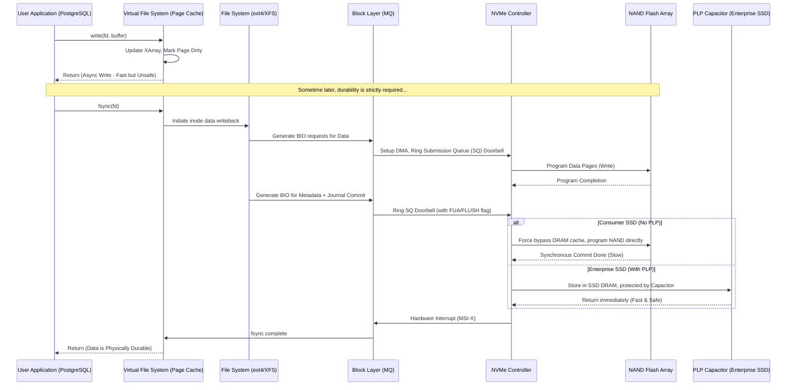

# 42: `fsync()` và Data Durability: Cuộc Giằng Co Giữa Hiệu Năng và Toàn Vẹn Dữ Liệu

## Tóm Tắt & Vấn Đề Cốt Lõi

Với các hệ thống phân tán, RDBMS, hay bất kỳ ứng dụng nào đòi hỏi độ chính xác tuyệt đối (nghĩ đến core banking), **tính bền bỉ của dữ liệu (Data Durability - chữ "D" trong ACID)** không phải là thứ có thể du di.

Câu hỏi đặt ra khá đơn giản để phát biểu nhưng cực khó để giải quyết triệt để: làm sao phần mềm chắc chắn được rằng một dòng dữ liệu vừa được người dùng nhấn "Lưu" sẽ không biến mất, kể cả khi ai đó rút phích cắm điện của máy chủ ngay giây tiếp theo?

Câu trả lời nằm ở lời gọi hệ thống `fsync()` trong chuẩn POSIX, cùng người anh em tối ưu hơn của nó là `fdatasync()`. Đây là ranh giới kiến trúc giữa bộ nhớ dễ bay hơi (RAM) và thiết bị lưu trữ không bay hơi (HDD/SSD). Gọi `fsync()` nghĩa là bắt nhân hệ điều hành đẩy toàn bộ các trang dữ liệu bẩn (dirty pages) từ Page Cache xuống đĩa, đồng thời ra lệnh cho bộ điều khiển thiết bị xả luôn bộ đệm phần cứng của nó xuống phương tiện lưu trữ vật lý.

- **Ảo giác tốc độ:** Bỏ qua `fsync()` cho cảm giác thông lượng cực cao — ghi vào RAM chỉ mất 1 micro-giây. Nhưng nếu mất điện, dữ liệu bốc hơi vĩnh viễn và cơ sở dữ liệu rơi vào trạng thái hỏng cấu trúc.
- **Cái giá của sự an toàn:** Gọi `fsync()` liên tục lại kéo hiệu năng xuống thảm hại. Luồng CPU bị chặn lại, chờ hàng mili-giây — chậm hơn RAM cả nghìn lần — cho đến khi electron thực sự bị bẫy thành công trong cổng nổi của chip NAND flash. Đó là cách một nút thắt cổ chai I/O khổng lồ ra đời, kèm theo tuổi thọ SSD bị bào mòn nhanh hơn vì Write Amplification.

Bài viết này đi từ user space, xuyên qua nhân Linux (VFS, Block Layer), xuống tận cấp độ bóng bán dẫn vật lý, để làm rõ cơ chế `fsync()` hoạt động ra sao và các hệ quản trị CSDL lớn đối phó với nó như thế nào.

---

## Kiến Trúc Phân Tầng Của Hệ Thống Lưu Trữ và Cơ Chế Bộ Nhớ Đệm

Máy tính hiện đại được xây dựng theo nguyên lý phân tầng bộ nhớ, nhằm dung hòa khoảng cách tốc độ khổng lồ giữa vi xử lý và thiết bị lưu trữ thứ cấp.

### Vòng Đời Của Một Lệnh `write()` Bất Đồng Bộ

Khi một ứng dụng (NodeJS, Python, gì cũng được) gọi `write()`, dữ liệu không hề đi thẳng xuống ổ cứng. Nó dừng lại ở **Page Cache** trước — do Virtual File System (VFS) của Linux quản lý, hoạt động như một miếng bọt biển hấp thụ mọi thao tác ghi. Các trang chứa dữ liệu mới được đánh dấu "bẩn" (dirty).

Lệnh `write()` trả về `Success` gần như ngay lập tức. Ứng dụng nghĩ dữ liệu đã an toàn, nhưng thực chất nó vẫn đang lơ lửng trong RAM. Các luồng worker ngầm của kernel (như `bdi_writeback`) sẽ từ từ gom các trang bẩn và đẩy xuống đĩa sau, dựa trên các tham số như `vm.dirty_ratio` hay `vm.dirty_expire_centisecs`.

### Phân Tích Độ Trễ

Độ trễ của thao tác ghi bất đồng bộ ($L_{async}$) chỉ gồm:
$$L_{async} = L_{syscall} + L_{copy\_to\_kernel} + L_{page\_cache\_update} + L_{lock\_contention}$$
Tổng cộng chỉ 1 đến 5 micro-giây.

Nhưng ngay khi `fsync()` được gọi, luồng đó coi như bị nhốt lại. Độ trễ đồng bộ hóa ($L_{sync}$) phải đi qua hàng chục tầng:
$$L_{sync} = L_{syscall} + L_{vfs\_flush} + L_{fs\_journal} + L_{block\_queue} + L_{pcie\_tlp} + L_{nvme\_ctrl} + L_{ftl\_mapping} + L_{nand\_prog}$$

Riêng thành phần $L_{nand\_prog}$ (thời gian lập trình vật lý chip flash) đã tốn từ 200 micro-giây (chip SLC) đến hơn 1500 micro-giây (chip QLC) — chậm hơn ghi RAM **300 đến 1500 lần**. Cộng thêm việc đóng gói Transaction Layer Packets (TLP) của PCIe và tranh chấp tại Block I/O Scheduler, độ trễ tổng càng phình to.

### Vũ Khí Của Doanh Nghiệp: Tụ Điện PLP và Cờ FUA

Bộ điều khiển SSD có một thanh RAM riêng làm bộ đệm (Disk Write Cache). Khi OS gọi `fsync()`, nó phải nhét thêm cờ `FLUSH` hoặc bit `FUA` (Force Unit Access) vào lệnh PCIe.

Cờ `FUA` về cơ bản ra lệnh: "Đừng nhét dữ liệu vào RAM nội bộ để đánh lừa hệ thống, hãy ghi thẳng xuống chip NAND ngay." Việc ép ghi trực tiếp này khiến SSD chậm đi trông thấy.

Giải pháp mà giới doanh nghiệp chọn là **tụ điện PLP (Power Loss Protection)**. SSD Enterprise gắn tụ điện siêu dung lượng, cho phép SSD "phớt lờ" cờ FUA một cách an toàn: nó lưu dữ liệu vào RAM nội bộ (siêu nhanh) rồi báo thành công về OS ngay. Nếu mất điện, năng lượng tích trong tụ đủ cho SSD thêm 50-100 mili-giây để xả nốt dữ liệu từ RAM xuống chip NAND. Đây chính là lý do database chạy trên SSD Enterprise có thể nhanh gấp 50 lần so với chạy trên một ổ Samsung EVO tiêu dùng trong các bài test ghi nặng.

---

## So Sánh Vi Kiến Trúc: `fsync()` vs `fdatasync()`

Bên trong hệ thống tệp, `fsync()` không chỉ ghi dữ liệu. Nó còn phải ghi cả siêu dữ liệu (metadata) — kích thước tệp, quyền hạn, thời gian chỉnh sửa (mtime), thời gian truy cập (atime).

Thử tưởng tượng bạn ghi thêm 10 byte vào cuối một file log:
- Gọi `fsync()`, hệ điều hành phải thực hiện 2 thao tác I/O vật lý riêng biệt: một để ghi 10 byte dữ liệu, một để cập nhật `mtime` trong cấu trúc `inode`.
- Việc cập nhật `mtime` liên tục như vậy tạo ra một khoản khuếch đại I/O gần như vô ích.

`fdatasync()` sinh ra để giải quyết đúng vấn đề này: nó chỉ đảm bảo tính toàn vẹn của phần dữ liệu thực sự cấu thành nội dung tệp, cộng với metadata *chỉ khi metadata đó ảnh hưởng đến khả năng đọc lại dữ liệu* (ví dụ tăng kích thước file). Nếu chỉ có `mtime` thay đổi, `fdatasync()` sẽ không buồn đẩy metadata xuống đĩa.

Về số lượng I/O vật lý ($N_{io}$):
$$N_{io}(\text{fdatasync}) \le N_{io}(\text{fsync})$$

Phần lớn các hệ quản trị cơ sở dữ liệu hiện đại — InnoDB của MySQL, WAL của PostgreSQL — đều chọn `fdatasync()` để giữ thông lượng. Chỉ cần tiết kiệm một thao tác I/O metadata mỗi lần commit, hiệu năng tổng thể có thể tăng gấp đôi.

---

## Write Amplification Factor (WAF): Kẻ Bào Mòn Flash NAND

Lạm dụng `fsync()` không chỉ làm chậm hệ thống — nó còn thực sự đốt cháy tuổi thọ ổ SSD.

Chip NAND flash không hỗ trợ ghi đè tại chỗ (in-place update) như HDD. Mỗi lần cập nhật dữ liệu, SSD phải ghi vào một trang vật lý hoàn toàn trống (thường 16KB). Trang cũ bị đánh dấu là rác. Khi ổ hết chỗ trống, FTL (Flash Translation Layer) khởi động thuật toán Garbage Collection (GC).

Điểm trớ trêu về kiến trúc: xóa rác phải diễn ra ở cấp độ Block (4MB-16MB), trong khi ghi dữ liệu diễn ra ở cấp độ Page (16KB). GC phải nạp cả block lên RAM của SSD, nhặt các trang còn dùng được ghép sang chỗ khác, rồi dùng điện áp cao xóa trắng toàn bộ block đó.

Thử mô phỏng một ứng dụng thiếu kinh nghiệm: cứ ghi 100 byte log lại gọi `fsync()` một lần. Ở cấp phần cứng, SSD không thể ghi đúng 100 byte — nó buộc phải cấp phát nguyên một trang vật lý 16KB để chứa 100 byte đó, chỉ để đảm bảo yêu cầu FUA được tuân thủ.

Công thức của hệ số khuếch đại ghi (WAF):
$$WAF = \frac{\text{Tổng Bytes dữ liệu thực tế đẩy xuống Flash NAND}}{\text{Tổng Bytes cấu trúc dữ liệu Host OS yêu cầu ghi}} \approx \frac{S_{page}}{S_{payload}} + WAF_{GC\_overhead}$$

Với $S_{payload} = 100\text{ bytes}$ ghi vào trang $S_{page} = 16384\text{ bytes}$, WAF cơ sở đã là **163.8 lần**. Nghĩa là yêu cầu ghi 1GB dữ liệu, SSD thực tế phải ghi khoảng 163GB. Chỉ số TBW (Terabytes Written) tụt dốc nhanh chóng, GC phải chạy liên tục, khóa cứng bộ điều khiển, và độ trễ p99 có thể vọt lên hàng trăm mili-giây.

---

## Các Chiến Lược "Vượt Rào" Từ Các Database Engine

Đứng trước nghịch lý giữa durability và throughput, các kỹ sư database đã nghĩ ra vài cơ chế đáng học hỏi.

### Group Commit

Đây gần như là phép màu cứu cả ngành công nghiệp database. Thay vì mỗi luồng giao dịch tự gọi `fsync()` riêng, engine sẽ:
1. Các luồng giao dịch đẩy log vào một hàng đợi Memory Ring Buffer rồi ngủ.
2. Một luồng "leader" (Leader Flusher) thức dậy, gom tất cả giao dịch đang chờ trong buffer.
3. Leader gọi một lệnh `fdatasync()` duy nhất, thay mặt cho tất cả.
4. I/O hoàn thành, Leader đánh thức toàn bộ các luồng khách hàng cùng lúc, báo commit thành công.

Giới hạn thông lượng nếu không gom nhóm:
$$ \lambda_{naive} \approx \frac{1}{L_{fsync}} $$
Nếu `fsync()` tốn 1ms, hệ thống tối đa chỉ đạt 1000 TPS bất kể có bao nhiêu CPU đang rảnh.

Giới hạn thông lượng với Group Commit:
$$ \lambda_{group\_commit} = \min\left( \lambda_{max\_hardware\_io\_bandwidth}, \frac{\bar{N}_{batch}}{L_{fsync}} \right) $$
Khi gom nhóm ($\bar{N}_{batch}$), thông lượng không còn bị trói bởi độ trễ seek của ổ đĩa nữa mà tiệm cận với băng thông của bus PCIe. Nghịch lý thú vị là: hệ thống càng nghẽn, càng nhiều luồng chờ, $N_{batch}$ càng lớn, và hệ thống lại càng hiệu quả hơn.

### `io_uring` Thay Đổi Cuộc Chơi

Linux Kernel gần đây có `io_uring`, thay thế mô hình `fsync()` chặn (blocking) truyền thống. Hai hàng đợi mmap dùng chung giữa kernel và user-space — Submission Queue (SQ) và Completion Queue (CQ) — loại bỏ hẳn chi phí context switching.

Các database hiện đại như ScyllaDB nhồi hàng vạn lệnh I/O kèm cờ `IORING_OP_FSYNC` vào SQ mà không cần luồng CPU đứng chờ. Mọi thứ trở nên event-driven — CPU rảnh tay làm việc khác trong lúc ổ cứng vẫn đang ghi dữ liệu ở phía sau.

### Direct I/O (`O_DIRECT`) so với Buffer I/O + `fsync()`

Một ngã ba kiến trúc khác: dùng Page Cache rồi gọi `fsync()`, hay bỏ qua Page Cache bằng `O_DIRECT` và tự quản lý memory (như InnoDB Buffer Pool của MySQL)?
- `O_DIRECT`: ứng dụng phải tự xây Buffer Pool riêng, tự chịu trách nhiệm flush trang bẩn xuống đĩa. Đổi lại, nó kiểm soát hoàn toàn vòng đời I/O, không bị kernel can thiệp bất ngờ. Kết hợp `O_DIRECT` với `fsync()` (tùy file system) thường cho hiệu năng dự đoán được tốt nhất với database quy mô lớn.
- `Buffer I/O`: dễ lập trình hơn, tận dụng OS cache cho việc đọc. Nhưng khi gọi `fsync()`, ứng dụng phải gánh luôn hậu quả của làn sóng I/O do `bdi_writeback` của kernel gây ra.

---

## Tương Lai: Storage-Class Memory (SCM) và NVDIMM

Khi vật liệu bán dẫn tiến bộ, công nghệ SCM (Intel Optane, NVDIMM) đang xóa nhòa ranh giới giữa RAM và SSD. SCM cắm trực tiếp vào khe RAM (bus DDR thay vì PCIe), lưu trữ không bay hơi nhưng truy xuất nhanh cỡ nano-giây.

Vũ khí trung tâm ở đây là giao diện **DAX (Direct Access)**. Bằng cách mmap một tệp DAX, hệ thống tệp bỏ qua hoàn toàn cả Page Cache lẫn Block Layer. `fsync()` gần như trở nên thừa thãi. Thay vào đó, CPU chỉ cần gọi lệnh assembly `CLWB` (Cache Line Write Back) kèm hàng rào `SFENCE`. Dữ liệu đi thẳng từ thanh ghi CPU (L1 Cache) xuống module SCM an toàn với điện năng, chỉ trong vài chục nano-giây. Các database dùng NVDIMM làm tầng log cache giải quyết gần như trọn vẹn bài toán durability, bỏ lại phía sau mọi lo lắng về WAF hay `fsync()`.

---

## Bài Học Rút Ra Cho Kỹ Sư Hệ Thống

1. **Hiểu rõ phần cứng bạn đang chạy trên đó:** đừng bao giờ triển khai một hệ database ghi nặng trên SSD tiêu dùng. Tụ điện PLP trên SSD Enterprise là thứ duy nhất giúp `fsync()` không giết chết hiệu năng hệ thống.
2. **Ưu tiên `fdatasync()` hơn `fsync()`:** trong phần lớn trường hợp viết log/WAL tùy chỉnh, bạn chỉ quan tâm nội dung dữ liệu chứ không cần `mtime`. Dùng `fdatasync()` sẽ cắt bớt một lượng I/O vô ích đáng kể.
3. **Luôn gom nhóm (batching):** giống nguyên lý Group Commit, nếu ứng dụng cần ghi log bền bỉ, hãy gom dữ liệu thành chunk lớn (16KB hoặc 64KB) trên RAM trước khi flush xuống đĩa. Đừng gọi `fsync` cho từng dòng log vài byte.
4. **Kiểm soát Kernel Dirty Ratio:** nếu ứng dụng tạo ra nhiều dirty pages chưa kịp fsync, hãy hạ `vm.dirty_background_ratio` xuống thấp (ví dụ 5%) để kernel dọn dẹp dần dần. Để nó dồn lên 20% rồi mới dọn một lượt, hệ thống sẽ bị I/O stall đứng hình.
5. **Đừng tự viết database engine nếu không cần thiết:** độ phức tạp của việc dung hòa ACID với I/O vật lý là rất lớn. Hãy tận dụng những gì InnoDB, RocksDB, hay PostgreSQL đã giải quyết sẵn.

---
