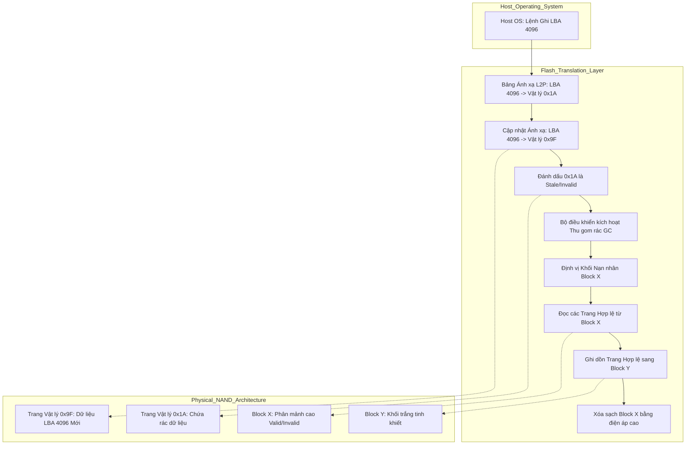
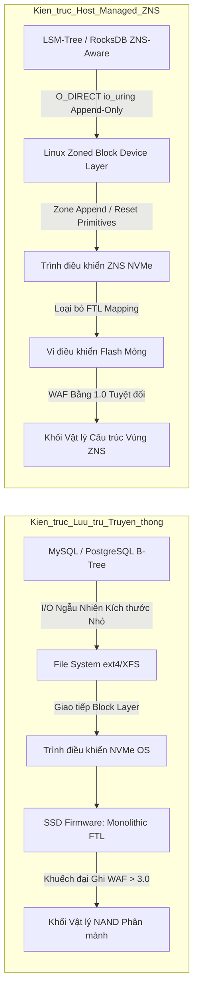

# 43: Write Amplification trong SSD: Khi DB bào mòn ổ cứng của bạn

## Cơ sở Vi kiến trúc của Flash Memory và Hiện tượng Khuyếch đại Ghi

Nền tảng vật lý cốt lõi của bộ nhớ NAND Flash hiện đại được xây dựng dựa trên kiến trúc bóng bán dẫn trường hiệu ứng oxit kim loại cổng nổi (FGMOS) hoặc công nghệ Charge Trap Flash (CTF) trong các thiết kế 3D NAND đa lớp. Trong các cấu trúc vi mô này, thông tin nhị phân được biểu diễn và lưu trữ vĩnh cửu thông qua khối lượng điện tích bị cô lập bên trong cổng nổi hoặc lớp bẫy điện tích, từ đó làm dịch chuyển điện áp ngưỡng ($V_{th}$) của bóng bán dẫn. Để lập trình (ghi) dữ liệu vào một cell bộ nhớ—ví dụ trong kiến trúc TLC (Triple-Level Cell) NAND, nơi yêu cầu điều khiển chính xác 8 mức điện áp ngưỡng riêng biệt để mã hóa 3 bit dữ liệu—bộ điều khiển lưu trữ sẽ áp đặt một xung điện áp dương cực cao ($V_{prog}$), thường dao động ở mức 20V, lên cực cổng điều khiển (Control Gate). Điện áp này tạo ra một điện trường xuyên thủng cực mạnh qua lớp oxit mỏng, cưỡng bức các electron từ kênh dẫn xuyên hầm lượng tử vào cổng nổi thông qua hiệu ứng Fowler-Nordheim (FN). Mật độ dòng điện xuyên hầm FN tuân theo phương trình cơ học lượng tử phức tạp: $$J = A E_{ox}^2 \exp\left(-\frac{B}{E_{ox}}\right)$$, trong đó $E_{ox}$ biểu thị cường độ điện trường vắt ngang lớp oxit đường hầm, còn $A$ và $B$ là các hằng số vật lý phụ thuộc chặt chẽ vào khối lượng hiệu dụng của electron và rào cản thế năng tại bề mặt phân cách silicon-oxit. Quá trình ngược lại, tức là xóa dữ liệu, đòi hỏi một điện áp âm cực lớn đặt vào đế silicon để rút electron khỏi cổng nổi, một thao tác gây căng thẳng vật lý nghiêm trọng lên cấu trúc mạng tinh thể và làm xói mòn lớp oxit cách điện theo thời gian. Sự suy thoái vật lý này chính là nguyên nhân giới hạn số chu kỳ Ghi/Xóa (Program/Erase cycles - P/E cycles) của ổ cứng SSD, biến NAND flash thành một loại vật liệu có tuổi thọ tiêu hao hữu hạn.

Đặc tính kiến trúc tàn khốc nhất của bộ nhớ NAND flash không nằm ở bản chất suy thoái vật lý, mà ở sự bất đối xứng nghiêm trọng trong đơn vị thao tác không gian. Mặc dù các vi điều khiển có thể đọc và lập trình dữ liệu ở cấp độ trang (Page) với kích thước phổ biến từ 4KB đến 16KB, thao tác xóa bằng điện áp cao lại bắt buộc phải thực thi trên toàn bộ một khối (Block) khổng lồ chứa hàng nghìn trang, tương đương từ 2MB đến 16MB dữ liệu vật lý. Ngặt nghèo hơn, đặc tính vật lý của electron cấm tuyệt đối việc ghi đè dữ liệu lên một trang đã chứa điện tích; một trang bộ nhớ bắt buộc phải được trả về trạng thái trống (erased) thông qua thao tác xóa khối trước khi có thể tiếp nhận tín hiệu lập trình mới. Ràng buộc "xóa trước khi ghi" (Erase-before-write constraint) này tạo ra một sự bất đồng cấu trúc sâu sắc giữa hệ thống tệp tin truyền thống của hệ điều hành—vốn luôn mặc định các thiết bị khối (Block Devices) như ổ đĩa từ tính HDD hỗ trợ ghi đè trực tiếp tại chỗ (In-place updates) với kích thước cung từ 512 byte. Để giải quyết sự xung đột kiến trúc này, các kỹ sư phần cứng đã chèn vào SSD một lớp phần mềm trung gian nhúng phức tạp gọi là Flash Translation Layer (FTL). FTL vận hành như một hệ thống quản lý bộ nhớ ảo độc lập ngay trên phần cứng đĩa, duy trì một bảng ánh xạ Logical-to-Physical (L2P) khổng lồ lưu trữ trên DRAM tích hợp của ổ cứng. Khi máy chủ phát lệnh ghi một khối dữ liệu Logic Block Address (LBA), thay vì kích hoạt thao tác ghi đè bất khả thi, thuật toán FTL sẽ định tuyến dữ liệu này đến một trang vật lý mới tinh đang trong trạng thái trống, cập nhật con trỏ L2P tương ứng, và đánh dấu trang vật lý cũ chứa dữ liệu lịch sử thành trạng thái "không hợp lệ" (stale/invalid).

Theo thời gian vận hành liên tục, chuỗi thao tác ghi gián tiếp của FTL sẽ băm nát cấu trúc vật lý của ổ đĩa, để lại vô số các khối chứa hỗn hợp phân mảnh giữa các trang dữ liệu còn hợp lệ và các trang đã bị đánh dấu loại bỏ. Để đảm bảo nguồn cung cấp khối trống không bao giờ cạn kiệt cho các thao tác ghi tương lai, vi điều khiển FTL buộc phải kích hoạt một tiến trình nền khét tiếng mang tên Garbage Collection (GC - Thu gom rác). Thuật toán GC phân tích heuristic toàn bộ hệ thống để chọn ra một khối nạn nhân (Victim Block). FTL phải đọc toàn bộ các trang dữ liệu còn hợp lệ từ khối nạn nhân này vào bộ đệm SRAM cục bộ, ghi tuần tự chúng sang một khối mới đang trống, cập nhật hàng loạt hàng trong bảng ánh xạ L2P, và cuối cùng mới áp đặt điện áp cao để xóa sạch toàn bộ khối nạn nhân cũ, thu hồi không gian lưu trữ vật lý. Tiến trình nhào lộn dữ liệu nội bộ thầm lặng này chính là nguồn cơn cốt lõi sinh ra hiện tượng Write Amplification (WA - Khuyếch đại ghi). Mức độ khuyếch đại ghi được định lượng toán học thông qua Write Amplification Factor (WAF), định nghĩa là tỷ số giữa tổng lượng dữ liệu byte thực tế mà phần cứng phải lập trình vào các ô NAND so với tổng lượng dữ liệu byte mà hệ điều hành máy chủ yêu cầu ghi: $$WAF = \frac{\text{Bytes physically written to flash}}{\text{Bytes logically written by host}}$$. Trong các kịch bản ghi tuần tự lý tưởng, WAF tiến sát về mức 1.0. Tuy nhiên, dưới các tải trọng ghi ngẫu nhiên cường độ cao, mức độ phân mảnh không gian trở nên nghiêm trọng. Giả sử khối nạn nhân chứa $N$ trang với tỷ lệ trang hợp lệ là $u$ ($0 < u < 1$), thuật toán GC phải bốc dỡ và ghi lại $u \cdot N$ trang chỉ để giải phóng một khoảng trống thực tế là $(1-u) \cdot N$ trang. Giới hạn toán học tiệm cận của WAF dưới tải ngẫu nhiên phụ thuộc nghịch biến vào mức dự phòng dung lượng phần cứng (Over-provisioning - OP). Gọi $\alpha$ là tỷ lệ OP (tỷ lệ phần trăm dung lượng NAND ẩn so với dung lượng LBA khả dụng), công thức xấp xỉ kinh điển cho thấy: $$WAF_{random} \approx \frac{1 + \alpha}{\alpha}$$. Đối với SSD tiêu dùng với OP khoảng 7%, WAF nội tại của FTL có thể vọt lên mức hủy diệt phần cứng, giải thích vì sao ổ cứng máy chủ Enterprise bắt buộc phải hi sinh tới 28% dung lượng vật lý chỉ để kìm hãm mẫu số ảo tưởng này.



## Tương tác Hệ điều hành, Quản lý Bộ nhớ và Phân hệ Lưu trữ Cơ sở dữ liệu

Sự khuyếch đại ghi xuất phát từ phần mềm nội bộ của SSD chỉ là tầng đáy của một thảm họa khuếch đại đa tầng khi xét trên toàn bộ hệ sinh thái phần mềm. Tổng hệ số khuyếch đại ghi ($WAF_{total}$) mà lớp vật lý silicon phải gánh chịu thực chất là một chuỗi tích toán học của các hệ số khuếch đại sinh ra tại mọi tầng ảo hóa lưu trữ: $$WAF_{total} = WAF_{DB} \times WAF_{FS} \times WAF_{SSD}$$. Hệ quản trị cơ sở dữ liệu (DBMS) truyền thống, đặc biệt là các cỗ máy phụ thuộc vào cấu trúc dữ liệu B+Tree như PostgreSQL hay MySQL (InnoDB engine), là những tác nhân tàn phá khủng khiếp nhất đối với chỉ số $WAF_{DB}$. Cấu trúc B+Tree phân mảnh dữ liệu thành các trang cố định (thường là 8KB hoặc 16KB), hoạt động như đơn vị I/O nguyên tử giữa Buffer Pool trong DRAM và hệ thống tệp tin. Khi một giao dịch thay đổi một trường dữ liệu chỉ vài chục byte, engine cơ sở dữ liệu không thể dội trực tiếp cụm byte nhỏ nhoi đó xuống đĩa. Cả một trang 16KB khổng lồ trong bộ đệm bị đánh dấu là "dirty" và bắt buộc phải được flush toàn bộ xuống bộ lưu trữ, tạo ra một sự bất đối xứng kích thước thao tác cực độ. Hơn thế nữa, để tuân thủ nghiêm ngặt tiêu chuẩn ACID và đảm bảo khả năng khôi phục sau thảm họa, DBMS áp dụng kiến trúc Write-Ahead Logging (WAL). Mọi thay đổi logic phải được ghi nối tiếp vào tệp nhật ký WAL một cách bền vững bằng lệnh `fsync()` trước khi trang dữ liệu thực sự được phép flush. Quy trình này ngay lập tức nhân đôi khối lượng I/O vật lý cho mọi lệnh cập nhật.

Mọi chuyện còn trở nên tồi tệ hơn trong kiến trúc của InnoDB khi đối mặt với hội chứng "Torn Pages" (Trang dữ liệu bị xé rách). Nếu máy chủ mất điện đột ngột ngay giữa quá trình kernel đang ghi một trang B+Tree 16KB xuống hệ thống tệp tin vốn định dạng theo khối 4KB, một phần của trang 16KB có thể được ghi thành công trong khi phần còn lại chứa dữ liệu rác, dẫn đến sự sụp đổ toàn diện của cây chỉ mục. Để bọc lót lỗ hổng này, InnoDB phát minh ra cơ chế Doublewrite Buffer (DWB). Trước khi xả các trang dirty từ bộ đệm về đúng vị trí ngẫu nhiên của chúng trên tablespace, InnoDB buộc phải ghi tuần tự một bản sao của các trang này vào một vùng an toàn liên tục trên đĩa mang tên Doublewrite Buffer. Chỉ sau khi bản sao lưu này được hệ điều hành xác nhận đã nằm an toàn trên phiến đĩa, luồng I/O thứ hai mới bắt đầu phân phát dữ liệu về tablespace. Nếu thảm họa xảy ra trong pha ghi thứ hai, quá trình phục hồi sẽ chép ngược bản sao nguyên vẹn từ DWB ra. Dù tối ưu cho an toàn dữ liệu, cơ chế này đẩy Write Amplification lên mức độ phi lý trí. Một thay đổi 100 byte trên giao diện ứng dụng sẽ kích hoạt một lệnh ghi WAL, một lệnh ghi 16KB vào DWB, và một lệnh ghi ngẫu nhiên 16KB vào data file. Về mặt toán học ứng dụng, $WAF_{DB}$ của giao dịch này lên tới $\frac{100 + 16384 + 16384}{100} \approx 328$. Khi khối dữ liệu ngẫu nhiên 16KB này rơi xuống tầng FTL của một chiếc SSD đang trong trạng thái phân mảnh nặng với $WAF_{SSD} = 3.0$, hệ thống vật lý sẽ cắn nuốt gần 1 Megabyte chu kỳ xóa NAND chỉ để cập nhật một dòng trạng thái ngắn ngủi của người dùng, minh chứng cho sự bất tương thích cực đoan giữa kiến trúc B-Tree cổ điển và vật liệu Flash.

Trái ngược với sự hủy diệt của B-Tree, các siêu cơ sở dữ liệu phân tán hiện đại như RocksDB, Cassandra, hay ScyllaDB đặt cược sinh mạng kiến trúc vào Log-Structured Merge-Trees (LSM-Trees) nhằm làm dịu cơn khát I/O ngẫu nhiên. Đặc điểm kỹ thuật cốt lõi của LSM-Tree là sự từ chối hoàn toàn khái niệm cập nhật tại chỗ (In-place updates). Mọi truy vấn ghi mới đều được nối đuôi tuần tự vào một cấu trúc dữ liệu trên DRAM gọi là MemTable, song song với một tệp WAL. Khi MemTable đầy, nó bị đóng băng và được xả thẳng xuống đĩa tạo thành một Sorted String Table (SSTable) tĩnh tại Tầng 0 ($L_0$). Hành vi I/O tuần tự thuần túy và khối lượng lớn này là "thần dược" đối với bộ điều khiển SSD. $WAF_{SSD}$ nội tại lập tức rơi thẳng đứng về mức 1.0 vì FTL có thể ung dung cấp phát các block mới mà không cần đụng chạm đến GC. Tuy nhiên, định luật bảo toàn năng lượng trong khoa học máy tính không cho phép sự miễn phí. LSM-Tree vay mượn hiệu năng ghi ở hiện tại và trả nợ bằng một hình phạt bùng nổ dữ liệu ở tương lai thông qua quá trình Compaction (Nén và Trộn). Khi các tầng $L_1, L_2, \dots, L_n$ phình to, độ trễ đọc và sự lãng phí không gian tăng vọt do các bản ghi cũ chưa bị xóa đi. Thuật toán Compaction sẽ tự động thức giấc, đọc các SSTable ở tầng $L_i$ và các SSTable chồng lấn ở tầng $L_{i+1}$ lên RAM, thực hiện thuật toán trộn đa luồng để loại bỏ dữ liệu cũ, rồi ghi tuần tự khối dữ liệu mới khổng lồ xuống $L_{i+1}$. Phương trình vi phân mô hình hóa hình phạt I/O của Leveled Compaction cho thấy, với một hệ số khuếch đại kích thước giữa các tầng là $T$ (thường $T=10$), để đẩy một byte dữ liệu từ tầng cao nhất chìm dần xuống tầng sâu nhất $L_{max}$, lượng dữ liệu trung bình phải được ghi lại là tỷ lệ thuận với $T \cdot L_{max}$. Mặc dù hệ số $WAF_{DB}$ do LSM-Tree sinh ra có thể dao động từ 10 đến 30 lần, mẫu hình I/O mà nó nã vào ổ cứng lại gồm toàn các khối siêu lớn và tuần tự, giúp hệ điều hành dễ dàng tối ưu hóa Page Cache và SSD không bao giờ rơi vào trạng thái hoảng loạn của rác đứt đoạn.

```rust
// Pseudocode mô phỏng thuật toán Leveled Compaction sinh Write Amplification
struct LSMLevel {
    id: usize,
    sstables: Vec<SSTableFile>,
    capacity_limit: usize,
}

fn trigger_leveled_compaction(current_level: &mut LSMLevel, next_level: &mut LSMLevel, target_sst: SSTableFile) -> usize {
    let mut overlapping_candidates = Vec::new();
    let mut total_bytes_read = 0;
    let mut total_bytes_written = 0;
    
    // Quét tìm tất cả các SSTable có dải khóa (Key Range) chồng lấn ở tầng dưới
    for sst in &next_level.sstables {
        if sst.check_key_range_overlap(&target_sst) {
            overlapping_candidates.push(sst.clone());
            total_bytes_read += sst.file_size_bytes;
        }
    }
    
    total_bytes_read += target_sst.file_size_bytes;
    
    // Tải dữ liệu vào RAM và thực hiện thuật toán K-way Merge Sort
    let merged_data_stream = execute_k_way_merge(&target_sst, &overlapping_candidates);
    
    // Phá hủy các bản ghi có cờ Tombstone và các phiên bản khóa cũ
    let optimized_data_blocks = purge_tombstones_and_stale_versions(merged_data_stream);
    total_bytes_written += optimized_data_blocks.calculate_total_size();
    
    // Xả dữ liệu mới xuống đĩa tạo thành các SSTable tinh khiết bằng I/O tuần tự
    let fresh_sstables = flush_to_disk_sequentially(optimized_data_blocks, next_level.id);
    
    // Cập nhật siêu dữ liệu Manifest và xóa tệp tin cũ (Kích hoạt lệnh TRIM của OS)
    next_level.swap_sstables(&overlapping_candidates, fresh_sstables);
    os_issue_nvme_trim(&overlapping_candidates);
    
    // Trả về số byte thực tế đã ghi để hệ thống tính toán WAF theo thời gian thực
    total_bytes_written 
}
```

## Các Giới hạn Phần cứng và Thuật toán Tối ưu hóa Cấp phát Lưu trữ Thế hệ mới

Khi mật độ lưu trữ của NVMe tiệm cận kỷ nguyên Petabyte và độ trễ chuyển dịch về thang đo microsecond, lớp ảo hóa FTL nguyên khối truyền thống bộc lộ những khiếm khuyết phần cứng không thể cứu vãn. Bảng ánh xạ L2P cần một lượng DRAM khổng lồ để hoạt động mượt mà—quy tắc kinh nghiệm là cần 1GB DRAM tinh khiết cho mỗi 1TB bộ nhớ Flash được quản lý ở kích thước block 4KB. Kinh hoàng hơn, các xung nhiễu độ trễ (tail latency spikes) đột ngột xuất hiện khi vi điều khiển FTL cướp quyền I/O để thực thi quy trình Garbage Collection đã phá vỡ hoàn toàn các thỏa thuận mức dịch vụ (SLAs) nghiêm ngặt trong các kiến trúc cơ sở dữ liệu đám mây đa khách hàng. Đứng trước bức tường giới hạn vật lý này, ngành công nghiệp trung tâm dữ liệu đang trải qua một cuộc lột xác triệt để chuyển hướng sang các kiến trúc lưu trữ do máy chủ quản lý (Host-Managed Storage), mà mũi nhọn tiên phong là tiêu chuẩn Zoned Namespaces (ZNS) tích hợp thẳng vào đặc tả giao thức NVMe thế hệ mới. ZNS thực hiện một cuộc cách mạng tàn bạo: xé bỏ lớp màn che đậy FTL, phơi bày trực tiếp toàn bộ tô-pô vật lý của bộ nhớ flash lên thẳng hệ điều hành và phần mềm cơ sở dữ liệu. Toàn bộ dải không gian địa chỉ logic (LBA) bị băm nhỏ thành các vùng độc lập gọi là Zones. Các kỹ sư thiết kế phần cứng áp đặt hai bộ quy tắc thép lên Zones: Thứ nhất, dữ liệu bên trong một Zone phải được ghi nối tiếp một chiều từ điểm bắt đầu đến khi đầy. Thứ hai, Zone không bao giờ chấp nhận lệnh ghi đè tại chỗ; cách duy nhất để tái sử dụng một Zone là hệ điều hành phải phát ra lệnh Zone Reset toàn cục, lệnh này ngay lập tức được ánh xạ thành một thao tác xóa vật lý (Block Erase) ở mức dòng điện cao áp lên trực tiếp đế NAND silicon.

Sự độc tài của cơ chế ghi tuần tự một chiều này chính là án tử hình dành cho FTL truyền thống. Bởi lẽ không còn bất kỳ hiện tượng ghi đè xé rách khối vật lý nào được phép xảy ra, sự phân mảnh vĩnh viễn biến mất. Vi điều khiển SSD không còn cần bảng L2P tốn kém RAM, và thuật toán Garbage Collection nội bộ bị tước đoạt quyền lực hoàn toàn. Ở tầng phần cứng, chỉ số $WAF_{SSD}$ bị ép cưỡng bức bằng sức mạnh toán học xuống chính xác mức tuyệt đối 1.0. Tuy nhiên, định luật bảo toàn khối lượng quản lý yêu cầu rằng khi FTL chết đi, gánh nặng cực độ của việc quản lý không gian ảo, lập lịch mài mòn (Wear Leveling) và dọn rác phải được thuyên chuyển trực tiếp lên các kỹ sư phần mềm hệ thống. Cơ sở dữ liệu và hệ điều hành phải được tái thiết trúc hoàn toàn để trở thành những thực thể ZNS-Aware. Kiến trúc LSM-Tree một lần nữa chứng minh sự siêu việt vượt thời đại của nó khi mô hình ghi nối đuôi SSTable khớp nối hoàn hảo đến từng byte với đặc tả Zoned Namespaces. Khi MemTable xả dữ liệu hoặc thuật toán Compaction nhào nặn ra file mới, database tự động đàm phán mở một Zone trống từ NVMe và nối đuôi tuần tự luồng dữ liệu xuống đó. Khi các SSTable cũ trở nên lỗi thời, engine theo dõi tỷ lệ rác của từng Zone. Khi một Zone ngập trong rác, chính luồng Compaction của database sẽ đảm nhận vai trò bốc dỡ các block dữ liệu còn sót lại, chuyển nhà cho chúng sang một Zone mới, rồi tự tay gửi lệnh Zone Reset về kernel để xóa sạch mạch điện.

Sự tương thích kiến trúc ở mức cực đoan này đòi hỏi các hệ thống quản trị tệp tin (File Systems) nhân Linux cổ đại như ext4 hay XFS phải lùi bước, bởi thói quen ghi đè trực tiếp metadata inode và superblock của chúng sẽ bị kiến trúc ZNS từ chối ngay ở vòng gửi xe. Không gian này trở thành thánh địa độc quyền của các Log-Structured File Systems như F2FS (Flash-Friendly File System) hoặc btrfs được tinh chỉnh sâu qua khung Zoned Block Device (ZBD) của kernel. Trong cấu hình hệ thống máy chủ tối thượng, siêu cơ sở dữ liệu RocksDB sẽ bỏ qua hoàn toàn cơ chế Page Cache của hệ điều hành bằng cờ `O_DIRECT`, sử dụng API I/O không đồng bộ tốc độ cao `io_uring` để bắn trực tiếp các khối lượng lớn dữ liệu SSTable thẳng vào một không gian ZNS NVMe namespace. Sự hội tụ toán học ở đây yêu cầu kích thước Zone do nhà sản xuất chip quyết định (ví dụ 256MB) phải đồng bộ tuyệt đối với tham số dung lượng tối đa của một file SSTable do DBA cấu hình. Thông qua sự cộng hưởng cơ học hoàn mỹ này, bóng ma Write Amplification không chỉ bị làm thuyên giảm mà bị tiêu diệt tận gốc ở tầng silicon phần cứng, mở khóa giới hạn thông lượng vật lý tối đa của chip nhớ NAND, đồng thời đảm bảo độ trễ phản hồi phẳng lặng ở mức microsecond—chìa khóa sinh tử cho các hệ thống giao dịch tần suất cao (HFT) và lưới viễn thám siêu dữ liệu toàn cầu.



## SEO
*   **Keywords**: Write Amplification Factor, Tối ưu hóa WAF, SSD NAND Flash Architecture, Vi kiến trúc Flash Memory, FTL Garbage Collection, B-Tree vs LSM-Tree Storage Engine, NVMe Zoned Namespaces, ZNS Technology, InnoDB Doublewrite Buffer, Fowler-Nordheim Tunneling, Database I/O Performance Tuning, Log-Structured File System F2FS.
*   **Meta Description**: Đi sâu vào bản chất kỹ thuật vi kiến trúc của NAND Flash và hiện tượng Write Amplification. Phân tích chi tiết toán học cách các cơ sở dữ liệu B-Tree và LSM-Tree tàn phá tuổi thọ SSD, và giải pháp kiến trúc NVMe Zoned Namespaces (ZNS) giúp loại bỏ FTL, tối ưu I/O cho cơ sở hạ tầng đám mây lưu trữ dữ liệu lớn.
*   **Target Audience**: Chuyên gia hệ thống (Systems Engineers), Kiến trúc sư cơ sở dữ liệu (Database Architects), Kỹ sư phát triển bộ đệm lưu trữ (Storage Kernel Developers), DBA, và những nhà thiết kế giải pháp phần cứng trung tâm dữ liệu muốn thấu hiểu mối tương quan vật lý giữa cơ sở dữ liệu và vật liệu bán dẫn.
