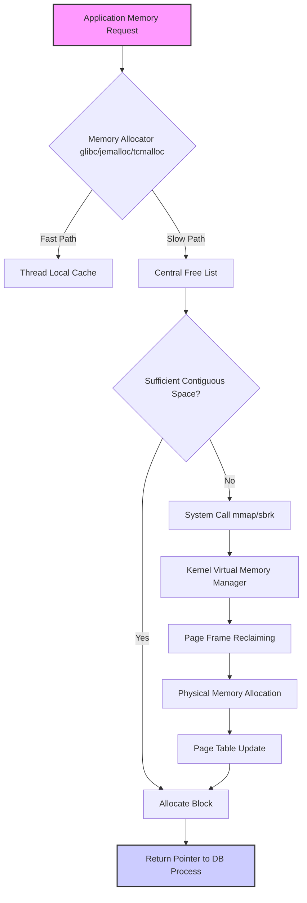
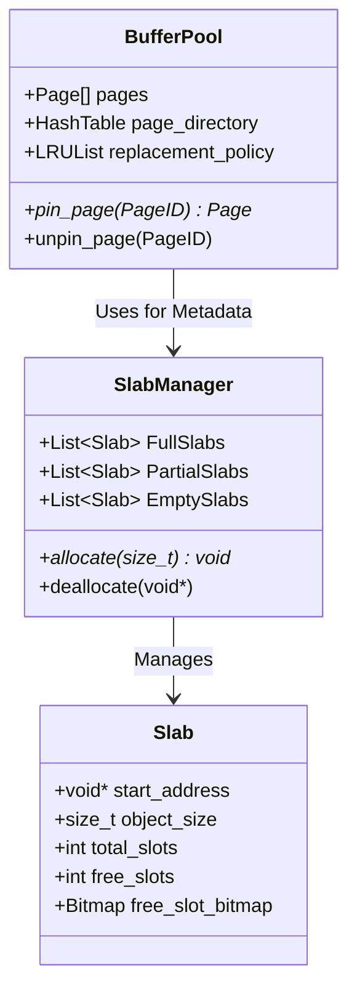
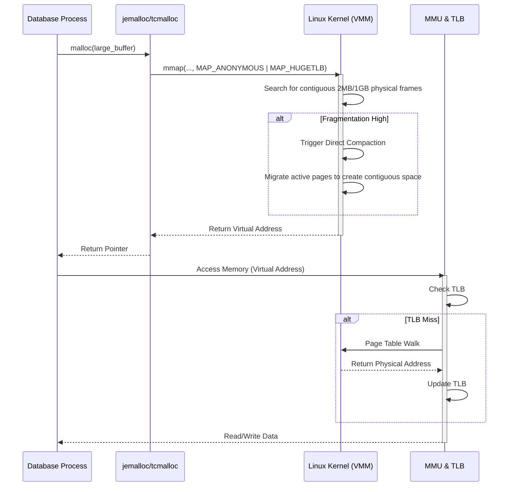

Title: Memory Fragmentation in Long-Running Database Processes: Micro-architectural Implications and Algorithmic Mitigations

## Introduction and Theoretical Foundations of Memory Fragmentation

The phenomenon of memory fragmentation within long-running database processes constitutes a critical performance bottleneck, manifesting as a progressive degradation of throughput and latency over extended operational epochs. In the context of database management systems (DBMS) designed for high-concurrency transactional processing (OLTP) and analytical workloads (OLAP), memory allocation and deallocation operations are executed at an unprecedented frequency. Over continuous uptimes spanning weeks or months, the underlying memory allocator of the operating system, interacting with the virtual memory subsystem, inevitably encounters structural entropy within the heap. This entropy, broadly classified into internal and external fragmentation, fundamentally disrupts the contiguous nature of memory address spaces, thereby imposing severe penalties on both software-level data structure traversals and hardware-level cache hierarchies. Internal fragmentation arises when the memory allocator provisions blocks of memory that are strictly larger than the requested size, typically to satisfy alignment constraints or block-size quantization rules. This unused, yet allocated, space represents wasted capacity that diminishes the effective utilization of the available physical memory. Conversely, external fragmentation manifests as a proliferation of small, non-contiguous free memory segments interspersed among allocated blocks. Although the aggregate sum of these free segments might be sufficient to satisfy a large allocation request, their disjointed nature precludes the satisfaction of such requests without computationally expensive compaction mechanisms or the invocation of the Out-Of-Memory (OOM) killer.

To rigorously quantify the extent of memory fragmentation, we can define the fragmentation ratio $\Phi$. Let $M_{total}$ denote the total memory requested from the operating system via system calls such as `mmap` or `sbrk`, and let $M_{used}$ represent the aggregate memory actively utilized by the database process to store live data structures, buffer pools, and execution state. The fragmentation ratio is then expressed as $\Phi = 1 - \frac{M_{used}}{M_{total}}$. As $\Phi$ monotonically increases over time $t$, the system approaches a critical threshold where the probability of allocation failure $P_{fail}(s)$ for a request of size $s$ becomes non-negligible, even when $M_{total} - M_{used} \gg s$. This probability can be modeled using a modified Poisson distribution considering the geometric distribution of free block sizes $F=\{f_1, f_2, \dots, f_n\}$. Specifically, $P_{fail}(s) = \prod_{i=1}^{n} (1 - H(f_i - s))$, where $H(x)$ is the Heaviside step function. The micro-architectural consequences of elevated fragmentation are profound. Modern processors rely heavily on the Translation Lookaside Buffer (TLB) to cache virtual-to-physical address translations. When a database process exhibits severe external fragmentation, logically contiguous data structures, such as B+ Tree nodes or columnar arrays, are frequently mapped to disparate, physically non-contiguous pages. This spatial dispersion completely invalidates the spatial locality assumptions inherent in modern CPU cache designs. Consequently, the rate of TLB misses escalates dramatically. Let $T_{hit}$ be the latency of a TLB hit and $T_{miss}$ be the latency of a TLB miss, which necessitates a costly page table walk. The effective memory access time (EMAT) is defined as $EMAT = P_{hit} \cdot T_{hit} + (1 - P_{hit}) \cdot T_{miss}$. As fragmentation increases, the TLB hit rate $P_{hit}$ precipitously declines, forcing the Memory Management Unit (MMU) to frequently traverse the multi-level page tables, thereby stalling the CPU pipeline and inflating the EMAT by orders of magnitude.



Furthermore, the degradation extends to the L1, L2, and L3 (Last Level Cache - LLC) hierarchies. In a heavily fragmented heap, data elements that would ideally reside within the same 64-byte cache line are scattered across multiple cache lines, reducing the effective cache capacity and exacerbating cache thrashing. The processor's hardware prefetcher, which relies on predictable sequential or strided memory access patterns, becomes entirely ineffective when traversing fragmented linked structures or arrays mapped to disparate physical pages. This phenomenon necessitates the deployment of specialized memory allocators, such as `jemalloc` or `tcmalloc`, which are architected specifically to mitigate fragmentation in multi-threaded, high-allocation-rate environments. These allocators employ sophisticated techniques such as size classes, thread-local caching, and background memory purging mechanisms. `jemalloc`, for instance, utilizes a rigorous segregation of memory into discrete size classes, thereby limiting internal fragmentation to a mathematically bounded maximum while concurrently employing intricate coalescing algorithms to combat external fragmentation. However, even with these advanced user-space allocators, the fundamental dichotomy between the application's logical memory view and the operating system's physical memory management necessitates continuous architectural scrutiny within the database engine itself to ensure long-term stability and sustained performance.

## Algorithmic Mitigations and Custom Memory Management Architectures

To counteract the insidious progression of memory fragmentation, modern high-performance database management systems frequently bypass the standard C library allocators entirely, opting instead for bespoke memory management architectures tailored to their specific workload characteristics. A paramount strategy involves the implementation of autonomous slab allocators and memory pools directly within the database engine. In a slab allocation scheme, memory is pre-allocated from the operating system in substantial, contiguous chunks known as slabs. Each slab is subsequently partitioned into uniformly sized slots, strictly dedicated to accommodating specific internal data structures of the database, such as transaction context objects, lock descriptors, or standard B+ Tree nodes. By enforcing this strict segregation by object type and size, the slab allocator structurally eliminates external fragmentation within the pool, as every allocation and deallocation operation manipulates slots of identical dimensions. When a slot is freed, it is simply appended to a lock-free singly linked list (often implemented using atomic Compare-And-Swap operations to minimize contention), completely avoiding the complex coalescing logic required by general-purpose allocators. Let $S_{slab}$ be the size of the slab and $S_{obj}$ be the size of the target object. The number of objects per slab is $N_{obj} = \lfloor \frac{S_{slab}}{S_{obj}} \rfloor$. The internal fragmentation per slab is strictly bounded by $S_{slab} \mod S_{obj}$, which is entirely negligible when $S_{slab} \gg S_{obj}$. This deterministic allocation profile guarantees $O(1)$ allocation and deallocation latency, irrespective of the system's uptime.



For the management of primary data pages, databases universally employ a fixed-size Buffer Pool architecture. The Buffer Pool acts as an explicit, software-managed cache over the underlying persistent storage. Memory for the Buffer Pool is allocated as a single, massive, contiguous virtual memory region during the database initialization phase. This region is logically divided into identical frames, typically sized at 4KB, 8KB, or 16KB, mirroring the underlying storage block size or the OS page size. By strictly adhering to a uniform frame size for all data pages, the Buffer Pool entirely circumvents both internal and external fragmentation related to data caching. The allocation dynamics are completely transformed from complex heap management to a simple frame replacement policy, typically governed by algorithms such as Least Recently Used (LRU), Clock, or more advanced variants like CLOCK-Pro or LRU-K. When a new page must be loaded from disk and all frames are occupied, the replacement algorithm deterministically selects a victim frame, evicts its contents (flushing to disk if dirty), and reuses the exact same contiguous memory region for the incoming page. This approach ensures that the database's primary memory consumer, the cache, remains completely immune to fragmentation over an infinite time horizon. The mathematics governing the Buffer Pool hit rate $H(C)$ as a function of cache capacity $C$ and working set size $W$ is critical. Utilizing Belady's anomaly models and the independent reference model (IRM), the expected hit rate for an LRU policy can be approximated by $H(C) \approx 1 - e^{-\lambda \frac{C}{W}}$, where $\lambda$ is a workload-specific locality parameter. Optimizing this hit rate is paramount, as a cache miss requires disk I/O, which is orders of magnitude slower than memory access.

```cpp
template <typename T, size_t BlockSize = 4096>
class FragmentFreeArena {
private:
    struct Block {
        char data[BlockSize];
        size_t current_offset;
        Block* next;
        Block() : current_offset(0), next(nullptr) {}
    };
    Block* head_block;
    Block* current_block;

public:
    FragmentFreeArena() {
        head_block = new Block();
        current_block = head_block;
    }
    
    ~FragmentFreeArena() {
        Block* curr = head_block;
        while (curr != nullptr) {
            Block* next = curr->next;
            delete curr;
            curr = next;
        }
    }

    void* allocate(size_t size, size_t alignment = alignof(std::max_align_t)) {
        size_t current_ptr = reinterpret_cast<size_t>(current_block->data) + current_block->current_offset;
        size_t offset = (alignment - (current_ptr % alignment)) % alignment;
        
        if (current_block->current_offset + offset + size <= BlockSize) {
            void* ptr = current_block->data + current_block->current_offset + offset;
            current_block->current_offset += offset + size;
            return ptr;
        } else {
            Block* new_block = new Block();
            current_block->next = new_block;
            current_block = new_block;
            return allocate(size, alignment); 
        }
    }
    
    void reset() {
        Block* curr = head_block->next;
        while (curr != nullptr) {
            Block* next = curr->next;
            delete curr;
            curr = next;
        }
        head_block->next = nullptr;
        head_block->current_offset = 0;
        current_block = head_block;
    }
};
```

Beyond the Buffer Pool and object-specific slabs, databases must also manage dynamic, variable-sized allocations utilized during query execution, such as hash tables for hash joins, sorting buffers, and intermediate materialization structures. To prevent these transient allocations from fracturing the global heap, modern query execution engines employ Arena Allocators (also known as Region-Based Memory Management). An Arena Allocator provisions a large, contiguous block of memory at the commencement of a query or specific execution pipeline. All subsequent memory requests associated with that execution context are satisfied by simply incrementing a pointer within the arena, representing a true $O(1)$ allocation without any associated metadata overhead per object. The crucial characteristic of the Arena Allocator is its deallocation semantics. Individual objects within the arena are never explicitly freed. Instead, the entire arena is reclaimed in a single, instantaneous operation when the query execution concludes. This architectural design fundamentally guarantees that transient query memory cannot contribute to long-term external fragmentation. Let the total memory requested during a query be $M_Q = \sum_{i=1}^{k} s_i$. The Arena Allocator merely ensures that the arena size $S_{arena} \ge M_Q$. If $S_{arena}$ is exceeded, a new contiguous block is chained to the arena. The deallocation cost is completely decoupled from the number of allocations $k$, rendering the process exceptionally efficient and entirely deterministic. By combining slab allocators for persistent metadata, a fixed-size Buffer Pool for data pages, and arena allocators for transient query execution, database architects construct a comprehensive defense-in-depth strategy against memory fragmentation, ensuring that the system can sustain maximum throughput across indefinite operational periods.

## Operating System Interactions and Advanced Hardware Mechanisms

The management of memory fragmentation within a long-running database process cannot be analyzed in isolation from the underlying Operating System (OS) and the hardware's Virtual Memory subsystem. The kernel's memory management policies exert a profound influence on the database's performance characteristics. A critical optimization vector involves the utilization of Huge Pages (or Large Pages). Standard x86-64 architectures typically utilize a 4KB page size. For a database process consuming hundreds of gigabytes of RAM, the number of 4KB pages required is astronomical. Each page requires a distinct entry in the Page Table, resulting in a multi-level radix tree (typically 4 levels in x86-64) that the Memory Management Unit (MMU) must traverse upon a TLB miss. This traversal, known as a page walk, is an extremely high-latency operation, often incurring multiple main memory accesses. By configuring the OS and the database to utilize Huge Pages—typically 2MB or 1GB in size—the number of page table entries is drastically reduced. Let $M_{db}$ be the total memory utilized by the database, and $S_{page}$ be the page size. The number of TLB entries required to map the entire memory space is $N_{TLB\_entries} = \lceil \frac{M_{db}}{S_{page}} \rceil$. Transitioning from a 4KB page to a 2MB page reduces $N_{TLB\_entries}$ by a factor of 512. This massive reduction exponentially increases the TLB coverage (the total amount of memory accessible without a TLB miss), drastically reducing the TLB miss rate and the corresponding CPU stall cycles. Furthermore, Huge Pages are strictly allocated as contiguous physical memory blocks by the kernel. By locking the Buffer Pool into Huge Pages via mechanisms like `mmap` with the `MAP_HUGETLB` flag, the database mathematically guarantees contiguous physical mapping, thereby completely immunizing the critical data caching layer from OS-level physical memory fragmentation and preventing the OS from swapping these pages to disk.



However, the aggressive pursuit of memory contiguity, particularly when utilizing Transparent Huge Pages (THP) available in Linux, can introduce severe pathological behaviors if not meticulously managed. THP attempts to dynamically and transparently collapse standard 4KB pages into 2MB Huge Pages in the background via a kernel thread known as `khugepaged`. While conceptually beneficial, this asynchronous compaction process is notoriously disruptive to database workloads. When the kernel attempts to allocate a Huge Page but physical memory is heavily fragmented, it must invoke 'direct compaction'. Direct compaction is a synchronous, blocking operation that halts the allocating process while the kernel forcefully migrates physical pages to construct a contiguous 2MB block. For a latency-sensitive database, this sudden, unpredictable stall—often lasting tens or hundreds of milliseconds—is catastrophic, causing severe latency spikes and throughput degradation. Let $T_{compaction}$ be the latency penalty incurred during direct compaction. The tail latency $L_{99.9}$ of the database operations becomes directly dominated by $T_{compaction}$ rather than the actual query execution time. Consequently, best practices dictate completely disabling Transparent Huge Pages (`echo never > /sys/kernel/mm/transparent_hugepage/enabled`) for high-performance database servers, relying instead on explicit, statically allocated Huge Pages configured during system boot via kernel parameters (`hugepages=N`). This approach sacrifices the flexibility of dynamic allocation but guarantees deterministic latency by ensuring that all contiguous memory requirements are fulfilled upfront, eliminating the risk of kernel-induced stalls due to runtime fragmentation resolution.

Another critical OS-level interaction concerns the `madvise` system call, specifically utilizing flags like `MADV_DONTNEED` and `MADV_FREE`. These mechanisms are essential for memory allocators like `jemalloc` to combat the virtual-to-physical mapping bloat. When the database process deallocates memory, the user-space allocator marks the region as free, but the OS still maintains the physical page mapping, counting it towards the process's Resident Set Size (RSS). Over time, this leads to an artificially inflated RSS, even if the database is not actively utilizing the memory, potentially triggering the kernel's OOM killer during momentary spikes in system-wide memory demand. To mitigate this, allocators periodically issue `madvise(MADV_DONTNEED)` on free memory extents. This call explicitly instructs the kernel to tear down the page table entries for the specified virtual address range and reclaim the underlying physical pages. Let $V_{addr}$ be the virtual address and $S_{len}$ be the length of the freed extent. Upon `madvise(V_{addr}, S_{len}, MADV_DONTNEED)`, the physical memory $M_{phys}$ associated with $V_{addr}$ is returned to the kernel's free list. If the database later accesses $V_{addr}$, the kernel will satisfy the page fault by seamlessly allocating a new, zero-filled physical page. This mechanism is vital for ensuring that the database process returns unused resources to the OS, maintaining systemic stability and preventing long-term physical memory fragmentation from suffocating other processes. The interplay between sophisticated user-space memory architectures, strategic utilization of hardware features like Huge Pages, and precise communication with the kernel via `madvise` forms the absolute zenith of memory management engineering for long-running database engines.


## SEO Optimization
*   **Target Keyword:** Memory Fragmentation trong Long-Running DB
*   **Secondary Keywords:** Database Memory Management, Buffer Pool Architecture, jemalloc tcmalloc, Transparent Huge Pages THP, Arena Allocator Database, OS Kernel Memory Compaction, TLB Miss Optimization.
*   **Meta Description:** Khám phá chi tiết kiến trúc vi mô và thuật toán chuyên sâu đằng sau Memory Fragmentation trong các quy trình Database dài hạn. Phân tích các kỹ thuật Slab, Arena Allocator, Buffer Pool và sự tương tác với OS Kernel/TLB.
*   **URL Slug:** 44-memory-fragmentation-long-running-db
*   **Heading Tags Strategy:** H2 cho các phần cấu trúc cốt lõi, tích hợp tự nhiên từ khóa kỹ thuật.
