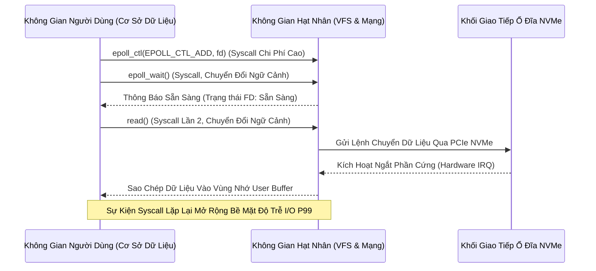

# Đánh giá Chuyên sâu: Cơ chế io_uring và epoll trong Kiến trúc I/O Bất đồng bộ của Cơ sở Dữ liệu

Trong thiết kế hệ thống cơ sở dữ liệu phân tán và hiệu năng cao hiện đại, việc quản lý luồng dữ liệu vào/ra (I/O) giữa bộ nhớ chính và các thiết bị lưu trữ thứ cấp đóng vai trò then chốt trong việc quyết định độ trễ và thông lượng tổng thể. Từ trước đến nay, mô hình I/O bất đồng bộ (asynchronous I/O) trên môi trường nhân (kernel) Linux đã chủ yếu phụ thuộc vào các giao diện truyền thống như `select()`, `poll()`, và đặc biệt là `epoll()`. Tuy nhiên, sự xuất hiện của `io_uring` trong các phiên bản nhân Linux gần đây (từ phiên bản 5.1 trở đi) đã đánh dấu một bước chuyển dịch mô hình mang tính bước ngoặt, cấu trúc lại hoàn toàn cách thức không gian người dùng (user space) giao tiếp với không gian hạt nhân (kernel space). Sự dịch chuyển từ mô hình hướng sự kiện (event-driven) của `epoll` sang mô hình dựa trên hàng đợi chia sẻ bộ nhớ (shared memory queue) của `io_uring` giải quyết trực tiếp các vấn đề về chi phí gọi hệ thống (system call overhead) và chuyển đổi ngữ cảnh (context switching) vốn là những nút thắt cổ chai kinh điển trong các cơ sở dữ liệu đòi hỏi I/O cường độ cao. Bài viết này tiến hành phân tích kiến trúc vi mô, các mô hình toán học định lượng, và nguyên lý quản lý bộ nhớ cơ bản của hai cơ chế này, nhằm đánh giá khả năng áp dụng và những giới hạn phần cứng tương ứng trong bối cảnh các cỗ máy cơ sở dữ liệu hiện đại. Việc phân tách các lớp VFS (Virtual File System), khối lượng công việc của page cache, và cơ chế Direct I/O sẽ cung cấp một cái nhìn toàn diện về cấu trúc I/O ở mức hạt nhân.

## Kiến trúc Hệ điều hành và Hạn chế của epoll trong Mô hình Cơ sở dữ liệu

Cơ chế `epoll`, được giới thiệu trong Linux 2.5.44, vốn dĩ được thiết kế để giải quyết bài toán C10K cho các kết nối mạng (network sockets), thông qua việc theo dõi sự thay đổi trạng thái của các file descriptor (FD). Đối với hệ thống cơ sở dữ liệu, `epoll` thường được kết hợp với các bộ mô tả tệp I/O không chặn (non-blocking I/O file descriptors). Tuy nhiên, mô hình thực thi của `epoll` bị ràng buộc bởi bản chất thông báo mức độ sẵn sàng (readiness notification) thay vì hoàn thành công việc (completion notification). Khi một khối dữ liệu được yêu cầu từ ổ đĩa SSD NVMe, cơ sở dữ liệu gọi `epoll_wait()` để chờ đợi thông báo. Quá trình này yêu cầu CPU phải lưu trữ trạng thái của ngữ cảnh thực thi hiện tại, vượt qua ranh giới người dùng/hạt nhân, kiểm tra trạng thái bên trong hệ thống tệp ảo (VFS), và sau đó quay trở lại. Tổng thời gian trễ $T_{epoll}$ có thể được mô hình hóa toán học bao gồm tổng các thành phần chi phí chuyển đổi:

$$T_{epoll} = t_{ctx\_switch} + t_{syscall} + t_{vfs\_lookup} + t_{device\_io} + t_{interrupt\_handling}$$

Trong môi trường lưu trữ NVMe tốc độ cực cao hiện nay, thời gian thực thi I/O phần cứng $t_{device\_io}$ có thể giảm xuống ngưỡng vài micro giây, điều này khiến cho phần chi phí mềm từ hạt nhân $t_{syscall}$ và $t_{ctx\_switch}$ chiếm một tỷ lệ đáng kể, thậm chí vượt trội, trong tổng số thời gian $T_{epoll}$. Việc thực hiện một lệnh gọi `read()` hoặc `write()` sau khi nhận được thông báo từ `epoll` tiếp tục đòi hỏi một lệnh gọi hệ thống bổ sung, làm nhân đôi hoặc nhân ba số lần chuyển ranh giới hạt nhân-người dùng. Hơn nữa, `epoll` không hỗ trợ tốt cho disk I/O thực sự bất đồng bộ trong Linux. Đối với các tệp tin lưu trữ thông thường (regular files) trên hệ thống tệp cục bộ (ext4, xfs, btrfs), các bộ mô tả tệp luôn báo cáo trạng thái sẵn sàng (ready) khi được truy vấn, dẫn đến việc lệnh gọi hệ thống `read()` hoặc `write()` tiếp theo vẫn có thể bị chặn (block) nghiêm trọng trong không gian hạt nhân nếu dữ liệu không có sẵn trong bộ nhớ đệm trang (page cache) hoặc khi có sự tranh chấp khóa (lock contention) nội tại bên trong cấu trúc hệ thống tệp. Hành vi chặn đột ngột này phá vỡ hoàn toàn nguyên lý thiết kế và mô hình toán học của bộ xử lý cơ sở dữ liệu vòng lặp sự kiện (event-loop database engine), nơi một sự kiện chặn đơn lẻ có thể làm ngưng trệ hàng nghìn kết nối đang được phục vụ bởi lõi CPU đó.

Để giải quyết vấn đề này, các cơ sở dữ liệu có kiến trúc trưởng thành như PostgreSQL phải thiết lập các nhóm luồng (thread pools) tinh vi nhằm mục đích đẩy các thao tác I/O tệp tin lưu trữ ra khỏi luồng thực thi chính, hoặc sử dụng giao diện aio (Linux AIO - `io_submit`), vốn đi kèm với vô số hạn chế kiến trúc. Tiêu biểu nhất là Linux AIO chỉ hoạt động được với I/O trực tiếp (`O_DIRECT`) và yêu cầu khối dữ liệu cùng bộ nhớ đệm (buffer alignment) được căn lề chặt chẽ theo kích thước block logic của ổ cứng (thường là 512 bytes hoặc 4096 bytes). Cơ chế Linux AIO cấu trúc dữ liệu dưới dạng các mảng khối điều khiển `iocb`, và quá trình gửi I/O vẫn đòi hỏi ít nhất một lệnh gọi hệ thống đắt đỏ cho mỗi đợt. Việc mô phỏng cơ chế bất đồng bộ thông qua đa luồng (multi-threading) thay vì cơ chế phi chặn gốc của hệ điều hành (native non-blocking) làm tiêu tốn đáng kể các chu kỳ CPU (CPU cycles) do phải quản lý khóa đồng bộ (mutex locking) và tín hiệu điều phối luồng (condition variables). Trong các cơ sở dữ liệu phân tán sử dụng kiến trúc Shared-Nothing như ScyllaDB, việc có bất kỳ sự đình trệ (stall) nào trong luồng xử lý reactor cốt lõi đều tác động tiêu cực theo hàm mũ đến toàn bộ độ trễ phân vị P99 của nút mạng đó. Khối lượng công việc trong môi trường này thường trải qua sự cạnh tranh cực đoan về băng thông bus bộ nhớ (memory bandwidth contention). Việc sao chép dữ liệu từ bộ đệm của hạt nhân sang không gian người dùng khi sử dụng Buffered I/O kết hợp với `epoll` tiêu thụ tài nguyên của bus RAM DDR cục bộ ở mức cực cao, được thể hiện qua công thức tính toán tài nguyên băng thông hệ thống $B_{req}$:

$$B_{req} = N_{req} \times (S_{req} + S_{kernel\_overhead}) \times C_{mem\_copy}$$

Trong công thức trên, $C_{mem\_copy}$ biểu diễn số vòng lặp truyền tải bộ nhớ qua lại giữa các khu vực địa chỉ ảo, làm bão hòa cấu trúc liên kết vi xử lý NUMA và tạo ra áp lực rất lớn lên hệ thống quản lý bộ nhớ đệm vi xử lý (L3 Cache Eviction). Với các phân tích chuyên sâu như vậy, cơ chế `epoll` truyền thống rõ ràng không còn khả năng đáp ứng trọn vẹn giới hạn vật lý của cấu trúc phần cứng mới, nơi số lượng tác vụ IOPS (I/O operations per second) có thể vượt qua cột mốc hàng triệu hoạt động mỗi giây một cách dễ dàng chỉ trên một luồng CPU đa luồng duy nhất.



## Mô hình Bộ nhớ và Cấu trúc Dữ liệu Vòng của io_uring

Trái ngược hoàn toàn với cách tiếp cận thông báo sự kiện thụ động, `io_uring` thiết lập một kênh giao tiếp liên tục dựa trên bộ nhớ dùng chung (shared memory) phi khóa (lock-free) giữa ứng dụng cơ sở dữ liệu và hạt nhân hệ điều hành. Kiến trúc vi mô cốt lõi của `io_uring` được xây dựng xung quanh hai hàng đợi vòng (circular ring buffers) giao tiếp một chiều cực kỳ tối ưu: Hàng đợi Gửi tác vụ (Submission Queue - SQ) để chuyển các yêu cầu I/O từ không gian người dùng vào khu vực xử lý của hạt nhân, và Hàng đợi Nhận kết quả (Completion Queue - CQ) để hạt nhân hoàn trả trạng thái hoàn thành cùng với mã lỗi tương ứng trực tiếp về bộ nhớ người dùng. Cả hai cấu trúc dữ liệu hình khuyên này đều được ánh xạ trực tiếp (mmap) nguyên bản vào không gian bộ nhớ ảo của tiến trình ứng dụng, điều này loại bỏ triệt để và hoàn toàn nhu cầu sao chép khối lượng cấu trúc dữ liệu điều khiển I/O (I/O control blocks) qua lại ranh giới bảo mật ảo hóa ở mỗi thao tác read/write. Trong mô hình bộ nhớ siêu tinh vi này, việc phát sinh (submission) và tiêu thụ (consumption) các mục SQE (Submission Queue Entries) và CQE (Completion Queue Entries) được đồng bộ hóa hoàn toàn không thông qua các cơ chế khóa mutex phần mềm. Thay vào đó, nó tận dụng các hàng rào bộ nhớ ở cấp độ kiến trúc tập lệnh phần cứng (Hardware ISA Memory Barriers) nhằm định chuẩn thứ tự khả kiến (visibility ordering) một cách tuyệt đối. Cơ chế liên kết con trỏ vòng được diễn tả qua hàm modulo số nguyên như sau:

$$Index_{SQE} = Head_{SQ} \pmod{Size_{Ring}}$$
$$Index_{CQE} = Head_{CQ} \pmod{Size_{Ring}}$$

Để duy trì tính toàn vẹn bộ nhớ trong môi trường thực thi bộ vi xử lý đa lõi (multicore scalar execution), `io_uring` sử dụng nguyên hàm thao tác nguyên tử `smp_store_release()` và `smp_load_acquire()` nhằm định nghĩa tính khả kiến của chuỗi lệnh ghi bộ nhớ (Store-Release/Load-Acquire Semantics). Khi động cơ cơ sở dữ liệu tạo ra một tác vụ I/O, nó ghi trực tiếp dữ liệu (bao gồm opcodes, flags, user_data pointer) vào một vị trí SQE đã được tính toán trong mảng ánh xạ mmap, sau đó nó cập nhật nguyên tử chỉ số con trỏ cuối hàng đợi (Tail Pointer của SQ) thông qua thao tác giải phóng nguyên tử (release semantic). Ở phía đối diện bên trong hạt nhân, tiến trình thăm dò (kernel polling mechanism) sẽ đọc biến số nguyên tử này qua thao tác thu nhận nguyên tử (acquire semantic). Nếu ứng dụng cơ sở dữ liệu được khởi tạo và biên dịch cùng cờ cấu hình cấp thấp `IORING_SETUP_SQPOLL`, một luồng hạt nhân chuyên trách và ẩn danh sẽ được sinh ra (kernel SQPOLL thread) và được gán vĩnh viễn (pinned) vào một lõi CPU cụ thể để liên tục thực hiện vòng lặp thăm dò SQ tail. Thiết kế đặc biệt này cho phép ứng dụng cơ sở dữ liệu gửi và hoàn tất các yêu cầu I/O khối lượng cực lớn với không (0) lệnh gọi hệ thống. Phương trình độ trễ vi mô lúc này đối với một lệnh ghi nhật ký dự phòng WAL (Write-Ahead Logging) $T_{iouring\_WAL}$ được thu gọn tối đa thành:

$$T_{iouring\_WAL} = t_{mem\_barrier\_release} + t_{sqpoll\_latency} + t_{pcie\_dma\_transfer} + t_{mem\_barrier\_acquire}$$

Chỉ số toán học của $t_{mem\_barrier\_release}$ và $t_{mem\_barrier\_acquire}$ trong bộ vi xử lý x86_64 hiện đại thông qua vi lệnh `MFENCE` hoặc `SFENCE` chỉ tốn kém không quá một vài chục chu kỳ xung nhịp CPU, thay thế hoàn toàn cho mức tiêu hao hàng nghìn chu kỳ bắt buộc của thao tác bảo vệ bảng trang (page table isolation - KPTI) trong một syscall truyền thống. Khía cạnh kiến trúc này tạo ra năng lực mở rộng thông lượng theo hệ số tuyến tính thực sự trên cấu trúc liên kết vi xử lý NUMA. 

Mô hình bộ nhớ (memory model) tinh tế của `io_uring` còn được mở rộng sâu hơn thông qua các khái niệm tối ưu hóa kỹ thuật đặc thù như Đăng ký Bộ đệm Chuyên sâu (Registered Buffers / Fixed Buffers) và Đăng ký Bộ mô tả Tệp (Registered Files). Khi một cơ sở dữ liệu xử lý số lượng kết nối hoặc giao dịch phân tán ở quy mô exabyte, việc hạt nhân liên tục thực hiện hành động ánh xạ (map) rồi giải ánh xạ (unmap) các trang bộ nhớ vật lý của không gian người dùng vào khu vực bộ nhớ DMA (Direct Memory Access) dùng cho phần cứng thiết bị là một chu trình thao tác tốn kém không thể phớt lờ. Vấn đề này bị khuếch đại nghiêm trọng do hiện tượng xáo trộn liên tục của bộ đệm dịch địa chỉ nhánh con (Translation Lookaside Buffer - TLB shootdowns). Để khắc chế giới hạn này, tính năng đăng ký trước (pre-registration) cho phép ứng dụng cấp phát các dải bộ nhớ khổng lồ và ra lệnh cho hệ điều hành khóa chặt (pinning) các không gian trang ảo này vào bộ nhớ vật lý tĩnh. Thao tác này được thực thi một lần duy nhất trong quá trình khởi tạo (bootstrap process), sau đó hạt nhân sẽ tính toán và bảo lưu tĩnh các con trỏ vật lý cấp phần cứng dẫn trực tiếp tới hệ thống card giao tiếp PCIe NVMe. Khi luồng ghi đĩa (flusher thread) của cơ sở dữ liệu đẩy đi một yêu cầu theo khuôn mẫu `IORING_OP_WRITE_FIXED`, thành phần IOMMU (Input-Output Memory Management Unit) trên bo mạch chủ không cần tái kiểm duyệt địa chỉ và tự động điều hướng luồng dữ liệu xung nhịp cao ngay lập tức tới bộ nhớ vật lý, bypass toàn diện các chu trình gây ra page fault ảo. 

```mermaid
graph TD
    subgraph Kiến Trúc Không Gian Người Dùng (User Space)
        DB[Database I/O Thread]
        SQ_Tail[SQ Tail Pointer (Atomic)]
        CQ_Head[CQ Head Pointer (Atomic)]
        SQ_Ring[Mảng Hàng Đợi Gửi - SQEs mmap]
        CQ_Ring[Mảng Hàng Đợi Hoàn Thành - CQEs mmap]
    end
    subgraph Kiến Trúc Không Gian Hạt Nhân (Kernel Space)
        SQ_Head[SQ Head Pointer]
        CQ_Tail[CQ Tail Pointer]
        Kernel_Thread[Luồng Thăm Dò Hạt Nhân - SQPOLL]
        Block_Layer[Lớp VFS Bậc Thấp & O_DIRECT / Bypass Cache]
    end
    subgraph Cơ Sở Hạ Tầng Phần Cứng NVMe (Hardware Fabric)
        NVMe[Bộ Điều Khiển Lưu Trữ NVMe PCIe Gen 4/5]
    end

    DB -->|Cập Nhật Dữ Liệu Tải| SQ_Tail
    SQ_Tail -.->|Đồng Bộ Smp_store_release()| SQ_Head
    Kernel_Thread -->|Thăm Dò Và Cắt Dữ Liệu Lập Lịch| SQ_Ring
    Kernel_Thread -->|Phân Bổ Kệnh Yêu Cầu| Block_Layer
    Block_Layer -->|Chỉ Thị Mã Máy DMA Commands| NVMe
    NVMe -->|Tín Hiệu Giao Dịch Hoàn Tất CQ| Block_Layer
    Block_Layer -->|Ghi Lệnh Lên Vùng Nhớ mmap CQE| CQ_Ring
    Block_Layer -->|Dịch Chuyển Con Trỏ Đuôi CQ| CQ_Tail
    CQ_Tail -.->|Đồng Bộ Smp_load_acquire()| CQ_Head
    DB -->|Đọc Gói Dữ Liệu Trực Tiếp Phi Syscall| CQ_Ring
```

Để thiết kế một hệ thống phần mềm nền tảng thực thi tương thích với mô hình vòng lặp sự kiện `io_uring`, bộ định tuyến kiến trúc ngôn ngữ của ứng dụng cấp cao cần phải thiết lập một kỹ thuật gắn kết dữ liệu trạng thái bộ nhớ (user data pointer mapping) cùng với các mã định danh của CQE được trả về. Dưới đây là mã giả lập mô hình lập trình C++ phi chặn cực đoan (ultra-low latency non-blocking architecture), minh họa việc tích hợp hạt nhân-người dùng trong việc thao tác truyền tải bộ nhớ qua io_uring nhằm thay thế thuật toán luồng truyền thống.

```cpp
#include <liburing.h>
#include <memory>
#include <cstdint>
#include <iostream>

// Cấu trúc yêu cầu tùy chỉnh mang theo ngữ cảnh ứng dụng nội bộ
struct IORequest {
    int file_descriptor;
    uint64_t offset;
    std::unique_ptr<char[]> buffer;
    size_t length;
    int operation_type; // e.g., READ, WRITE, FSYNC
};

class AsyncDatabaseStorageEngine {
private:
    struct io_uring ring;
    const unsigned int ring_depth = 8192; // Kích thước vòng lớn để chống tràn I/O áp lực cao

public:
    AsyncDatabaseStorageEngine() {
        struct io_uring_params params = {};
        // Tối đa hóa tối ưu hóa: Sử dụng SQPOLL để loại trừ hoàn toàn syscal khi đệ trình 
        // và thiết lập luồng nhàn rỗi ở mức giới hạn cực thấp.
        params.flags |= IORING_SETUP_SQPOLL;
        params.sq_thread_idle = 2000; 
        
        if (io_uring_queue_init_params(ring_depth, &ring, &params) < 0) {
            throw std::runtime_error("Lỗi phần cứng hoặc hạt nhân không hỗ trợ đầy đủ cấu hình io_uring");
        }
    }

    void submit_direct_write(IORequest* req) {
        // Truy xuất khối SQE rỗng từ Ring Buffer chia sẻ 
        struct io_uring_sqe *sqe = io_uring_get_sqe(&ring);
        if (!sqe) {
            // Khi Hàng đợi SQ quá tải, buộc phải đệ trình (submit) để giải phóng không gian
            io_uring_submit(&ring);
            sqe = io_uring_get_sqe(&ring);
        }
        
        // Cấu hình mã lệnh ghi bất đồng bộ cấp thấp
        io_uring_prep_write(sqe, req->file_descriptor, 
                            req->buffer.get(), req->length, req->offset);
                           
        // Gắn con trỏ của đối tượng C++ trực tiếp vào ô nhớ metadata của SQE.
        // Đây là phương pháp map logic không chi phí (zero-cost abstraction)
        io_uring_sqe_set_data(sqe, req);
    }

    void process_cqe_completions_lockfree() {
        struct io_uring_cqe *cqe;
        unsigned head;
        unsigned count = 0;

        // Vòng lặp chạy phi chặn qua tất cả các CQE đã hoàn tất. 
        // Phụ thuộc hoàn toàn vào cơ chế memory barrier thay cho Mutex.
        io_uring_for_each_cqe(&ring, head, cqe) {
            IORequest* req = static_cast<IORequest*>(io_uring_cqe_get_data(cqe));
            
            if (cqe->res < 0) {
                // Xử lý mã lỗi phân giải từ hạt nhân trả về (EAGAIN, EIO, v.v.)
                std::cerr << "I/O Failure Code: " << cqe->res << std::endl;
            } else {
                // Dữ liệu đã chuyển đến/từ NVMe thành công qua luồng DMA
                commit_transaction_to_wal(req, cqe->res);
            }
            count++;
        }
        
        if (count > 0) {
            // Cập nhật atomic Head pointer để thông báo tái chế bộ nhớ cho hạt nhân
            io_uring_cq_advance(&ring, count);
        }
    }

private:
    void commit_transaction_to_wal(IORequest* req, int transferred_bytes) {
        // Cấu trúc xử lý nghiệp vụ Write-Ahead Log tại User Space
    }
    
    ~AsyncDatabaseStorageEngine() {
        io_uring_queue_exit(&ring);
    }
};
```

## Tối ưu hóa I/O Bất đồng bộ trong Kiến trúc Cơ sở dữ liệu Hiện đại

Việc triển khai toàn diện `io_uring` trong lõi thiết kế cơ sở dữ liệu không chỉ đơn thuần dừng lại ở việc thay thế các cuộc gọi hàm trong thư viện I/O tiêu chuẩn (glibc), mà trên thực tế, nó đã kích hoạt một chu trình xem xét lại tận gốc rễ đối với toàn bộ vi mô hình luồng bộ nhớ trong kiến trúc động cơ lưu trữ (storage engines). Các hệ thống cơ sở dữ liệu phân tán có kiến trúc tương lai, chẳng hạn như Aerospike, hệ sinh thái nền tảng dựa trên framework Seastar, hay bộ định tuyến lưu trữ cốt lõi của ScyllaDB, đều thiết kế và thực thi nghiêm ngặt một mô hình luồng "không chia sẻ trạng thái" (shared-nothing thread model). Nghĩa là, mỗi lõi CPU độc lập sẽ chịu trách nhiệm tuyệt đối trong việc tự quản lý khu vực vùng nhớ phân trang của riêng nó (NUMA-aware memory pools), phân bổ các kết nối mạng máy tính tương ứng, và đảm đương hoàn toàn việc giao tiếp truy xuất lưu trữ độc lập mà không can thiệp qua lại. Khi kết hợp thiết kế hệ thống cấp độ ứng dụng phức tạp này với cơ chế I/O Trực Tiếp đa cấp (`O_DIRECT`), giao diện `io_uring` cung cấp một phương pháp luận thực sự mang tính bất đồng bộ 100% nhằm vòng qua lớp phần mềm trung gian VFS Page Cache một cách hiệu quả tối thượng. Đặt vào ngữ cảnh nếu cơ sở dữ liệu đó đã được tinh chỉnh để sử dụng hệ thống cấu trúc bộ nhớ đệm nội tại siêu việt (như buffer pool LRU độc quyền của InnoDB thuộc MySQL), việc tiếp tục sử dụng Page Cache mặc định của hệ điều hành thực chất lại tạo ra chi phí sao chép vùng nhớ đệm bị trùng lặp dư thừa (double buffering). Tình trạng này không chỉ lãng phí bộ nhớ vật lý cực kì đắt đỏ mà còn tạo ra rủi ro cạn kiệt tài nguyên ảo (memory pressure constraints) theo những kịch bản không thể tiên đoán và kiểm soát bằng thuật toán của không gian người dùng. Sự phối hợp chiến lược ở cấp độ vi mô giữa cấu trúc `io_uring` đa nhiệm và Direct I/O đã thực thi việc định hình một tuyến cao tốc dữ liệu (data highway) thông suốt và không rào cản từ lớp giao thức phần cứng PCIe NVMe đến ngay vùng nhớ phân trang DMA mà tiến trình cơ sở dữ liệu đã phân bổ từ ban đầu.

Hơn thế nữa, tính năng đa dạng hóa giao diện là một trong những ưu thế kiến trúc đột phá, nơi `io_uring` được chứng minh là một cơ chế đa mô thức không chỉ dành cho lưu trữ đĩa vật lý mà còn là vũ khí vô song cho mạng truyền tải (networking layer). Thông qua khả năng tích hợp chặt chẽ việc gửi và nhận trên luồng I/O mạng TCP/UDP (mô phỏng chuẩn giao thức `sendmsg`, `recvmsg`, `accept`, và thiết lập kết nối phi trạng thái qua cơ chế time-out nội sinh `IORING_OP_TIMEOUT`), động cơ cơ sở dữ liệu dựa trên vòng lặp sự kiện duy nhất (single multiplexed event-loop engine) có thể dễ dàng hợp nhất (multiplex) toàn bộ các tải công việc bao gồm I/O mạng từ phía hàng triệu client và tác vụ lưu trữ ghi I/O lên các mảng đĩa cứng SSD nội bộ, để tất cả chúng cùng hội tụ vào chung một Hàng đợi Nhận Kết quả (Completion Queue CQE ring). Hành vi tích hợp cấp hệ thống cực đoan này giảm thiểu tối đa hiện tượng xâm lấn cấu trúc luồng của hạt nhân. Đồng thời, nó đẩy ngưỡng khả năng phân tán lệnh cấp độ L1/L2 Cache của bộ vi xử lý lên mức bão hòa hoàn hảo nhờ giảm thiểu tỷ lệ rớt bộ đệm (instruction cache miss rate). Các báo cáo khảo sát hệ thống với các kho lưu trữ khối như Intel Optane NVMe SSD tiết lộ rằng tính năng kết nối các lệnh (Linked SQEs) cùng kĩ thuật đẩy theo lô tập trung (batch submission array) trong tính năng `io_uring_submit()` giúp thông lượng dữ liệu IOPS hệ thống đạt mốc gia tăng biên độ vô tiền khoáng hậu (từ 150% đến 250%) khi so sánh với cấu trúc POSIX AIO có đa luồng truyền thống.

Cuối cùng, tính chất xác định cấu trúc theo hàm chuỗi thời gian phân đoạn toán học (deterministic execution characteristic) của hệ sinh thái `io_uring` là chìa khóa để kiến tạo nên những cỗ máy xử lý đám mây độ trễ thấp (low-latency cloud compute node). Khác với tình trạng chờ chặn đan xen và gây ra nghẽn cổ chai cục bộ ở `epoll_wait()`, nơi các ngắt phần cứng (hardware IRQs) có nguy cơ gây ngập lụt hệ thống (interrupt storming) và làm chậm chu trình đồng bộ hoá thời gian thực đối với các lõi CPU xử lý giao dịch. Biến thể cấp tiến `IORING_SETUP_IOPOLL` của io_uring sử dụng kỹ thuật thăm dò luân phiên (busy polling mode), yêu cầu lõi CPU xử lý hệ điều hành theo dõi trạng thái hoàn thành trực diện ở cấp phần cứng thay vì chuyển sang trạng thái ngắt chờ bị động. Dẫu cho điều kiện này tiêu hao mức điện năng nhỉnh hơn đôi chút (do không Sleep CPU), nhưng nó đã triệt tiêu hoàn toàn độ trễ khôi phục (wake-up delay) vốn nằm ẩn trong khối mã nguồn kiến trúc C của hạt nhân Linux dành cho bộ điều khiển NVMe. Phương thức toán học này đã góp phần thu hẹp thời gian đáp ứng của toàn bộ chu trình xử lý tiệm cận đến mức trần vật lý của mạng tinh thể bán dẫn bộ nhớ. Toàn bộ các ưu việt toán học đa chiều này, đi kèm với việc loại bỏ vĩnh viễn khóa hệ điều hành (kernel locks) nhờ sự tương tác bộ nhớ nguyên tử, đã một lần và mãi mãi xác lập `io_uring` thành trụ cột cốt lõi không thể xâm phạm trên đường đua tái định hình lại toàn bộ kiến trúc lõi quản trị dữ liệu lớn toàn cầu trong kỷ nguyên điện toán đám mây thế hệ mới.

## Tối Ưu Hóa Tìm Kiếm (SEO)
*   **Focus Keyword:** Linux io_uring, epoll, asynchronous I/O, database performance, storage engines, Direct I/O.
*   **Meta Description:** Báo cáo phân tích chuyên sâu về sự khác biệt kiến trúc vi mô giữa mô hình io_uring và epoll trong tối ưu hóa luồng I/O bất đồng bộ của hệ thống cơ sở dữ liệu tốc độ cực cao trên hạt nhân Linux.
*   **Target Audience:** Chuyên gia hệ thống, Kiến trúc sư CSDL phân tán, Kỹ sư lập trình C/C++, Chuyên viên tối ưu hệ điều hành Linux Kernel.
*   **Core Concepts Discussed:** Hàng rào bộ nhớ vi kiến trúc (Hardware ISA Memory Barriers), Chia sẻ bộ nhớ đa luồng phi khóa (Lock-free Shared Memory Queue), Giải phẫu độ trễ mạng NVMe PCIe Gen 4/5, Sự cạn kiệt băng thông cấu trúc NUMA (Memory Contention), Chiến lược bypass VFS Page Cache bằng Direct I/O (`O_DIRECT`).
