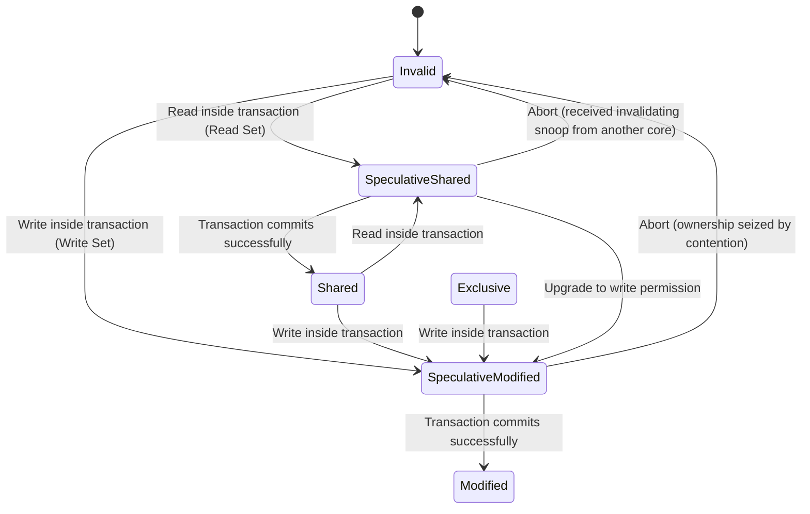

# Hardware Transactional Memory (HTM): A Micro-Architectural Anatomy and the Future of Database Locking

## Summary & Core Problem Statement

Keeping shared data consistent across threads is one of the oldest hard problems in database engineering, and for decades the industry's default answer was the same: **Pessimistic Concurrency Control (PCC)** — mutexes, semaphores, spinlocks, all serializing access before a single byte gets touched.

That default comes with real costs, and they show up at the micro-architectural level, not just in application throughput.
1. **Cache line bouncing:** when dozens of CPU cores fight over the same lock flag (usually a plain boolean), the cache-coherence protocol (MESI) has to shuttle invalidation messages between L1 caches nonstop. The inter-core interconnect ends up spending more bandwidth on lock traffic than on actual data.
2. **Lock convoying and priority inversion:** if a thread holding a lock gets context-switched out mid-critical-section, every other thread queued behind that lock sits idle for no good reason.
3. **Scalability limits in tree structures:** locking a B+Tree from root to leaf (lock coupling) turns the root into a serialization point that caps how much parallelism you can extract.

**Hardware Transactional Memory (HTM)** — most notably Intel's TSX (Transactional Synchronization Extensions) — attacks this problem from a different angle entirely. Instead of asking for a lock up front, a thread runs its update **optimistically**: the CPU quietly uses its own L1 cache to watch whether any other core touches the same data mid-transaction. If nothing collides, the transaction commits almost instantly. If something does collide, the CPU throws away every speculative change and rolls back in a handful of cycles.

This piece walks through how HTM actually works under the hood — the L1 cache mechanics, Intel's RTM instruction set, the hard physical ceiling on transaction size, how HTM interacts (badly, sometimes) with the OS kernel, and what breaks in practice once you try to run HTM inside a real in-memory database.

---

## The Theoretical Foundations of HTM: L1 Cache and the MESI Protocol

Software Transactional Memory (STM) tried to solve this same problem years earlier and mostly failed — the software-side bookkeeping added too much latency to be worth it. HTM sidesteps that by pushing the entire transaction-control logic down into silicon.

### The Read Set and the Write Set
When a thread starts a hardware transaction, the CPU takes an **architectural checkpoint** — a snapshot of the full register state. From that point on, every memory access is sandboxed:
- Anything the CPU reads gets tagged into the **Read Set**.
- Anything the CPU wants to modify gets tagged into the **Write Set**.

The key trick is that writes made inside the transaction stay purely **speculative**. They live inside that core's L1 data cache and never get flushed out to RAM or to L2/L3 — not until the transaction commits.

### Conflict Detection via MESI
So how does the CPU detect that another thread stepped on its data, without any software-level checking? It piggybacks on a mechanism that already exists: cache coherence.

The MESI protocol (Modified, Exclusive, Shared, Invalid) tracks the state of every cache line, typically 64 bytes. While a transaction is in flight:
1. Core A reads variable $X$ — the cache line holding $X$ moves to a *Speculative Shared* state.
2. Core B (running HTM or not, it doesn't matter) tries to write to $X$. It broadcasts an RFO (Read-For-Ownership) message on the system bus, demanding *Modified* ownership.
3. Core A snoops that RFO and notices it targets a cache line sitting in its own Read Set.
4. **Conflict detected.** Core A immediately discards all speculative data in L1, restores registers to the original checkpoint, and aborts. The whole rollback takes roughly 10-20 clock cycles — thousands of times faster than a software try/catch.



---

## The Limits of Physics: L1 Cache Capacity Aborts

Riding on L1 cache is what makes HTM so fast, but it's also its biggest weakness. A hardware transaction's size is bound by the physical dimensions of the L1 data cache — there's no getting around it.

On Intel Skylake or Ice Lake, the L1 data cache is 32KB, organized as an 8-way set-associative structure. That caps the theoretical maximum Write Set size at 32KB. In practice it's often much lower: because of the 8-way associativity, if a transaction touches 9 different variables that happen to hash into **the same cache set**, that set fills up well before the cache as a whole does.

HTM has one hard rule: uncommitted speculative data is never evicted down to L2. So the moment a set fills up locally, the CPU has no fallback — it triggers a **Capacity Abort**, even if the rest of the system is completely idle with zero thread contention.

**Modeling the failure rate:**
Let $|R|$ and $|W|$ denote the size of the Read Set and Write Set. The probability of a successful commit, $P_{success}$, decays exponentially as $|R| + |W|$ approaches the L1 limit, and again as the number of concurrent threads $N$ grows:
$$ P_{success} = \left( 1 - \frac{|R| + |W|}{D_{L1\_Capacity}} \right)^{C \cdot (N - 1)} $$

---

## Programming Databases with Intel TSX (RTM)

Intel exposes this through the Restricted Transactional Memory (RTM) instruction set, built around three primitives:
- `_xbegin()`: starts the transaction, creates a checkpoint.
- `_xend()`: commits the transaction.
- `_xabort()`: lets software proactively bail out.

### Lock Elision
HTM doesn't get rid of locks — it wraps them in a technique called **Lock Elision**. Rather than fighting to write `is_locked = true` (which is exactly the cache-bouncing pattern we're trying to avoid), threads simply *read* `is_locked == false` inside the HTM block. If threads A and B both observe the flag as false, the hardware silently lets both enter the critical section in parallel — and if they touch different records, both transactions commit cleanly.

### The Fallback Path (Non-Negotiable)
HTM makes no forward-progress guarantee. A transaction can hit a permanent Capacity Abort no matter how many times you retry, so the code always needs an escape hatch — typically a traditional spinlock.

**The Lemming Effect** is the trap here: once thread A gives up on HTM and grabs the fallback spinlock, it writes `is_locked = true`. That single write fires an invalidation broadcast, which instantly aborts every one of the, say, 100 other threads currently running HTM transactions — because all of them are sitting there reading `is_locked == false` as part of their Read Set. The system collapses into serial execution exactly when you needed it to scale.

The fix is to check the spinlock **before** entering HTM, and check it again from inside the transaction:

```cpp
#include <immintrin.h>
#include <atomic>
#include <thread>

class TSXTransactionalMutex {
    std::atomic<bool> fallback_lock{false};

public:
    void execute_transaction(auto&& db_operation) {
        int retries = 0;
        const int MAX_RETRIES = 5;

        while (true) {
            // 1. PREVENT THE LEMMING EFFECT: wait for the software lock to open before trying HTM
            if (fallback_lock.load(std::memory_order_relaxed)) {
                _mm_pause(); 
                continue; 
            }

            // 2. Start the Hardware Transaction
            unsigned status = _xbegin();

            if (status == _XBEGIN_STARTED) {
                // 3. Bring the Lock into the Read Set. If any thread holds the Fallback, abort now!
                if (fallback_lock.load(std::memory_order_relaxed)) {
                    _xabort(0xff); 
                }

                // 4. Execute the database logic (B-Tree traversal, tuple update...)
                db_operation();

                // 5. Blazing-fast commit (microseconds)
                _xend();
                return; // A resounding transaction success!
            } else {
                // Analyze the hardware's abort reason
                if ((status & _XABORT_RETRY) && retries < MAX_RETRIES) {
                    // Data conflict — back off and retry
                    retries++;
                    exponential_backoff(retries);
                    continue;
                }
                
                // Out of retries, or a Capacity Abort -> forced to fall back to the pessimistic lock
                acquire_fallback_lock();
                db_operation();
                release_fallback_lock();
                return;
            }
        }
    }

private:
    void acquire_fallback_lock() {
        while (fallback_lock.exchange(true, std::memory_order_acquire)) {
            while (fallback_lock.load(std::memory_order_relaxed)) _mm_pause();
        }
    }
    void release_fallback_lock() { fallback_lock.store(false, std::memory_order_release); }
    void exponential_backoff(int attempt) { /* Backoff CPU cycles */ }
};
```

---

## The Interaction Between HTM and the OS Kernel

Pairing a micro-scale transaction mechanism with a full operating system is asking for trouble. Anything that disturbs user space mid-transaction turns into a **Spurious Abort** — a failure that has nothing to do with data conflicts.

1. **Context switches and interrupts:** a timer interrupt fires, or a network packet arrives, and the kernel takes control. The moment the CPU context-switches, the transaction aborts.
2. **Page faults:** if HTM touches a virtual memory region that hasn't been backed by a physical page yet (demand paging), or one that's been swapped out, the kernel steps in and the transaction aborts.
3. **TLB shootdowns:** the kernel unmaps a page on some other thread and sends an IPI (inter-processor interrupt) to force every core to update its TLB. That interrupt aborts any HTM transaction in flight.

**What this means operationally:**
Getting HTM to actually pay off in production requires locking down the environment around it:
- Use **huge pages** (2MB/1GB) to eliminate page faults during transactions.
- Pin memory with `mlock()` so the OS can't swap it out from under you.
- Disable unnecessary hardware interrupts on the cores running transactional code.

---

## False Sharing & B-Tree Optimization

The nastiest trap in HTM design is **false sharing**. MESI operates at 64-byte granularity, not at the granularity of your variables. Say thread A transacts on `Counter_A` and thread B transacts on `Counter_B`, and the two variables happen to live next to each other in the same 64-byte cache line. When thread B modifies `Counter_B`, it claims ownership of the *entire* line — and thread A, watching that same line as part of its Read Set, aborts immediately, even though the two counters have nothing to do with each other logically.

**The fix is cache line padding.**
Database engineers deal with this by aligning sensitive structures with `alignas(64)`, forcing each field onto its own cache line. The cost is memory bloat — padding a small struct out to 64-byte boundaries can waste a lot of space, and tuning that tradeoff between abort rate and memory footprint is genuinely fiddly work.

**Where this pays off: B-Trees.**
In-memory databases like Silo and HyPer lean on HTM specifically to avoid root-to-leaf locking, which otherwise turns the root node into a global bottleneck. Instead, they wrap the entire tree traversal inside `_xbegin()`/`_xend()`. Thousands of threads can descend to their target leaves concurrently without acquiring a single lock; HTM only needs to guarantee atomicity at the point where a leaf actually gets written.

---

## Future Architecture: The Symbiosis of HTM and Network RDMA

In a distributed cloud database cluster, a traditional two-phase commit (2PC) over TCP/IP costs hundreds of microseconds — an eternity compared to a local HTM transaction.

The interesting direction is combining **HTM inside the processor core** with **RDMA**, which lets one machine touch another's memory without involving its CPU, over InfiniBand or RoCEv2:
- **Preparation phase:** RDMA fetches a copy of the tuple from the remote machine into the coordinating node in about 2 microseconds, without disturbing the remote CPU at all.
- **Local phase:** the coordinating node opens a fast HTM transaction locally, reconciles the tuple version, and computes the update.
- **Confirmation phase:** once HTM commits, the node uses an RDMA CAS (Compare-And-Swap) to write the result directly into the remote machine's memory.

This hybrid, known as DrTM (Distributed hardware Transactional Memory) and proposed out of Microsoft Research and MIT, removes the need for heavyweight distributed locks almost entirely.

---

## Lessons Learned & Best Practices for Systems Engineers

1. **HTM is not a silver bullet.** Don't go rip out your mutexes. HTM is an optimistic fast path layered on top of a pessimistic fallback, not a replacement for one. If your working set regularly exceeds the 32KB L1 limit, or your contention rate is genuinely high, HTM will make things slower — you'll pay for abort-and-retry cycles instead of just waiting on a lock. Keep the fallback path solid.
2. **Watch the abort rate.** Use Linux `perf` to read the PMU (Performance Monitoring Unit) counters. If Capacity Aborts run above 30%, your transactions are too big — split them into smaller chunks.
3. **Design against false sharing from the start.** Any struct holding transactional metadata should be built with 64 bytes in mind. `alignas(64)` isn't optional polish — it's often the difference between HTM working and not.
4. **Check hardware and hypervisor support before committing to the design.** Some Intel CPUs have shipped with TSX-related microcode bugs serious enough that vendors disabled the feature via microcode update. Many cloud providers (AWS, GCP) turn off TSX by default at the hypervisor level, so verify the flag is actually enabled before you architect a database around it.
