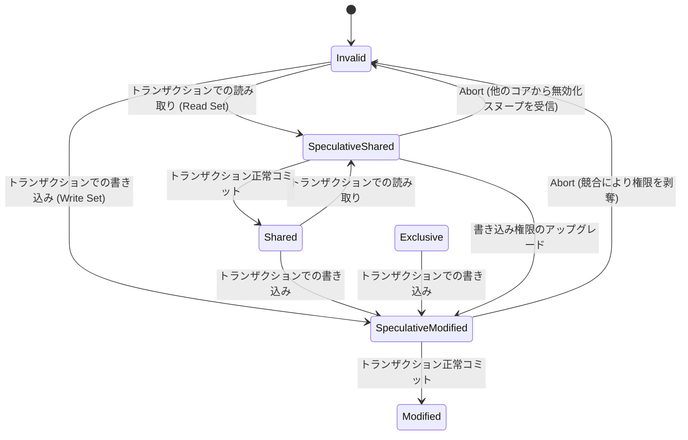

# 46: Hardware Transactional Memory(HTM): マイクロアーキテクチャの解剖とデータベースロッキングの未来

## 概要と中心的な問題

マルチスレッドプログラミングと高負荷なOLTPデータベースの世界では、共有データの整合性を保つことが常に大きな課題だった。何十年もの間、業界の答えはほぼ一つしかなかった。Mutex、Semaphore、Spinlockといったソフトウェアロックによる**悲観的並行性制御(Pessimistic Concurrency Control - PCC)**だ。

しかし従来のソフトウェアロックには、マイクロアーキテクチャレベルで無視できない弱点がある。
1. **Cache Line Bouncing:** 何十ものCPUコアがロックフラグ(単なるboolean変数のことが多い)の更新を奪い合うと、キャッシュコヒーレンシプロトコル(MESI)がL1キャッシュ間で無効化メッセージを絶えずやり取りする羽目になり、コア間の帯域幅を圧迫する。
2. **Lock ConvoyingとPriority Inversion:** ロックを保持しているスレッドがOSに突然コンテキストスイッチされると、待機列に並ぶ何千ものスレッドが無駄に足止めを食う。
3. **スケーラビリティの限界:** B+Treeのような巨大なデータ構造では、ルートからリーフまでのLock Couplingが並行実行能力を大きく制限してしまう。

**Hardware Transactional Memory(HTM)**――代表格はIntel TSX(Transactional Synchronization Extensions)命令セット――は、この問題に対する一つの答えとして登場した。HTMを使うと、スレッドは事前にロックを取得することなく**楽観的に**データ更新を実行できる。CPUは自身のL1キャッシュの仕組みを使い、他のスレッドが同じデータを触っていないかを裏で監視する。誰も触れていなければトランザクションは瞬時に成功する。誰かが触れていれば、CPUはすべての変更を破棄し、一瞬でロールバックする。

この記事では、HTMの量子的とも言える動作原理、Intel RTM命令セットの構造、L1キャッシュが課す物理的な制約、HTMとOSカーネルの間で起きる複雑な相互作用、そして分散インメモリデータベースにHTMを実装する際の実践的な教訓を掘り下げていく。

---

## HTMの理論的基盤: L1CacheとMESIプロトコル

ソフトウェアのレイテンシがネックとなってほぼ実用化に失敗したSoftware Transactional Memory(STM)とは違い、HTMはトランザクション制御のロジックそのものをシリコン回路に直接埋め込んでいる。

### Read SetとWrite Set

スレッドがハードウェアトランザクションを開始すると、CPUは**アーキテクチャチェックポイント**を作成し、すべてのレジスタ状態をキャプチャする。この時点から、RAMへの読み書きはすべてシステムによってサンドボックス化される。
- CPUが読み取ったメモリはすべて**Read Set**としてマークされる。
- CPUが変更しようとするメモリはすべて**Write Set**としてマークされる。

興味深いのは、これらの書き込みが**あくまで投機的**だという点だ。書き込み内容はそのCPUコアのL1データキャッシュ内にひっそりと保持されるだけで、RAMやL2/L3キャッシュへフラッシュされることは一切ない。

### MESIプロトコルによる競合検出

ソフトウェア側で何もチェックしていないのに、CPUはどうやって他のスレッドが自分のトランザクションを邪魔しているか知るのだろうか。答えは、既存のキャッシュコヒーレンシプロトコルをそのまま流用することにある。

MESIプロトコル(Modified、Exclusive、Shared、Invalid)は各キャッシュライン(通常64バイト)の状態を管理する。トランザクション実行中は次のように動く。
1. コアAが変数$X$を読むと、$X$を含むキャッシュラインは*Speculative Shared*状態になる。
2. コアB(HTMを実行中かどうかは関係ない)が変数$X$への書き込みを試みると、コアBは*Modified*権限を得るためRFO(Read-For-Ownership)メッセージをシステムバスにブロードキャストする。
3. コアAはこのRFOメッセージを「盗み聞き」(Snoop)し、それが自分のRead Set内のキャッシュラインを狙っていることに気づく。
4. **その瞬間、データ競合が確定する。** コアAはL1キャッシュ内の投機的データをすべて破棄し、レジスタを最初のチェックポイントへ復元してトランザクションを中止する。このロールバック全体はおよそ10〜20クロックサイクルで完了し、ソフトウェアのtry/catchより何千倍も速い。



---

## 物理的な壁: L1 Cache Capacity Abort

L1キャッシュに依存することでHTMは驚くほど速くなるが、これは同時にHTMの弱点でもある。トランザクションのサイズは、L1データキャッシュという物理的な枠に永遠に縛られる。

Intel SkylakeやIce Lakeでは、L1データキャッシュの容量は32KB、8-way set associative構造だ。つまりWrite Setの絶対的な上限は32KBを超えられない。さらに厄介なのは、8-way構造ゆえに、トランザクションが9つの異なる変数(9本のキャッシュラインに配置)へ書き込もうとして、それらがハードウェアのハッシュ関数によって**同じキャッシュセット**に割り当てられてしまうと、そのセット単体がいっぱいになってしまうことだ。

HTMの鉄則がここで効いてくる。**コミット前の投機的データは、L2キャッシュへ追い出されることが決して許されない**。だからL1がローカルにいっぱいになると、システムがアイドル状態でスレッド間の競合がまったくなくても、CPUは白旗を揚げて**Capacity Abort**(容量超過による中止)を発生させる。

**HTMの成功確率を式で見ると:** $|R|$と$|W|$をそれぞれRead SetとWrite Setのサイズとすると、トランザクションの成功確率$P_{success}$は、$|R| + |W|$がL1の上限に近づくほど、また同時実行スレッド数$N$が増えるほど指数的に落ちていく。
$$ P_{success} = \left( 1 - \frac{|R| + |W|}{D_{L1\_Capacity}} \right)^{C \cdot (N - 1)} $$

---

## Intel TSX(RTM)でデータベースを書く

Intelが提供するRestricted Transactional Memory(RTM)命令セットには、主に次の3つの命令がある。
- `_xbegin()`: トランザクションを開始し、チェックポイントを作る。
- `_xend()`: トランザクションをコミットする。
- `_xabort()`: ソフトウェア側から能動的にトランザクションを中止する。

### Lock Elisionという発想

HTMはロックそのものを廃止するわけではなく、**Lock Elision**という考え方を持ち込む。`is_locked = true`というフラグを書き換えようと奪い合う(これがキャッシュバウンシングの元凶になる)代わりに、スレッドはHTMブロック内で`is_locked == false`を読むだけにする。スレッドAとBが両方とも`false`を読んだ場合、ハードウェアは暗黙的に両者がクリティカルセクションへ同時に入ることを許す(異なるレコードを変更している限り、HTMは自動的にコミットに成功する)。

### フォールバック経路は必須

HTMはForward Progress(いずれ完了するという保証)を提供しない。トランザクションが永久にCapacity Abortし続ける可能性は十分にある。したがって、実装には常に従来のSpinlockによる退避経路が必要になる。

**Lemming Effect:** スレッドAがHTMを諦めてSpinlock(フォールバックロック)を取得すると、`is_locked`を`true`に書き換える。この書き込みは即座に無効化メッセージをブロードキャストし、`is_locked == false`を読んで待機していた他の100個のスレッドを**一斉に**Abortさせてしまう。結果として、システム全体が悲惨なシングルスレッド実行モードに転落する。

この現象を避けるため、標準的なC++実装ではHTMに**入る前に**Spinlockの状態をチェックし、さらにHTM内部でも再チェックする必要がある。

```cpp
#include <immintrin.h>
#include <atomic>
#include <thread>

class TSXTransactionalMutex {
    std::atomic<bool> fallback_lock{false};

public:
    void execute_transaction(auto&& db_operation) {
        int retries = 0;
        const int MAX_RETRIES = 5;

        while (true) {
            // 1. レミング効果の防止: HTMを試す前にソフトウェアロックが開くのを待つ
            if (fallback_lock.load(std::memory_order_relaxed)) {
                _mm_pause(); 
                continue; 
            }

            // 2. ハードウェアトランザクションの開始
            unsigned status = _xbegin();

            if (status == _XBEGIN_STARTED) {
                // 3. ロックをRead Setに組み込む。Fallbackを保持しているスレッドがある場合は即座にAbort！
                if (fallback_lock.load(std::memory_order_relaxed)) {
                    _xabort(0xff); 
                }

                // 4. データベースロジックの実行 (B-Tree traversal, update tuple...)
                db_operation();

                // 5. 瞬時コミット (Micro-seconds)
                _xend();
                return; // トランザクション大成功！
            } else {
                // ハードウェアからのAbort理由の分析
                if ((status & _XABORT_RETRY) && retries < MAX_RETRIES) {
                    // データ競合 (Conflict)、Backoffして再試行可能
                    retries++;
                    exponential_backoff(retries);
                    continue;
                }
                
                // 再試行制限超過またはCapacity Abort -> Fallback Lock (悲観的) の使用を強制
                acquire_fallback_lock();
                db_operation();
                release_fallback_lock();
                return;
            }
        }
    }

private:
    void acquire_fallback_lock() {
        while (fallback_lock.exchange(true, std::memory_order_acquire)) {
            while (fallback_lock.load(std::memory_order_relaxed)) _mm_pause();
        }
    }
    void release_fallback_lock() { fallback_lock.store(false, std::memory_order_release); }
    void exponential_backoff(int attempt) { /* Backoff CPU cycles */ }
};
```

---

## HTMとOSカーネルの微妙な関係

ミクロなトランザクションとマクロなOSという組み合わせは、思った以上に危うい。ユーザースペースを乱すあらゆるイベントが**Spurious Abort**(不当な中止)につながりかねない。

1. **コンテキストスイッチと割り込み:** タイマー割り込みが発生したり、ネットワークパケットが届いたりしてカーネルが制御権を奪うと、そのままHTMトランザクションは中止される。
2. **ページフォールト:** HTM実行中に、まだ物理メモリが割り当てられていない仮想アドレス(Demand Paging)へアクセスしたり、スワップアウトされたページに触れたりすると、カーネルの介入によりHTMはAbortする。
3. **TLB Shootdown:** カーネルが別スレッドのmmapページを解放し、全スレッドにIPI(Inter-Processor Interrupt)をブロードキャストしてTLB更新を強制すると、これもHTM Abortを引き起こす。

**運用側でできる対策:**
HTMをまともに動かすには、データベース環境をかなり作り込む必要がある。
- ページフォールトを避けるために**Huge Pages(2MB/1GB)**を使う。
- OSにスワップさせないよう`mlock()`でRAMを固定する。
- トランザクション処理を行うコア上の不要なハードウェア割り込みをオフにする。

---

## False SharingとB-Treeの最適化

HTM設計における最も厄介な落とし穴が**False Sharing**だ。

MESIプロトコルは64バイト(キャッシュライン)単位でしか状態を管理できない。スレッドAが変数`Counter_A`を、スレッドBが変数`Counter_B`をそれぞれトランザクション内で扱っていても、この2つの変数が同じ64バイトブロック内に隣接して配置されていたらどうなるか。スレッドBが`Counter_B`を変更した瞬間、そのブロック全体の所有権が意図せず失われる。スレッドAは`Counter_A`を含むブロックの権限が奪われたことを検知し、両者に論理的なつながりが何もなくても即座にAbortしてしまう。

**対策: Cache Line Padding**
C++でデータベースを設計するエンジニアは、こうしたホットなデータ構造に`alignas(64)`を指定することでこれを回避する。ただしこのパディングはメモリの無駄遣い(Memory Bloat)につながる。HTMのAbort率とメモリ使用効率のトレードオフは、常に頭を悩ませる問題だ。

**B-Treeでの活用:**
Silo、HyPerのようなインメモリデータベースでは、HTMはB-Treeにとってかなり有効な武器になる。ルートからリーフまで逐一ロックする(ルートがボトルネックになる)代わりに、ツリー走査全体を`_xbegin()`と`_xend()`で包んでしまう。何千ものスレッドが単一のロックを取得することなく同時にリーフまで降りていける。書き込みが発生するリーフの部分だけ、HTMが原子性を保証すればよい。

---

## この先の姿: HTMとRDMAネットワークの組み合わせ

分散クラウドデータベースクラスタでは、TCP/IP経由の従来型2PC(Two-Phase Commit)には数百マイクロ秒もかかってしまう。

データベースロッキングの次の一手は、InfiniBandやRoCEv2上での**HTM(プロセッサコア内)**と**RDMA(相手のCPUに触れないネットワーク処理)**の組み合わせにありそうだ。
- **準備フェーズ:** RDMAがリモートマシンからタプルのレプリカを約2マイクロ秒で中央ノードへ取得する(相手側サーバーのCPUは一切関与しない)。
- **ローカルフェーズ:** 中央ノードのCPUが瞬時にHTMトランザクションを開き(Fast-Path)、タプルのバージョンを計算・調整する。
- **確定フェーズ:** HTMが成功すれば、そのノードはRDMAのCAS(Compare-And-Swap)を使ってリモートマシンのRAMへ変更を反映する。

Microsoft/MITが提案したこのDrTM(Distributed hardware Transactional Memory)というハイブリッド構成は、巨大な分散ロックという概念自体をほぼ不要にする。

---

## システムエンジニアへの教訓

1. **HTMは万能薬ではない:** Mutexを完全に捨ててはいけない。HTMはあくまで*楽観的な高速パス*にすぎない。32KBのL1容量を超える大きなデータブロックや、競合率が本当に高いワークロードでは、Abort-and-Retryを繰り返してかえって遅くなる。常にしっかりしたフォールバックパスを用意しておくこと。
2. **Abort率を監視する:** `perf`のようなLinuxツールでPMU(Performance Monitoring Unit)レジスタを見る。Capacity Abortの割合が30%を超えるようなら、トランザクションが長すぎるサインだ。トランザクションを細かく分割していこう。
3. **False Sharing対策を怠らない:** トランザクション関連のメタデータを持つC/C++の構造体を定義するときは、常に64バイトという単位を意識する。`alignas(64)`はHTMの性能を守る生命線だ。
4. **ハードウェアの互換性を確認する:** IntelのCPUにはTSX関連のマイクロコードバグがあり、システムクラッシュにつながったことがある。多くのクラウドプロバイダ(AWS、GCPなど)はハイパーバイザーレベルでTSXをデフォルト無効にしている。データベースを設計する前に、TSXフラグが有効になっているかOS側の設定を確認しておく必要がある。

---
