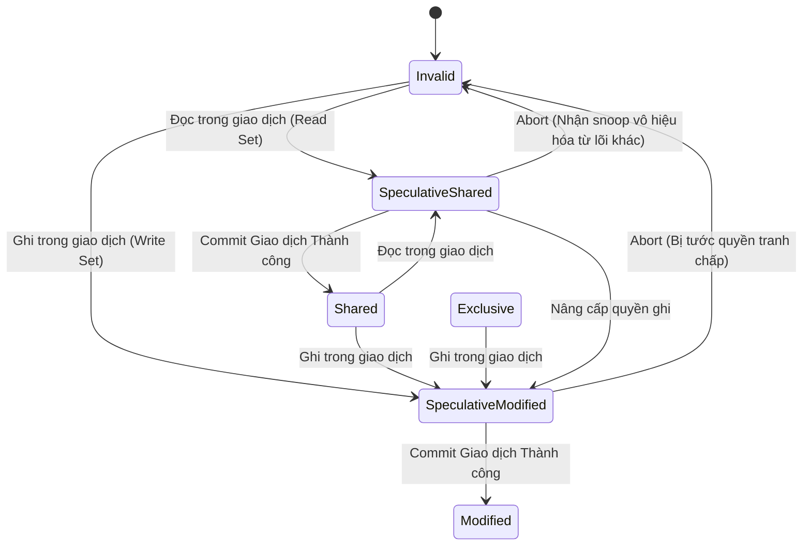

# 46: Hardware Transactional Memory (HTM): Giải Phẫu Vi Kiến Trúc Và Tương Lai Của Database Locking

## Tóm Tắt & Vấn Đề Cốt Lõi (Core Problem Statement)

Trong lập trình đa luồng và các cơ sở dữ liệu OLTP cường độ cao, giữ cho dữ liệu dùng chung không bị xé nát bởi các luồng cạnh tranh nhau là bài toán không thể lảng tránh. Suốt nhiều thập kỷ, câu trả lời gần như duy nhất là **kiểm soát đồng thời bi quan (Pessimistic Concurrency Control)** — Mutex, Semaphore, Spinlock, tất cả đều dựa trên việc xin khóa trước khi đụng vào dữ liệu.

**Vấn đề cốt lõi:** các cơ chế khóa phần mềm truyền thống kéo theo những cái giá không hề nhỏ ở tầng vi kiến trúc.
1. **Cache Line Bouncing.** Khi hàng chục lõi CPU cùng tranh nhau cập nhật một cờ khóa (thường chỉ là một biến boolean), lưu lượng truy cập bộ nhớ qua bus hệ thống tăng vọt. Giao thức MESI phải liên tục bắn thông điệp vô hiệu hóa qua lại giữa các L1 cache, và băng thông liên kết giữa các lõi trở thành nút thắt cổ chai.
2. **Lock convoying và đảo ngược độ ưu tiên.** Một luồng đang giữ khóa mà bị hệ điều hành ngắt giữa chừng (context switch) sẽ khiến hàng nghìn luồng khác xếp hàng chờ khóa đó bị treo vô ích.
3. **Không mở rộng được.** Trong các cấu trúc dữ liệu lớn như B+Tree, việc khóa tuần tự từ gốc xuống lá (lock coupling) giới hạn nghiêm trọng khả năng chạy song song.

**Hardware Transactional Memory (HTM)** — tiêu biểu là tập lệnh Intel TSX (Transactional Synchronization Extensions) — giải quyết vấn đề này từ một góc khác hẳn. HTM cho phép các luồng thực hiện cập nhật dữ liệu theo hướng **lạc quan**, không cần xin khóa trước. CPU dùng chính hệ thống L1 cache của nó để âm thầm theo dõi xem có luồng nào khác đang đụng vào cùng dữ liệu hay không. Không có xung đột thì giao dịch chốt gần như tức thì; có xung đột thì CPU hủy toàn bộ thay đổi và quay lại điểm xuất phát trong chớp mắt.

Bài viết này đi sâu vào cơ chế của HTM, tập lệnh RTM của Intel, giới hạn vật lý áp đặt bởi L1 cache, cách HTM tương tác với kernel của hệ điều hành, và những bài học thực tế khi đưa HTM vào cơ sở dữ liệu in-memory phân tán.

---

## Nền Tảng Lý Thuyết Của HTM: L1 Cache Và Giao Thức MESI

Không như Software Transactional Memory (STM) từng thất bại vì độ trễ phần mềm quá lớn, HTM đưa toàn bộ logic kiểm soát giao dịch xuống thẳng bảng mạch silicon.

### Tập Đọc (Read Set) và Tập Ghi (Write Set)

Khi một luồng bắt đầu một giao dịch phần cứng, CPU tạo ra một điểm checkpoint kiến trúc — chụp lại toàn bộ trạng thái thanh ghi. Từ điểm đó, mọi thao tác đọc/ghi RAM đều bị đưa vào một dạng sandbox:
- Mọi vùng nhớ CPU đọc được ghi vào **read set**.
- Mọi vùng nhớ CPU muốn thay đổi được ghi vào **write set**.

Điều đáng chú ý là những thao tác ghi này hoàn toàn mang tính đầu cơ (speculative). Chúng nằm im trong L1 data cache của lõi đó và tuyệt đối không được xả xuống RAM hay L2/L3.

### Phát Hiện Xung Đột Dựa Trên Giao Thức MESI

CPU không cần một lớp kiểm tra phần mềm riêng để biết luồng khác có đang phá giao dịch của mình hay không — nó tận dụng chính cơ chế nhất quán bộ nhớ đệm vốn đã có sẵn trong phần cứng.

Giao thức MESI (Modified, Exclusive, Shared, Invalid) quản lý trạng thái của từng cache line (thường 64 byte). Trong lúc giao dịch đang chạy:
1. Lõi A đọc biến $X$ — cache line chứa $X$ chuyển sang trạng thái speculative-shared.
2. Lõi B (bất kể có chạy HTM hay không) muốn ghi vào $X$ — nó phát tín hiệu RFO (Read-For-Ownership) trên bus hệ thống để đòi quyền modified.
3. Lõi A "nghe lén" (snoop) được tín hiệu RFO đó và nhận ra nó nhắm đúng vào cache line nằm trong read set của mình.
4. Xung đột xảy ra. Lõi A ngay lập tức xóa bỏ toàn bộ dữ liệu đầu cơ trong L1, khôi phục thanh ghi về điểm checkpoint, và abort giao dịch. Toàn bộ quá trình rollback này diễn ra trong khoảng 10-20 chu kỳ xung nhịp — nhanh hơn một khối try/catch phần mềm cả nghìn lần.



---

## Giới Hạn Của Vật Lý: L1 Cache Capacity Abort

Việc dựa hoàn toàn vào L1 cache mang lại tốc độ ấn tượng, nhưng đó cũng chính là điểm yếu cấu trúc của HTM. Kích thước một giao dịch HTM bị giới hạn cứng bởi dung lượng vật lý của L1 data cache.

Trên kiến trúc Intel Skylake hay Ice Lake, L1 data cache có 32KB, tổ chức theo kiểu 8-way set associative. Nghĩa là write set tuyệt đối không thể vượt quá 32KB. Tệ hơn, vì cấu trúc 8-way, nếu một giao dịch ghi vào 9 biến khác nhau mà theo hàm băm phần cứng lại rơi vào cùng một cache set, set đó sẽ đầy dù tổng dung lượng dữ liệu còn rất nhỏ so với 32KB.

Quy tắc cứng của HTM là: dữ liệu đầu cơ chưa commit không bao giờ được phép tràn xuống L2. Vì vậy khi một set L1 đầy cục bộ, CPU chỉ còn cách kích hoạt **Capacity Abort** — hủy giao dịch vì quá tải dung lượng, dù hệ thống có thể đang hoàn toàn rảnh rỗi và không hề có xung đột luồng nào.

**Mô hình xác suất thành công:**
Gọi $|R|$ và $|W|$ là kích thước read set và write set. Xác suất thành công $P_{success}$ giảm theo hàm mũ khi $|R| + |W|$ tiến gần giới hạn L1, hoặc khi số luồng đồng thời $N$ tăng lên:
$$ P_{success} = \left( 1 - \frac{|R| + |W|}{D_{L1\_Capacity}} \right)^{C \cdot (N - 1)} $$

---

## Lập Trình Cơ Sở Dữ Liệu Bằng Intel TSX (RTM)

Intel cung cấp tập lệnh Restricted Transactional Memory (RTM) với 3 vi lệnh chính:
- `_xbegin()` — khởi động giao dịch, tạo checkpoint.
- `_xend()` — commit giao dịch.
- `_xabort()` — chủ động hủy giao dịch từ phía phần mềm.

### Lock Elision

HTM không loại bỏ khóa hoàn toàn, mà tạo ra một cách dùng khóa khác gọi là **lock elision**. Thay vì tranh nhau ghi cờ `is_locked = true` (nguồn gốc của cache bouncing), các luồng chỉ đọc cờ `is_locked == false` bên trong khối HTM. Nếu luồng A và B cùng đọc thấy cờ là `false`, phần cứng ngầm cho cả hai chạy song song trong critical section — miễn là chúng sửa các bản ghi khác nhau, HTM sẽ tự commit thành công cho cả hai.

### Cấu Trúc Fallback Bắt Buộc

HTM không đảm bảo forward progress. Một giao dịch có thể liên tục bị Capacity Abort mà không bao giờ thành công. Vì vậy mã nguồn luôn cần một đường lùi bằng spinlock truyền thống.

**Hiệu ứng Lemming:** nếu luồng A từ bỏ HTM và lấy fallback spinlock, nó sẽ đổi cờ `is_locked = true`. Việc ghi đó ngay lập tức bắn thông báo vô hiệu hóa, kích hoạt abort hàng loạt cho hàng trăm luồng khác đang chạy HTM và chờ đọc cờ `is_locked == false`. Kết quả là cả hệ thống sụp về chạy tuần tự.

Để tránh hiệu ứng Lemming, mã C++ chuẩn cần kiểm tra spinlock trước khi vào HTM, rồi kiểm tra lại một lần nữa bên trong:

```cpp
#include <immintrin.h>
#include <atomic>
#include <thread>

class TSXTransactionalMutex {
    std::atomic<bool> fallback_lock{false};

public:
    void execute_transaction(auto&& db_operation) {
        int retries = 0;
        const int MAX_RETRIES = 5;

        while (true) {
            // 1. NGĂN CHẶN LEMMING EFFECT: Chờ lock phần mềm mở trước khi thử HTM
            if (fallback_lock.load(std::memory_order_relaxed)) {
                _mm_pause(); 
                continue; 
            }

            // 2. Khởi động Giao dịch Phần cứng
            unsigned status = _xbegin();

            if (status == _XBEGIN_STARTED) {
                // 3. Đưa Lock vào Read Set. Nếu có luồng nào đang giữ Fallback, Abort ngay!
                if (fallback_lock.load(std::memory_order_relaxed)) {
                    _xabort(0xff); 
                }

                // 4. Thực thi logic Database (B-Tree traversal, update tuple...)
                db_operation();

                // 5. Commit chớp nhoáng (Micro-seconds)
                _xend();
                return; // Giao dịch Thành công rực rỡ!
            } else {
                // Phân tích lý do Abort từ phần cứng
                if ((status & _XABORT_RETRY) && retries < MAX_RETRIES) {
                    // Xung đột dữ liệu (Conflict), có thể Backoff rồi thử lại
                    retries++;
                    exponential_backoff(retries);
                    continue;
                }
                
                // Hết lượt hoặc Capacity Abort -> Buộc phải dùng Fallback Lock (Bi quan)
                acquire_fallback_lock();
                db_operation();
                release_fallback_lock();
                return;
            }
        }
    }

private:
    void acquire_fallback_lock() {
        while (fallback_lock.exchange(true, std::memory_order_acquire)) {
            while (fallback_lock.load(std::memory_order_relaxed)) _mm_pause();
        }
    }
    void release_fallback_lock() { fallback_lock.store(false, std::memory_order_release); }
    void exponential_backoff(int attempt) { /* Backoff CPU cycles */ }
};
```

---

## Tương Tác Giữa HTM và OS Kernel (Hệ Điều Hành)

Ghép một cơ chế vi mô như giao dịch phần cứng với một hệ điều hành vĩ mô luôn tiềm ẩn rủi ro. Bất kỳ sự kiện nào làm gián đoạn không gian người dùng cũng có thể gây ra **spurious abort** — hủy giao dịch dù chẳng có xung đột dữ liệu thực sự nào.

1. **Context switch và ngắt.** Timer interrupt hết hạn, hoặc một gói tin mạng tới — kernel giành quyền điều khiển, đổi ngữ cảnh, và giao dịch HTM bị hủy ngay lập tức.
2. **Page fault.** Giao dịch đang chạy mà chạm phải vùng RAM ảo chưa được cấp phát vật lý, hoặc đã bị swap ra đĩa — kernel can thiệp, HTM abort.
3. **TLB shootdown.** Kernel xóa một trang mmap ở luồng khác, gửi ngắt liên xử lý (IPI) tới mọi luồng để buộc cập nhật TLB — HTM abort theo.

**Hướng xử lý cho DBA:** để HTM hoạt động ổn định, database cần được cấu hình khá kỹ:
- Dùng **huge pages** (2MB/1GB) để loại bỏ phần lớn page fault.
- Dùng `mlock()` để ghim RAM, không cho OS swap ra.
- Tắt bớt các ngắt phần cứng không cần thiết trên những lõi xử lý transaction.

---

## False Sharing Và Tối Ưu B-Tree

Một trong những cạm bẫy thiết kế nghiêm trọng nhất của HTM là **false sharing**. Giao thức MESI thao tác ở độ phân giải 64 byte (một cache line). Nếu luồng A giao dịch với biến `Counter_A`, luồng B giao dịch với biến `Counter_B`, nhưng hai biến này tình cờ nằm chung trên một khối 64 byte — luồng B sửa `Counter_B` sẽ vô tình thu hồi quyền sở hữu của cả khối đó, khiến luồng A thấy cache line chứa `Counter_A` bị tước quyền và abort ngay lập tức, dù về mặt logic hai biến chẳng liên quan gì đến nhau.

**Cách xử lý: cache line padding.** Các kiến trúc sư C++ thường dùng `alignas(64)` cho các cấu trúc dữ liệu nhạy cảm để tránh hai biến độc lập vô tình chia sẻ một cache line. Cái giá phải trả là bộ nhớ bị lãng phí đáng kể — đánh đổi giữa tỷ lệ abort của HTM và mức sử dụng bộ nhớ luôn là một bài toán cần cân nhắc kỹ.

**Tối ưu B-Tree:** trong các database in-memory như Silo hay HyPer, HTM là lời giải cho vấn đề khóa B-Tree. Thay vì khóa tuần tự từ root xuống leaf — vốn tạo ra nút thắt cổ chai ngay tại root — toàn bộ quá trình duyệt cây được bọc trong một cặp `_xbegin()`/`_xend()`. Hàng nghìn luồng có thể trôi xuống lá đồng thời mà không cần xin bất kỳ khóa nào; chỉ khi ghi vào leaf, HTM mới cần đảm bảo tính nguyên tử.

---

## Kiến Trúc Tương Lai: Sự Cộng Sinh Của HTM Và RDMA Mạng

Trong các cụm cơ sở dữ liệu phân tán trên cloud, 2PC (Two-Phase Commit) truyền thống chạy qua TCP/IP tốn hàng trăm micro-giây mỗi lần.

Hướng đi tiếp theo cho việc khóa dữ liệu phân tán là kết hợp **HTM** ở tầng vi xử lý với **RDMA** ở tầng mạng, qua InfiniBand hoặc RoCEv2.
- **Pha chuẩn bị:** RDMA lấy bản sao tuple từ một máy ở xa về node trung tâm chỉ trong khoảng 2 micro-giây, không làm phiền CPU của máy đối diện.
- **Pha cục bộ:** CPU của node trung tâm mở một giao dịch HTM nhanh, tính toán và đối chiếu phiên bản tuple.
- **Pha xác nhận:** nếu HTM commit thành công, node dùng RDMA CAS (Compare-And-Swap) để ghi thẳng thay đổi vào RAM của máy ở xa.

Kiến trúc lai DrTM (Distributed hardware Transactional Memory), do Microsoft và MIT đề xuất, loại bỏ gần như hoàn toàn nhu cầu dùng distributed lock cồng kềnh theo cách truyền thống.

---

## Bài Học Rút Ra & Best Practices Cho Kỹ Sư Hệ Thống

1. **HTM không phải viên đạn bạc.** Đừng xóa hết mutex trong hệ thống. HTM chỉ là một lớp tăng tốc lạc quan (fast-path). Với các giao dịch chạm vào lượng dữ liệu lớn (vượt 32KB L1) hoặc workload có tỷ lệ xung đột cao, HTM có thể khiến hệ thống chậm hơn vì liên tục abort rồi retry. Luôn giữ một đường fallback tốt.
2. **Theo dõi tỷ lệ abort.** Dùng `perf` của Linux để giám sát các thanh ghi PMU. Nếu tỷ lệ Capacity Abort vượt quá 30%, giao dịch của bạn đang quá dài — hãy chia nhỏ nó ra.
3. **Đề phòng false sharing.** Khi định nghĩa struct C/C++ lưu metadata giao dịch, luôn nhớ đến con số 64 byte. `alignas(64)` gần như là điều kiện sống còn cho hiệu năng HTM.
4. **Kiểm tra khả năng tương thích phần cứng.** CPU Intel thỉnh thoảng có lỗi vi mã liên quan đến TSX gây crash hệ thống, và nhiều nhà cung cấp cloud (AWS, GCP) mặc định tắt TSX ở tầng hypervisor. Cần bật cờ TSX ở hệ điều hành trước khi thiết kế database dựa vào nó.

---
