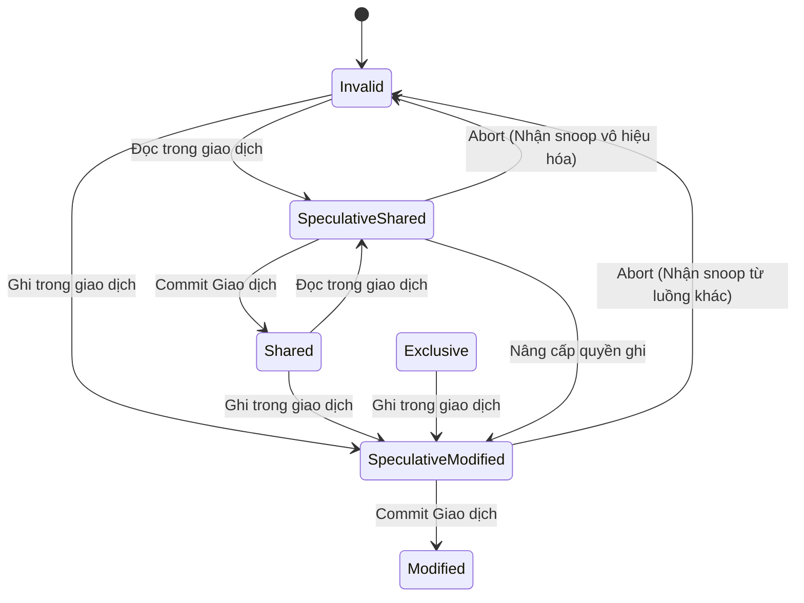
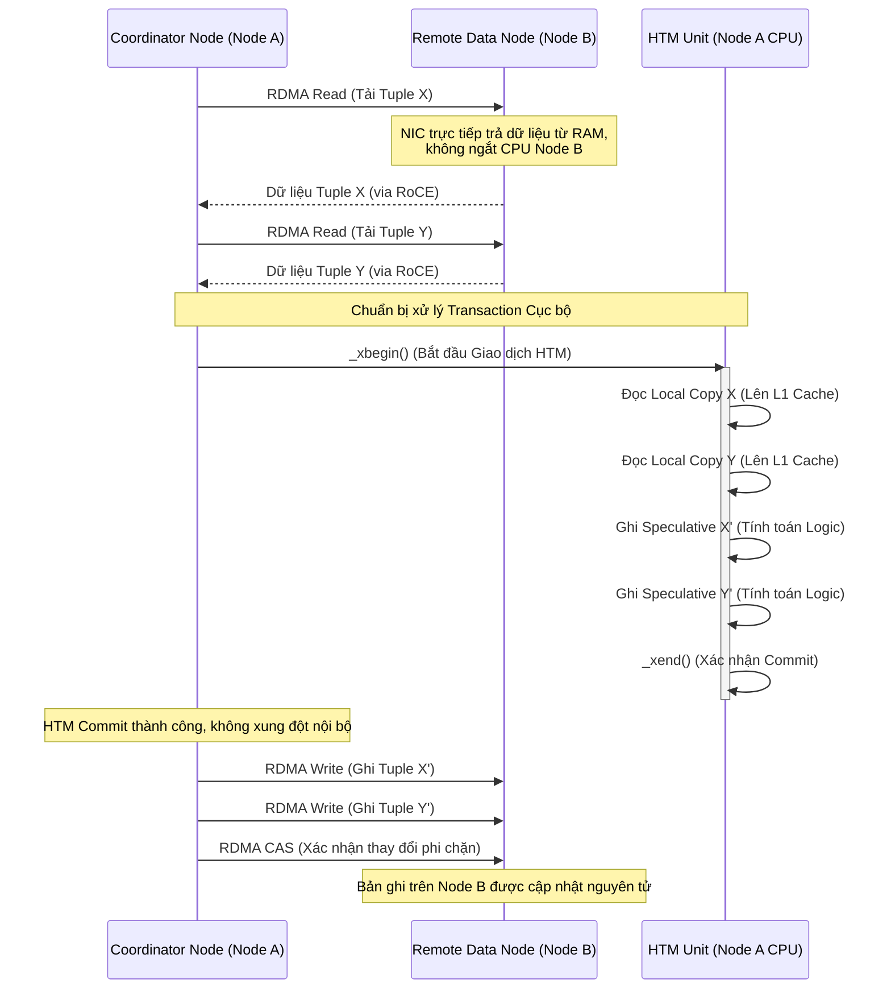

# 46: Hardware Transactional Memory (HTM): Tương lai của Database Locking?

## Kiến trúc Vi mô và Nền tảng Lý thuyết của Hardware Transactional Memory

Hardware Transactional Memory (HTM) đại diện cho một bước tiến mang tính cách mạng trong kiến trúc vi xử lý, nhằm giải quyết triệt để những điểm nghẽn hiệu năng cố hữu của các cơ chế kiểm soát đồng thời truyền thống (Pessimistic Concurrency Control - PCC) như spinlock, mutex và semaphore. Trong suốt nhiều thập kỷ, các nhà nghiên cứu và kỹ sư hệ thống đã phải đối mặt với các vấn đề như lock convoying (hiện tượng một luồng giữ khóa bị ngắt quãng, khiến hàng loạt các luồng khác phải chờ đợi một cách vô ích), priority inversion (nghịch lý đảo ngược độ ưu tiên khi luồng ưu tiên thấp giữ khóa mà luồng ưu tiên cao cần), và sự sụt giảm hiệu suất nghiêm trọng do cache line bouncing khi nhiều lõi CPU liên tục tranh giành quyền thay đổi một cờ khóa (lock flag) duy nhất trên bộ nhớ đệm. Software Transactional Memory (STM) từng được đề xuất như một giải pháp thay thế dựa trên phần mềm, cung cấp mô hình lập trình tối giản thông qua các khối mã giao dịch (transactional blocks). Tuy nhiên, STM thất bại trong việc ứng dụng rộng rãi do chi phí phụ trợ (overhead) cực lớn phát sinh từ việc duy trì các read barrier và write barrier bằng phần mềm, cũng như việc phải phân bổ và quản lý các siêu dữ liệu (metadata) phức tạp để phát hiện xung đột bộ nhớ. Bối cảnh này đã thúc đẩy sự ra đời của Hardware Transactional Memory, một nỗ lực tích hợp trực tiếp khả năng theo dõi giao dịch và phát hiện xung đột vào kiến trúc vi mô của bộ vi xử lý, cụ thể là tận dụng hệ thống bộ nhớ đệm (L1/L2 cache) và giao thức đồng bộ bộ nhớ đệm (cache coherence protocols) đã có sẵn trên phần cứng để thực thi các giao dịch nguyên tử mà gần như không phát sinh độ trễ phụ trợ.

Để hiểu sâu về cách thức HTM hoạt động, chúng ta cần đi sâu vào cấu trúc vi mô của hệ thống phân cấp bộ nhớ đệm trong các vi xử lý hiện đại, đặc biệt là kiến trúc x86-64 của Intel (với tập lệnh TSX - Transactional Synchronization Extensions) và kiến trúc PowerPC của IBM. Khác với mô hình khóa bi quan (pessimistic locking), HTM áp dụng nguyên lý thực thi lạc quan (optimistic execution). Khi một luồng bắt đầu một giao dịch phần cứng, vi xử lý không hề yêu cầu bất kỳ quyền truy cập độc quyền nào trước thông qua khóa; thay vào đó, nó tạo ra một điểm đánh dấu trạng thái kiến trúc (architectural checkpoint), lưu lại toàn bộ ngữ cảnh của các thanh ghi đa dụng. Bắt đầu từ điểm này, mọi thao tác đọc (load) và ghi (store) từ bộ nhớ đều được hệ thống phần cứng theo dõi vô cùng chặt chẽ. Tập hợp các địa chỉ bộ nhớ mà giao dịch đọc được gọi là Tập đọc (Read Set), và tập hợp các địa chỉ bị chỉnh sửa được gọi là Tập ghi (Write Set). Phần cứng sử dụng chính cấu trúc của bộ nhớ đệm L1 (L1 Data Cache) làm nơi lưu trữ các thao tác này. Mỗi cache line (thường có kích thước 64 bytes) trong L1 cache được bổ sung thêm các bit trạng thái ẩn (hidden state bits) để đánh dấu xem nó có thuộc về Read Set hay Write Set của giao dịch đang thực thi hay không. Những thay đổi dữ liệu (writes) được giữ lại một cách đầu cơ (speculative) bên trong L1 cache và tuyệt đối không được ghi ra bộ nhớ chính (main memory) hay các cấp độ cache thấp hơn (như L3) cho đến khi giao dịch được xác nhận (commit).

Cơ chế cốt lõi để phát hiện xung đột giữa các luồng đồng thời trong HTM phụ thuộc hoàn toàn vào giao thức nhất quán bộ nhớ đệm, điển hình là biến thể của giao thức MESI (Modified, Exclusive, Shared, Invalid) hoặc MOESI. Khi một giao dịch đang diễn ra trên lõi CPU A thực hiện việc đánh dấu một cache line vào Read Set, nó yêu cầu một bản sao của cache line này ở trạng thái Shared. Nếu một lõi CPU B khác cố gắng ghi vào chính cache line này, lõi B sẽ phát đi một thông điệp RFO (Read-For-Ownership) trên bus kết nối hệ thống (ring bus hoặc mesh interconnect) để yêu cầu quyền độc quyền chuyển cache line sang trạng thái Modified. Khi lõi A nhận được thông điệp snoop này từ bus, phần cứng của lõi A ngay lập tức đối chiếu địa chỉ yêu cầu với các cache line đã được đánh dấu trong Read Set hoặc Write Set của nó. Việc phát hiện một thông điệp vô hiệu hóa (invalidation message) nhắm vào một địa chỉ đang nằm trong tập dữ liệu theo dõi của giao dịch sẽ kích hoạt một sự kiện xung đột dữ liệu (data conflict). Tại thời điểm này, phần cứng không có cơ chế phân xử phức tạp; nó áp dụng chính sách hủy bỏ (abort) ngay lập tức đối với giao dịch đang thực thi. Toàn bộ các thay đổi đầu cơ trong L1 cache bị vô hiệu hóa bằng cách xóa các bit trạng thái giao dịch (flash clear), và trạng thái thanh ghi của vi xử lý được khôi phục nguyên vẹn về thời điểm trước khi bắt đầu giao dịch, tiêu tốn một khoảng thời gian tính bằng hàng chục chu kỳ xung nhịp (clock cycles) thay vì hàng nghìn chu kỳ như việc chuyển đổi ngữ cảnh phần mềm.

Mô hình toán học của xác suất xung đột giao dịch trong HTM đóng vai trò then chốt trong việc dự đoán thông lượng hệ thống cơ sở dữ liệu. Giả sử chúng ta có một hệ thống với $N$ luồng thực thi đồng thời. Mỗi luồng thi hành một giao dịch với kích thước Tập đọc là $|R|$ và kích thước Tập ghi là $|W|$, tương tác trên một không gian dữ liệu đồng nhất có kích thước $D$ (tính bằng số lượng cache lines). Xác suất để một thao tác đọc/ghi ngẫu nhiên của luồng $i$ xung đột với tập dữ liệu của luồng $j$ có thể được xấp xỉ thông qua phân phối xác suất. Cụ thể, xác suất để không có bất kỳ xung đột nào xảy ra đối với luồng $i$ từ $N-1$ luồng còn lại trong suốt vòng đời của giao dịch được mô phỏng như sau: 

$$ P_{success} = \left( 1 - \frac{|R| + |W|}{D} \right)^{C \cdot (N - 1)} $$

Trong đó $C$ là số lượng thao tác truy cập bộ nhớ trung bình của một giao dịch. Hệ quả của phương trình này là xác suất thành công giảm theo hàm mũ đối với kích thước của giao dịch (đại diện bởi $|R|$ và $|W|$), và cũng giảm nghiêm trọng khi số lượng luồng $N$ tăng lên. Thông lượng tổng thể của hệ thống HTM, ký hiệu là $\mathcal{T}$, được tính bằng tỷ lệ nghịch đảo của thời gian hoàn thành trung bình của một giao dịch (bao gồm cả các lần thử nghiệm thất bại và cơ chế fallback):

$$ \mathcal{T} = \frac{N \times P_{success}}{T_{exec} + (1 - P_{success}) \times (T_{abort} + T_{fallback})} $$

Sơ đồ dưới đây minh họa sự mở rộng của giao thức MESI truyền thống nhằm phục vụ mục đích theo dõi trạng thái giao dịch đầu cơ trên kiến trúc x86. Các trạng thái mới (Speculative Modified, Speculative Shared) được thêm vào để tách biệt dữ liệu đã cam kết và dữ liệu đang trong quá trình giao dịch.



Sự phụ thuộc vào cấu trúc L1 cache mang lại tốc độ kiểm tra xung đột cực kỳ ấn tượng (hoàn thành trong 1-2 chu kỳ xung nhịp của CPU), nhưng đồng thời cũng thiết lập nên những giới hạn vật lý khắc nghiệt về dung lượng của giao dịch. Trong kiến trúc Intel Skylake hoặc Ice Lake, L1 Data Cache thường có kích thước 32KB và được tổ chức theo kiến trúc tập hợp liên kết 8 đường (8-way set associative). Điều này có nghĩa là dung lượng tối đa tuyệt đối của Write Set không thể vượt quá 32KB. Thậm chí trên thực tế, do sự phân bổ không đồng đều của các địa chỉ hàm băm (hash collisions) trên các tập hợp của cache, giới hạn thực tế thường xuyên nằm ở mức thấp hơn rất nhiều. Nếu một giao dịch thực hiện việc ghi vào 9 địa chỉ bộ nhớ khác nhau mà xui xẻo ánh xạ vào cùng một tập hợp cache (cache set) trong L1, phần cứng sẽ buộc phải đẩy (evict) một cache line ra khỏi L1 xuống L2. Tuy nhiên, việc đẩy một cache line chứa dữ liệu đầu cơ chưa được cam kết là điều cấm kỵ vì nó sẽ làm mất khả năng theo dõi xung đột hoặc rò rỉ dữ liệu chưa hoàn chỉnh ra toàn hệ thống. Do đó, phần cứng ngay lập tức ban hành một lệnh hủy bỏ dung lượng (Capacity Abort), chấm dứt giao dịch ngay cả khi không có bất kỳ luồng nào khác đang tranh chấp dữ liệu.

## Cơ chế Quản lý Bộ nhớ Hệ điều hành và Tích hợp Cơ sở dữ liệu

Sự tương tác giữa Hardware Transactional Memory và nhân Hệ điều hành (Operating System Kernel) là một lĩnh vực nghiên cứu vô cùng phức tạp, nơi những xung đột giữa nguyên lý tối ưu vi mô và cơ chế bảo vệ vĩ mô diễn ra mãnh liệt. Về mặt kiến trúc, các giao dịch phần cứng bị ràng buộc nghiêm ngặt trong không gian người dùng (user space) và môi trường thực thi bộ nhớ vật lý ảo hóa thông qua Translation Lookaside Buffer (TLB) và bảng trang (Page Tables). Mọi sự kiện phá vỡ tính liên tục của luồng thực thi cấp độ vi mô đều dẫn đến việc hủy bỏ giao dịch vô điều kiện. Một trong những nguyên nhân phổ biến nhất gây ra sự hủy bỏ ngẫu nhiên (Spurious Abort) là các ngắt phần cứng (hardware interrupts) hoặc ngắt định thời (timer interrupts) từ hệ điều hành. Khi bộ định thời (timer) báo hiệu hết lượng tử thời gian (time quantum) của một luồng, CPU buộc phải chuyển quyền điều khiển cho bộ điều phối (OS scheduler) để thực hiện chuyển đổi ngữ cảnh (context switch). Quá trình này đòi hỏi phải lưu lại trạng thái thanh ghi và sửa đổi các cấu trúc dữ liệu của hệ điều hành, những hành động vượt ra ngoài phạm vi quản lý của giao dịch hiện tại, do đó buộc HTM phải hủy bỏ toàn bộ kết quả tính toán tạm thời.

Hơn thế nữa, cơ chế quản lý bộ nhớ ảo (virtual memory) tạo ra những rào cản đặc thù. Khi một luồng đang trong trạng thái giao dịch truy cập vào một địa chỉ bộ nhớ mà chưa được ánh xạ trong TLB, một TLB miss sẽ xảy ra. Nếu bảng trang (page table) tương ứng đang nằm trong bộ nhớ chính, CPU có thể thực hiện page walk bằng phần cứng mà không làm hỏng giao dịch. Tuy nhiên, nếu trang bộ nhớ chưa từng được cấp phát vật lý (demand paging) hoặc đã bị hoán đổi (swapped out) ra ổ cứng, hệ điều hành phải phát sinh một Page Fault để chuyển quyền xử lý cho kernel. Tương tự như ngắt phần cứng, Page Fault phá vỡ không gian thực thi của giao dịch và dẫn đến Abort lập tức. Một vấn đề nghiêm trọng khác trong môi trường đa lõi là TLB Shootdown. Khi hệ điều hành thay đổi quyền truy cập hoặc xóa ánh xạ một trang bộ nhớ (ví dụ như qua lệnh `munmap`), nó phải phát đi các Inter-Processor Interrupts (IPI) để yêu cầu tất cả các lõi CPU khác vô hiệu hóa mục TLB tương ứng nhằm duy trì tính nhất quán. Bất kỳ lõi nào đang thực thi giao dịch HTM khi nhận được IPI sẽ phải dừng lại và hủy bỏ giao dịch. Những đặc tính này yêu cầu các kỹ sư phát triển cơ sở dữ liệu phải tích hợp HTM cực kỳ cẩn trọng, thường xuyên gọi các lệnh `mlock` để ghim bộ nhớ xuống RAM vật lý và sử dụng các Huge Pages (2MB hoặc 1GB) nhằm giảm thiểu tối đa áp lực lên TLB và tỷ lệ xảy ra Page Fault.

Việc tích hợp HTM vào trong hệ quản trị cơ sở dữ liệu không phải là sự thay thế một đối một cho các module khóa (lock manager), mà là một quá trình tinh chỉnh chiến lược Loại bỏ Khóa (Lock Elision) có điều kiện. Intel cung cấp hai giao diện cho HTM trên nền tảng TSX: Hardware Lock Elision (HLE) và Restricted Transactional Memory (RTM). RTM mang tính linh hoạt cao hơn nhờ bộ lệnh tường minh, cho phép các hệ thống cơ sở dữ liệu hiện đại lập trình trực tiếp các cấu trúc kiểm soát đồng thời tinh vi. Một điểm thiết kế sống còn trong RTM là cơ chế fallback (đường lùi). Bởi vì HTM không bao giờ đảm bảo khả năng tiến triển vững chắc (forward progress guarantee) - nghĩa là một giao dịch có thể liên tục gặp Capacity Abort hoặc Conflict Abort vĩnh viễn - mọi khối mã RTM đều bắt buộc phải có một giải pháp dự phòng dùng khóa phần mềm truyền thống. Mã giả C++ dưới đây phác thảo một mô hình fallback sử dụng vòng lặp kiểm tra trạng thái và Backoff theo hàm mũ, kết hợp cùng Spinlock thích ứng:

```cpp
#include <immintrin.h>
#include <thread>

// Cấu trúc kiểm soát đồng thời tích hợp HTM và Spinlock
class TransactionalMutex {
    std::atomic<bool> global_lock{false};

public:
    void execute_transaction(auto&& db_operation) {
        int retries = 0;
        const int MAX_RETRIES = 5;

        while (true) {
            // Kiểm tra trạng thái khóa phần mềm trước khi thử HTM
            // Tránh hiện tượng Lemming effect khi một luồng fallback làm hỏng tất cả luồng HTM
            if (global_lock.load(std::memory_order_relaxed)) {
                _mm_pause(); 
                continue; 
            }

            // Khởi động giao dịch phần cứng RTM
            unsigned status = _xbegin();

            if (status == _XBEGIN_STARTED) {
                // Kiểm tra lại khóa lần nữa bên trong giao dịch, đưa khóa vào Read Set
                if (global_lock.load(std::memory_order_relaxed)) {
                    _xabort(0xff); // Hủy bỏ ngay lập tức nếu khóa bị giữ bởi luồng fallback
                }

                // Thực thi tác vụ dữ liệu (B-Tree traversal, tuple updates, v.v...)
                db_operation();

                // Xác nhận giao dịch phần cứng
                _xend();
                return; // Thành công
            } else {
                // Xử lý các nguyên nhân Abort
                if ((status & _XABORT_RETRY) && retries < MAX_RETRIES) {
                    // Xung đột dữ liệu tạm thời, có thể thử lại
                    retries++;
                    exponential_backoff(retries);
                    continue;
                }
                
                // Nếu là Capacity Abort hoặc đã hết lượt thử, chuyển sang fallback path
                acquire_fallback_lock();
                db_operation();
                release_fallback_lock();
                return;
            }
        }
    }

private:
    void acquire_fallback_lock() {
        while (global_lock.exchange(true, std::memory_order_acquire)) {
            while (global_lock.load(std::memory_order_relaxed)) {
                _mm_pause(); // Giảm tiêu thụ năng lượng và tranh chấp bus
            }
        }
    }

    void release_fallback_lock() {
        global_lock.store(false, std::memory_order_release);
    }
    
    void exponential_backoff(int attempt) {
        int delay = (1 << attempt) * 10;
        for(int i = 0; i < delay; ++i) _mm_pause();
    }
};
```

Trong thực tiễn xây dựng các hệ quản trị cơ sở dữ liệu in-memory (như HyPer, Silo, hay các biến thể nghiên cứu của PostgreSQL/MySQL), kỹ thuật Elision được áp dụng khéo léo vào các cấu trúc dữ liệu có chỉ số tranh chấp (contention) cao nhưng khối lượng thao tác nhỏ, điển hình là B+Tree hoặc Radix Tree. Khi một giao dịch cơ sở dữ liệu muốn cập nhật một bản ghi, nó phải duyệt qua cấu trúc cây từ thư mục gốc (root node) xuống nút lá (leaf node). Sử dụng khóa Latch thông thường (như crabbing/coupling lock) sẽ tạo ra điểm nghẽn cổ chai khủng khiếp tại các node gốc. Việc bọc toàn bộ quá trình duyệt cây bằng giao dịch HTM cho phép hàng ngàn luồng duyệt cây xuống đồng thời mà không chạm đến bất kỳ byte trạng thái chia sẻ nào để cập nhật cờ khóa. Tuy nhiên, chiều sâu của cây $h$ sẽ đẩy kích thước của Tập đọc lên mức $\mathcal{O}(h \log B)$ (với $B$ là bậc của cây). Việc đánh giá rủi ro dựa trên xác suất hàm mũ đối với số lượng phần tử trong Tập đọc bắt buộc các cơ sở dữ liệu phải chia nhỏ các hoạt động dài thành những giao dịch HTM phân mảnh (chunked transactions) hoặc sử dụng kiến trúc Bw-Tree không khóa (lock-free) thay thế cho những cây quá sâu. Sự kết hợp giữa Optimistic Concurrency Control (OCC) và HTM, nơi mà HTM chỉ được dùng để bảo vệ một cửa sổ thay đổi trạng thái cực ngắn ở pha Commit của OCC (phát minh được ứng dụng trên Silo), được chứng minh là có thể gia tăng thông lượng hệ thống lên tới hàng chục triệu giao dịch mỗi giây trên cấu hình đa vi xử lý NUMA.

## Giới hạn Phần cứng và Định hướng Triển khai trong Hệ thống Cơ sở dữ liệu Phân tán

Mặc dù mang lại lợi thế về hiệu năng khổng lồ, phần cứng vi mô ẩn chứa những cạm bẫy thiết kế buộc các kiến trúc sư cơ sở dữ liệu phải viết lại phần lớn mã nguồn hệ thống để thích nghi. Vấn đề nghiêm trọng nhất gây suy giảm hiệu suất trong các ứng dụng áp dụng HTM là hiện tượng False Sharing (Chia sẻ giả). Đặc thù vi mô của giao thức MESI không theo dõi độc lập các byte hay biến số riêng lẻ, mà thao tác trên toàn bộ một Cache Line (chuẩn công nghiệp là 64 bytes). Giả sử hệ thống cơ sở dữ liệu phân bổ hai biến số độc lập thuộc về hai cấu trúc giao dịch khác nhau, chẳng hạn như biến bộ đếm bản ghi của luồng A (counter_A) và biến bộ đếm bản ghi của luồng B (counter_B), liền kề nhau trong không gian bộ nhớ sao cho cả hai đều nằm trên cùng một Cache Line vật lý. Khi luồng A đang trong giao dịch HTM đọc biến counter_A, toàn bộ 64 bytes của Cache Line được thêm vào Tập đọc của lõi A. Lúc này, nếu luồng B (không nhất thiết phải đang trong giao dịch HTM) thực hiện lệnh ghi vào biến counter_B, lõi B sẽ yêu cầu quyền độc quyền toàn bộ Cache Line và gửi thông báo vô hiệu hóa trên bus hệ thống. Lõi A nhận thông báo này và lập tức nhận định rằng Tập đọc của mình đã bị xâm phạm, dẫn đến việc Hủy bỏ giao dịch (Abort) một cách oan uổng. Tình trạng "chia sẻ giả" này có thể dẫn đến sự sụp đổ thông lượng cục bộ (throughput collapse).

Giải pháp kỹ thuật tiêu chuẩn để giải quyết vấn đề này là Cache Line Padding (Chèn không gian đệm cache). Bằng cách khai báo các biến số nhạy cảm hoặc cấu trúc dữ liệu quan trọng với các chỉ thị canh lề bộ nhớ (memory alignment directives) đặc thù của trình biên dịch, hệ thống đảm bảo rằng mỗi biến sẽ chiếm giữ độc quyền một dải địa chỉ 64 bytes, loại bỏ hoàn toàn các biến lân cận ra khỏi phạm vi ảnh hưởng snoop. Trong ngôn ngữ C++11 trở lên, lập trình viên sử dụng từ khóa `alignas(64)` hoặc hằng số `std::hardware_destructive_interference_size` để định hình thiết kế các Tuple Headers và Lock Control Blocks. Mặc dù Padding giải quyết triệt để vấn đề Abort giả mạo, hệ quả của nó là sự phình to cấu trúc bộ nhớ (memory bloat) và làm giảm hiệu quả sử dụng dung lượng cache tổng thể, đẩy nhanh tỷ lệ trượt cache (cache miss) cho dữ liệu thực. Bài toán đánh đổi giữa tỷ lệ Abort trong HTM và Hiệu suất tận dụng cấu trúc bộ nhớ vật lý là nội dung trọng điểm trong các nỗ lực tối ưu hóa của các Data Systems Engineers. 

Nhìn về tương lai của các hệ quản trị cơ sở dữ liệu quy mô siêu lớn, xu hướng dịch chuyển từ kiến trúc Monolithic sang các cụm điện toán đám mây phân tán (Distributed Cloud Clusters) đang tạo ra một nền tảng lai mới: Sự kết hợp giữa Hardware Transactional Memory cục bộ (Local HTM) và Remote Direct Memory Access (RDMA) qua mạng truyền tải InfiniBand hoặc RoCEv2. Các giao thức kiểm soát đồng thời hai pha (Two-Phase Commit - 2PC) truyền thống trên mạng TCP/IP tốn hàng trăm micro giây cho mỗi quyết định mạng, tạo ra các bế tắc không thể chấp nhận được đối với các hệ thống yêu cầu độ trễ cực thấp. Kiến trúc mạng RDMA cung cấp khả năng thao tác đọc/ghi thẳng vào không gian bộ nhớ của máy chủ từ xa mà không cần thông qua sự can thiệp của hệ điều hành hay CPU từ xa, giúp độ trễ mạng giảm xuống chỉ còn 1-2 micro giây. Tuy nhiên, RDMA một chiều (one-sided RDMA) lại thiếu đi các cơ chế khóa nguyên tử phức tạp trên mạng diện rộng. 

Các hệ thống tiên phong như FaSST (Fast, Scalable and Simple Distributed Transactions) và DrTM (Distributed hardware Transactional Memory) tại các trung tâm nghiên cứu của Microsoft và MIT đã đề xuất việc "cộng sinh" (symbiosis) hai công nghệ này. Giao dịch toàn cầu (Global Transaction) được chia thành một pha chuẩn bị bằng mạng RDMA để tải toàn bộ bản sao tập dữ liệu về node điều phối cục bộ (Coordinator Node). Tại máy chủ cục bộ này, một chu trình giao dịch HTM nhanh chóng (Fast-path HTM) được khởi tạo trên lõi vi xử lý vật lý để khóa và sửa đổi hàng loạt bản ghi thông qua tính nhất quán bộ nhớ L1/L2 đã trình bày ở trên, loại bỏ hoàn toàn các Distributed Locks (Khóa phân tán) đắt đỏ. Dưới đây là biểu đồ mô tả luồng thực thi giao dịch lai ghép RDMA và HTM trên hệ thống Data Center:



Tuy mô hình này vẽ ra một chân trời mới về hiệu suất mở rộng tuyến tính (linear scalability) cho cơ sở dữ liệu tương lai, việc hiện thực hóa ở tầm vĩ mô đòi hỏi phải giải quyết hàng tá các tình huống rủi ro, chẳng hạn như RDMA network isolation, switch fabric congestion, và năng lực giới hạn của bộ nhớ đăng ký RDMA (Registered Memory Regions). Tóm lại, Hardware Transactional Memory không phải là "viên đạn bạc" (silver bullet) hứa hẹn tiêu diệt hoàn toàn khái niệm Database Locking trong tương lai. Sự biến động về hiệu năng phần cứng trên các thế hệ vi xử lý khác nhau, bản chất không xác định của các loại lỗi Abort, và ranh giới khắc nghiệt về quy mô L1 Cache khẳng định rằng pessimistic locks và các cơ chế OCC phức tạp sẽ vẫn đóng vai trò là "lưới an toàn" tối hậu. Tuy nhiên, nếu được áp dụng với vai trò là tuyến phòng thủ đầu tiên trên lớp kiến trúc Fast-Path - một công cụ Lock Elision tinh giản - HTM sẽ duy trì vị thế là một trong những cơ chế vi mô định hình hệ thống Data Center thế hệ tiếp theo, nơi từng nano giây độ trễ và từng vòng quay xung nhịp đều mang lại giá trị kinh tế khổng lồ.

## Tối ưu hóa Tìm kiếm (SEO)

- **Tiêu đề trang**: 46: Hardware Transactional Memory (HTM) - Tương lai của Database Locking? | Bài viết Kỹ thuật Chuyên sâu
- **Mô tả meta (Meta Description)**: Khám phá kiến trúc vi mô của Hardware Transactional Memory (HTM), giới hạn L1 Cache, thuật toán Fallback và tác động cách mạng của nó lên cơ chế kiểm soát đồng thời và Database Locking trong phân tán.
- **Từ khóa (Keywords)**: Hardware Transactional Memory, HTM, Intel TSX, Lock Elision, MESI Protocol, False Sharing, In-memory Database, RDMA Transaction, L1 Cache, Optimistic Concurrency Control.
- **Thẻ (Tags)**: Computer Architecture, Database Systems, Multithreading, C++ Concurrency, Distributed Systems.
- **Canonical URL**: /blogs/part-6/46-hardware-transactional-memory-htm
