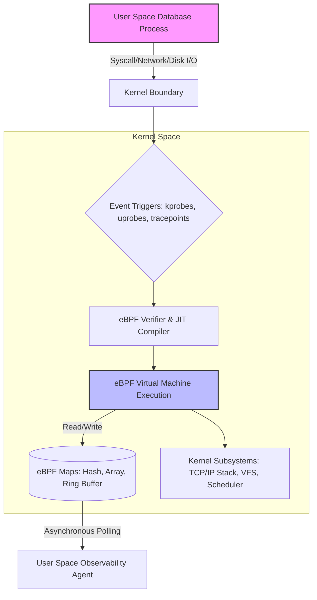
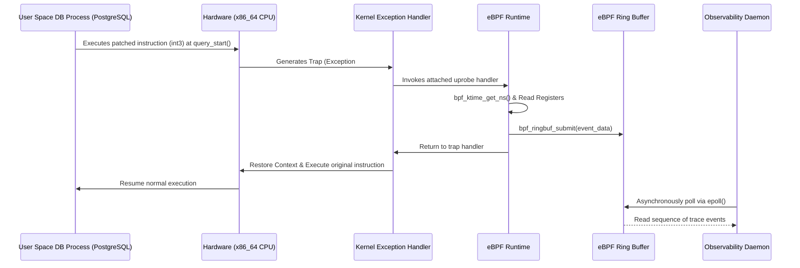

# 47: BPF và eBPF trong Database Observability: Kiến trúc cốt lõi và phương pháp phân tích hiệu năng mức hạt nhân

## Kiến trúc vi mô của BPF và eBPF trong bối cảnh hệ điều hành

Extended Berkeley Packet Filter (eBPF) đại diện cho một bước tiến căn bản trong kiến trúc hệ điều hành hiện đại, cho phép thực thi các chương trình do người dùng định nghĩa bên trong không gian hạt nhân (kernel space) một cách an toàn và đạt hiệu suất gần tương đương với mã máy gốc. Quá trình phát triển từ kiến trúc BPF cổ điển (cBPF), vốn ban đầu được thiết kế dành riêng cho việc lọc gói tin mạng với kiến trúc máy ảo thanh ghi 32-bit dựa trên bộ vi xử lý Motorola 6502, sang eBPF là một sự lột xác hoàn toàn về mặt kiến trúc tập lệnh (Instruction Set Architecture - ISA). Kiến trúc eBPF hiện đại được thiết kế để ánh xạ trực tiếp và tối ưu (one-to-one mapping) với cấu trúc phần cứng của các bộ vi xử lý 64-bit đương đại như x86_64, ARM64 và RISC-V. Bộ xử lý eBPF sử dụng mô hình 11 thanh ghi 64-bit ảo ($R0$ đến $R10$), trong đó $R0$ lưu trữ giá trị trả về, $R1$ đến $R5$ chứa các đối số đầu vào của hàm, $R6$ đến $R9$ là các thanh ghi được bảo toàn qua các lời gọi hàm (callee-saved registers), và $R10$ là thanh ghi con trỏ khung xếp (frame pointer register) chỉ đọc. Quá trình biên dịch tức thời (Just-In-Time - JIT compilation) trong eBPF dịch các mã byte eBPF (eBPF bytecode) thành mã máy nguyên thủy của CPU đích với độ trễ tối thiểu, tránh được chi phí thông dịch (interpretation overhead). Hiệu suất thực thi của một chương trình eBPF sau khi được JIT biên dịch có thể được biểu diễn qua phương trình mô hình hóa thời gian thực thi: $$T_{exec} = N_{inst} \times CPI_{avg} \times \frac{1}{f_{clock}} + T_{mem} + T_{context\_switch}$$, trong đó $N_{inst}$ là số lượng chỉ thị eBPF sau khi chuyển đổi sang kiến trúc đích, $CPI_{avg}$ là số chu kỳ đồng hồ trung bình trên mỗi chỉ thị (thường tiệm cận 1.0 đối với các lệnh số học đơn giản nhờ cấu trúc đường ống siêu hướng lượng), $f_{clock}$ là tần số xung nhịp của CPU, và $T_{mem}$ là tổng thời gian trễ do truy cập bộ nhớ. Đặc biệt, $T_{context\_switch}$ được loại trừ hoàn toàn khi chương trình eBPF được kích hoạt bởi các sự kiện bên trong nhân, thay vì phải chuyển ngữ cảnh từ không gian người dùng (user space) sang không gian hạt nhân, một quá trình thường tiêu tốn từ hàng nghìn đến hàng chục nghìn chu kỳ đồng hồ do sự cố dọn dẹp bộ đệm chuyển đổi địa chỉ (Translation Lookaside Buffer - TLB flush) và chi phí chuyển đổi vòng đai đặc quyền (privilege ring transition).

Một trong những cơ chế kiểm soát bảo mật và an toàn dữ liệu nghiêm ngặt nhất của hệ sinh thái eBPF là thành phần Verifier (Bộ xác minh). Trước khi bất kỳ đoạn mã eBPF nào được chèn vào không gian hạt nhân thông qua lời gọi hệ thống `bpf()`, nó phải vượt qua một chuỗi các phép phân tích tĩnh học đồ thị luồng điều khiển (Control Flow Graph - CFG) cực kỳ khắt khe. Verifier mô phỏng trạng thái thực thi của mọi đường dẫn lệnh có thể xảy ra nhằm đảm bảo không tồn tại các vòng lặp vô hạn (mặc dù các vòng lặp có giới hạn (bounded loops) đã được hỗ trợ trong các phiên bản kernel mới nhất), không có truy cập bộ nhớ ngoài ranh giới (Out-of-Bounds memory access), và các con trỏ được khởi tạo và kiểm tra tính hợp lệ trước khi giải tham chiếu (dereference). Quá trình phân tích này có độ phức tạp thuật toán tiệm cận $O(N \times E)$, với $N$ là số lượng trạng thái độc lập được khám phá và $E$ là số lượng nhánh rẽ của đồ thị CFG. Để lưu trữ trạng thái chia sẻ giữa không gian hạt nhân và không gian người dùng một cách hiệu quả, kiến trúc eBPF sử dụng hệ thống Bản đồ (eBPF Maps), hoạt động như các cấu trúc dữ liệu lưu trữ dưới dạng cặp khóa-giá trị (Key-Value stores) chuyên dụng. Các Maps này được phân bổ từ vùng nhớ vật lý không phân trang (non-pageable memory) nhằm loại trừ độ trễ phân trang (page fault latency) trong các đường dẫn thực thi trọng yếu của hệ điều hành. Thuật toán cấu trúc dữ liệu băm bên trong eBPF (Hash Map) sử dụng phép băm RCU-protected (Read-Copy-Update), đảm bảo tốc độ đọc đồng thời không khóa (lock-free concurrent reads) cực kỳ cao. Xác suất xảy ra xung đột khóa trong quá trình băm (hash collision probability) được điều chỉnh bởi hệ số tải (load factor) $\alpha = \frac{n}{m}$, trong đó $n$ là số lượng phần tử hiện tại và $m$ là số lượng khe băm (hash buckets). Hiệu suất truy cập kỳ vọng vào một eBPF Hash Map có thể được tính bằng $$E[T_{access}] = T_{hash} + (1 + \frac{\alpha}{2}) \times T_{cache\_miss}$$, với $T_{cache\_miss}$ phản ánh hình phạt thời gian do không trúng bộ đệm L1/L2 của CPU, thường rơi vào khoảng 50-100 nano giây trên các kiến trúc DRAM hiện đại.



```c
// Pseudocode: Cơ sở của một chương trình eBPF truy xuất gói tin
#include <linux/bpf.h>
#include <linux/if_ether.h>
#include <linux/ip.h>
#include <linux/tcp.h>
#include <bpf/bpf_helpers.h>

struct {
    __uint(type, BPF_MAP_TYPE_HASH);
    __uint(max_entries, 100000);
    __type(key, struct ipv4_flow_key);
    __type(value, struct db_query_metrics);
} query_latency_map SEC(".maps");

SEC("socket_filter/db_traffic")
int capture_db_queries(struct __sk_buff *skb) {
    void *data_end = (void *)(long)skb->data_end;
    void *data = (void *)(long)skb->data;
    
    struct ethhdr *eth = data;
    if ((void *)(eth + 1) > data_end) return 0;
    if (eth->h_proto != bpf_htons(ETH_P_IP)) return 0;
    
    struct iphdr *iph = (struct iphdr *)(eth + 1);
    if ((void *)(iph + 1) > data_end) return 0;
    if (iph->protocol != IPPROTO_TCP) return 0;
    
    struct tcphdr *tcph = (struct tcphdr *)(iph + 1);
    if ((void *)(tcph + 1) > data_end) return 0;
    
    // Thuật toán trích xuất payload và phân tích độ trễ tại đây...
    // Đo lường bằng bpf_ktime_get_ns() và lưu trữ vào query_latency_map
    
    return 0;
}
```

## Phân tích và quan sát cơ sở dữ liệu ở chế độ hạt nhân

Việc ứng dụng BPF và eBPF vào lĩnh vực quan sát cơ sở dữ liệu (Database Observability) đã tạo ra một mô hình dịch chuyển kiến trúc (architectural paradigm shift), cho phép theo dõi mọi hoạt động nội tại của hệ quản trị cơ sở dữ liệu (RDBMS hoặc NoSQL) mà không yêu cầu sửa đổi mã nguồn ứng dụng, hay cài đặt các module bổ trợ gây suy giảm hiệu năng. Phương pháp tiếp cận này đặc biệt hữu ích trong các hệ thống xử lý giao dịch trực tuyến (OLTP) phân tán có thông lượng cao, nơi mọi hoạt động thu thập telemetry theo phương thức truyền thống (in-band profiling) đều gây tác động tiêu cực đến hiệu suất. eBPF cung cấp khả năng gắn các điểm theo dõi động (dynamic tracing) vào bất kỳ địa chỉ hàm nào trên cả không gian người dùng và không gian hạt nhân thông qua kprobes (Kernel Probes), uprobes (User Probes), USDT (User-Level Statically Defined Tracing), và các bộ lọc mạng (network socket filters). Để giám sát cơ sở dữ liệu từ quan điểm mạng, một chương trình eBPF thường được chèn vào tầng điều khiển giao tiếp giao thức kiểm soát truyền vận (TCP/IP stack). Bằng cách khai thác `tcp_sendmsg` và `tcp_recvmsg` bằng kprobes, hay gắn trực tiếp vào thiết bị mạng qua XDP (eXpress Data Path) hoặc TC (Traffic Control), hệ thống thu thập thông tin có thể chặn bắt (intercept) và cấu trúc lại các chuỗi byte (byte streams) của giao thức giao tiếp cơ sở dữ liệu (chẳng hạn như Giao thức Băng thông (Wire Protocol) của PostgreSQL hay MySQL). Tuy nhiên, việc tái thiết lập (reassembly) các gói tin TCP bị phân mảnh (TCP fragmentation) bên trong hạt nhân bằng eBPF C bị giới hạn là một thách thức kỹ thuật lớn do rào cản bộ nhớ và độ phức tạp của thuật toán quản lý cửa sổ trượt (sliding window). Giải pháp kiến trúc tối ưu nhất thường là chỉ thu thập các thẻ metadata của gói (packet headers) kết hợp với một vài byte tải trọng đầu tiên (initial payload bytes) bằng eBPF, sau đó chuyển đẩy phần dữ liệu thô này qua bộ đệm vòng (eBPF Ring Buffer) về không gian người dùng để tiến hành phân tích sâu hơn. Ring Buffer là cấu trúc dữ liệu chia sẻ vùng nhớ (memory-mapped shared structure) hoạt động cực kỳ hiệu quả, cho phép nhiều luồng eBPF ghi dữ liệu đồng thời với kiến trúc không khóa đa người sản xuất - đơn người tiêu thụ (Multi-Producer Single-Consumer - MPSC lock-free architecture). Băng thông truyền tải dữ liệu của eBPF Ring Buffer có thể được cực đại hóa, tuân thủ mô hình lý thuyết hàng đợi: $$\lambda_{throughput} = \frac{S_{buffer}}{E[S_{event}] \times \mu_{process}}$$, với $S_{buffer}$ là kích thước bộ đệm vòng theo byte, $E[S_{event}]$ là kích thước trung bình của mỗi khối dữ liệu telemetry cơ sở dữ liệu, và $\mu_{process}$ là tỷ lệ tiêu thụ sự kiện của tác nhân người dùng (user space agent). Nếu tỷ lệ sản xuất sự kiện $\lambda_{produce}$ vượt quá tỷ lệ tiêu thụ $\mu_{process}$, hiện tượng rớt sự kiện (event drop) sẽ xảy ra, dẫn đến sai lệch dữ liệu quan sát.

Khả năng nội soi sâu vào quá trình thực thi của công cụ cơ sở dữ liệu (Database Engine) trở nên mạnh mẽ phi thường khi sử dụng uprobes (User Probes) hoặc USDT. Với uprobes, hệ thống giám sát eBPF chèn các ngắt phần cứng (hardware interrupts) dạng `int3` (đối với kiến trúc x86) vào mã máy thực thi (executable text code) của tiến trình cơ sở dữ liệu tại các điểm bắt đầu và kết thúc của hàm, chẳng hạn như hàm phân tích cú pháp truy vấn (query parser) hoặc hàm thực thi bộ đệm quét bảng (table scan executor). Khi CPU chạm tới lệnh `int3` này, một ngoại lệ (exception) được sinh ra, khiến hệ điều hành chuyển đổi bối cảnh thực thi (context switch) vào một hàm xử lý ngoại lệ hạt nhân, từ đó kích hoạt mã eBPF tương ứng để đo đạc thời gian bắt đầu và kết thúc hàm bằng cách truy xuất đồng hồ đếm ngược với độ phân giải nano giây thông qua hàm trợ giúp (helper function) `bpf_ktime_get_ns()`. Sự sai số đo lường độ trễ ($\Delta T_{error}$) phải được tính toán nghiêm ngặt vì mỗi lời gọi uprobe chịu một mức phạt hiệu năng (overhead penalty) đáng kể do quá trình gián đoạn đường ống (pipeline disruption) và vô hiệu hóa bộ đệm lệnh (Instruction Cache Invalidation). Gọi $T_{int3}$ là chi phí phần cứng của lệnh ngắt, $T_{trap}$ là chi phí của hệ điều hành trong việc phân phối bộ xử lý lỗi (fault handler dispatch), và $T_{ebpf}$ là thời gian thực thi mã đo lường eBPF, thì tổng phí của một sự kiện chặn bắt hàm ứng dụng là $$C_{uprobe} = T_{int3} + T_{trap} + T_{ebpf}$$. Trong các bài kiểm tra thực tế trên vi kiến trúc AMD Zen 4 hoặc Intel Sapphire Rapids, $C_{uprobe}$ trung bình tiêu thụ khoảng $1.5$ đến $3.0$ micro giây trên mỗi lệnh ngắt. Vì vậy, việc áp dụng uprobes trên các hàm thực thi hàng triệu lần mỗi giây (như quá trình tìm kiếm mục nhập chỉ mục trên cây B-Tree) sẽ gây bão ngắt (interrupt storm), làm sụp đổ thông lượng của hệ thống quản trị cơ sở dữ liệu (DBMS throughput degradation). Ngược lại, việc gắn kprobes vào các hệ thống tệp tin ảo (Virtual File System - VFS) hoặc hệ thống phân trang gốc (Block I/O Layer) mang lại thông tin chuyên sâu về cơ chế quản lý lưu trữ (storage engine mechanics) của cơ sở dữ liệu. Bằng cách quan sát hàm `vfs_read()` và `vfs_write()`, kết hợp với mô hình nhận dạng mô hình truy cập (access pattern recognition), eBPF có thể định lượng tỷ lệ bắn trượt vùng nhớ đệm trang (Page Cache Miss Ratio) đối với tệp dữ liệu cụ thể, cung cấp dữ liệu định lượng cho việc hiệu chỉnh thuật toán thu hồi bộ nhớ (LRU cache eviction policy) của máy chủ cơ sở dữ liệu.



## Ứng dụng thực tiễn và giới hạn phần cứng

Quá trình triển khai kỹ thuật eBPF ở quy mô hạ tầng lớn không chỉ là bài toán về phần mềm mà còn chạm tới những ranh giới tận cùng của vật lý bán dẫn và vi kiến trúc bộ vi xử lý. Các cấu trúc dữ liệu bản đồ eBPF (eBPF Maps), do được phân bổ tĩnh trong bộ nhớ chính (Main Memory) và liên tục được truy xuất bởi lõi CPU, chịu ảnh hưởng mạnh mẽ bởi cấu trúc Truy cập Bộ nhớ Không đồng nhất (Non-Uniform Memory Access - NUMA). Trong một máy chủ cơ sở dữ liệu đa khe cắm (multi-socket server), nếu chương trình eBPF thực thi trên một lõi CPU thuộc NUMA node 0 nhưng lại thực hiện lệnh cập nhật bản đồ eBPF được khởi tạo bằng bộ nhớ thuộc NUMA node 1, một quá trình truy cập bộ nhớ từ xa (remote memory access) sẽ diễn ra qua các liên kết vi xử lý liên nối tiếp (chẳng hạn như Intel UPI hoặc AMD Infinity Fabric). Độ trễ này tăng tuyến tính khi áp lực truyền tải lên bus cao, làm thay đổi nghiêm trọng hồ sơ hiệu năng (performance profile). Để giải quyết triệt để rào cản vật lý này, kiến trúc eBPF cung cấp cấu trúc Bản đồ cục bộ cho từng CPU (Per-CPU Maps). Sử dụng bản đồ Per-CPU Hash Array, mỗi bộ xử lý logic sẽ làm việc với một bản sao địa phương (local copy) của dữ liệu, biến đổi giao dịch ghi bộ nhớ thành các phép toán hoàn toàn không có khóa (lockless and contention-free memory writes), tận dụng tối đa băng thông bộ đệm L1/L2 của từng lõi phần cứng độc lập. Công thức cho tốc độ truyền tải bộ nhớ được tối ưu hóa theo thiết kế này đạt giới hạn trên của băng thông DRAM: $$BW_{max} = f_{mem} \times W_{bus} \times C_{channels}$$, nơi lượng tiêu thụ băng thông của eBPF gần như không thể cản trở băng thông của tiến trình cơ sở dữ liệu khi hệ thống được quy hoạch chặt chẽ. Đặc biệt, thao tác hợp nhất dữ liệu từ Per-CPU Maps xuống người dùng sẽ được thực hiện không đồng bộ và theo chu kỳ, giải phóng hoàn toàn tiến trình không gian hạt nhân khỏi trách nhiệm đồng bộ hóa (synchronization responsibilities).

Hơn thế nữa, giới hạn nghiêm ngặt về phức tạp tính toán (computational complexity limitations) áp đặt bởi BPF Verifier yêu cầu kỹ năng thuật toán tinh vi khi phân tích luồng dữ liệu cơ sở dữ liệu (Database Data Stream Parsing). Mã eBPF không cho phép phân bổ bộ nhớ động thông qua `malloc()` hoặc mở rộng dung lượng ngăn xếp (stack space) vượt quá 512 bytes. Để theo dõi toàn bộ trạng thái vòng đời của một truy vấn dài (Long-running Query) kèm theo một lượng lớn ngữ cảnh (context values), việc thiết kế thuật toán phải dựa vào cấu trúc Máy trạng thái hữu hạn (Finite State Machine - FSM) được trải phẳng (flattened) và lưu trữ từng bước chuyển đổi trạng thái vào hệ thống Bản đồ eBPF, sử dụng khóa kết hợp (compound key) như kết hợp giữa Mã định danh luồng (`Thread ID`) và Định danh kết nối TCP (`TCP 4-tuple`). Sự đánh đổi (trade-off) giữa khả năng quan sát (Observability) và năng lượng phần cứng chi tiêu đòi hỏi một mô hình quản lý dung lượng giới hạn (bounded capacity management) - nếu Bản đồ trạng thái đầy (map overflow), thuật toán eBPF phải thực hiện cơ chế rớt dữ liệu (eviction hoặc tail-drop) một cách nhẹ nhàng nhất có thể. Động thái vô hiệu hóa bộ đệm CPU (CPU Cache invalidation) cũng là một rủi ro hiện hữu. Khi số lượng chương trình eBPF tăng lên và số lượng các lệnh JIT phát sinh làm phình to bộ đệm lệnh cấp 1 (L1 Instruction Cache), thuật toán thay thế bộ đệm LRU của phần cứng sẽ loại bỏ mã của hệ quản trị cơ sở dữ liệu để chứa các lệnh BPF. Tác động của hiện tượng tràn bộ đệm lệnh (Instruction Cache thrashing) này được biểu thị qua số liệu đếm chu kỳ bị đình trệ (Stall Cycles) trong đơn vị giám sát hiệu suất phần cứng (Hardware Performance Monitoring Unit - PMU), tuân theo nguyên tắc xác suất Poisson cho phân phối trượt. Do đó, kỹ sư hệ thống cần cấu hình eBPF Agent một cách tinh gọn (lean binary compilation), hợp nhất các chương trình BPF theo cách mà luồng thực thi (execution path) luôn nằm trọn trong ranh giới $32$ KB của vùng L1i cache, giữ cho mã cơ sở dữ liệu cốt lõi (như PostgreSQL query planner hay MySQL InnoDB log buffer flush) hoạt động liên tục với số lượng cache miss nhỏ nhất. Cuối cùng, khía cạnh bảo mật (security perimeter) xung quanh eBPF cũng cần được thắt chặt ở mức tối đa bằng kỹ thuật Kernel Lockdown và cơ chế chữ ký mã hệ thống (Code Signing), ngăn chặn mọi cuộc tấn công tiêm mã độc cấp thấp (low-level code injection), bảo vệ tính nguyên vẹn toàn vẹn dữ liệu cho mọi hệ thống cơ sở dữ liệu vận hành ở trạng thái tối mật (mission-critical).

## Tối ưu hóa SEO & Tổng kết

* **Từ khóa chính**: Database Observability, eBPF, BPF, Kiến trúc hạt nhân, Phân tích hiệu năng, Kprobes, Uprobes, Tối ưu hóa Database, Hệ thống phân tán, Just-In-Time Compiler.
* **Tóm tắt (Meta Description)**: Khám phá kiến trúc vi mô và kỹ thuật triển khai eBPF/BPF cho Database Observability. Tài liệu kỹ thuật chuyên sâu về kprobes, uprobes, bộ đệm vòng (ring buffer), và giới hạn phần cứng trong giám sát RDBMS/NoSQL với hiệu suất tối đa, độ trễ bằng không.
* **Đối tượng hướng đến**: Staff Engineer, Kiến trúc sư hệ thống, Kỹ sư lập trình Kernel, Quản trị viên Cơ sở dữ liệu (DBA) cao cấp, SRE (Site Reliability Engineer).
* **Ứng dụng công nghệ**: Phân tích TCP/IP, cấu trúc dữ liệu eBPF Maps không khóa, xử lý tín hiệu JIT, tối ưu hóa băng thông NUMA và kiến trúc CPU bộ đệm trong môi trường xử lý tải cao.
