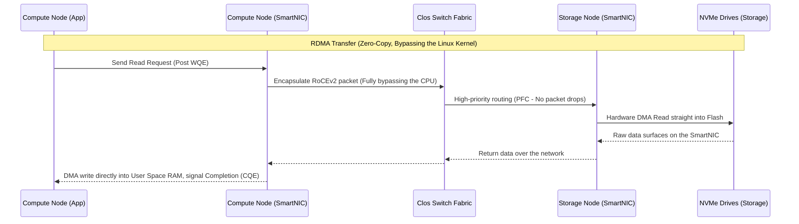

# Technical Whitepaper #48: Separation of Storage and Compute: Cloud-Native Architecture, Microarchitectural Dynamics, and the Future of Distributed Systems

## Executive Summary
This piece walks through the separation of storage and compute — the architectural shift underpinning most modern cloud-native databases — for engineers, architects, and anyone trying to understand why systems like Snowflake, BigQuery, and Aurora are built the way they are. We'll cover the core problem these architectures solve, how they work around hard physical limits like network latency and memory bandwidth, and the design lessons worth carrying into your own systems.

---

## Introduction: Why Cloud-Native Architecture Looks the Way It Does
The evolution of database systems and big-data platforms rarely happens by accident. Every real paradigm shift traces back to some inflection point in hardware capability or business pressure. Over the last decade we've watched a genuine shift: away from monolithic architecture, where CPU, RAM, and disk all lived inside the same chassis, toward fully decoupled compute and storage in the cloud.

So what's actually going on under the hood here? This isn't just a trend to nod along with — it touches microarchitecture, the math behind routing decisions, and the tricks modern software uses to get transfer speeds close to the physical limits of fiber optics. The interesting question isn't "why is separating storage and compute a good idea" — it's "how do you separate them without the network becoming the bottleneck that kills the whole system."

---

## The Core Problem: Why Monolithic Architecture Breaks Down

### The Law of Hardware Coupling Constraints
In traditional monolithic systems — shared-nothing Hadoop clusters, Teradata, local RDBMS deployments — the ratio between compute and storage capacity is effectively baked into the hardware:
$$R_c = \frac{C_{capacity}}{S_{capacity}}$$

Here $C_{capacity}$ is compute capacity (CPU cores, RAM) and $S_{capacity}$ is local storage capacity (HDD/SSD).

**Problem one: growth doesn't scale evenly.**
Data volume tends to grow exponentially ($O(e^x)$) while query-processing demand usually grows only linearly ($O(x)$). In a monolithic setup, once you run out of disk, you have to buy new nodes — and those nodes bring their own CPU and RAM whether you need them or not. The result is a data center full of idle cores while storage utilization sits pinned at 100%. That wasted $R_c$ ratio translates directly into wasted capital and operating spend.

### Data Gravity
**Problem two: workloads can't move freely.**
When data is glued to a specific processing node, sharing the same dataset across teams — Data Science running ML, BI running dashboards, Data Engineering running ETL — becomes impractical without physically copying it around. Replicating large datasets is slow and tends to break consistency, which is how you end up with isolated data silos nobody trusts.

---

## The Fix: Decoupling Compute From Storage

The solution is fairly blunt: split the physical server apart and run compute and storage as two independent clusters.

```mermaid
graph TD
    subgraph Monolithic Architecture (The Past)
        N1[Node 1: CPU + RAM + SSD]
        N2[Node 2: CPU + RAM + SSD]
        N3[Node 3: CPU + RAM + SSD]
        N1 <--> N2
        N2 <--> N3
        N1 <--> N3
    end

    subgraph Decoupled Cloud-Native Architecture (The Present & Future)
        direction TB
        subgraph Compute Layer (Stateless, Ephemeral)
            C1[Elastic Compute Node 1\n(Micro-cluster)]
            C2[Elastic Compute Node 2\n(Micro-cluster)]
            C3[Elastic Compute Node N\n(Micro-cluster)]
        end
        
        Net((High-Speed Clos/Fat-Tree\nData Center Network Fabric))
        
        subgraph Storage Layer (Stateful, Persistent)
            S1[(Distributed Object Store\ne.g., S3, GCS, ABS)]
        end
        
        C1 <--> Net
        C2 <--> Net
        C3 <--> Net
        Net <--> S1
    end
```

### Compute Becomes Stateless
The compute layer is now made of VMs, containers, or serverless functions, and critically, they hold no persistent local state. If a compute node gets killed by a kernel panic or reclaimed as a spot instance, not a single byte of user data goes with it.
That's what lets the orchestrator's scheduler spin up or tear down thousands of cores within milliseconds.

### The Trade-off: Network Becomes the Bottleneck
The flexibility isn't free. Reading from local SSD costs a CPU roughly 10-100 microseconds; fetching the same data over the network from object storage typically costs tens of milliseconds — about a thousand times slower.

Amdahl's Law, extended for distributed systems with network synchronization, looks like this:
$$S(N) = \frac{1}{(1 - p) + \frac{p}{N} + C(N)}$$
where $C(N)$ is the network-latency penalty of moving data around. Query execution time works out to:
$$T_{total} = T_{init} + \sum_{i=1}^{K} \left( \frac{D_i}{B_{net}} + L_{net} + T_{compute\_i} \right)$$
For the system to stay responsive, engineers have to keep chipping away at three things: $D_i$ (how much data crosses the network), $L_{net}$ (latency), and $T_{compute}$ (actual CPU time).

---

## Algorithmic Foundations and Distributed Query Execution

### PACELC and the Consistency Question
Once the network is effectively acting as the system bus, partitioning is unavoidable. Per the PACELC theorem, even when the network is behaving ("Else"), you still face a trade-off between latency and consistency.
The compute layer needs a sizable distributed buffer cache. But when one compute node writes data, how do the others learn to invalidate their copies? The cost of an invalidation broadcast scales as $O(N)$ or $O(\log N)$. That's part of why top-tier data warehouses settle for **eventual consistency** via MVCC: writes land sequentially, LSM-Tree structures turn as much random I/O into sequential I/O as possible, and compaction gets pushed onto background nodes so interactive reads stay fast.

### Pushdown Analytics and JIT Compilation
The real lever for reducing $D_i$ — the volume of data crossing the network — is **computation pushdown**: pushing the work down to where the data lives.
The cost-based optimizer no longer thinks in terms of disk-spin latency; it works from a differential cost function:
$$Cost(P) = \alpha \cdot W_{CPU} + \beta \cdot W_{Memory} + \gamma \cdot W_{Storage\_IO} + \delta \cdot W_{Network\_Transfer} + \epsilon \cdot W_{Serialization}$$

The compute layer isn't going to drag an entire 1TB Parquet table into RAM just to satisfy a single-row `SELECT`. Instead:
1. It extracts an abstract syntax tree (AST) from the filter condition (say, `WHERE user_id = 123`).
2. It serializes that AST and ships it via RPC down to the storage node (or SmartNIC).
3. On the storage side, a small ARM/RISC-V processor uses LLVM to JIT-compile the AST into machine code.
4. Data gets filtered as it comes off the NAND flash chip — before it ever touches the network.
The upshot: maybe a kilobyte of data that actually matches the filter makes it onto the wire back to the compute node. What used to be a network-bound bottleneck becomes a massively parallel filtering job happening right at the storage hardware.

```cpp
// Pseudocode: Pushdown Filter Serialization (C++ Paradigm)
struct FilterExpression {
    enum Operator { EQUALS, GREATER_THAN, IN_BLOOM_FILTER };
    Operator op;
    uint32_t column_id;
    std::vector<uint8_t> scalar_value_bytes;
};

class StorageNodeComputeEngine {
public:
    std::shared_ptr<ArrowRecordBatch> execute_pushdown(
        const std::string& parquet_path, const std::vector<FilterExpression>& filters) {
        auto file_metadata = ParquetReader::Open(parquet_path)->metadata();
        std::vector<int> matching_row_groups;

        // STEP 1: Filter using Metadata (Zero-Decompression Pruning)
        // Use Min/Max zone maps & Bloom Filters, no need to decompress the actual data
        for (int i = 0; i < file_metadata->num_row_groups(); ++i) {
            if (evaluate_zone_maps(file_metadata->RowGroup(i)->statistics(), filters)) {
                matching_row_groups.push_back(i);
            }
        }

        // STEP 2: Execute the vectorized filter (Vectorized JIT execution using AVX-512)
        std::shared_ptr<ArrowRecordBatch> result_batch = allocate_result_buffer();
        for (int rg_idx : matching_row_groups) {
            auto chunk = file_reader->ReadRowGroup(rg_idx);
            result_batch->append(SIMD_Vectorized_Filter::apply(chunk, filters));
        }
        
        // STEP 3: Return the minimally-compressed result data, freeing up the network
        return result_batch;
    }
};
```

---

## Physical Limits and Microarchitectural Dynamics

This is the point where writing good algorithmic code isn't enough anymore — you have to understand the silicon underneath it.

### Kernel Bypass, RDMA, and RoCEv2
On a standard Linux box, every incoming packet from the storage layer triggers a hardware interrupt, the CPU has to stop what it's doing, the OS pulls the packet, strips the TCP/IP header, checks the checksum, assembles the payload, and copies it from kernel space into user space. That context switching and memory copying burns CPU cycles and floods the L3 cache for no good reason.

**The fix is kernel bypass.**
With RDMA running over RoCEv2, the SmartNIC gets permission to DMA the incoming byte stream directly into the exact virtual address of the user-space process's RAM — no kernel involvement required.


The compute node's CPU has essentially no idea anything happened until the data is already sitting in its memory buffer. Network latency compresses from tens of milliseconds down to single-digit microseconds.

### NUMA-Aware Memory Scheduling
Pulling hundreds of gigabytes over RDMA means the destination memory has to be pinned (mlocked) so the OS never swaps it out — otherwise you risk a kernel panic.
Large servers also use multi-socket NUMA layouts. If the SmartNIC writes into RAM attached to socket 1 but the OS schedules the processing thread on socket 2, that data has to cross the interconnect (Intel UPI, AMD Infinity Fabric) — a serious bottleneck in practice.
The fix is NUMA-aware scheduling: always use huge pages for incoming network data, and pin the processing thread to the exact physical core attached to that memory.

---

## Lessons Learned

Having pulled apart a decoupled storage/compute system at the micro level, a few principles stand out.

1. **The network stopped being the fatal barrier — wasted CPU is.** With 100/400Gbps Clos fabrics and RDMA, network I/O can get close to local NVMe performance. The bottleneck has shifted from the speed of the fiber to how much overhead Linux adds for interrupts and copies. Kernel bypass isn't optional anymore — it's the direction backend engineering is heading.
2. **Move the algorithm to the data, not the data to the algorithm.** Physical separation of storage and compute doesn't mean blindly hauling data across the wire. Metadata — zone maps, Bloom filters — is what lets you prune junk data blocks right at the hardware level.
3. **Hardware and software co-design is unavoidable.** Modern distributed databases can't just be Java or C++ running on an abstract POSIX machine anymore. You need to understand L1/L2 cache lines, NUMA sockets, and vectorized SIMD instructions (AVX-512) to keep data from stalling on the motherboard's own buses.
4. **The line between storage and memory is disappearing.** With CXL and NVMe-oF, arrays of SSDs sitting hundreds of meters away in the data center can be mapped directly into a CPU's address space — effectively turning the whole data center into one big multi-core computer.

---

## Conclusion
Moving from monolithic architecture to separated compute and storage is one of the more consequential shifts of the cloud era. It solves the inflexibility of scaling resources independently and breaks the pull of data gravity. It also introduces real challenges around latency and consistency — but engineers have found ways to combine query optimization math, pushdown and vectorization techniques, and hardware tricks like RDMA, NUMA-awareness, and SmartNICs to build systems like Snowflake or Databricks that can ingest petabytes of data cheaply and quickly.

Understanding this decoupled architecture is a solid foundation for designing the kind of elastic, resilient, multi-tenant SaaS and PaaS systems the next decade of infrastructure will demand.
