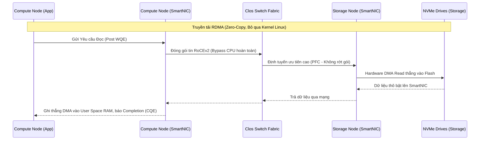

# 第48回: StorageとComputeの分離が生む、クラウドネイティブDBの設計思想

## エグゼクティブサマリー

この記事はエンジニア、システムアーキテクト、研究者向けに、**StorageとComputeの分離**というトレンドの本質と、その裏にある動作原理を掘り下げる。読み終える頃には、現代の分散アーキテクチャが解決すべき中心的な課題、システムが物理法則の限界(ネットワーク遅延、メモリ帯域幅)をどう乗り越えているか、そしてSnowflake、BigQuery、Auroraのような次世代クラウドネイティブデータベースに応用されている設計上の教訓が見えてくるはずだ。

---

## はじめに:クラウドネイティブアーキテクチャを読み解く

データベース管理システム(DBMS)やビッグデータ処理基盤の進化は、思いつきの変化の積み重ねではない。パラダイムシフトが起きるときは、たいてい物理ハードウェアの限界とビジネス要求がぶつかった瞬間だ。過去10年でも、CPU・RAM・ディスクが同じ物理シャーシに閉じ込められたモノリシックアーキテクチャから、クラウド上で計算とストレージを完全に切り離すアーキテクチャへと、根本的な転換が起きている。

とはいえ、ここで扱いたいのは単なる流行り言葉としての話ではない。メモリのマイクロ構造、ルーティングを支配する数式、そして現代のソフトウェアがOSを「うまく出し抜いて」光の速度に迫る転送レートを実現する仕組みまで踏み込む。知りたいのは「なぜ分離が良いのか」ではなく、「ネットワーク遅延でシステムが崩れないように、どう分離を設計するか」だ。

---

## 中心的な課題:モノリシックアーキテクチャはなぜ限界に来たのか

### ハードウェア結合の制約

従来のモノリシックシステム(Shared-Nothing HadoopやTeradata、オンプレミスRDBMS)では、リソースの結合比率はハードウェア構成の定数として固定されてしまう。

$$R_c = \frac{C_{capacity}}{S_{capacity}}$$

ここで$C_{capacity}$は計算能力(CPUコア数、RAM容量)、$S_{capacity}$はローカルストレージ容量(HDD/SSD)を表す。

問題はここから始まる。ビッグデータの時代、データ量はおおむね指数関数的($O(e^x)$)に増えていくが、クエリ処理の需要は線形($O(x)$)程度にしか伸びない。モノリシックアーキテクチャでディスク容量が尽きると、新しい物理ノードを買い足すしかない。だがそのノードにはCPUもRAMもディスクも一緒についてくる。結果、データセンターはアイドル状態のCPUコアで溢れているのに、ストレージだけは100%埋まっている、という奇妙な状態になる。この$R_c$のミスマッチが、設備投資(CapEx)と運用コスト(OpEx)の両方を静かに蝕んでいく。

### データの重力

もう一つの問題は、データが特定のローカル処理ノードにべったり張り付いてしまうことだ。同じ生データを、Data ScienceチームのML学習、BIチームのダッシュボード、Data Engineeringチームのバッチ処理といった具合に複数の用途で共有しようとすると、物理的なコピーなしには成立しなくなる。巨大なデータセットのETLレプリケーションは時間がかかるだけでなく、一貫性を崩し、結果としてサイロ化したデータ資産を量産してしまう。

---

## 解決策:リソースを分離するという設計原理

行き着いた答えはシンプルで、かつ徹底している。物理サーバーという単位そのものを解体し、2つのリソース層を独立したクラスタとして切り離すのだ。

```mermaid
graph TD
    subgraph Monolithic Architecture (The Past)
        N1[Node 1: CPU + RAM + SSD]
        N2[Node 2: CPU + RAM + SSD]
        N3[Node 3: CPU + RAM + SSD]
        N1 <--> N2
        N2 <--> N3
        N1 <--> N3
    end

    subgraph Decoupled Cloud-Native Architecture (The Present & Future)
        direction TB
        subgraph Compute Layer (Stateless, Ephemeral)
            C1[Elastic Compute Node 1\n(Micro-cluster)]
            C2[Elastic Compute Node 2\n(Micro-cluster)]
            C3[Elastic Compute Node N\n(Micro-cluster)]
        end
        
        Net((High-Speed Clos/Fat-Tree\nData Center Network Fabric))
        
        subgraph Storage Layer (Stateful, Persistent)
            S1[(Distributed Object Store\ne.g., S3, GCS, ABS)]
        end
        
        C1 <--> Net
        C2 <--> Net
        C3 <--> Net
        Net <--> S1
    end
```

### Computeのステートレス化

計算層は今や仮想マシン、コンテナ、Serverless関数のいずれかで構成される。肝心なのは、これらがローカルな状態をほぼ持たないという点だ。カーネルパニックやSpot Instanceの強制回収でComputeノードが突然落ちても、失われるユーザーデータは一切ない。だからこそオーケストレーターの弾力的なスケジューリングは、数千のCPUコアを数ミリ秒単位で割り当てたり手放したりできる。

### 引き換えに生まれるネットワークのボトルネック

もっとも、この柔軟性はタダでは手に入らない。ローカルSSDからの読み取りは10〜100マイクロ秒で済むのに対し、ネットワーク越しにObject Storageからデータを取りに行くと数十ミリ秒かかる。つまり1000倍近く遅くなる計算だ。

ネットワーク同期を考慮したアムダールの法則は次のように書き直せる。

$$S(N) = \frac{1}{(1 - p) + \frac{p}{N} + C(N)}$$

$C(N)$はデータ転送時に課されるネットワーク遅延のペナルティだ。クエリ全体の実行時間は概ね次の形でモデル化できる。

$$T_{total} = T_{init} + \sum_{i=1}^{K} \left( \frac{D_i}{B_{net}} + L_{net} + T_{compute\_i} \right)$$

システムを窒息させないためには、エンジニアは$D_i$(ネットワークに送るデータ量)、$L_{net}$(遅延)、$T_{compute}$(CPU時間)の3つを絞り込むことに集中する必要がある。

---

## アルゴリズムの土台:分散クエリ実行の仕組み

### PACELC定理と一貫性の綱引き

ネットワークが事実上の「システムバス」になる以上、パーティションの発生は避けられない。PACELC定理が示す通り、ネットワークが安定している(Else)場合でも、遅延と一貫性の間には常にトレードオフが存在する。

Compute層は大規模な分散バッファキャッシュを持つ必要がある。しかし、あるComputeノードがデータを書き換えたとき、他のノードはどうやって自分のキャッシュを破棄すべきだと知るのか。この無効化ブロードキャストのコストは$O(N)$または$O(\log N)$のオーダーで効いてくる。だからこそ優れたデータウェアハウス製品の多くは、MVCC(多版同時実行制御)を使った**結果整合性**モデルへと意図的に格下げしている。テーブルは順次書き込まれ、LSM-Tree構造がランダムI/Oをシーケンシャルな書き込みへと集約し、コンパクションの負担はバックグラウンドノードに押し付けることで、対話的な読み取り性能を守っている。

### Pushdown AnalyticsとJITコンパイル

$D_i$、つまりネットワークを流れるデータ量を削るための決定打が**Computation Pushdown**、計算をストレージ層に押し下げる手法だ。コストベースオプティマイザ(CBO)はもはやディスクの回転数を測るのではなく、こういった目的関数を使う。

$$Cost(P) = \alpha \cdot W_{CPU} + \beta \cdot W_{Memory} + \gamma \cdot W_{Storage\_IO} + \delta \cdot W_{Network\_Transfer} + \epsilon \cdot W_{Serialization}$$

Compute層は、1行だけ`SELECT`したいがために1テラバイトのParquetテーブル全体をRAMに引き込んだりはしない。代わりにこうする。

1. フィルタ条件(例: `WHERE user_id = 123`)の抽象構文木(AST)を取り出す。
2. そのASTをシリアライズし、RPC経由でストレージノード(あるいはSmartNIC)に送りつける。
3. ストレージノード側の小さなプロセッサ(ARM/RISC-V)が、LLVMを使ってそのASTを機械語にJITコンパイルする。
4. NAND Flashからデータが出てくる瞬間にフィルタをかけ、ネットワークに乗せる前に絞り込む。

結果として、フィルタ条件を満たすたった数キロバイトのデータだけがネットワークを経由してComputeノードに戻ってくる。ネットワークI/Oというボトルネックが、ストレージ側での超並列フィルタリング処理に置き換わるわけだ。

```cpp
// Pseudocode: Pushdown Filter Serialization (C++ Paradigm)
struct FilterExpression {
    enum Operator { EQUALS, GREATER_THAN, IN_BLOOM_FILTER };
    Operator op;
    uint32_t column_id;
    std::vector<uint8_t> scalar_value_bytes;
};

class StorageNodeComputeEngine {
public:
    std::shared_ptr<ArrowRecordBatch> execute_pushdown(
        const std::string& parquet_path, const std::vector<FilterExpression>& filters) {
        auto file_metadata = ParquetReader::Open(parquet_path)->metadata();
        std::vector<int> matching_row_groups;

        // BƯỚC 1: Lọc bằng Siêu Dữ Liệu (Zero-Decompression Pruning)
        // (STEP 1: メタデータによるフィルタリング (Zero-Decompression Pruning))
        // Dùng Min/Max zone maps & Bloom Filters, không cần giải nén dữ liệu thật
        // (Min/Max zone maps & Bloom Filters を使用し、実データの展開は不要)
        for (int i = 0; i < file_metadata->num_row_groups(); ++i) {
            if (evaluate_zone_maps(file_metadata->RowGroup(i)->statistics(), filters)) {
                matching_row_groups.push_back(i);
            }
        }

        // BƯỚC 2: Thực thi bộ lọc vector hóa (Vectorized JIT execution bằng AVX-512)
        // (STEP 2: ベクター化されたフィルタの実行 (AVX-512 による Vectorized JIT execution))
        std::shared_ptr<ArrowRecordBatch> result_batch = allocate_result_buffer();
        for (int rg_idx : matching_row_groups) {
            auto chunk = file_reader->ReadRowGroup(rg_idx);
            result_batch->append(SIMD_Vectorized_Filter::apply(chunk, filters));
        }
        
        // BƯỚC 3: Trả về lượng dữ liệu đã được nén tối thiểu, giải phóng mạng
        // (STEP 3: 最小限に圧縮されたデータ量を返し、ネットワークを解放する)
        return result_batch;
    }
};
```

---

## 物理的な限界とOSマイクロアーキテクチャのせめぎ合い

ここから先は、アルゴリズムに強いだけでは通用しない領域だ。シリコンそのものを理解していないと太刀打ちできない。

### Kernel BypassとRDMA / RoCEv2

普通のLinux(POSIX)環境では、Storage層からパケットが届くたびに、NICが割り込みを発生させ、CPUは処理を止め、OSがパケットを受け取り、TCP/IPヘッダーを剥がし、チェックサムを検証し、ペイロードを組み立て、Kernel SpaceからUser Spaceへとコピーする。このコンテキストスイッチとメモリコピーの連鎖が、貴重なCPUサイクルを食いつぶし、L3キャッシュを汚染していく。

そこで登場するのがKernel Bypass技術だ。RoCEv2上のRDMA(Remote Direct Memory Access)を使えば、ネットワークハードウェア(SmartNIC)がネットワークから受け取ったバイト列を、User Spaceプロセスの仮想アドレスへ直接書き込める(DMA)。



結果として、計算ノードのCPUはデータがきちんとバッファに収まるまで、ネットワークで何が起きているかをまったく感知しない。ネットワーク遅延は数十ミリ秒から数マイクロ秒にまで圧縮される。

### NUMAアーキテクチャとハードウェアを意識したメモリ割り当て

数百ギガバイトのデータをRDMA経由で引き込むには、対象のメモリ領域をmlockedで固定し、OSがディスクにスワップしてしまわないようにする必要がある。そうしないとカーネルパニックの原因になる。

さらに厄介なのが、大規模な物理サーバーが複数CPUソケットのNUMA構成を取っている点だ。SmartNICがCPU-Socket-1に紐づくRAM領域にデータを書き込んだのに、OSがCPU-Socket-2のスレッドにその解析を割り当ててしまうと、巨大なデータストリームがIntel UPIやAMD Infinity FabricのようなソケットローカルパスをまたいでSocket間を移動することになる。これは相当深刻なボトルネックを生む。

これを避けるため、データベース管理システムはNUMA-Awareなスケジューリングを実装する必要がある。ネットワークデータを受け止めるためのHuge Pagesを常に確保し、そのRAM領域を保持している物理コアに処理スレッドをCore Affinityで固定するのだ。

---

## StorageとComputeの分離から得られた教訓

このアーキテクチャをマイクロレベルまで分解してくると、いくつかの原則的な教訓が見えてくる。

1. **「ネットワークはもう致命的な壁ではない。無駄になっているCPUリソースこそが壁だ」**: 100Gbps/400GbpsクラスのClosネットワークとRDMAがあれば、ネットワーク越しのI/OはローカルNVMeに肉薄する。ボトルネックはもはや光ファイバーの速度ではなく、割り込み処理やメモリコピーにまつわるLinuxカーネルのオーバーヘッドだ。Kernel Bypassはバックエンド開発の必然的な流れになりつつある。
2. **データではなくアルゴリズムを動かす、というPushdownの原則**: 物理的な分離は、データを無条件にネットワーク越しに引き寄せることを意味しない。メタデータ(Zone Maps、Bloom Filters)は、ハードウェアの近くで不要なデータブロックを刈り込むための鍵になる。
3. **ハードウェアとソフトウェアの共生**: 今どきの分散データベースは、抽象化されたPOSIX仮想マシンの上で動く素朴なJava/C++コードとしては設計できない。開発者はL1/L2キャッシュライン、NUMAソケット、AVX-512のようなSIMDベクトル命令まで理解して初めて、データがマザーボードのバス上で滞留するのを防げる。
4. **StorageとMemoryの境界はますます曖昧になっている**: Compute Express Link(CXL)やNVMe-oFのおかげで、データセンター内の数百メートル離れた場所にあるSSDアレイでさえ、計算中のCPUのRAMアドレス空間に直接マッピングできるようになった。データセンター全体が、実質的に一つの巨大な多コアコンピュータへと近づいている。

---

## 結論

モノリシックアーキテクチャからComputeとStorageを分離するアーキテクチャへの移行は、クラウド時代を生き延びるための必然の技術転換だった。スケーラビリティの硬直性を根本から解消し、データの重力を打ち破る。もちろん物理的な遅延や一貫性のトレードオフという大きな課題も伴うが、システムエンジニアたちは数学(クエリ最適化)、計算機科学(pushdown、ベクトル化)、電子工学(RDMA、NUMA、SmartNIC)を組み合わせることで、SnowflakeやDatabricksのようにペタバイト級のデータを瞬時に、かつコスト効率よく処理できるシステムを作り上げてきた。

**Storageと Computeの分離**を理解することは、弾力性があり、耐久性があり、次の10年のワークロードにも耐えられるマルチテナントSaaS/PaaSを設計するための、確かな足がかりになるはずだ。
