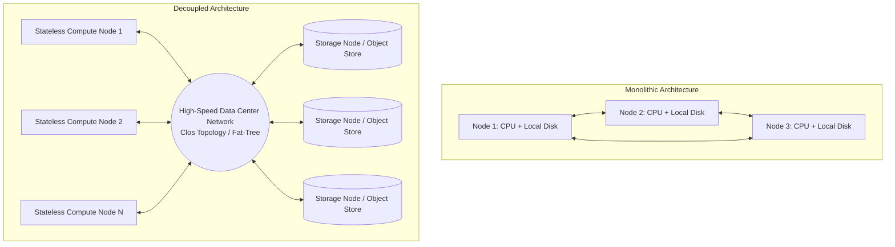
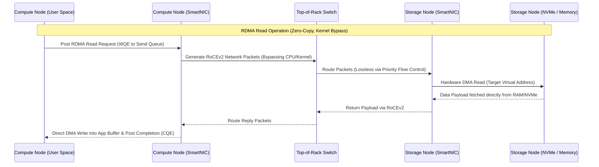

# 48: Tách biệt Storage và Compute (Separation of Storage and Compute): Kiến trúc Đám mây Gốc và Động lực học Vi kiến trúc

## Nguyên lý Kiến trúc và Mô hình Tách biệt Tài nguyên Thể hiện ở Cấp độ Hệ thống

Sự tiến hóa của các hệ thống quản lý cơ sở dữ liệu và xử lý dữ liệu lớn đã chứng kiến một sự chuyển dịch mô hình căn bản từ kiến trúc nguyên khối (monolithic architecture), nơi tài nguyên tính toán (compute) và lưu trữ (storage) bị ràng buộc chặt chẽ trong cùng một nút mạng vật lý, sang kiến trúc tách biệt hoàn toàn (separation of compute and storage). Trong hệ thống nguyên khối truyền thống, tỷ lệ kết hợp tài nguyên có thể được định nghĩa bằng hằng số cấu hình phần cứng $R_c = \frac{C_{capacity}}{S_{capacity}}$, trong đó $C_{capacity}$ đại diện cho năng lực tính toán và $S_{capacity}$ đại diện cho dung lượng lưu trữ cục bộ. Khi khối lượng dữ liệu lưu trữ tăng lên theo hàm mũ trong khi nhu cầu tính toán chỉ tăng trưởng tuyến tính, hoặc ngược lại, tỷ lệ $R_c$ bị phá vỡ dẫn đến sự lãng phí tài nguyên nghiêm trọng do hệ thống buộc phải mở rộng theo chiều ngang (scale-out) một cách đồng bộ. Việc mua sắm và lắp đặt các máy chủ với tỷ lệ phần cứng cố định khiến trung tâm dữ liệu ngập tràn các đĩa cứng trống rỗng trên các nút cần nhiều CPU, hoặc các CPU nhàn rỗi trên các nút cần thêm không gian đĩa. Kiến trúc tách biệt giải quyết bài toán này bằng cách phân lập hai lớp tài nguyên thành hai cụm độc lập, cho phép mở rộng từng thành phần một cách bất đối xứng dựa trên nhu cầu thực tế của tải trọng công việc (workload). Lớp lưu trữ thường được xây dựng trên các hệ thống tệp phân tán (distributed file systems) hoặc hệ thống lưu trữ đối tượng (object storage) với khả năng chịu lỗi cao và tính khả dụng cao, trong khi lớp tính toán bao gồm các máy ảo hoặc bộ chứa (containers) hoàn toàn phi trạng thái (stateless). Tính phi trạng thái của lớp tính toán cho phép hệ thống triển khai các thuật toán lập lịch đàn hồi (elastic scheduling algorithms) trong thời gian thực, có khả năng phân bổ và thu hồi tài nguyên tính toán chỉ trong phạm vi vài mili giây để phản hồi các đợt tăng đột biến về lưu lượng người dùng (traffic spikes). Định luật Amdahl cho hệ thống phân tán mở rộng có tính đến chi phí đồng bộ hóa được phát biểu bằng phương trình $S(N) = \frac{1}{(1 - p) + \frac{p}{N} + C(N)}$, trong đó $p$ là tỷ lệ công việc có thể song song hóa, $N$ là số lượng nút tính toán, và $C(N)$ là chi phí giao tiếp liên nút. Trong kiến trúc tách biệt, chi phí $C(N)$ bị chi phối nặng nề bởi thao tác nạp dữ liệu qua mạng, thay vì chỉ là sự trao đổi trạng thái. Mặc dù mang lại tính linh hoạt tuyệt đối, kiến trúc này đặt ra những thách thức vật lý nghiêm trọng về độ trễ mạng và băng thông, do dữ liệu bắt buộc phải di chuyển qua đường truyền mạng từ nút lưu trữ đến nút tính toán trước khi các lệnh vi xử lý có thể thao tác trên chúng. Phương trình thời gian thực thi truy vấn cơ bản trong kiến trúc này được mô hình hóa thành $T_{total} = T_{init} + \sum_{i=1}^{K} \left( \frac{D_i}{B_{net}} + L_{net} + T_{compute\_i} \right)$, với $D_i$ là kích thước khối dữ liệu thứ $i$, $B_{net}$ là băng thông khả dụng của mạng, $L_{net}$ là độ trễ truyền tải tĩnh của tín hiệu quang học, và $T_{compute\_i}$ là thời gian CPU tiêu tốn cho việc xử lý khối dữ liệu đó. Sự dịch chuyển từ truy cập đĩa cục bộ (local disk I/O) sang truy cập qua mạng (network I/O) làm lộ rõ nút thắt cổ chai (bottleneck) tại giao diện mạng, buộc các kỹ sư hệ thống phải áp dụng các kỹ thuật đa chiều từ phần cứng đến phần mềm để tiệm cận với hiệu suất của kiến trúc chia sẻ không có gì (shared-nothing).



Để giải quyết giới hạn về độ trễ, các hệ thống cơ sở dữ liệu đám mây gốc (cloud-native databases) tích hợp sâu các giao thức mạng tiên tiến vào mô hình luồng dữ liệu (dataflow model). Khi dữ liệu nằm xa vi xử lý, chi phí cận biên của một thao tác đọc phụ thuộc hoàn toàn vào cấu trúc liên kết mạng (network topology) của trung tâm dữ liệu và khả năng chống tắc nghẽn (network congestion control algorithms). Các cấu trúc liên kết phi bế tắc như Clos network hoặc Fat-Tree giúp giảm thiểu xác suất xung đột định tuyến bằng cách cung cấp không gian trạng thái đa đường dẫn (multi-pathing) vật lý giữa hai máy chủ bất kỳ, đảm bảo băng thông đường cắt (bisection bandwidth) luôn ở mức tối đa trên lý thuyết. Mật độ kết nối tĩnh này giúp giải quyết bài toán thông lượng tổng (aggregate throughput), tuy nhiên, việc duy trì tính nhất quán của dữ liệu (data consistency) giữa hai lớp phi đồng bộ lại là một vấn đề lý thuyết máy tính nan giải khác. Định lý PACELC, một phần mở rộng chính thức của định lý CAP (Consistency, Availability, Partition tolerance) nổi tiếng, nhấn mạnh rằng trong trường hợp mạng bị chia cắt (Partition), hệ thống phải đánh đổi bằng toán học giữa tính khả dụng (Availability) và tính nhất quán (Consistency), nhưng ngay cả khi hệ thống hoạt động bình thường mà không có sự cố phân vùng (Else), vẫn tồn tại một sự đánh đổi vi mô cơ bản giữa độ trễ (Latency) và tính nhất quán chặt chẽ (Consistency). Sự hiện diện của phân vùng bộ đệm (in-memory buffer pool cache) tại lớp tính toán nhằm che giấu đi độ trễ truy xuất mạng vô hình trung tạo ra một bài toán cổ điển về tính nhất quán của bộ đệm đa nút (multi-node cache coherence). Khi một nút tính toán ghi dữ liệu mới hoặc cập nhật một chỉ mục dạng cây $B^+$ xuống lớp lưu trữ trung tâm, mô hình nhất quán tuyến tính hóa (linearizability) có thể yêu cầu việc phát sinh các tín hiệu vô hiệu hóa (invalidation broadcasts) đồng bộ tới tất cả các bản sao trong bộ đệm của các nút tính toán ngang hàng khác trước khi giao dịch (distributed transaction) được xác nhận là cam kết (committed). Hàm chi phí phi tuyến tính cho hoạt động duy trì tính nhất quán rườm rà này tỷ lệ thuận với số lượng nút tính toán tham gia vào cụm $N$ và được biểu diễn thông qua độ phức tạp thời gian liên lạc là $O(N)$ đối với các giao thức dựa trên mạng phát sóng (broadcast-based invalidation protocols) truyền thống, hoặc $O(\log N)$ đối với các giao thức phân cấp dựa trên cấu trúc cây phân tán hoặc mạng lưới giao thức đồn đại (gossip dissemination protocols). Do sự đắt đỏ của các phép toán đồng bộ mạng, phần lớn các công cụ cơ sở dữ liệu phân tích xử lý dữ liệu lớn (OLAP) hiện đại lựa chọn mô hình hạ cấp nhất quán cuối cùng (eventual consistency) cho các phân vùng chỉ đọc (read-only replicas) hoặc sử dụng các biến thể của cơ chế phiên bản hóa đồng hồ logic (logical clock versioning / Lamport timestamps) bên trong một hệ thống kiểm soát đồng thời đa phiên bản (Multiversion Concurrency Control - MVCC) phức tạp. Các cấu trúc dữ liệu cơ bản như Log-Structured Merge Tree (LSM-Tree) cực kỳ phù hợp với kiến trúc này vì chúng biến mọi thao tác cập nhật ngẫu nhiên thành các lệnh ghi tuần tự (append-only sequential writes). Hoạt động nén và nối (compaction) của LSM-Tree, vốn tiêu tốn cực lớn chu kỳ CPU, giờ đây có thể được tháo dỡ (offloaded) hoàn toàn cho một nhóm các nút điện toán nền (background compute nodes) hoàn toàn độc lập, không làm ảnh hưởng đến tài nguyên phục vụ các truy vấn tương tác thời gian thực của người dùng. Điều này cho phép không gian lớp tính toán được mở rộng vô hạn trên giới hạn của lý thuyết hàng đợi, biến trung tâm dữ liệu thành một bể chứa tài nguyên động học dùng chung khổng lồ, miễn là dung lượng vật lý của kết nối quang học giữa lớp tính toán và lớp lưu trữ chưa chạm đến điểm gãy của giới hạn tốc độ truyền tải thông tin cực đại do định luật Shannon-Hartley chi phối tuyệt đối: $C = B \log_2(1 + \frac{S}{N})$, trong đó $C$ là dung lượng kênh truyền mạng nội bộ tính bằng bit trên giây, $B$ là băng thông dải tần vật lý tính bằng Hertz, và $\frac{S}{N}$ là tỷ lệ công suất tín hiệu trên nhiễu nền vật lý. Kiến trúc tách rời hoàn toàn triệt tiêu tác động tiêu cực của "lực hấp dẫn dữ liệu" (data gravity), cho phép dữ liệu thô nằm bất động một cách an toàn trong các kho lưu trữ bền bỉ dài hạn (ví dụ AWS S3, GCS), trong khi các cụm điện toán vi mô tạm thời (ephemeral micro-clusters) được huy động lập tức và bao vây để phân tích khối dữ liệu đó từ vô số các quy trình song song khác nhau.

## Nền tảng Thuật toán và Cơ chế Thực thi Truy vấn Phân tán

Sự tồn tại của một ranh giới vật lý sắc nét giữa vi xử lý tính toán và mảng đĩa lưu trữ đòi hỏi một cuộc cách mạng sâu sắc trong lý thuyết tối ưu hóa truy vấn (query optimization theory) và thiết kế hệ thống động cơ cơ sở dữ liệu. Bộ tối ưu hóa chi phí (Cost-Based Optimizer - CBO) hiện đại không thể chỉ đơn thuần phân tích các chi phí vi mô của CPU và ước tính số vòng quay I/O đĩa từ tính truyền thống như trong các hệ thống nguyên khối RDBMS của thập niên trước. Thay vào đó, bộ tối ưu hóa đại số quan hệ phải tích hợp một hàm mục tiêu toán học phức tạp, bao hàm cả các biến số phi tuyến tính liên quan đến hình phạt độ trễ truyền tải qua không gian chuyển mạch của hệ thống mạng. Hàm chi phí tổng quát đại diện để đánh giá một kế hoạch thực thi cây truy vấn $P$ có thể được mô hình hóa thành một biểu thức toán học rời rạc đa biến tối ưu hóa: $Cost(P) = \alpha \cdot W_{CPU} + \beta \cdot W_{Memory} + \gamma \cdot W_{Storage\_IO} + \delta \cdot W_{Network\_Transfer} + \epsilon \cdot W_{Serialization}$. Trong phương trình vi phân chi phí này, các hằng số trọng số $\alpha, \beta, \gamma, \delta, \epsilon$ đại diện cho các hàm mật độ xác suất chi phí đơn vị vật lý và chúng được vi chỉnh liên tục trong thời gian thực bởi các thuật toán học máy học tăng cường (reinforcement learning models) đóng vai trò theo dõi trạng thái từ xa của hệ thống. Để giảm thiểu triệt để và cắt gọt thành phần chi phí $W_{Network\_Transfer}$ khổng lồ, thuật toán đẩy biểu thức tính toán xuống sát tầng bộ lưu trữ (computation pushdown algorithms) đóng vai trò như một giải pháp sống còn trong việc bảo vệ băng thông trung tâm dữ liệu khỏi sự sụp đổ bởi tắc nghẽn (network incast). Thay vì kéo toàn bộ các khối dữ liệu thô cồng kềnh từ lớp lưu trữ sâu (deep storage tier) về hàng đợi của trung tâm tính toán chỉ để hệ thống vi xử lý lọc bỏ phần lớn trong số chúng ở giai đoạn đầu, bộ phân tích cú pháp truy vấn sẽ thực hiện bóc tách chiến lược các phép toán đại số quan hệ (relational algebra primitives) ở sát các nút lá của mạng cây đồ thị thực thi. Các toán tử ngoại biên này bao gồm phép toán chọn lọc (selection $\sigma$ dựa trên các vị từ logic predicate), phép toán chiếu (projection $\pi$ để loại bỏ vĩnh viễn các chiều dữ liệu cột không tham chiếu), và phép toán gom nhóm sơ bộ cục bộ (local aggregation $\gamma$ để tính toán các hàm tập hợp như tổng, phương sai, mức trung bình). Lớp tiến trình trung gian của nút tính toán sau đó sẽ thực hiện đóng gói các toán tử hàm vô hướng này thành các đoạn mã byte-code độc lập hoặc một cấu trúc cây cú pháp trừu tượng (Abstract Syntax Tree - AST) được chuỗi hóa nguyên khối (serialized payload), rồi định tuyến gửi ngược xuống mảng các nút nền lưu trữ thông qua các lệnh gọi giao thức thủ tục từ xa không đồng bộ (asynchronous RPCs). Lớp lưu trữ phân tán, vốn luôn được thiết kế để trang bị các bộ vi xử lý nhúng phụ trợ riêng biệt (chẳng hạn như các mảng lõi ARM tiết kiệm điện năng hoặc kiến trúc tập lệnh RISC-V tùy biến) dành cho mục đích định tuyến phần cứng I/O, sẽ trực tiếp tiến hành biên dịch tĩnh (AOT compilation) hoặc sử dụng bộ biên dịch ngay lúc chạy (Just-In-Time JIT compiler bằng LLVM) đối với các cây cấu trúc AST truyền đến này. Các đoạn mã máy sau khi được JIT biên dịch sẽ được đưa vào thực thi phần cứng trực tiếp ngay trên bộ đệm khối dữ liệu thô tức thời, ngay khi các bit dữ liệu này vừa được kích hoạt đẩy ra khỏi các cổng logic của đơn vị bộ nhớ flash NAND, thậm chí trước khi chúng chạm vào ngăn xếp mạng ảo. Kết quả vi mô trả về hệ thống mạng giờ đây chỉ là một tập dữ liệu con (resultset) đã qua sàng lọc khắt khe và tinh gọn đi hàng vạn lần về dung lượng, giúp triệt tiêu tải băng thông tổng của mạng theo tỷ lệ nghịch thuận tuyệt đối với độ chọn lọc (selectivity) vô hướng của các vị từ lọc truy vấn ban đầu. Đặc biệt tối ưu đối với các hệ thống kho dữ liệu áp dụng định dạng lưu trữ khối phân vùng dạng cột (columnar formats) tiêu chuẩn công nghiệp như Apache Parquet hay định dạng ORC, quá trình đẩy mạnh các biểu thức lọc xuống đáy lưu trữ còn kết hợp vô cùng mật thiết với các khối tệp siêu dữ liệu thống kê đính kèm (metadata blocks như min/max bounds, zone maps, dictionary encodings, và cấu trúc hàm băm nội suy Bloom Filters). Thuật toán không gian lưu trữ sẽ chỉ cần quét qua các mảng siêu dữ liệu nhỏ bé này để áp dụng lý thuyết tập hợp, qua đó loại bỏ bỏ qua ngay lập tức toàn bộ các tập hợp nhóm hàng (row groups) khổng lồ vốn được chứng minh toán học là không bao giờ thỏa mãn điều kiện, trước khi tiến hành thực hiện bất kỳ một chỉ thị giải nén luồng bit tốn kém nào từ CPU, biến I/O mạng từ một nút thắt cổ chai vật lý thành một thế mạnh xử lý siêu song song vô tiền khoáng hậu.

```cpp
// Pseudocode: Pushdown Filter Serialization and Execution in Rust/C++ Paradigm
struct FilterExpression {
    enum Operator { EQUALS, GREATER_THAN, IN_BLOOM_FILTER };
    Operator op;
    uint32_t column_id;
    std::vector<uint8_t> scalar_value_bytes;
};

class StorageNodeComputeEngine {
public:
    // Execute pushed down AST over locally fetched NVMe blocks
    std::shared_ptr<ArrowRecordBatch> execute_pushdown(
        const std::string& parquet_file_path, 
        const std::vector<FilterExpression>& pushed_filters) {
        
        auto file_reader = ParquetReader::Open(parquet_file_path);
        auto file_metadata = file_reader->metadata();
        std::vector<int> matching_row_groups;

        // Phase 1: Zero-Decompression Pruning using Zone Maps and Bloom Filters
        for (int i = 0; i < file_metadata->num_row_groups(); ++i) {
            auto rg_metadata = file_metadata->RowGroup(i);
            if (evaluate_zone_maps(rg_metadata->statistics(), pushed_filters)) {
                matching_row_groups.push_back(i);
            }
        }

        // Phase 2: JIT-compiled vectorized filtering on raw data pages
        std::shared_ptr<ArrowRecordBatch> result_batch = allocate_result_buffer();
        for (int rg_idx : matching_row_groups) {
            auto chunk = file_reader->ReadRowGroup(rg_idx);
            // Decode and evaluate JIT code utilizing SIMD AVX-512
            auto filtered_chunk = SIMD_Vectorized_Filter::apply(chunk, pushed_filters);
            result_batch->append(filtered_chunk);
        }
        
        // Transmit heavily reduced dataset over the network back to Compute Node
        return result_batch;
    }
};
```

Cùng với kỹ thuật đẩy biểu thức toán học tiên tiến, việc cấu trúc và tối ưu hóa cơ chế thực thi truy vấn nội bộ cốt lõi dựa trên nguyên lý xử lý vector hóa (vectorized execution engines) cũng được tinh chỉnh khắc nghiệt ở mức độ kiến trúc tập lệnh vi mô CPU (micro-architectural instruction sets) để che lấp đi các điểm mù của độ trễ truyền tải mạng (latency hiding). Trong kiến trúc tách biệt phi trạng thái này, hệ thống tuyệt đối không bao giờ được phép xử lý từng hàng dữ liệu một (tuple-at-a-time processing) như trong mô hình đường ống Volcano cổ điển do mức chi phí hàm ảo (virtual function call overhead) quá lớn. Trái lại, engine hệ thống xử lý theo các khối lô lớn (batches) được lưu trữ ép chặt trong các cấu trúc bộ nhớ dạng mảng liền kề (contiguous arrays) thẳng hàng chính xác với kích thước tiêu chuẩn của đường dẫn bộ nhớ đệm L1/L2 của CPU (CPU cache line size alignment, thường chuẩn hóa ở 64 hoặc 128 bytes). Thiết kế này tối đa hóa tỷ lệ trúng bộ đệm (cache hit ratio) và mở khóa tiềm năng sử dụng các tập lệnh SIMD (Single Instruction, Multiple Data) thế hệ mới như Intel AVX-512 hoặc ARM SVE (Scalable Vector Extension). Khi một luồng xử lý đồ thị truy vấn (execution thread) yêu cầu tải một lô mảng dữ liệu tiếp theo để xử lý, nếu lô mảng dữ liệu này chưa hiện diện sẵn sàng ở vùng bộ đệm RAM cục bộ của bộ điều phối quản lý không gian người dùng, luồng thực thi sẽ tuyệt đối không bị đưa vào trạng thái chặn cứng (blocked) thông qua các lệnh gọi hệ thống, ngăn chặn thảm họa lãng phí các chu kỳ xử lý nano giây đắt đỏ. Thay vào đó, bộ lập lịch luồng của cơ sở dữ liệu ngay lập tức thực hiện một quy trình chuyển đổi ngữ cảnh sợi siêu nhẹ (ultra-lightweight user-space fiber context switch) sang một tác vụ con khác trong mạng đồ thị có hướng không chu trình (DAG) tổng thể của luồng công việc. Bằng cách nhường lại toàn bộ không gian thời gian thực thi cho một bộ điều khiển giao tiếp mạng không đồng bộ đa luồng (asynchronous network controller), nó âm thầm thực thi việc tìm nạp trước (prefetch) hàng loạt khối dữ liệu từ phía sau màn chắn hệ điều hành thông qua các thư viện như `io_uring` hoặc `epoll`. Thuật toán phân bổ lập lịch động đa luồng trong không gian cực trị này tuân thủ khắt khe một mạng lưới xếp hàng (queuing network theory) có tính chất ngẫu nhiên phức hợp (stochastic processes), trong đó tỷ lệ khối dữ liệu đến (arrival rate $\lambda$) từ hạ tầng mạng bắt buộc phải được theo dõi liên tục để duy trì trạng thái cân bằng động tuyệt đối với tỷ lệ phục vụ toán học (service rate $\mu$) của đường ống đa chỉ thị dữ liệu bên trong vi kiến trúc lõi CPU. Để đảm bảo hệ số hiệu suất sử dụng vi xử lý $\rho = \frac{\lambda}{\mu}$ luôn duy trì trạng thái tiệm cận ở mức lý tưởng là $1.0$, các bộ lập lịch truy vấn phân tán hiện đại phải kiến tạo và duy trì một cửa sổ tìm nạp trước (prefetch window array) trượt liên tục. Kích thước tối ưu của vùng không gian cửa sổ nạp trước này được ước lượng toán học nghiêm ngặt dựa trên định luật Little mở rộng: $L = \lambda W$, trong đó tham số $W$ đại diện cho một phân phối xác suất thời gian trễ khứ hồi động (dynamic network RTT) băng qua toàn bộ cấu trúc mạng chuyển mạch. Khi độ trễ $W$ đột ngột tăng đột biến (latency tail spikes) do các sự kiện vi tắc nghẽn mạng cực bộ xảy ra tại hàng đợi của các thiết bị chuyển mạch (switch micro-burst congestions), kích thước mảng cửa sổ $L$ bắt buộc phải được điều khiển mở rộng phình to ra theo thuật toán điều khiển PID để giữ cho hệ thống luồng lệnh CPU luôn được cung cấp đủ nhiên liệu dữ liệu thô. Tuy nhiên, nghịch lý xảy ra là sự phình to bất chấp giới hạn của cửa sổ này trực tiếp dẫn đến một áp lực khổng lồ đè nặng lên các mảnh vỡ của bộ phận cấp phát bộ nhớ động (dynamic memory allocator - ví dụ: jemalloc, tcmalloc) thuộc hệ điều hành, yêu cầu hệ thống vật lý phải cấp phát và duy trì các vùng lưu trữ tạm thời trung gian (staging buffers) với quy mô hàng trăm Gigabyte bộ nhớ RAM. Sự tương tác giằng co tinh tế và liên tục giữa cấu trúc thuật toán thực thi truy vấn khát kẽ phía không gian người dùng, cùng với cơ chế thu gom dọn rác và quản lý bộ nhớ vô hình ở tầng nhân hệ điều hành, vô hình trung tạo ra một bối cảnh môi trường thực thi máy tính cực kỳ khắc nghiệt. Việc tồn tại trong không gian này đòi hỏi các kỹ sư hệ thống phải thiết kế và nhúng các bộ cấu trúc dữ liệu không khóa phân cấp phức tạp (hierarchical lock-free data structures) và sử dụng chính xác các chỉ thị hàng rào đồng bộ bộ nhớ phần cứng cốt lõi (hardware memory barrier / fence instructions) ở mức độ chỉ thị vi mô (micro-instructions logic) để triệt tiêu hoàn toàn xác suất xảy ra các trạng thái tương tranh (race conditions) hoặc tái sắp xếp lệnh (out-of-order execution anomalies) chết người.

## Giới hạn Phần cứng và Động lực học Vi kiến trúc Hệ điều hành

Dù cho sự trừu tượng hóa kiến trúc đồ họa của việc tách biệt không gian máy tính lưu trữ và năng lực tính toán đám mây mang đến sự linh hoạt điều phối vô song ở khía cạnh thiết kế kỹ thuật phần mềm, nhưng cuối cùng hệ thống điện toán này cũng phải đối mặt trực diện với các thiết chế định luật vật lý cứng rắn và những giới hạn tắc nghẽn cốt lõi trong vi kiến trúc mã nguồn của nhân hệ điều hành. Trên các máy chủ sử dụng bộ hệ điều hành mạng tiêu chuẩn thông thường được xây dựng theo chuẩn POSIX (như Linux hay UNIX), hoạt động đọc liên tục một luồng dữ liệu khổng lồ xuyên qua hệ thống mạng chuyển mạch yêu cầu sự thực thi vô số các bản sao chép nội dung tệp dư thừa qua lại giữa vùng không gian bảo vệ nhân (kernel space) sang vùng bộ nhớ ứng dụng không gian người dùng (user space). Dưới lăng kính vi kiến trúc phần cứng, khi một khung gói tin Ethernet mạng vật lý mang theo một phân mảnh dữ liệu của bảng cơ sở dữ liệu bay đến đầu cắm của thẻ giao tiếp mạng (Network Interface Card - NIC), dòng byte này trước tiên được bộ phận phần cứng điều khiển mạng tự động chuyển chép trực tiếp vào một mảng không gian bộ nhớ chính thông qua giao thức truy cập bộ nhớ trực tiếp bus phần cứng (DMA engine bus). Ngay lập tức, thẻ NIC phát sinh một tín hiệu ngắt phần cứng điện toán (hardware interrupt IRQ) lên các chân cắm của CPU để cảnh báo vi xử lý về sự kiện mới. Đáp lại, toàn bộ chuỗi luồng ngữ cảnh hiện tại của hệ điều hành sẽ phải đình chỉ để kích hoạt đánh thức các quy trình nhận diện và tiến hành khởi động chồng giao thức mạng TCP/IP khổng lồ trong mã hạt nhân: CPU buộc phải tuần tự phân tích và bóc tách các tiêu đề nhãn tin (packet headers stripping), tính toán kiểm tra mã toàn vẹn (checksum validation), kiểm tra tuần tự logic các số thứ tự TCP để ngăn chặn gói tin lạc (out-of-order sequencing), và cuối cùng thực hiện sao chép toàn bộ khối phân đoạn tải trọng tĩnh (payload data chunks) vào một vùng đệm không gian ổ cắm an toàn do nhân kiểm soát (socket ring buffer). Ở chặng cuối của vòng luẩn quẩn này, khi tiến trình mã nguồn cơ sở dữ liệu gọi hàm API hệ thống cổ điển như `recv()` hoặc `read()`, hệ điều hành một lần nữa lại buộc phải thực hiện thêm một thao tác sao chép khối bộ nhớ quy mô lớn nữa từ không gian cách ly nhân (kernel pages) vào không gian phân trang bộ nhớ ảo của tiến trình người dùng (user-space virtual memory). Số lượng khổng lồ các chu kỳ dao động xung nhịp CPU (CPU clock cycles) cực kỳ đắt đỏ và quý giá vô hình chung bị thiêu rụi hoàn toàn cho các hoạt động chuyển đổi ngữ cảnh phần mềm (software context switching delays), kết hợp với sự tàn phá hủy hoại không gian hệ thống bộ nhớ đệm L2/L3 (cache pollution trashing) do các dòng cache (cache lines) bị ghi đè thô bạo bởi luồng sao chép dữ liệu mạng. Hơn nữa, việc giao tiếp sao chép liên tục làm bão hòa nhanh chóng thông lượng của hệ thống bus bộ nhớ (memory bus bandwidth saturation). Tất cả những sự lãng phí cơ học này là điều tuyệt đối không thể chấp nhận được đối với các cụm kiến trúc cơ sở dữ liệu phân tán đám mây được định giá hàng triệu đô la và được kỳ vọng duy trì hiệu suất hoạt động song song cực đại. Để tháo gỡ thành công rào cản chí mạng về vi kiến trúc hệ điều hành này, bản thiết kế cấu trúc mạng tách biệt lưu trữ tính toán hiện đại bắt buộc phải thực hiện một bước nhảy vọt, vượt qua giới hạn của mô hình hạt nhân Linux truyền thống bằng cách tích hợp và ứng dụng triệt để các công nghệ bỏ qua nhân mạng (kernel bypass networking technologies) tiên phong. Trong số đó, công nghệ RDMA (Remote Direct Memory Access) chạy trên cơ sở hạ tầng nền tảng mạng RoCEv2 (RDMA over Converged Ethernet) hoặc hệ thống mạng kết nối siêu máy tính Infiniband chuyên biệt nổi lên như một vị cứu tinh hoàn hảo. Giao thức RDMA cho phép phần mã sụn nhúng (hardware firmware) của thẻ giao tiếp mạng SmartNIC trên nút máy tính điện toán gửi và phát hành trực tiếp các lệnh truy cập bộ nhớ từ xa (Remote DMA read/write operations) đâm thẳng qua mạng đến vùng phân trang bộ nhớ không gian người dùng đã được định vị sẵn của nút máy chủ lưu trữ. Toàn bộ quá trình định tuyến và truyền tải bộ nhớ này được quản lý thông qua cơ chế cặp hàng đợi không khóa điều khiển bằng phần cứng (hardware-assisted queue pairs), hoàn toàn không cần thiết phải đánh thức bất kỳ một lõi xử lý CPU nào hay chạm vào các ngăn xếp nhân hệ điều hành ở máy chủ lưu trữ đầu xa đó. Sự đột phá công nghệ vi mạch này đã thay đổi một cách triệt để định luật và phương trình toán học nền tảng về mối quan hệ giữa thông lượng băng thông và độ trễ ở phần cơ sở lý thuyết trước đó. Việc loại bỏ hoàn toàn các số hạng đại số $T_{compute\_i}$ dành cho việc lãng phí phục vụ hàm ngắt và xử lý gói TCP/IP phức tạp đã làm giảm thiểu mạnh mẽ độ trễ mạng xuống chỉ còn dao động trong phạm vi giới hạn lý tưởng vài micro giây (microseconds), bất chấp các biến số khoảng cách vật lý của sợi quang học trong khuôn viên trung tâm dữ liệu.



Những hệ quả kéo theo từ góc độ vi kiến trúc phần cứng của việc triển khai rộng rãi RDMA kết hợp với tập lệnh lưu trữ mạng NVMe-oF (NVMe over Fabrics) tác động một cách toàn diện và vô cùng sâu sắc đến các chiến lược quản lý phân trang bộ nhớ. Điều này đặc biệt thể hiện rõ rệt và trầm trọng trên các kiến trúc phân bổ liên kết cấu trúc bộ nhớ không đồng nhất (NUMA - Non-Uniform Memory Access architecture) phổ biến trên các hệ thống bo mạch chủ siêu máy chủ đa ổ cắm vi xử lý (multi-socket motherboards) hiện đại. Khi một nút đám mây tính toán sử dụng khả năng phân luồng RDMA phần cứng để kéo hàng gigabyte dữ liệu mã hóa về không gian bộ nhớ định tuyến của nó một cách hoàn toàn bất đồng bộ (asynchronously), vùng không gian bộ nhớ vật lý đích (destination memory addresses) tại nút nhận bắt buộc phải được thiết lập trạng thái neo khóa vật lý tuyệt đối chặt chẽ (memory pinning / mlocked status). Thao tác neo khóa bắt buộc này là một điều kiện ràng buộc tối quan trọng nhằm ngăn cản bộ quản lý phân trang không gian bộ nhớ ảo (virtual memory manager subsystem) của lõi hệ điều hành tiến hành các thuật toán hoán đổi tự động, tránh việc đẩy (page out) các trang nhớ đệm đó xuống vùng không gian hoán đổi phụ (swap space) chật hẹp trên đĩa cứng tĩnh cục bộ. Cơ chế bảo vệ này đảm bảo chắc chắn rằng dải địa chỉ bộ nhớ vật lý cứng mà mảng vi mạch của thẻ giao tiếp mạng NIC đang thực hiện ghi dữ liệu trực tiếp vào (thông qua băng thông bus tốc độ cao PCIe Gen 5 hoặc Gen 6) luôn luôn tồn tại hợp lệ và luôn được giữ an toàn tuyệt đối khỏi sự kích hoạt của các lỗi trang (page faults) thảm khốc, vốn có thể làm sập toàn bộ hệ thống bằng một màn hình hoảng loạn hạt nhân (kernel panic). Nhưng bài toán tối ưu hóa vi kiến trúc ở đây mới thực sự trở nên vĩ mô và phức tạp hơn rất nhiều: nếu như luồng CPU của ứng dụng (application thread) có nhiệm vụ thao tác xử lý và phân tích tập dữ liệu vừa nhận được thông qua mạng lại bị hệ điều hành lập lịch cư trú ngẫu nhiên trên một nút phần cứng NUMA hoàn toàn khác biệt với vị trí của khối vi mạch bộ điều khiển gốc PCIe mà thẻ mạng NIC vật lý được gắn trực tiếp vào, luồng dữ liệu liên tục và khổng lồ này sẽ bị bắt buộc phải di chuyển băng ngang chéo qua cấu trúc thiết kế của các liên kết kết nối nối tiếp điểm-điểm tốc độ cao liên ổ cắm (inter-socket interconnects). Các công nghệ kết nối ngang hàng cầu nối này, tiêu biểu chẳng hạn như kiến trúc kết nối Intel UPI (Ultra Path Interconnect) hoặc băng thông kênh AMD Infinity Fabric, tuy rất nhanh nhưng không phải là không có điểm yếu vật lý. Sự can thiệp cơ học và chuyển hướng luồng hạt điện tử này ngay lập tức chèn ép thêm một mức độ trễ vật lý nội bộ ký sinh (parasitic latency) ước tính dao động nghiêm trọng trong khoảng từ hàng chục đến hàng trăm nano giây tĩnh cho mỗi một chỉ thị truy cập lấy mẫu bộ nhớ của CPU. Đồng thời, cấu trúc định tuyến chéo này còn gây ra hiện tượng cạnh tranh khốc liệt tranh giành băng thông đường truyền kết nối ngang với vô số các thao tác truy cập không gian bộ nhớ khác của hệ thống con lân cận, sinh ra một hiệu ứng nút thắt cổ chai nghẽn mạch vô hình ngay tại trung tâm bên trong một thiết kế máy chủ vật lý tưởng chừng như sở hữu sức mạnh xử lý vô hạn. 

Mô hình phân tích độ trễ học của quyền truy cập chéo NUMA dị hướng này có thể được các nhà khoa học máy tính mô phỏng giả lập dưới dạng các phương trình toán học tinh vi như một cấu trúc chuỗi Markov thời gian liên tục biến thiên (Continuous-Time Markov Chain - CTMC). Trong đồ thị không gian trạng thái của cấu trúc này, các nút điểm đỉnh không gian toán học biểu thị chính xác vị trí cư trú vật lý tĩnh hiện tại của các dòng phân chia bộ nhớ đệm (cache lines) bị vi xử lý tác động thay đổi, và các ma trận quá trình chuyển đổi trạng thái mạng (state transitions matrix) tương ứng với vô số các luồng thông báo rình mò nhằm duy trì trạng thái vi mô nhất quán bộ nhớ (cache coherence snooping and invalidation messages) lan truyền đi liên tục trên bề mặt silicon theo cơ chế giao thức duy trì độ cứng đồng nhất thiết kế chuẩn mực như giao thức MESI hoặc các hệ biến thể kiểm soát như giao thức MOESI. Để có thể sinh tồn và khai thác trọn vẹn hiệu năng vượt qua nghịch lý suy thoái vi kiến trúc tàn bạo này, phần lõi lập lịch của hệ điều hành và chính bản thân kiến trúc phần mềm mã nguồn của cơ sở dữ liệu phân tán (distributed database engine) phải sở hữu khả năng nhận thức sâu sắc để đồng điều phối chung một bộ chính sách cấp phát và phân mảnh không gian bộ nhớ dựa trên năng lực nhận diện quang học toàn vẹn của cấu trúc NUMA nền tảng (NUMA-aware memory topology allocation schemas). Qua hệ thống nhận diện này, phần mềm có khả năng ép buộc một cách hệ thống bằng các cơ chế áp đặt ái lực (affinity bindings) cứng rắn sao cho các vùng mảng cấu trúc dữ liệu khổng lồ (huge-pages data structures) dùng để hứng nhận dòng luồng byte bất tận từ hệ thống kho lưu trữ phân tán bên ngoài luôn luôn được cấp phát và căn chỉnh gắn chặt vị trí cục bộ (strict local node affinity / core pinning) với luồng vi xử lý điện toán thực thi (compute processing threads) đang chịu trách nhiệm trực tiếp phân tích chính các mảng byte mã hóa đó. Song song với đó, cùng với sự bùng nổ của giao thức kiến trúc NVMe-oF (NVMe over Fabrics) và chuẩn kết nối CXL (Compute Express Link) tối tân thế hệ mới, công nghệ mạng siêu phân tán này đã cho phép việc ánh xạ chia sẻ địa chỉ trực tiếp và hiển thị xuyên biên giới các hệ thống hàng đợi điều khiển phần cứng vi mạch (hardware execution queue pairs) của hàng vạn ổ đĩa thể rắn quang học lưu trữ NVMe khổng lồ từ các cụm nút không gian lưu trữ sâu, xa xôi hàng dặm, phóng thẳng qua sợi quang học để nối liền mạch vào biểu đồ không gian bộ nhớ ảo phẳng phiu của các cụm phân tích nút tính toán tạm thời. Quá trình quang học này đã triệt để làm mờ đi giới hạn và ranh giới định nghĩa vật lý cổ điển giữa thuật ngữ bộ nhớ RAM điện tĩnh kết nối qua mạng (networked volatile DRAM memory) và các phiến đĩa tĩnh lưu trữ qua mạng phân tán (networked persistent flash storage tier). Mô hình triết học trừu tượng của kiến trúc lưu trữ và tính toán tách biệt (Separation of Storage and Compute), nhờ sự hội tụ của hàng loạt các thiết chế công nghệ phần cứng và thuật toán tinh hoa này, đã hoàn toàn lột xác và vượt qua được cái bóng giới hạn vật lý của chính nó, vươn lên tiệm cận một cách vô cùng kinh ngạc đến với một cấu trúc liên kết phẳng khổng lồ thống nhất (giant uniform flat topology architecture). Trong không gian tầm nhìn tương lai rực rỡ đó, kiến trúc vật lý bao trùm toàn bộ một cấu trúc trung tâm dữ liệu đám mây thực chất chỉ đang hòa chung nhịp đập hoạt động mượt mà dưới tư cách như một cỗ máy tính lượng tử siêu nguyên khối duy nhất khổng lồ. Nó vận hành trên một không gian hệ tọa độ địa chỉ ảo phân tán khổng lồ chia sẻ tài nguyên đồng nhất (distributed shared memory space unification), vĩnh viễn phá vỡ những quan niệm giới hạn cũ kỹ và thiết lập lại một cách mạnh mẽ hoàn toàn quy chuẩn định nghĩa kinh điển về một giới hạn nút máy tính tính toán độc lập cô lập (standalone independent compute node) vốn dĩ đã ngự trị và thống trị sự phát triển của tư duy lý thuyết kiến trúc hệ thống mạng máy tính xuyên suốt dòng lịch sử nhiều thập kỷ phát triển của kỷ nguyên máy tính Von Neumann tĩnh truyền thống. Cuộc cách mạng vĩ đại về lý thuyết phân mảnh hệ thống và sự tách biệt phi trạng thái hóa tài nguyên máy tính tính toán lưu trữ trong kỷ nguyên số hiện nay không đơn thuần chỉ dừng lại ở sự tiến hóa thay đổi mô hình triển khai dịch vụ cho thuê phần cứng của các công ty công nghệ cung cấp nền nền tảng đám mây khổng lồ, mà đó thực sự chính là bước đà để định hình và tái cấu trúc lại hoàn toàn các đường nét ranh giới vi mô tối thượng nhất của toàn bộ nền móng khoa học máy tính hiện đại ở mọi cấp độ: trải dài từ tầng vi mạch vật lý bán dẫn điện tử, vi kiến trúc hệ điều hành, cho đến cấu trúc mạng dữ liệu quang học và những thuật toán mã nguồn phần mềm siêu song song ưu việt nhất.

## SEO Metadata
*   **Keywords**: Separation of Storage and Compute, Tách biệt lưu trữ và tính toán, Cloud-native architecture, Cơ sở dữ liệu đám mây, RDMA, NVMe-oF, Vectorized execution, Kernel bypass, NUMA architecture, Compute Express Link.
*   **Description**: Khám phá kiến trúc tách biệt lưu trữ và tính toán (Separation of Storage and Compute) dưới góc độ vi kiến trúc hệ thống đám mây, toán học tối ưu truy vấn, và động lực học hệ điều hành đa nút. Phân tích chi tiết về RoCEv2, đẩy biểu thức lọc phân tán, vector hóa truy vấn, và cách kiến trúc vượt qua giới hạn độ trễ mạng vật lý bằng mạng tốc độ cao.
