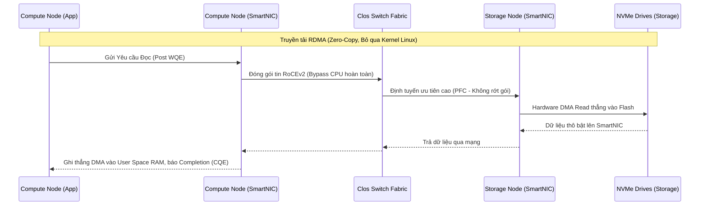

# Tập 48: Kiến Trúc Tách Biệt Storage và Compute Trong Hệ Thống Đám Mây Gốc

## Tóm Tắt Điều Hành

Bài viết này phân tích chuyên sâu **kiến trúc tách biệt Storage và Compute** - nguyên lý đứng sau hầu hết các cơ sở dữ liệu đám mây gốc hiện nay. Bạn sẽ hiểu vì sao các hệ thống phân tán buộc phải tách rời hai loại tài nguyên vốn dĩ luôn đi cùng nhau, cách chúng vượt qua giới hạn vật lý về độ trễ mạng và băng thông, và những nguyên tắc thiết kế đã được đúc kết từ các nền tảng như Snowflake, BigQuery hay Aurora.

---

## Mở Đầu: Đọc Vị Kiến Trúc Đám Mây Gốc

Không có sự dịch chuyển kiến trúc nào trong ngành cơ sở dữ liệu xảy ra một cách ngẫu nhiên. Mỗi lần mô hình thay đổi, đằng sau nó luôn là một giới hạn vật lý đã bị chạm tới, cộng thêm áp lực từ phía kinh doanh. Trong hơn một thập kỷ qua, ngành đã đi từ kiến trúc nguyên khối - nơi CPU, RAM và ổ đĩa nằm cố định trong cùng một khung máy chủ - sang mô hình tách biệt hoàn toàn giữa tính toán và lưu trữ, chạy trên hạ tầng đám mây.

Câu chuyện ở đây không dừng lại ở việc chạy theo trào lưu công nghệ. Để hiểu tại sao việc tách ra lại mang lại lợi ích thực sự, cần đi sâu vào cấu trúc vi mô của bộ nhớ, các phương trình chi phối việc định tuyến dữ liệu, và cách phần mềm hiện đại "lách" hệ điều hành để đạt tốc độ truyền tải gần chạm tới giới hạn vật lý của ánh sáng trong sợi quang. Câu hỏi đáng quan tâm không phải "tách ra có lợi gì" mà là "tách như thế nào để hệ thống không sụp đổ vì độ trễ mạng".

---

## Bài Toán Cốt Lõi: Vì Sao Kiến Trúc Nguyên Khối Đi Vào Ngõ Cụt

### Giới hạn từ việc ghép cứng phần cứng

Trong các hệ thống nguyên khối truyền thống (Shared-Nothing Hadoop, Teradata, RDBMS chạy tại chỗ), tỷ lệ giữa năng lực tính toán và dung lượng lưu trữ gần như bị khóa cứng theo cấu hình phần cứng đã đầu tư:

$$R_c = \frac{C_{capacity}}{S_{capacity}}$$

Trong đó $C_{capacity}$ đại diện cho năng lực tính toán (số lõi CPU, dung lượng RAM), còn $S_{capacity}$ là dung lượng lưu trữ cục bộ (HDD/SSD).

Cái khó nằm ở tốc độ tăng trưởng lệch pha. Khối lượng dữ liệu trong thời đại big data thường tăng gần theo hàm mũ, trong khi nhu cầu xử lý truy vấn thường chỉ tăng tuyến tính. Khi một cụm nguyên khối cạn dung lượng đĩa, cách duy nhất để mở rộng là mua thêm node vật lý mới - mà node nào cũng kéo theo CPU, RAM lẫn ổ đĩa, kể cả khi bạn chỉ cần thêm chỗ chứa. Hệ quả là trung tâm dữ liệu ngập trong những lõi CPU nhàn rỗi, trong khi hệ thống vẫn báo cáo đã chạm giới hạn lưu trữ. Sự lệch pha $R_c$ này âm thầm ngốn cả ngân sách đầu tư ban đầu lẫn chi phí vận hành hàng tháng.

### Lực hút của dữ liệu

Vấn đề thứ hai tinh vi hơn nhưng không kém phần nghiêm trọng: một khi dữ liệu bị khóa chặt vào một node xử lý cục bộ, việc chia sẻ cùng một tập dữ liệu gốc cho nhiều nhóm khác nhau - Data Science chạy mô hình học máy, BI dựng dashboard, Data Engineering chạy pipeline ETL - gần như bất khả thi nếu không sao chép dữ liệu ra nhiều nơi. Mà sao chép dữ liệu ở quy mô lớn vừa tốn thời gian, vừa dễ làm vỡ tính nhất quán, để lại phía sau một mớ kho dữ liệu rời rạc không liên thông được với nhau.

---

## Giải Pháp: Nguyên Lý Kiến Trúc Tách Biệt Tài Nguyên

Lời giải triệt để là bỏ hẳn khái niệm "máy chủ vật lý" như một đơn vị tài nguyên cố định, tách hai lớp tài nguyên này thành hai cụm điện toán vận hành độc lập với nhau.

```mermaid
graph TD
    subgraph Monolithic Architecture (The Past)
        N1[Node 1: CPU + RAM + SSD]
        N2[Node 2: CPU + RAM + SSD]
        N3[Node 3: CPU + RAM + SSD]
        N1 <--> N2
        N2 <--> N3
        N1 <--> N3
    end

    subgraph Decoupled Cloud-Native Architecture (The Present & Future)
        direction TB
        subgraph Compute Layer (Stateless, Ephemeral)
            C1[Elastic Compute Node 1\n(Micro-cluster)]
            C2[Elastic Compute Node 2\n(Micro-cluster)]
            C3[Elastic Compute Node N\n(Micro-cluster)]
        end
        
        Net((High-Speed Clos/Fat-Tree\nData Center Network Fabric))
        
        subgraph Storage Layer (Stateful, Persistent)
            S1[(Distributed Object Store\ne.g., S3, GCS, ABS)]
        end
        
        C1 <--> Net
        C2 <--> Net
        C3 <--> Net
        Net <--> S1
    end
```

### Lớp Compute không còn giữ trạng thái

Lớp tính toán giờ được dựng từ máy ảo, container, hoặc hàm serverless, và điểm mấu chốt là chúng gần như không giữ trạng thái cục bộ lâu dài. Một node Compute có thể bị tắt đột ngột do kernel panic hoặc bị hạ tầng đám mây thu hồi (Spot Instance), nhưng không có byte dữ liệu người dùng nào bị mất theo. Chính đặc tính này cho phép bộ điều phối cấp phát hoặc thu hồi hàng ngàn lõi CPU chỉ trong vài mili giây, tùy theo tải thực tế.

### Cái giá phải trả: nút thắt cổ chai ở tầng mạng

Sự linh hoạt đó không miễn phí. Đọc dữ liệu từ SSD cục bộ chỉ mất 10-100 micro giây, còn gọi dữ liệu qua mạng từ Object Storage thường tốn hàng chục mili giây - chậm hơn khoảng 1.000 lần.

Định luật Amdahl khi tính thêm chi phí đồng bộ hóa mạng được viết lại như sau:

$$S(N) = \frac{1}{(1 - p) + \frac{p}{N} + C(N)}$$

Trong đó $C(N)$ là khoản phạt về độ trễ mạng phát sinh khi truyền dữ liệu. Thời gian thực thi một truy vấn có thể mô hình hóa gần đúng bằng:

$$T_{total} = T_{init} + \sum_{i=1}^{K} \left( \frac{D_i}{B_{net}} + L_{net} + T_{compute\_i} \right)$$

Muốn hệ thống không bị nghẹt, kỹ sư buộc phải tập trung giảm ba đại lượng: $D_i$ (lượng dữ liệu gửi qua mạng), $L_{net}$ (độ trễ), và $T_{compute}$ (thời gian CPU xử lý).

---

## Nền Tảng Thuật Toán Cho Việc Thực Thi Truy Vấn Phân Tán

### Định lý PACELC và cuộc mặc cả về tính nhất quán

Khi mạng đóng vai trò như một "bus hệ thống" nối các thành phần, việc bị phân vùng gần như không thể tránh khỏi. Theo PACELC, ngay cả lúc mạng ổn định, vẫn luôn tồn tại sự đánh đổi giữa độ trễ và tính nhất quán.

Lớp Compute cần một tầng đệm phân tán đủ lớn để hoạt động hiệu quả. Nhưng khi một node Compute ghi dữ liệu, các node khác lấy đâu ra tín hiệu để xóa bộ đệm cũ của mình? Chi phí phát thông điệp vô hiệu hóa tỷ lệ với $O(N)$ hoặc $O(\log N)$ - không hề rẻ khi số node tăng lên. Vì vậy, nhiều hệ thống kho dữ liệu chọn cách hạ cấp có chủ đích xuống mô hình **nhất quán cuối cùng**, dựa trên MVCC. Dữ liệu được ghi tuần tự, cấu trúc LSM-Tree gom các thao tác ghi ngẫu nhiên thành luồng tuần tự, còn việc dọn dẹp (compaction) được đẩy cho các node chạy nền để không ảnh hưởng tốc độ đọc tương tác của người dùng.

### Pushdown Analytics và biên dịch JIT

Để giải bài toán $D_i$ - giảm lượng dữ liệu phải truyền qua mạng - kỹ thuật cốt lõi là **Computation Pushdown**: đẩy phép tính xuống ngay tầng lưu trữ thay vì kéo dữ liệu lên tầng compute. Bộ tối ưu hóa dựa trên chi phí (CBO) giờ không còn đo số vòng quay ổ cứng nữa, mà dùng một hàm chi phí đa chiều:

$$Cost(P) = \alpha \cdot W_{CPU} + \beta \cdot W_{Memory} + \gamma \cdot W_{Storage\_IO} + \delta \cdot W_{Network\_Transfer} + \epsilon \cdot W_{Serialization}$$

Lớp Compute sẽ không kéo cả bảng Parquet nặng 1 Terabyte về RAM chỉ để lấy đúng một dòng dữ liệu. Thay vào đó, quy trình diễn ra theo bốn bước:

1. Trích xuất cây cú pháp trừu tượng (AST) của điều kiện lọc, chẳng hạn `WHERE user_id = 123`.
2. Mã hóa AST đó và gửi qua RPC xuống node Lưu trữ, có thể thẳng tới SmartNIC.
3. Tại node Lưu trữ, một vi xử lý nhỏ (ARM/RISC-V) dùng LLVM biên dịch JIT ngay AST đó thành mã máy.
4. Lọc dữ liệu ngay khi nó vừa rời khỏi chip nhớ NAND Flash, trước khi kịp đưa lên mạng.

Kết quả là chỉ vài kilobyte dữ liệu thực sự khớp điều kiện lọc mới lọt lên mạng để trả về cho Compute. Một điểm nghẽn I/O mạng đã được biến thành một tác vụ lọc song song hóa cao ngay tại phần cứng lưu trữ.

```cpp
// Pseudocode: Pushdown Filter Serialization (C++ Paradigm)
struct FilterExpression {
    enum Operator { EQUALS, GREATER_THAN, IN_BLOOM_FILTER };
    Operator op;
    uint32_t column_id;
    std::vector<uint8_t> scalar_value_bytes;
};

class StorageNodeComputeEngine {
public:
    std::shared_ptr<ArrowRecordBatch> execute_pushdown(
        const std::string& parquet_path, const std::vector<FilterExpression>& filters) {
        auto file_metadata = ParquetReader::Open(parquet_path)->metadata();
        std::vector<int> matching_row_groups;

        // BƯỚC 1: Lọc bằng Siêu Dữ Liệu (Zero-Decompression Pruning)
        // Dùng Min/Max zone maps & Bloom Filters, không cần giải nén dữ liệu thật
        for (int i = 0; i < file_metadata->num_row_groups(); ++i) {
            if (evaluate_zone_maps(file_metadata->RowGroup(i)->statistics(), filters)) {
                matching_row_groups.push_back(i);
            }
        }

        // BƯỚC 2: Thực thi bộ lọc vector hóa (Vectorized JIT execution bằng AVX-512)
        std::shared_ptr<ArrowRecordBatch> result_batch = allocate_result_buffer();
        for (int rg_idx : matching_row_groups) {
            auto chunk = file_reader->ReadRowGroup(rg_idx);
            result_batch->append(SIMD_Vectorized_Filter::apply(chunk, filters));
        }
        
        // BƯỚC 3: Trả về lượng dữ liệu đã được nén tối thiểu, giải phóng mạng
        return result_batch;
    }
};
```

---

## Giới Hạn Vật Lý Và Động Lực Học Vi Kiến Trúc Hệ Điều Hành

Đến đây, giỏi thuật toán thôi là chưa đủ - phải hiểu cả cách silicon vận hành ở tầng thấp nhất.

### Kernel Bypass, RDMA và RoCEv2

Trên một hệ điều hành Linux (POSIX) thông thường, mỗi khi có gói tin từ lớp Storage bay tới, card mạng (NIC) báo ngắt cứng, CPU tạm dừng công việc đang xử lý, hệ điều hành nhận gói tin, bóc header TCP/IP, kiểm tra checksum, gom thành payload rồi sao chép từ Kernel Space sang User Space. Chuỗi thao tác context switch và sao chép bộ nhớ này ngốn sạch những chu kỳ CPU quý giá và làm tràn ngập L3 Cache.

Giải pháp cho vấn đề này là công nghệ Kernel Bypass. Với RDMA chạy trên nền RoCEv2, phần cứng mạng (SmartNIC) được cấp quyền ghi thẳng (DMA) luồng byte nhận từ mạng vào đúng địa chỉ ảo của tiến trình User Space, không cần CPU can thiệp vào giữa chừng.



Nhờ vậy, CPU của node tính toán hoàn toàn không hay biết chuyện gì đang diễn ra trên mạng cho tới khi dữ liệu đã nằm gọn trong bộ đệm. Độ trễ mạng co lại từ mức hàng chục mili giây xuống chỉ còn vài micro giây.

### NUMA và việc cấp phát bộ nhớ có nhận thức phần cứng

Kéo hàng trăm Gigabyte dữ liệu qua RDMA đòi hỏi vùng nhớ đích phải được ghim cứng (mlocked) để hệ điều hành không lỡ tay swap nó xuống đĩa - nếu không sẽ dẫn tới kernel panic.

Bài toán còn phức tạp hơn ở các máy chủ vật lý lớn dùng kiến trúc NUMA đa socket CPU. Nếu SmartNIC ghi dữ liệu vào vùng RAM gắn với CPU-Socket-1, nhưng hệ điều hành lại giao việc phân tích cho một luồng đang chạy trên CPU-Socket-2, luồng dữ liệu khổng lồ đó buộc phải băng qua bus nội bộ như Intel UPI hay AMD Infinity Fabric - tạo ra một nút thắt cổ chai phần cứng không hề nhỏ.

Cách khắc phục là để hệ quản trị cơ sở dữ liệu lập lịch theo kiểu nhận thức NUMA: luôn cấp phát Huge Pages để hứng dữ liệu mạng, đồng thời ghim (Core Affinity) luồng xử lý CPU vào đúng lõi vật lý đang giữ vùng RAM đó.

---

## Những Bài Học Rút Ra Từ Kiến Trúc Tách Biệt Storage và Compute

Sau khi bóc tách kiến trúc này đến tận vi mô, có thể đúc kết vài bài học nguyên lý sau:

1. **Mạng không còn là rào cản chí mạng, sự lãng phí CPU mới là**: Với mạng Clos 100Gbps/400Gbps và RDMA, I/O qua mạng có thể tiệm cận hiệu năng của NVMe cục bộ. Vấn đề không còn nằm ở tốc độ truyền dẫn quang học, mà ở chi phí gián tiếp của Linux khi xử lý ngắt và sao chép dữ liệu. Kernel Bypass gần như là hướng đi tất yếu cho backend trong những năm tới.
2. **Đưa thuật toán đến với dữ liệu, đừng kéo dữ liệu đến thuật toán**: Tách biệt vật lý không có nghĩa là kéo mù quáng mọi thứ qua mạng. Metadata như Zone Maps hay Bloom Filters chính là chìa khóa để cắt tỉa dữ liệu thừa ngay từ tầng phần cứng, trước khi nó kịp chiếm băng thông mạng.
3. **Phần cứng và phần mềm phải cộng sinh với nhau**: Cơ sở dữ liệu phân tán hiện đại không thể chỉ là những dòng Java/C++ chạy trên một máy ảo POSIX trừu tượng. Người viết engine phải hiểu về cache line L1/L2, về socket NUMA, về các chỉ thị SIMD như AVX-512 - nếu không dữ liệu sẽ bị ùn tắc ngay trên bus của chính bo mạch chủ.
4. **Ranh giới giữa Storage và Memory đang mờ dần**: Nhờ Compute Express Link (CXL) và NVMe-oF, những dàn SSD nằm cách xa hàng trăm mét trong trung tâm dữ liệu giờ có thể được ánh xạ thẳng vào không gian địa chỉ RAM của CPU đang tính toán - biến cả trung tâm dữ liệu thành một cỗ máy đa nhân khổng lồ duy nhất.

---

## Kết Luận

Việc chuyển từ kiến trúc nguyên khối sang kiến trúc tách biệt Storage và Compute không phải một trào lưu nhất thời, mà là một cuộc cải tổ kỹ thuật gần như bắt buộc để tồn tại trong thời đại đám mây. Nó giải quyết được sự cứng nhắc trong mở rộng tài nguyên và phá vỡ lực hút của dữ liệu vốn từng khóa chặt các đội ngũ vào một hạ tầng duy nhất. Đổi lại, nó kéo theo những thách thức không nhỏ về độ trễ vật lý và tính nhất quán - nhưng các kỹ sư hệ thống đã khéo léo phối hợp toán học tối ưu hóa truy vấn, kỹ thuật pushdown và vector hóa, cùng với vật lý điện tử của RDMA, NUMA và SmartNIC để dựng nên những hệ thống như Snowflake hay Databricks, có thể nuốt trọn hàng Petabyte dữ liệu trong chớp mắt mà vẫn giữ chi phí ở mức hợp lý.

Hiểu rõ kiến trúc tách biệt này là nền tảng cần thiết để thiết kế các sản phẩm SaaS, PaaS đa người thuê vừa đàn hồi, vừa bền bỉ, đủ sức gánh vác khối lượng công việc của thập kỷ tới.
