# グラフデータベースを支えるIndex-Free Adjacencyという発想

## エグゼクティブサマリー

超高密度に接続されたデータ(highly-connected data)を扱うと、リレーショナルデータベース管理システム(RDBMS)はどこかで無理を来す。この記事は、Neo4jのような現代的なグラフデータベースの心臓部にある**Index-Free Adjacency**(インデックス不要な隣接関係、IFA)が、その無理をどう解消しているのかを追う。マルチホップトラバーサルの本当のコスト、なぜIFAが$\mathcal{O}(1)$という計算量を実現できるのか、そしてその代償としてOSページキャッシュ・Pointer Chasing・TLB Missといったハードウェアレベルの問題が浮上する様子まで見ていく。最後に、グラフが単一マシンに収まらなくなったときに何が起きるかにも触れる。

---

## リレーショナルモデルはどこで無理を来すのか

RDBMSはこの50年ほどソフトウェア業界を支えてきた。それには理由があり、集合論と関係代数という揺るぎない数学的基盤の上に成り立っているからだ。あらゆるエンティティは行と列の2次元テーブルへと正規化され、この規律こそがSQLを予測可能なものにしている。

ただ、現実の世界は表計算シートのようにはできていない。ソーシャルグラフ、レコメンデーションエンジン、経路探索地図、電力網、分子生物学 - これらはすべて**超高密度に接続されたデータ**であり、この形をRDBMSに押し込むということは、ソフトウェアに自然な流れへの逆行を強いることに等しい。この摩擦こそが、リレーショナルモデルの数学的・物理的な限界を露わにし、グラフデータベースが台頭する余地を生んだ。

では、グラフデータベースは実際にチップレベルで何をしているのか。単にUI上に丸と矢印を描いているわけではない。面白いのは**Index-Free Adjacency**(IFA)と呼ばれるメモリレイアウト戦略で、その仕組みを理解する価値は十分にある。

---

## 核心的な課題:結合(Join)はすぐに高くつく

### あらゆるJoinの裏にあるデカルト積

リレーショナルデータベースにおけるJoin - Inner、Outer、Leftを問わず - は、本質的にはデカルト積の変種である。$\mathcal{O}(N \times M)$かかるフルテーブルスキャンを避けるため、RDBMSは外部キーを解決するためにB+TreeやHash Tableといったグローバルな補助構造に丸ごと依存している。

テーブルAからテーブルBに関連するレコードを見つけるためにB-Treeインデックスを辿るとは、次のような手順を意味する。

1. ルートノードを読む。
2. 分岐ノードを下っていく。
3. 葉ノードに到達し、物理アドレスを得る。
4. ディスクから実際のレコードを取り出す。

この降下の各段階には少なくとも$\mathcal{O}(\log |R|)$のコストがかかる。$|R|$は検索対象テーブルの総行数だ。

### マルチホップトラバーサルが崩れていく理由

ソーシャルネットワークに「私の友達の、そのまた友達の、そのまた友達(深さ3ホップ)のうち東京に住んでいる人」を尋ねると、RDBMSは巨大なUserテーブルに対してSelf-Joinを3回連続で実行しなければならない。

全体のコストは次のように表される。
$$ \mathcal{C}_{relational}(k) = \sum_{i=1}^{k} \mathcal{O}(|R_i| \log |R_i|) + \mathcal{O}(|I_i| \log |I_i|) $$

ここで痛いのは、**計算コストがネットワーク全体の規模 - 数十億のユーザー - に支配されており、実際のあなたの友達の数(せいぜい数百人)にはほとんど左右されない**という点だ。深さを4や5ホップまで伸ばすと$\log |R|$の項が積み重なり、CPUはインデックス探索に埋もれ、応答時間はミリ秒単位から数分にまで悪化し、時にはメモリ不足に陥ることさえある。

---

## Index-Free Adjacency:パッチではなく、別のレイアウト

Neo4jのようなグラフデータベースは、リレーショナルの内部構造に回避策を継ぎ足したわけではない。メモリレイアウトそのものを組み直したのだ。Index-Free Adjacencyは、関係を辿るときに中央集権的なインデックスの存在を完全に排除する。

### グローバル検索からローカルなホップへ

IFAのレイアウトでは、グラフ$G = (V, E)$がポインタを使ってストレージの物理ブロックへ直接マッピングされる。各頂点は隣接する辺への物理メモリオフセットの配列を保持しており、各辺も同じ形で頂点を指し返す。

エンジンが頂点Aから頂点Bへ移動する必要があるとき、B-Treeには一切触れない。Aに格納されたポインタを読み、そのアドレスをCPUのレジスタにロードし、直ちにBを読む。

### なぜこれがO(1)につながるのか

RDBMSの$\mathcal{O}(\log N)$からIFAの$\mathcal{O}(1)$への移行は、処理の上限を恒久的に変える。深さ$k$のクエリのコストは、経路上にある頂点のローカルな次数だけに依存するようになる。
$$ \mathcal{C}_{graph}(k) = \mathcal{O}\left( \prod_{i=1}^{k} d(v_i) \right) \quad \text{ただし} \quad d(v_i) \ll |V| $$
データベースが1000万ユーザーであろうと100億ユーザーであろうと、友達の友達を見つける時間はほぼ変わらない。

```mermaid
graph TD
    subgraph "Relational B-Tree Join Model (The Old Way)"
        A1[Start Node A] --> B1[Lookup Foreign Key in B-Tree]
        B1 --> C1[Traverse Index Root]
        C1 --> D1[Traverse Index Branch]
        D1 --> E1[Traverse Index Leaf]
        E1 --> F1[Resolve Record B Address]
        F1 --> G1[Fetch Target Record B]
    end

    subgraph "Index-Free Adjacency Model (The Graph Way)"
        A2[Start Node A] --> B2[Read Local Pointer ID: 0x4A2B]
        B2 --> C2[Compute Offset = Base + 0x4A2B * 34 bytes]
        C2 --> D2[Directly Fetch Target Record B]
    end

    style A1 fill:#2d2d2d,stroke:#fff,color:#fff
    style A2 fill:#1a365d,stroke:#fff,color:#fff
```



---

## 純粋なO(1)を出すために必要なこと

純粋なO(1)を実現するには、メモリ管理層がかなり厳格な規律で動く必要がある。

### レコードは固定サイズ、例外なし

JSONやSQLのVARCHARのような可変長構造は選択肢から外れる。すべてのNodeとRelationshipレコードは静的に境界づけられていなければならない。すべてのNodeが同じサイズ$\Delta_{size}$を共有していれば、`ID`番目のNodeのアドレスは単なる線形補間で済み、プロセッサ速度で計算できる。
$$ \text{PhysicalAddress}(v_{ID}) = \text{BaseAddress}_{mmap} + (v_{ID} \times \Delta_{size}) $$
この乗算と加算は1〜2クロックサイクル程度、誤差の範囲と言っていい。

### 実際のメモリレイアウト(Rustの例)

物理メモリ上でRelationshipを保存する際の典型的な形は、複合的な双方向連結リストだ。`#[repr(C, packed)]`でコンパイラのパディングを取り除いている。

```rust
// Fixed size of 34 bytes: extremely optimized, fitting snugly within a single L1/L2 Cache Line (64 bytes).
#[repr(C, packed)]
#[derive(Debug, Clone, Copy)]
pub struct RelationshipRecord {
    pub in_use_flag: u8,       // 1 byte: Tombstone flag
    pub source_node: u32,      // 4 bytes: ID of the origin Node
    pub target_node: u32,      // 4 bytes: ID of the destination Node
    pub rel_type: u32,         // 4 bytes: Relationship type ("FOLLOWS")
    pub source_prev_rel: u32,  // 4 bytes: Pointer to the previous relationship in Node A's list
    pub source_next_rel: u32,  // 4 bytes: Pointer to the next relationship in Node A's list
    pub target_prev_rel: u32,  // 4 bytes: Pointer to the previous relationship in Node B's list
    pub target_next_rel: u32,  // 4 bytes: Pointer to the next relationship in Node B's list
    pub prop_id: u32,          // 4 bytes: Pointer to the Property data block
}
```
各エッジは横方向のトラバーサルのためだけに4つのポインタを抱えている。これがトレードオフだ。ポインタのオーバーヘッドでメモリを膨らませる代わりに、参照解決の速度を手に入れる。

### mmap()とOSページキャッシュへの依存

グラフエンジンは自前のバッファプールを組む代わりに、たいてい`mmap()`を呼んでLinuxにグラフファイルを仮想メモリへ直接マッピングさせる。CPUがポインタIDを参照解決するとき、MMUが仮想アドレスから物理アドレスへの変換を自動的に処理する。そのデータを含む4KBページがRAM上に存在しなければ、Major Page Faultが発生し、NVMeドライブが呼び出される。

---

## 物理法則が押し返してくる場所

O(1)という優雅さの裏で、Index-Free AdjacencyはCPU設計の容赦ない現実にまともにぶつかる。

### Pointer Chasingとそれに続くキャッシュミス

グラフのトラバーサルでは、次のNodeがどこにあるかは現在のNodeに格納されたポインタの値に完全に依存する。CPUは次に何が必要になるかを予測する手立てがなく、分岐予測器はほぼ無力化される。

結果として、TLB MissとL1/L2キャッシュミスが絶え間なく発生する。DDR5は理論上毎秒数十億件のレコードを読めるはずだが、実際にはこのワークロードのせいで毎秒数千万エッジ程度まで落ち込む。実効メモリアクセス時間は、L1キャッシュの約1nsではなく、DRAMの約100nsという遅延の底に張り付いてしまう。

### プリフェッチで抵抗する

メモリの壁を突破するため、現代のエンジンはハードウェアプリフェッチ命令に頼る。幅優先探索(BFS)がNode `i`を処理している間に、コードは`__builtin_prefetch()`を使ってNode `i + 4`をRAMからL1キャッシュへあらかじめ引き込ませる。

```cpp
void traverse_bfs_prefetch(uint32_t* frontier, size_t size, RelationshipRecord* rels) {
    for (size_t i = 0; i < size; ++i) {
        // Force-prefetch the future pointer's cache line, hiding the 100ns DRAM latency
        if (i + 4 < size) {
            __builtin_prefetch(&rels[frontier[i + 4]], 0, 1);
        }
        
        uint32_t current_rel = frontier[i];
        while (current_rel != NULL_REL) {
            RelationshipRecord& rel = rels[current_rel];
            process_node(rel.target_node);
            current_rel = rel.source_next_rel;
        }
    }
}
```

---

## システム設計への教訓

ここまでIFAを分解してくると、いくつかの教訓が浮かび上がる。

1. **タダのものは何もない。** IFAはめまいがするほど速いトラバーサル読み取りを実現する一方、書き込みは高くつく。1本のエッジを挿入するには、散らばったランダムなメモリ位置に4つのポインタを書く必要がある。しかもレコードはわずか数十バイトに固定されているため、長い文字列プロパティは別のプロパティストアに追い出され、テキストでフィルタするクエリには追加の遅延が生じる。
2. **ハイブリッドインデックスは選択肢ではなく必須だ。** 純粋なIndex-Free Adjacencyだけで生き残る本番システムは存在しない。商用のグラフエンジンは必ず、開始ノードを特定するグローバルインデックスフェーズにB-TreeやInverted Indexを使い、その後の網羅的な探索フェーズでIFAを使うというハイブリッド構成を取っている。
3. **分散グラフは本当に難しい問題だ。** IFAはグラフ全体が1台のマシンの物理メモリに収まっている間は輝く。だが容量が数十テラバイトを超えてシャーディングせざるを得なくなると、ローカルなポインタは崩壊する。解決策はネットワーク越しにRPCをルーティングする「Ghost Node」を作ることだが、そうなるとナノ秒スケールの$\mathcal{O}(1)$演算はミリ秒スケールのネットワーク遅延の前に崩れ去る。ここでの教訓は、グラフデータは局所性が極めて高く、Edge-cut比率を最小化するグラフ分割アルゴリズムの方が、どんな低レイヤーのハードウェアの工夫よりも重要だということだ。

---

## 結論

Index-Free Adjacencyは単なるソフトウェア工学の一手法ではなく、ハードウェアと直接対話する技術に近い。データ構造が保持する情報の実際の形を正確に映し出し、CPUのキャッシュ階層をすり抜けられるようバイト単位まで調整すれば、静的なフラットテーブルでは到底届かない性能の飛躍が得られることを、これは証明している。

同時にこれは、複雑性保存の法則を綺麗に示す例でもある。トポロジーのトラバーサルを最適化することは、ランダムな書き込みスループットと水平スケーラビリティを直接犠牲にする。そのトレードオフがどこにあるかを正確に把握していることこそ、シニアなデータアーキテクトが持つべき鋭い武器の一つだ。
