# Index-Free Adjacency: Lời Giải Của Graph Database Cho Bài Toán Kết Nối Dày Đặc

## Tóm Tắt Điều Hành

Khi dữ liệu có tính liên kết siêu dày đặc, hệ quản trị cơ sở dữ liệu quan hệ (RDBMS) bắt đầu bộc lộ giới hạn của mình. Bài viết này đi sâu vào **Index-Free Adjacency** (tính kề không cần chỉ mục) - cơ chế nằm ở trái tim của các Graph Database hiện đại như Neo4j - để xem nó giải quyết vấn đề đó bằng cách nào. Bạn sẽ hiểu chi phí thực sự của phép duyệt đa bước (multi-hop traversal), vì sao Index-Free Adjacency đạt được độ phức tạp $\mathcal{O}(1)$ trong khi phép Join quan hệ thì không thể, và cái giá phải trả ở tầng phần cứng - từ OS Page Cache, Pointer Chasing cho tới TLB Miss - để đổi lấy tốc độ hằng số đó. Phần cuối bài sẽ nói về những đánh đổi xuất hiện khi đồ thị lớn tới mức không còn vừa trong một máy chủ.

---

## Vì Sao Mô Hình Quan Hệ Bắt Đầu Đuối Sức

RDBMS đã dẫn dắt ngành phần mềm suốt khoảng năm thập kỷ, và điều đó không phải ngẫu nhiên - nó đứng vững trên nền tảng toán học chắc chắn của lý thuyết tập hợp và đại số quan hệ. Mọi thực thể được chuẩn hóa vào các bảng hai chiều gồm hàng và cột, và chính kỷ luật đó khiến SQL trở nên dễ đoán.

Vấn đề là thế giới thực hiếm khi trông giống một bảng tính. Mạng xã hội, hệ thống khuyến nghị, bản đồ định tuyến, lưới điện, sinh học phân tử - tất cả đều là dữ liệu **có tính liên kết siêu dày đặc**, và ép loại dữ liệu này vào khuôn RDBMS chẳng khác nào bắt phần mềm đi ngược lại bản chất tự nhiên của nó. Chính sự cấn cạnh này đã phơi bày giới hạn toán học và vật lý của mô hình quan hệ, và cũng chính nó mở đường cho Graph Database ra đời.

Vậy Graph Database thực sự vận hành ra sao ở mức lõi vi mạch? Nó không chỉ là vẽ vài vòng tròn và mũi tên trên giao diện. Phần thú vị nằm ở một chiến lược bố trí bộ nhớ mang tên **Index-Free Adjacency** (IFA), và cơ chế của nó đáng để tìm hiểu kỹ.

---

## Bài Toán Cốt Lõi: Phép Join Trở Nên Đắt Đỏ Rất Nhanh

### Tích Đề-các ẩn trong mọi phép Join

Bất kỳ phép Join nào trong cơ sở dữ liệu quan hệ - Inner, Outer, hay Left, không quan trọng - về bản chất đều là một biến thể của tích Đề-các. Để tránh phải quét toàn bảng với độ phức tạp $\mathcal{O}(N \times M)$, RDBMS dựa hoàn toàn vào các cấu trúc phụ trợ toàn cục - B+ Tree hoặc Hash Table - để giải quyết khóa ngoại.

Duyệt một B-Tree Index để tìm bản ghi ở Bảng A liên kết với Bảng B nghĩa là phải:
1. Đọc nút gốc (Root Node).
2. Đi xuống qua các nút nhánh (Branch Nodes).
3. Chạm tới nút lá (Leaf Node) để lấy địa chỉ vật lý.
4. Truy xuất bản ghi thật từ ổ đĩa.

Mỗi lần đi xuống một bậc trong cây này tốn ít nhất $\mathcal{O}(\log |R|)$, với $|R|$ là tổng số hàng của bảng đang tìm.

### Vì sao phép duyệt đa bước sụp đổ

Hỏi một mạng xã hội "tìm tất cả bạn của bạn của bạn tôi (đi 3 bước) đang sống ở Tokyo", RDBMS buộc phải chạy Self-Join ba lần liên tiếp trên một bảng User khổng lồ.

Tổng chi phí được biểu diễn như sau:
$$ \mathcal{C}_{relational}(k) = \sum_{i=1}^{k} \mathcal{O}(|R_i| \log |R_i|) + \mathcal{O}(|I_i| \log |I_i|) $$

Điều đáng nói ở đây: **chi phí bị chi phối bởi quy mô của toàn bộ mạng lưới - hàng tỷ người dùng - chứ không phải bởi số bạn bè thực tế của bạn, vốn chỉ vài trăm người.** Đẩy độ sâu lên 4 hay 5 bước, các số hạng $\log |R|$ cộng dồn đủ nhanh để CPU bị chôn vùi trong việc tìm kiếm chỉ mục, kéo thời gian phản hồi từ mili giây lên tới hàng phút, đôi khi rơi vào tình trạng hết bộ nhớ.

---

## Index-Free Adjacency: Một Cách Bố Trí Khác, Không Phải Một Bản Vá

Các Graph Database như Neo4j không đơn thuần gắn thêm một giải pháp tình thế vào phần lõi quan hệ - chúng tái cấu trúc hẳn cách bố trí bộ nhớ. Index-Free Adjacency loại bỏ hoàn toàn chỉ mục trung tâm khi duyệt một mối quan hệ.

### Từ tìm kiếm toàn cục sang những bước nhảy cục bộ

Trong bố cục IFA, đồ thị $G = (V, E)$ được ánh xạ trực tiếp lên các khối lưu trữ vật lý thông qua con trỏ. Mỗi đỉnh mang một mảng các offset bộ nhớ vật lý trỏ thẳng tới các cạnh kề nó, và mỗi cạnh cũng trỏ ngược lại theo cách tương tự.

Khi engine cần đi từ đỉnh A sang đỉnh B, nó không hề đụng tới B-Tree. Nó đọc con trỏ lưu ở A, nạp địa chỉ đó vào thanh ghi CPU, và đọc B ngay lập tức.

### Vì sao điều đó cho ra O(1)

Việc chuyển từ $\mathcal{O}(\log N)$ của RDBMS sang $\mathcal{O}(1)$ của IFA thay đổi vĩnh viễn giới hạn xử lý. Chi phí của một truy vấn độ sâu $k$ giờ chỉ phụ thuộc vào bậc cục bộ của các đỉnh trên đường đi:
$$ \mathcal{C}_{graph}(k) = \mathcal{O}\left( \prod_{i=1}^{k} d(v_i) \right) \quad \text{với} \quad d(v_i) \ll |V| $$
Dù cơ sở dữ liệu có 10 triệu hay 10 tỷ người dùng, thời gian tìm bạn của bạn gần như không đổi.

```mermaid
graph TD
    subgraph "Mô Hình Relational B-Tree Join (The Old Way)"
        A1[Start Node A] --> B1[Lookup Foreign Key in B-Tree]
        B1 --> C1[Traverse Index Root]
        C1 --> D1[Traverse Index Branch]
        D1 --> E1[Traverse Index Leaf]
        E1 --> F1[Resolve Record B Address]
        F1 --> G1[Fetch Target Record B]
    end

    subgraph "Mô Hình Index-Free Adjacency (The Graph Way)"
        A2[Start Node A] --> B2[Read Local Pointer ID: 0x4A2B]
        B2 --> C2[Compute Offset = Base + 0x4A2B * 34 bytes]
        C2 --> D2[Directly Fetch Target Record B]
    end

    style A1 fill:#2d2d2d,stroke:#fff,color:#fff
    style A2 fill:#1a365d,stroke:#fff,color:#fff
```



---

## Cái Giá Của Việc Đạt O(1) Thuần Túy

Để có được O(1) thực sự, tầng quản lý bộ nhớ phải hoạt động với một kỷ luật khá nghiêm ngặt.

### Bản ghi phải có kích thước cố định, không ngoại lệ

Cấu trúc độ dài thay đổi như JSON hay VARCHAR trong SQL không còn là lựa chọn. Mọi bản ghi Node và Relationship phải bị giới hạn tĩnh. Khi tất cả Node dùng chung một kích thước $\Delta_{size}$, địa chỉ của Node thứ `ID` chỉ đơn giản là một phép nội suy tuyến tính, tính được ở tốc độ vi xử lý:
$$ \text{PhysicalAddress}(v_{ID}) = \text{BaseAddress}_{mmap} + (v_{ID} \times \Delta_{size}) $$
Phép nhân-cộng này tốn khoảng 1-2 chu kỳ xung nhịp CPU - gần như không đáng kể.

### Bố cục bộ nhớ trông như thế nào trong thực tế (ví dụ bằng Rust)

Đây là cấu trúc thường dùng để lưu một Relationship trong bộ nhớ vật lý - một danh sách liên kết kép phức hợp, dùng `#[repr(C, packed)]` để loại bỏ padding của trình biên dịch:

```rust
// Fixed size of 34 bytes: extremely optimized, fitting snugly within a single L1/L2 Cache Line (64 bytes).
#[repr(C, packed)]
#[derive(Debug, Clone, Copy)]
pub struct RelationshipRecord {
    pub in_use_flag: u8,       // 1 byte: Tombstone flag
    pub source_node: u32,      // 4 bytes: ID of the origin Node
    pub target_node: u32,      // 4 bytes: ID of the destination Node
    pub rel_type: u32,         // 4 bytes: Relationship type ("FOLLOWS")
    pub source_prev_rel: u32,  // 4 bytes: Pointer to the previous relationship in Node A's list
    pub source_next_rel: u32,  // 4 bytes: Pointer to the next relationship in Node A's list
    pub target_prev_rel: u32,  // 4 bytes: Pointer to the previous relationship in Node B's list
    pub target_next_rel: u32,  // 4 bytes: Pointer to the next relationship in Node B's list
    pub prop_id: u32,          // 4 bytes: Pointer to the Property data block
}
```
Mỗi cạnh mang theo bốn con trỏ chỉ để phục vụ việc duyệt ngang. Đó chính là sự đánh đổi: tốn thêm bộ nhớ cho overhead của con trỏ để lấy lại tốc độ giải tham chiếu.

### Dựa vào mmap() và OS Page Cache

Thay vì tự xây và quản lý một Buffer Pool riêng, các Graph Engine thường chỉ gọi `mmap()` và để Linux ánh xạ thẳng tệp đồ thị vào bộ nhớ ảo. Khi CPU giải tham chiếu một pointer ID, MMU tự động xử lý việc chuyển đổi từ địa chỉ ảo sang vật lý. Nếu trang 4KB chứa dữ liệu đó chưa nằm trong RAM, một Major Page Fault sẽ được kích hoạt và ổ NVMe được gọi vào để phục vụ.

---

## Nơi Vật Lý Bắt Đầu Kháng Cự

Dù mang độ phức tạp O(1) thanh lịch, Index-Free Adjacency lại đâm thẳng vào những thực tế khắc nghiệt của thiết kế CPU.

### Pointer Chasing và những lần trượt cache theo sau

Trong phép duyệt đồ thị, vị trí của Node tiếp theo phụ thuộc hoàn toàn vào giá trị con trỏ nằm ở Node hiện tại. CPU không có cách nào dự đoán trước dữ liệu nào sẽ cần tới, khiến bộ dự đoán rẽ nhánh gần như vô dụng ở đây.

Kết quả là TLB Miss và trượt cache L1/L2 diễn ra liên tục. DDR5 về lý thuyết có thể phục vụ hàng tỷ bản ghi mỗi giây, nhưng trên thực tế khối lượng công việc này khiến con số đó rơi xuống chỉ còn vài chục triệu cạnh mỗi giây. Thời gian truy cập bộ nhớ hiệu quả bị mắc kẹt gần ngưỡng trễ ~100ns của DRAM, thay vì ~1ns của L1 Cache.

### Chống lại bằng kỹ thuật prefetch

Để phá vỡ bức tường bộ nhớ, các engine hiện đại dựa vào các chỉ thị prefetch phần cứng. Trong lúc thuật toán duyệt theo chiều rộng (BFS) đang xử lý Node thứ `i`, mã nguồn chủ động yêu cầu CPU nạp trước Node thứ `i + 4` từ RAM vào L1 Cache bằng `__builtin_prefetch()`.

```cpp
void traverse_bfs_prefetch(uint32_t* frontier, size_t size, RelationshipRecord* rels) {
    for (size_t i = 0; i < size; ++i) {
        // Force-prefetch the future pointer's cache line, hiding the 100ns DRAM latency
        if (i + 4 < size) {
            __builtin_prefetch(&rels[frontier[i + 4]], 0, 1);
        }
        
        uint32_t current_rel = frontier[i];
        while (current_rel != NULL_REL) {
            RelationshipRecord& rel = rels[current_rel];
            process_node(rel.target_node);
            current_rel = rel.source_next_rel;
        }
    }
}
```

---

## Bài Học Về Thiết Kế Hệ Thống

Bóc tách IFA đến mức chi tiết này, có vài bài học đáng rút ra.

1. **Không có gì miễn phí cả.** IFA mang lại tốc độ đọc duyệt nhanh đến chóng mặt, nhưng đổi lại việc ghi trở nên đắt đỏ. Chèn một cạnh nghĩa là phải ghi bốn con trỏ vào những vị trí bộ nhớ ngẫu nhiên, rải rác. Hơn nữa, vì bản ghi bị giới hạn ở vài chục byte, các thuộc tính chuỗi dài phải bị đẩy sang một kho lưu trữ Property riêng, khiến truy vấn lọc theo văn bản phát sinh thêm độ trễ.
2. **Kiến trúc lai không phải là lựa chọn, mà là bắt buộc.** Không hệ thống thực tế nào sống sót chỉ nhờ Index-Free Adjacency thuần túy. Các engine đồ thị thương mại luôn kết hợp B-Tree Index hoặc Inverted Index - dùng để xác định Node bắt đầu trong giai đoạn chỉ mục toàn cục - với IFA cho phần duyệt cấu trúc liên kết phía sau.
3. **Đồ thị phân tán là một bài toán khó thực sự.** IFA tỏa sáng khi toàn bộ đồ thị vừa vặn trong bộ nhớ vật lý của một máy. Nhưng khi dung lượng vượt quá vài chục Terabyte và buộc phải Sharding, con trỏ cục bộ sụp đổ, và hệ thống phải dùng tới "Ghost Node" để định tuyến RPC qua mạng. Lúc đó, phép toán $\mathcal{O}(1)$ ở quy mô nanosecond sụp đổ trước độ trễ mạng ở quy mô mili giây. Bài học ở đây: dữ liệu đồ thị có tính cục bộ cực cao, và thuật toán phân vùng nhằm giảm tỷ lệ Edge-cut quan trọng hơn bất kỳ thủ thuật phần cứng cấp thấp nào.

---

## Kết Luận

Index-Free Adjacency không chỉ là một kỹ thuật lập trình đơn thuần - nó gần với một nghệ thuật giao tiếp trực tiếp với phần cứng. Nó chứng minh rằng khi một cấu trúc dữ liệu phản ánh đúng hình dạng thực sự của thông tin mà nó lưu trữ, và được tinh chỉnh đến từng byte để luồn qua hệ thống cache của CPU, ta có thể đạt được những bước nhảy hiệu năng mà bảng phẳng tĩnh không bao giờ chạm tới.

Nhưng đây cũng là một minh chứng rõ ràng cho định luật bảo toàn sự phức tạp: tối ưu hóa cho việc duyệt cấu trúc liên kết đồng nghĩa với việc hy sinh trực tiếp thông lượng ghi ngẫu nhiên và khả năng mở rộng theo chiều ngang. Biết chính xác sự đánh đổi đó nằm ở đâu là một trong những vũ khí sắc bén nhất mà một kiến trúc sư dữ liệu dày dạn kinh nghiệm có thể mang theo.
