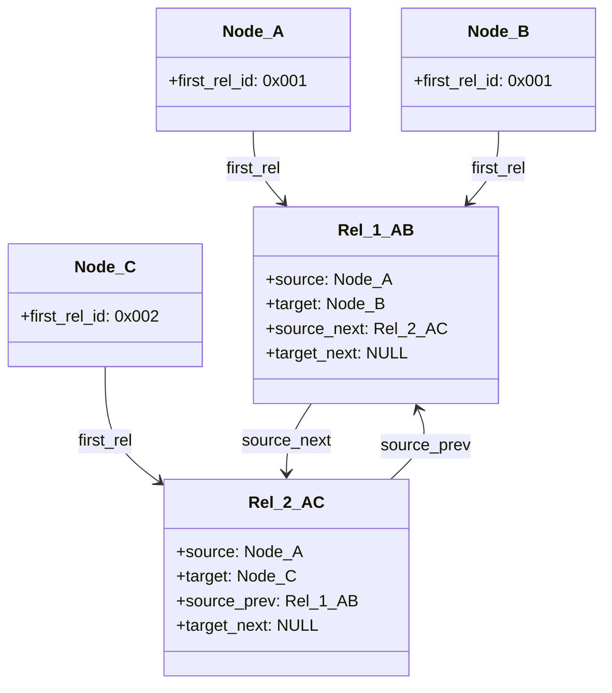

# 49: Bản chất của Graph Databases: Index-Free Adjacency

Hệ quản trị cơ sở dữ liệu quan hệ (RDBMS) đã thống trị ngành công nghiệp phần mềm trong nhiều thập kỷ, hoạt động dựa trên các tiên đề của lý thuyết tập hợp (Set Theory) và đại số quan hệ (Relational Algebra). Tuy nhiên, khi đối mặt với dữ liệu có tính liên kết siêu dày đặc, RDBMS bộc lộ những giới hạn toán học và vật lý không thể vượt qua. Bất kỳ một truy vấn liên kết dữ liệu (Join) nào trong cơ sở dữ liệu quan hệ, về bản chất, là một phép tích Đề-các (Cartesian product) được tối ưu hóa thông qua các cấu trúc dữ liệu phụ trợ. Khi thực thi các phép Join, engine cơ sở dữ liệu buộc phải định vị các khóa ngoại (Foreign Keys) thông qua thao tác tìm kiếm trên cây B+ (B+ Tree) hoặc bảng băm (Hash Table). Khi chiều sâu của truy vấn tăng lên — mô hình thường được gọi là multi-hop traversals — chi phí tính toán không tăng theo tuyến tính mà bùng nổ theo cấp số nhân, kéo theo sự suy giảm hiệu năng vĩ mô. Sự ra đời của Graph Databases đánh dấu một sự chuyển dịch hệ hình (paradigm shift) về cách cấu trúc lưu trữ tương tác với tầng cứng. Trung tâm của sự chuyển dịch này là khái niệm Index-Free Adjacency (Tính kề không cần chỉ mục), một kỹ thuật loại bỏ hoàn toàn chi phí tìm kiếm chỉ mục toàn cục để thay thế bằng các thao tác giải tham chiếu con trỏ (pointer dereferencing) cục bộ ở tốc độ của phần cứng. Tính chất Index-Free Adjacency không chỉ đơn thuần là một thuật toán phần mềm, mà là sự tái cấu trúc vi mô ở mức độ layout bộ nhớ, buộc hệ điều hành và CPU phải làm việc theo một cơ chế hoàn toàn khác biệt so với mô hình bảng truyền thống. Bài viết này sẽ mổ xẻ các chi tiết vi kiến trúc, nền tảng toán học, cơ chế quản lý con trỏ cấp thấp của hệ điều hành, và những giới hạn vật lý đằng sau bản chất thực sự của Index-Free Adjacency.

## Kiến trúc Vi Mô và Nền Tảng Lý Thuyết Của Index-Free Adjacency

Để hiểu rõ sự ưu việt của Index-Free Adjacency, chúng ta phải xuất phát từ nền tảng toán học của việc truy xuất dữ liệu. Giả sử chúng ta có hai quan hệ $R_1$ và $R_2$, phép nội kết nối (Inner Join) dựa trên một thuộc tính chung yêu cầu độ phức tạp thời gian cực tiểu phụ thuộc vào thuật toán join được sử dụng. Đối với thuật toán Sort-Merge Join hoặc Hash Join trên các tập dữ liệu cực lớn không vừa bộ nhớ, độ phức tạp thời gian tiệm cận tối thiểu là $\Omega(|R| \log |R|)$, trong đó $|R|$ là lực lượng của các tập hợp tham gia. Khi truy vấn đòi hỏi duyệt qua $k$ bước (hops), mô hình quan hệ phải thực hiện $k-1$ phép Join liên tiếp. Chi phí toàn cục được biểu diễn qua phương trình:

$$
\mathcal{C}_{relational}(k) = \sum_{i=1}^{k} \mathcal{O}(|R_i| \log |R_i|) + \mathcal{O}(|I_i| \log |I_i|)
$$

Trong đó $I_i$ đại diện cho cấu trúc cây B+ Index. Khối lượng tính toán bị chi phối bởi quy mô toàn cục của toàn bộ bảng dữ liệu, thay vì khối lượng dữ liệu thực tế liên quan trực tiếp đến truy vấn. Đây là một sự lãng phí tài nguyên ở mức vi mô. Ngược lại, Index-Free Adjacency tái định nghĩa bài toán bằng cách ánh xạ đồ thị $G = (V, E)$ trực tiếp xuống các khối vật lý của thiết bị lưu trữ. Trong mô hình này, mỗi đỉnh $v \in V$ duy trì các địa chỉ vật lý (physical memory offsets) trực tiếp trỏ đến các cạnh $e \in E$ kề với nó. Khi một engine đồ thị cần duyệt từ đỉnh $A$ sang đỉnh $B$, nó không tham chiếu đến bất kỳ một cấu trúc chỉ mục trung tâm nào. Nó đơn giản tính toán địa chỉ bộ nhớ và đọc trực tiếp dữ liệu. Độ phức tạp thời gian để duyệt qua một cạnh giảm xuống thành $\mathcal{O}(1)$ thuần túy. Chi phí cho toàn bộ truy vấn độ sâu $k$ chỉ phụ thuộc vào bậc (degree) cục bộ của các đỉnh trên đường đi, độc lập hoàn toàn với kích thước tổng thể của đồ thị $|V|$ hoặc $|E|$:

$$
\mathcal{C}_{graph}(k) = \mathcal{O}\left( \prod_{i=1}^{k} d(v_i) \right) \quad \text{với} \quad d(v_i) \ll |V|
$$

Sự dịch chuyển từ $\mathcal{O}(\log N)$ sang $\mathcal{O}(1)$ có vẻ nhỏ lẻ về mặt ký hiệu tiệm cận, nhưng trên thực tế kiến trúc máy tính, nó biểu thị sự khác biệt giữa hàng nghìn chu kỳ lệnh (instruction cycles) để so sánh các khóa trong nội bộ cây B+ và chỉ một chu kỳ lệnh duy nhất để nạp địa chỉ vào thanh ghi. Để đạt được phép màu $\mathcal{O}(1)$ này, Index-Free Adjacency bắt buộc phải từ bỏ cấu trúc bản ghi có độ dài thay đổi (variable-length records). Mọi bản ghi về đỉnh và cạnh phải được cố định hóa về mặt kích thước (fixed-size allocation) một cách cực đoan. Khi tất cả các bản ghi có chung kích thước $\Delta_{size}$, địa chỉ bộ nhớ thực tế của bản ghi thứ $ID$ có thể được tính toán ngay lập tức thông qua phép nội suy định vị tuyến tính:

$$
\text{PhysicalAddress}(v_{ID}) = \text{BaseAddress}_{mmap} + (v_{ID} \times \Delta_{node\_size})
$$

Bởi vì phép cộng và phép nhân số nguyên là các phép toán số học cấp thấp tiêu tốn ít hơn 1 chu kỳ xung nhịp CPU, hệ thống hoàn toàn loại bỏ được rào cản tính toán. Khi không có sự can thiệp của bộ định tuyến chỉ mục, mối quan hệ giữa các đỉnh được "hard-wired" trực tiếp vào cấu trúc tập tin vật lý. Sự liên kết này không chỉ giúp tối ưu hóa luồng đọc (Read I/O) mà còn biến đổi hoàn toàn cách thức hoạt động của bộ đệm CPU (CPU Caches) khi duyệt cấu trúc phức tạp, đưa dữ liệu vào vùng không gian cục bộ một cách quyết liệt nhất có thể.

```mermaid
graph TD
    subgraph Relational B-Tree Join
        A1[Start Query Node A] --> B1[Lookup Foreign Key in B-Tree Index]
        B1 --> C1[Traverse Tree Root]
        C1 --> D1[Traverse Tree Branch]
        D1 --> E1[Traverse Tree Leaf]
        E1 --> F1[Resolve Record B Address]
        F1 --> G1[Fetch Record B]
    end

    subgraph Index-Free Adjacency
        A2[Start Query Node A] --> B2[Read First Relationship Pointer ID: 0x4A2B]
        B2 --> C2[Compute Memory Offset = Base + 0x4A2B * 34]
        C2 --> D2[Directly Fetch Neighbor Node B]
    end

    style Relational B-Tree Join fill:#2d2d2d,stroke:#fff,color:#fff
    style Index-Free Adjacency fill:#1a365d,stroke:#fff,color:#fff
```



Bất chấp sự tinh gọn trong thuật toán, mô hình Index-Free Adjacency gặp phải rào cản nghiêm trọng liên quan đến độ thưa của ma trận kề đồ thị. Vì các đỉnh liên kết với nhau có thể nằm ở bất kỳ đâu trên không gian lưu trữ vật lý, việc tuần tự hóa một cấu trúc đồ thị bất kỳ (arbitrary graph serialization) vào một mảng bộ nhớ một chiều một cách tối ưu là một bài toán NP-Hard. Do đó, các engine cơ sở dữ liệu đồ thị phải chấp nhận sự phân tán vị trí ngẫu nhiên của các điểm dữ liệu. Điều này kéo theo hiện tượng truy cập bộ nhớ ngẫu nhiên (random memory accesses), đặt ra yêu cầu phải thiết kế các cấu trúc dữ liệu không gian hẹp nhất có thể nhằm duy trì khả năng đáp ứng của bộ nhớ đệm đa cấp trong bộ vi xử lý.

## Cấu Trúc Bộ Nhớ, Quản Lý Con Trỏ và Tối Ưu Hóa Tầng Cứng

Việc hiện thực hóa cơ chế Index-Free Adjacency ở cấp độ hệ điều hành đòi hỏi một sự can thiệp sâu sắc vào cơ chế ánh xạ bộ nhớ (memory mapping) và quản lý khối đệm (buffer pool). Các cơ sở dữ liệu đồ thị hàng đầu hiếm khi tự cấp phát bộ đệm truyền thống trên RAM (User-space Buffer Pool). Thay vào đó, chúng khai thác sức mạnh của hệ thống bộ đệm bộ nhớ ảo của nhân hệ điều hành (OS Page Cache) thông qua lệnh gọi hệ thống (syscall) `mmap()`. Cơ chế này ánh xạ trực tiếp các tập tin lưu trữ (chứa các chuỗi byte của bản ghi cố định) vào không gian địa chỉ ảo (Virtual Address Space) của tiến trình cơ sở dữ liệu. Khi bộ xử lý đồ thị giải tham chiếu một con trỏ ID, Bộ Quản Lý Bộ Nhớ (Memory Management Unit - MMU) tích hợp trên CPU sẽ dịch địa chỉ ảo sang địa chỉ vật lý DRAM. Nếu khối lượng dữ liệu kích thước 4KB tương ứng không nằm sẵn trong RAM, phần cứng sẽ kích hoạt một lỗi trang bộ nhớ (Major Page Fault). Lúc này, CPU sẽ ngưng thực thi luồng hiện tại, nhường quyền cho bộ điều khiển NVMe SSD nạp khối dữ liệu từ ổ cứng vật lý vào Page Cache.

Sự phụ thuộc vào cơ chế truy cập ngẫu nhiên này làm nảy sinh một nút thắt cổ chai cực kỳ nghiêm trọng trong vi kiến trúc: Hiện tượng Pointer Chasing (Truy đuổi con trỏ). Truy đuổi con trỏ là khắc tinh lớn nhất của kiến trúc CPU siêu vô hướng (Superscalar CPUs) hiện đại. CPU tối ưu hóa tốc độ nhờ vào khả năng dự đoán luồng dữ liệu (Hardware Prefetchers) và khả năng thực thi lệnh song song (Instruction-Level Parallelism). Nhưng với Index-Free Adjacency, địa chỉ của đỉnh tiếp theo phụ thuộc hoàn toàn vào giá trị con trỏ nằm ở đỉnh hiện tại. CPU không thể dự đoán được dữ liệu nào sẽ cần nạp tiếp theo cho đến khi dữ liệu trước đó được lấy về từ DRAM. Hậu quả là, CPU liên tục gặp hiện tượng trượt bộ đệm dịch ngược (Translation Lookaside Buffer Misses - TLB Misses) và trượt bộ đệm L1/L2 (Cache Misses). Để chống lại định luật vật lý này, các bản ghi cấu trúc đồ thị được nén đến mức độ vi mô, đảm bảo mỗi dòng bộ đệm (Cache Line) tiêu chuẩn kích thước 64 bytes có thể gói gọn được nhiều bản ghi nhất có thể. 

Hãy xem xét việc định nghĩa cấu trúc bộ nhớ vật lý của một cơ sở dữ liệu đồ thị bằng ngôn ngữ Rust, sử dụng thuộc tính `#[repr(C)]` nhằm triệt tiêu hoàn toàn tính năng padding tự động của trình biên dịch, bảo toàn cấu trúc căn lề byte chính xác tuyệt đối:

```rust
// Kích thước chính xác: 15 bytes. Đủ nhỏ để một Cache Line (64 bytes) chứa được 4 bản ghi Nodes.
#[repr(C, packed)]
#[derive(Debug, Clone, Copy)]
pub struct NodeRecord {
    pub in_use_flag: u8,       // 1 byte: Cờ đánh dấu bản ghi đang tồn tại hay đã xóa (Tombstone)
    pub first_rel_id: u32,     // 4 bytes: Con trỏ tới ID của mối quan hệ đầu tiên trong chuỗi
    pub first_prop_id: u32,    // 4 bytes: Con trỏ tới ID của khối thuộc tính (Property Block)
    pub label_id: u32,         // 4 bytes: Mã định danh nhãn đồ thị (ví dụ: "User", "Product")
    pub _reserved: u16,        // 2 bytes: Padding dự trữ để giữ đúng chuẩn 15 bytes
}

// Kích thước chính xác: 34 bytes. Một Cache Line chứa được gần 2 bản ghi Relationships.
#[repr(C, packed)]
#[derive(Debug, Clone, Copy)]
pub struct RelationshipRecord {
    pub in_use_flag: u8,       // 1 byte: Trạng thái tồn tại
    pub first_node: u32,       // 4 bytes: Con trỏ trỏ về Node xuất phát (Source)
    pub second_node: u32,      // 4 bytes: Con trỏ trỏ về Node đích (Target)
    pub rel_type: u32,         // 4 bytes: Loại quan hệ (ví dụ: "KNOWS", "PURCHASED")
    pub source_prev_rel: u32,  // 4 bytes: Quan hệ trước đó của Node Source trong danh sách liên kết
    pub source_next_rel: u32,  // 4 bytes: Quan hệ tiếp theo của Node Source
    pub target_prev_rel: u32,  // 4 bytes: Quan hệ trước đó của Node Target
    pub target_next_rel: u32,  // 4 bytes: Quan hệ tiếp theo của Node Target
    pub prop_id: u32,          // 4 bytes: Thuộc tính đi kèm trên quan hệ (ví dụ: "weight", "timestamp")
}
```

Nhìn vào cấu trúc `RelationshipRecord`, ta thấy một kiệt tác của kỹ thuật danh sách liên kết kép (Doubly Linked List). Mỗi cạnh không chỉ đơn thuần liên kết từ A đến B, mà nó phải đồng thời duy trì vị trí của mình trong danh sách các cạnh xuất phát từ A, và trong danh sách các cạnh hướng vào B. Sự phình to cục bộ về số lượng con trỏ (lên tới 4 con trỏ liên kết ngang - previous và next cho cả 2 đầu) là cái giá phải trả để duy trì đặc tính Index-Free Adjacency đa hướng. Bất kể chiều duyệt là đi ra (outgoing) hay đi vào (incoming), hệ thống chỉ cần đọc con trỏ kế tiếp tương ứng. Tuy nhiên, điều này đòi hỏi thao tác cập nhật (Write Operations) phải cực kỳ cẩn trọng. Việc chèn thêm một quan hệ mới yêu cầu hệ thống phải thực hiện các phép ghi bộ nhớ song song để cập nhật lại các con trỏ `prev` và `next` tại cấu trúc của Node đích và Node xuất phát. 



Sự cản trở lớn tiếp theo là kiến trúc Truy cập Bộ nhớ Không đồng nhất (Non-Uniform Memory Access - NUMA). Trong các máy chủ đa socket (multi-socket servers), RAM được phân bổ cục bộ cho từng CPU vật lý. Khi luồng xử lý trên CPU 1 duyệt qua một con trỏ đồ thị lưu tại vùng RAM quản lý bởi CPU 2, dữ liệu phải vượt qua cầu nối liên kết nội vi (QPI/UPI interconnect), cộng thêm khoảng 40 nanosecond vào độ trễ tự nhiên của DRAM. Do các đồ thị có tính chất cấu trúc phi tuyến tính, việc dữ liệu bị vương vãi trên nhiều domain NUMA là điều không thể tránh khỏi. Chính sự đan xen phức tạp này thiết lập giới hạn vật lý tuyệt đối về số lượng cạnh tối đa có thể được duyệt trên một lõi CPU mỗi giây.

## Đánh Giá Hiệu Năng, Thuật Toán Duyệt Đồ Thị và Giới Hạn Vật Lý

Hiệu suất của thuật toán duyệt đồ thị dưới mô hình Index-Free Adjacency được chi phối bởi Thời Gian Truy Cập Bộ Nhớ Kỳ Vọng (Expected Memory Access Time - EMAT). Biểu thức vật lý này cấu thành từ xác suất trượt ở các tầng bộ đệm khác nhau. Ký hiệu $h$ là tỉ lệ hit-rate, $t$ là độ trễ, phương trình trễ truy cập một node là:

$$
E[t_{access}] = h_{L1} t_{L1} + (1 - h_{L1}) \Big[ h_{L2} t_{L2} + (1 - h_{L2}) \big( h_{RAM} t_{RAM} + (1 - h_{RAM}) t_{Disk} \big) \Big]
$$

Trong một hệ thống được cấp phát đủ tài nguyên RAM để chứa toàn bộ biểu đồ ($h_{RAM} \approx 1$), sự phụ thuộc vào $t_{Disk}$ bị loại trừ. Tuy nhiên, vì cấu trúc nhảy con trỏ ngẫu nhiên, $h_{L1}$ và $h_{L2}$ thường rơi vào mức vô cùng thấp, khiến $E[t_{access}]$ tiệm cận về $t_{RAM}$, thường xấp xỉ 100 nanosecond. Điều này đồng nghĩa, tốc độ duyệt tối đa theo lý thuyết của một luồng xử lý đồng bộ (synchronous single-thread) bị mắc kẹt ở ngưỡng xấp xỉ $10^7$ edges/second. Để phá vỡ giới hạn Bức Tường Bộ Nhớ (Memory Wall) này, các kỹ sư hệ thống sử dụng thuật toán Biên Dịch Đường Ống Mềm (Software Pipelining) và Tải Trước Cưỡng Bức (Hardware Prefetching). Khi sử dụng lệnh `__builtin_prefetch` trong C/C++, hệ thống sẽ âm thầm phát lệnh I/O nạp các khối bộ nhớ của các Node ở độ sâu tiếp theo vào cache L1 trong khi CPU vẫn đang mải mê xử lý các Node hiện tại. Kỹ thuật này phát huy sức mạnh khủng khiếp đối với thuật toán Duyệt Theo Chiều Rộng (Breadth-First Search - BFS), nơi tập hợp biên (Frontier) tại lớp $k+1$ có thể được nạp trước hàng loạt.

```cpp
void traverse_bfs_vectorized(uint32_t* current_frontier, size_t frontier_size, MemoryMappedFile& rel_file) {
    RelationshipRecord* rels = static_cast<RelationshipRecord*>(rel_file.get_base_ptr());
    
    // Vòng lặp tối ưu hóa SIMD và Prefetching
    for (size_t i = 0; i < frontier_size; ++i) {
        uint32_t start_rel_id = current_frontier[i];
        
        // Cưỡng chế nạp trước dòng cache của Node tiếp theo vào L1 Cache, giảm thiểu độ trễ DRAM
        if (i + 4 < frontier_size) {
            __builtin_prefetch(&rels[current_frontier[i + 4]], 0, 1);
        }

        uint32_t current_rel_id = start_rel_id;
        while (current_rel_id != NULL_REL_ID) {
            RelationshipRecord& rel = rels[current_rel_id];
            process_node(rel.target_node);
            current_rel_id = rel.source_next_rel;
        }
    }
}
```

Bên cạnh đó, trong các thuật toán phức tạp như tìm đường đi ngắn nhất Dijkstra hay phân tích PageRank, yêu cầu cấp thiết là phải duy trì trạng thái "đã truy cập" (visited state) để ngăn chặn vòng lặp vô tận do đồ thị có chu trình (cyclic graphs). Nếu sử dụng Hash Set tiêu chuẩn, chi phí băm (hashing) sẽ hủy diệt hoàn toàn lợi ích của truy cập bộ nhớ trực tiếp, đồng thời phá vỡ tính cục bộ (spatial locality) của L1 Cache. Thay vào đó, thuật toán đồ thị cấp thấp sử dụng mảng Bitmaps cục bộ, cụ thể là Roaring Bitmaps. Để kiểm tra xem Node có ID là $k$ đã được viếng thăm hay chưa, engine chỉ cần dịch bit (bitwise operations): kiểm tra bit thứ $(k \pmod 8)$ tại địa chỉ byte $k / 8$. Phép toán bit này diễn ra trong duy nhất 1 chu kỳ máy và không tạo ra bất kỳ luồng rẽ nhánh ngẫu nhiên nào.

Tuyệt đỉnh về mặt lý thuyết là vậy, Index-Free Adjacency đối mặt với giới hạn khốc liệt khi chuyển đổi sang kiến trúc cơ sở dữ liệu phân tán (Distributed Graph Architectures). Đặc điểm "con trỏ bộ nhớ vật lý" hàm ý rằng mối quan hệ phải tham chiếu đến một vùng nhớ cục bộ. Khi đồ thị vượt quá dung lượng của một máy chủ vật lý, nó phải bị phân mảnh (Sharding). Một mối quan hệ lúc này có thể kết nối từ một đỉnh tại máy chủ A sang một đỉnh tại máy chủ B. Sự kỳ diệu của phép toán $\mathcal{O}(1)$ nanosecond sụp đổ hoàn toàn trước độ trễ của giao thức mạng RPC (Remote Procedure Call) thường tính bằng mili-giây (hàng triệu nanosecond). Để giải quyết tình trạng này, kiến trúc đồ thị phân tán triển khai cơ chế Đỉnh Bóng Ma (Ghost Nodes / Proxy Vertices). Khi một kết nối xuyên máy chủ hình thành, máy chủ nguồn sẽ tạo ra một bản sao vỏ bọc của đỉnh đích. Việc duyệt cục bộ dựa trên Index-Free Adjacency chạm vào bản sao proxy này, từ đó kích hoạt luồng xử lý bất đồng bộ qua mạng. Sự tối ưu hóa lúc này chuyển sang một bài toán toán học khác: thuật toán cắt đồ thị (Graph Partitioning / Minimum Weight k-Cut Problem), với mục tiêu giảm thiểu tối đa tỉ lệ phân cắt cạnh (Edge-Cut Ratio) giữa các Node mạng.

Cuối cùng, một điểm yếu cốt tử của hệ thống bản ghi kích thước cố định là sự cồng kềnh trong việc lưu trữ các thuộc tính (Properties) có độ dài thay đổi (như chuỗi văn bản lớn hoặc mảng dữ liệu đa chiều). Dữ liệu này không thể được nhúng thẳng vào khối bản ghi 15 byte. Do đó, hệ thống buộc phải lưu các thuộc tính này ở một tệp tin Property riêng lẻ, và duy trì một con trỏ cấu trúc từ Node sang Property Block. Khi truy vấn đòi hỏi sàng lọc thuộc tính (ví dụ: tìm tất cả các Node có `age > 30` trước khi tiến hành duyệt đồ thị), việc đuổi theo con trỏ thuộc tính trên hàng triệu Node thông qua Index-Free Adjacency sẽ trở thành một thảm họa Cache Miss. Vì lý do này, các hệ quản trị đồ thị thương mại thực tế sử dụng kiến trúc phân giải lai (Hybrid Query Execution Engine). Chúng sử dụng B-Tree Index hoặc Lucene Inverted Index cho giai đoạn lọc thuộc tính toàn cục (Global Indexing Phase), rồi mới chuyển quyền điều khiển sang Index-Free Adjacency cho giai đoạn duyệt mô hình tô-pô (Topological Traversal Phase). Trình tối ưu hóa truy vấn (Query Optimizer) có nhiệm vụ sử dụng biểu đồ phân phối thống kê (Statistical Histograms) để quyết định giới hạn can thiệp của từng cơ chế.

## SEO Phân Tích Thực Chiến Chuyên Sâu
*   **Tiêu đề SEO:** Bản chất Graph Databases: Giải phẫu vi kiến trúc Index-Free Adjacency
*   **Meta Description:** Bài viết kỹ thuật chuyên sâu mổ xẻ nền tảng toán học, cơ chế vi kiến trúc CPU, hiện tượng TLB Misses và giới hạn vật lý của Index-Free Adjacency trong cơ sở dữ liệu đồ thị, so sánh đối chiếu $\mathcal{O}(N \log N)$ của hệ quản trị dữ liệu quan hệ RDBMS.
*   **Keywords:** Graph Database, Index-Free Adjacency, Neo4j Architecture, Memory Mapping, Pointer Chasing, TLB Misses, NUMA Optimization, Thuật toán đồ thị, O(1) Time Complexity, B+ Tree Comparison.
*   **Phân khúc độc giả:** Staff Engineers, Data Architects, Hệ thống Cấp thấp (Low-level Systems Programmers).
*   **Thẻ định tuyến (URL Slug):** `graph-databases-index-free-adjacency-microarchitecture`
