# Whitepaper Kỹ Thuật Tập 49: Bản Chất Của Graph Databases và Sự Vi Diệu Của Index-Free Adjacency (Tính Kề Không Cần Chỉ Mục)

## Tóm Tắt Điều Hành (Executive Summary)
Bài viết này phân tích giới hạn của hệ quản trị cơ sở dữ liệu quan hệ (RDBMS) khi xử lý dữ liệu có tính liên kết dày đặc, và giải thích vì sao index-free adjacency lại là trái tim của các graph database hiện đại như Neo4j. Chúng ta sẽ đi qua bài toán cốt lõi của truy vấn đa bước (multi-hop traversal), lý do độ phức tạp giảm xuống còn $\mathcal{O}(1)$, và những hệ quả ở tầng vi kiến trúc phần cứng — OS page cache, pointer chasing, TLB miss — khi mô hình này buộc CPU và RAM hoạt động theo một cách hoàn toàn khác so với bảng phẳng truyền thống.

---

## Mở Đầu: Vì Sao Mô Hình Quan Hệ Bắt Đầu Bộc Lộ Giới Hạn
RDBMS đã thống trị ngành phần mềm suốt năm thập kỷ, dựa trên nền tảng toán học vững chắc của lý thuyết tập hợp và đại số quan hệ. Mọi thứ được chuẩn hóa vào các bảng hai chiều gồm hàng và cột — một mô hình gọn gàng, dễ suy luận.

Nhưng dữ liệu thực tế hiếm khi là những bảng tính rời rạc; phần lớn nó là một mạng lưới. Mạng xã hội, hệ thống khuyến nghị, định tuyến bản đồ, lưới điện thông minh, sinh học phân tử — tất cả đều mang tính liên kết dày đặc. Khi ép loại dữ liệu này vào RDBMS, ta đang bắt phần mềm làm ngược lại bản chất tự nhiên của dữ liệu, và chính điều đó phơi bày những giới hạn vật lý lẫn toán học của mô hình quan hệ — mở đường cho graph database.

Vậy graph database thực sự vận hành thế nào ở mức vi mạch? Không chỉ là vẽ vài vòng tròn và mũi tên lên giao diện. Cốt lõi của nó nằm ở một kiến trúc bộ nhớ khá cực đoan, gọi là **Index-Free Adjacency** (IFA).

---

## Bài Toán Cốt Lõi: Chi Phí Bùng Nổ Của Phép Join

### Tích Đề-các và Cấu Trúc B-Tree
Bất kỳ phép join nào trong RDBMS — Inner, Outer, Left — về bản chất đều là một biến thể của tích Đề-các (Cartesian product).
Để tránh phải quét toàn bảng với độ phức tạp $\mathcal{O}(N \times M)$, RDBMS dựa vào các cấu trúc phụ trợ toàn cục như B+ Tree hoặc hash table để định vị khóa ngoại.

Với B-Tree index lookup, để tìm một bản ghi ở bảng A liên kết với bảng B, engine phải:
1. Đọc root node của cây B-Tree.
2. Duyệt qua các branch node.
3. Đi tới leaf node để lấy địa chỉ vật lý.
4. Đọc bản ghi vật lý từ đĩa.

Mỗi bước đi xuống cây này có độ phức tạp tối thiểu $\mathcal{O}(\log |R|)$, với $|R|$ là tổng số hàng của bảng.

### Nghịch Lý Multi-hop Traversal
Khi một truy vấn mạng xã hội hỏi: "tìm bạn của bạn của bạn tôi (3 hop) đang sống ở Tokyo", RDBMS phải thực hiện self-join ba lần liên tiếp trên một bảng User khổng lồ.

Chi phí toàn cục được biểu diễn:
$$ \mathcal{C}_{relational}(k) = \sum_{i=1}^{k} \mathcal{O}(|R_i| \log |R_i|) + \mathcal{O}(|I_i| \log |I_i|) $$

Điểm bất hợp lý là: khối lượng tính toán bị chi phối bởi quy mô toàn mạng lưới (hàng tỷ user), chứ không phải bởi số bạn bè thực tế của bạn (chỉ vài trăm). Ở độ sâu 4-5 hop, số phép tính $\log |R|$ bùng nổ theo cấp số nhân — CPU bị chôn vùi trong việc dò index, thời gian phản hồi trượt từ mili-giây sang hàng phút, đôi khi hết cả bộ nhớ.

---

## Giải Pháp: Index-Free Adjacency (IFA)

Sự ra đời của graph database như Neo4j không phải là một bản vá phần mềm — đó là một cách tái cấu trúc bộ nhớ ở tầng layout. Nguyên lý index-free adjacency loại bỏ hoàn toàn cấu trúc index trung tâm khi duyệt liên kết.

### Từ Tìm Kiếm Toàn Cục Sang Duyệt Cục Bộ
Trong kiến trúc IFA, đồ thị $G = (V, E)$ được ánh xạ trực tiếp xuống các khối vật lý của thiết bị lưu trữ theo nguyên lý con trỏ.
Mỗi đỉnh (node) mang bên trong nó một mảng địa chỉ vật lý trỏ thẳng đến các cạnh (relationship) kề nó, và ngược lại.

Khi engine đồ thị cần đi từ đỉnh A sang đỉnh B, nó không tham chiếu tới bất kỳ B-Tree nào cả. Nó chỉ đơn giản đọc con trỏ từ A, nạp địa chỉ đó vào thanh ghi CPU, và đọc B ngay lập tức.

### Phép Màu O(1)
Việc chuyển từ $\mathcal{O}(\log N)$ của RDBMS sang $\mathcal{O}(1)$ của IFA thay đổi hẳn giới hạn xử lý. Chi phí cho một truy vấn độ sâu $k$ giờ chỉ còn phụ thuộc vào bậc (degree) cục bộ của các đỉnh trên đường đi:
$$ \mathcal{C}_{graph}(k) = \mathcal{O}\left( \prod_{i=1}^{k} d(v_i) \right) \quad \text{với} \quad d(v_i) \ll |V| $$
Dù database có 10 triệu hay 10 tỷ người dùng, thời gian tìm bạn của bạn vẫn gần như không đổi.

```mermaid
graph TD
    subgraph "Mô Hình Relational B-Tree Join (The Old Way)"
        A1[Start Node A] --> B1[Lookup Foreign Key in B-Tree]
        B1 --> C1[Traverse Index Root]
        C1 --> D1[Traverse Index Branch]
        D1 --> E1[Traverse Index Leaf]
        E1 --> F1[Resolve Record B Address]
        F1 --> G1[Fetch Target Record B]
    end

    subgraph "Mô Hình Index-Free Adjacency (The Graph Way)"
        A2[Start Node A] --> B2[Read Local Pointer ID: 0x4A2B]
        B2 --> C2[Compute Offset = Base + 0x4A2B * 34 bytes]
        C2 --> D2[Directly Fetch Target Record B]
    end

    style A1 fill:#2d2d2d,stroke:#fff,color:#fff
    style A2 fill:#1a365d,stroke:#fff,color:#fff
```



---

## Tối Ưu Hóa Tầng Cứng Và Layout Bộ Nhớ

Để đạt O(1) một cách thuần túy, hệ thống quản lý bộ nhớ phải được thiết kế khá cực đoan.

### Cố Định Kích Thước Bản Ghi
Hệ thống buộc phải từ bỏ bản ghi có độ dài thay đổi (kiểu JSON hay VARCHAR trong SQL). Mọi node và relationship phải có kích thước tĩnh. Khi mọi node dùng chung một dung lượng $\Delta_{size}$, địa chỉ bộ nhớ của node thứ `ID` được tính trực tiếp bằng một phép nội suy tuyến tính, chạy ở tốc độ vi xử lý:
$$ \text{PhysicalAddress}(v_{ID}) = \text{BaseAddress}_{mmap} + (v_{ID} \times \Delta_{size}) $$
Phép nhân-cộng này tốn chưa tới 1-2 chu kỳ xung nhịp CPU.

### Thiết Kế Layout Bộ Nhớ (Ví Dụ Bằng Rust)
Xem cấu trúc thực tế lưu một relationship trong bộ nhớ vật lý — dùng doubly linked list phức hợp, với `#[repr(C, packed)]` để loại bỏ padding do trình biên dịch tự thêm:

```rust
// Kích thước tĩnh 34 bytes: Cực kỳ tối ưu, vừa khít trong Cache Line (64 bytes) của L1/L2.
#[repr(C, packed)]
#[derive(Debug, Clone, Copy)]
pub struct RelationshipRecord {
    pub in_use_flag: u8,       // 1 byte: Tombstone flag
    pub source_node: u32,      // 4 bytes: ID của Node xuất phát
    pub target_node: u32,      // 4 bytes: ID của Node đích
    pub rel_type: u32,         // 4 bytes: Loại quan hệ ("FOLLOWS")
    pub source_prev_rel: u32,  // 4 bytes: Con trỏ quan hệ trước trong mảng của Node A
    pub source_next_rel: u32,  // 4 bytes: Con trỏ quan hệ tiếp trong mảng của Node A
    pub target_prev_rel: u32,  // 4 bytes: Con trỏ quan hệ trước trong mảng của Node B
    pub target_next_rel: u32,  // 4 bytes: Con trỏ quan hệ tiếp trong mảng của Node B
    pub prop_id: u32,          // 4 bytes: Con trỏ trỏ tới khối dữ liệu Property
}
```
Mỗi cạnh mang 4 con trỏ chỉ để phục vụ việc duyệt ngang. Đây là một sự đánh đổi rõ ràng: chấp nhận phình bộ nhớ để lưu con trỏ, đổi lại tốc độ giải tham chiếu nhanh hơn hẳn.

### Mmap() và OS Page Cache
Thay vì tự xây buffer pool cồng kềnh, graph DBMS thường dùng thẳng `mmap()` của Linux để ánh xạ tệp đồ thị vào virtual memory. Khi CPU giải tham chiếu một pointer ID, MMU tự chuyển địa chỉ ảo sang vật lý. Nếu trang 4KB cần đọc không có sẵn trong RAM, một "major page fault" được kích hoạt và ổ NVMe được huy động để nạp dữ liệu.

---

## Giới Hạn Vật Lý Và Cách Phá Vỡ Bức Tường Bộ Nhớ

Dù có độ phức tạp O(1), index-free adjacency vẫn phải đối mặt với những giới hạn vật lý khá khắc nghiệt trong thiết kế CPU hiện đại.

### Pointer Chasing và Cache Miss
Với thuật toán đồ thị, vị trí của node tiếp theo phụ thuộc hoàn toàn vào giá trị con trỏ nằm ở node hiện tại. CPU không thể đoán trước dữ liệu nào sẽ được tải tiếp — branch predictor gần như vô dụng trong tình huống này.
Kết quả: CPU liên tục trượt TLB và trượt L1/L2 cache. Tốc độ lý thuyết hàng tỷ bản ghi/giây của RAM DDR5 rơi xuống thực tế chỉ còn vài chục triệu cạnh/giây. Thời gian truy cập kỳ vọng (EMAT) bị kẹt ở mức ~100ns của DRAM thay vì ~1ns của L1 cache.

### Giải Pháp: Software Pipelining và Hardware Prefetching
Để phá vỡ bức tường bộ nhớ này, các engine hiện đại dùng hardware prefetching. Khi thuật toán BFS đang xử lý node thứ `i`, mã nguồn chủ động yêu cầu CPU nạp trước node thứ `i + 4` từ RAM vào L1 cache bằng `__builtin_prefetch()`.

```cpp
void traverse_bfs_prefetch(uint32_t* frontier, size_t size, RelationshipRecord* rels) {
    for (size_t i = 0; i < size; ++i) {
        // Cưỡng chế nạp trước dòng cache của con trỏ tương lai, ẩn đi 100ns độ trễ DRAM
        if (i + 4 < size) {
            __builtin_prefetch(&rels[frontier[i + 4]], 0, 1);
        }
        
        uint32_t current_rel = frontier[i];
        while (current_rel != NULL_REL) {
            RelationshipRecord& rel = rels[current_rel];
            process_node(rel.target_node);
            current_rel = rel.source_next_rel;
        }
    }
}
```

---

## Bài Học Về Triết Lý Thiết Kế Hệ Thống Phân Tán

Từ những gì đã mổ xẻ ở trên, có vài bài học đáng giữ lại khi thiết kế kiến trúc xử lý dữ liệu.

1. **Mọi thứ đều có giá của nó:** IFA cho tốc độ đọc/duyệt cực nhanh, nhưng đổi lại ghi (write/update) trở nên đắt đỏ hơn. Chèn một cạnh nghĩa là phải ghi 4 con trỏ ở nhiều vị trí bộ nhớ ngẫu nhiên khác nhau. Vì bản ghi có kích thước cố định, các thuộc tính chuỗi dài phải được đẩy ra một vùng lưu trữ property riêng, gây thêm độ trễ khi cần lọc theo văn bản.
2. **Kiến trúc lai gần như là bắt buộc:** không hệ thống thực tế nào sống được chỉ dựa vào IFA thuần túy. Các graph database thương mại luôn kết hợp: dùng B-Tree index hoặc inverted index để định vị node bắt đầu, rồi mới chuyển sang IFA để trườn theo mạng lưới kết nối.
3. **Bài toán phân tán đồ thị:** index-free adjacency phát huy tối đa khi toàn bộ dữ liệu nằm gọn trong một máy chủ. Nhưng khi đồ thị lớn tới hàng chục terabyte và buộc phải sharding qua nhiều máy, con trỏ cục bộ bị gãy. Giải pháp thường là tạo "ghost node" để định tuyến RPC qua mạng — lúc đó phép toán O(1) nanosecond sụp đổ trước độ trễ mạng cỡ mili-giây. Bài học rút ra: dữ liệu đồ thị mang tính cục bộ rất cao, và thuật toán graph partitioning để giảm edge-cut ratio quan trọng hơn bất kỳ thủ thuật phần cứng nào.

---

## Kết Luận
Index-free adjacency không đơn thuần là một kỹ thuật phần mềm — nó là cách tiếp cận bộ nhớ gần như đối thoại trực tiếp với phần cứng. Nó cho thấy khi cấu trúc dữ liệu được thiết kế mô phỏng đúng bản chất của thông tin (các mạng lưới liên kết), và được tinh chỉnh đến từng byte để tận dụng hệ thống cache của CPU, ta có thể đạt được những bước nhảy hiệu năng mà bảng phẳng truyền thống không bao giờ theo kịp.

Nhưng nó cũng minh chứng rõ cho một quy luật khó tránh: tối ưu cho việc duyệt topology sẽ phải hy sinh phần nào hiệu năng ghi ngẫu nhiên và khả năng mở rộng theo chiều ngang. Hiểu rõ ranh giới này chính là điều phân biệt một kỹ sư kiến trúc dữ liệu có kinh nghiệm với người chỉ biết chọn công nghệ theo trào lưu.
