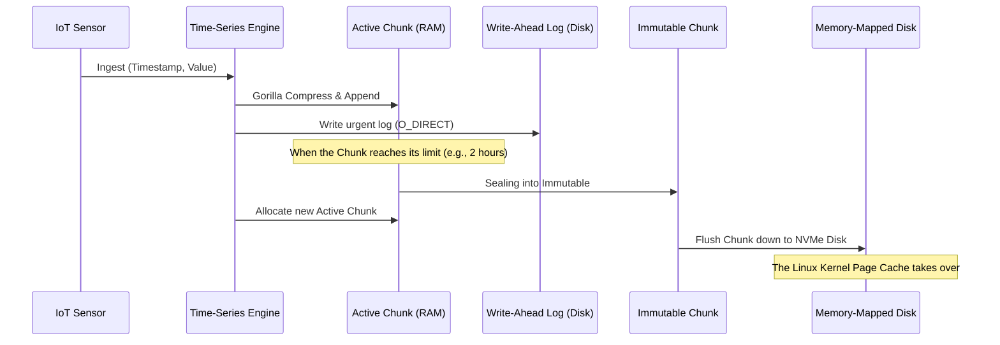

# Technical Whitepaper #50: Time-Series Databases (TSDB) - Dissecting the Gorilla Compression Algorithm and Memory Chunking Architecture

## Executive Summary
This piece takes a close look at how leading time-series databases — Prometheus, InfluxDB, and the Gorilla system that started it all — handle the flood of data coming out of IoT and microservices deployments. We'll work through the math behind Gorilla compression (delta-of-delta encoding and IEEE-754 XOR tricks), the chunking strategy that manages memory at the OS level, and how the two together get you a roughly 64:1 compression ratio using only a handful of CPU cycles per point. Along the way there are some design lessons worth carrying into any real-time distributed system.

---

## Introduction: Why Time-Series Data Behaves So Differently
In the cloud and IoT era, machines never really stop talking. Billions of sensors, servers, and containers keep streaming out telemetry, and all of that falls under the umbrella of time-series data.

Unlike a typical RDBMS or NoSQL table, a time-series database (TSDB) has a few distinctive — and demanding — physical characteristics:
1. **Extreme write throughput.** Millions of writes per second isn't unusual.
2. **Strictly increasing timestamps.** Data always arrives in time order; there's essentially no UPDATE, only APPEND.
3. **A dead-simple record shape.** Usually just a timestamp (64-bit int) and a metric value (64-bit float), plus a handful of tags for identification.

That monotony turns out to be both a massive storage problem and a genuine opportunity — it's exactly the kind of regularity that lets engineers do some very targeted microarchitectural optimization.

---

## The Core Problem: The IoT Data Tsunami

### Bandwidth, Disk I/O, and Why RDBMS Falls Over
Picture a datacenter monitoring setup watching 100,000 servers, each emitting 100 metrics a second.
That's $100,000 \times 100 = 10,000,000$ data points per second.
Each point is 16 bytes (8-byte timestamp plus 8-byte float value).
Raw ingestion rate: roughly $160 \text{ MB/second} \approx 13.8 \text{ TB/day}$.

Push that volume into PostgreSQL or MySQL via plain `INSERT` statements and the B-Tree index collapses under lock contention almost immediately. Even with something like Cassandra, buying enough NVMe storage for 13.8TB a day over a year of retention — roughly 5 petabytes — is a budget-breaking proposition.

### Why Dictionary Compression Doesn't Help
The obvious instinct is to reach for compression. But standard tools like LZ77, Snappy, Gzip, and Zstandard are all dictionary-based — they hunt for repeating byte sequences. The problem is that timestamps are strictly increasing numbers that never repeat, and floating-point values keep churning bits in their fractional part. Snappy or Zstd basically do nothing useful here, burning CPU cycles for barely any size reduction.

What's actually needed is a compression algorithm with no dictionary, no branching, tuned specifically for sequences of integers and floats. That's exactly what the Gorilla algorithm — introduced by Facebook (now Meta) in 2015 — was built to do.

---

## The Algorithmic Solution: Gorilla Compression

Gorilla splits the problem into two streams: compressing timestamps and compressing metric values. The insight underlying both is that while absolute values keep changing, **the difference between consecutive values is remarkably stable.**

### Timestamp Compression via Delta-of-Delta
Metric collection typically runs on a fixed interval — say every 10 seconds. Instead of storing 64 bits per timestamp:
$T = [1000, 1010, 1020, 1030]$
we compute the first-order delta ($D_n = T_n - T_{n-1}$):
$D = [10, 10, 10]$
Network jitter means the real delta sequence might look more like:
$D = [10, 12, 9, 11]$
so the algorithm goes one level further and computes the delta-of-delta:
$D^{(2)} = [2, -3, 2]$

Here's the payoff: in a stable system, roughly 96% of delta-of-delta values are exactly zero. Gorilla uses variable-length encoding (in the spirit of Huffman coding) to exploit this:
- DoD = 0: write a single bit, `0`. That's 64 bits compressed down to 1.
- DoD in [-63, 64]: write `10` plus 7 data bits (9 bits total).
- DoD in [-255, 256]: write `110` plus 9 data bits (12 bits total).
- And so on for wider ranges.

### Metric Compression via IEEE 754 XOR
A 64-bit float is normally a nightmare to compress — 1 sign bit, 11 exponent bits, 52 mantissa bits, and a tiny change (2.0 to 2.01) scrambles the whole bit pattern. But Gorilla noticed something useful: a sensor reading (say, a 37.5°C temperature) rarely jumps drastically between samples. At the bit level, adjacent values tend to share the same sign, the same exponent, and a large chunk of the leading mantissa bits.

Instead of subtracting, Gorilla XORs two adjacent values directly:
$$X_n = V_n \oplus V_{n-1}$$
The result is a 64-bit value with a run of leading zeros (LZ), a run of trailing zeros (TZ), and a small "meaningful bits" block in between.
1. If $X_n = 0$ (value unchanged): write just 1 bit, `0`.
2. If $X_n \neq 0$: compare the LZ/TZ counts against the previous value. If the meaningful-bits block fits inside the previous block's range, write control bits `10` and record only the differing bits, reusing the earlier LZ/TZ structure.
3. If the structure changed: write `11`, then 5 bits for the new LZ length, 6 bits for the length of the differing block, then the block itself.

### Why It's Fast on Real Hardware
Counting leading zeros doesn't require an expensive loop — compilers for C++, Rust, and Go map this directly onto the x86_64 CPU's native `LZCNT` and `TZCNT` instructions, which complete in a single clock cycle. Branching stays minimal, so the CPU's branch predictor never gets confused.

---

## System Microarchitecture: Memory Paging and Chunking

Compressed data ends up as one continuous bit-stream. But if a query only needs yesterday's data, you can't decompress sequentially starting from January 1st. That's what chunking architecture is for.

### What Chunking Actually Means
The endless time series gets sliced into chunks, typically defined either by a time window (say, 2 hours) or a byte budget (say, 4KB). At any given moment, each individual time series has exactly one active chunk — resident in RAM, receiving new points in append-only fashion.

### The CPU Trade-off: False Sharing vs. TLB Misses
Make chunks too small (under 4KB) and a single 4KB memory page ends up holding chunks from many unrelated series. When different CPU cores update series that happen to be adjacent on the same page, you get false sharing — the CPU's MESI protocol keeps broadcasting cache-invalidation messages between cores, and throughput collapses.

Make chunks too large (say, 20MB) and RAM fragments badly. The TLB gets overwhelmed tracking too many physical addresses, causing constant TLB misses.
The usual fix is to pool chunks into large memory arenas backed by huge pages (2MB), managed through an allocator like jemalloc, keeping the cache-hit ratio consistently high.

### The Lifecycle of a Data Block

---

## Working With the OS: Page Cache and Mmap()

Once an active chunk is sealed into an immutable chunk, the TSDB hands off a lot of the hard work to the Linux kernel.

### Blurring the Line Between RAM and SSD
The TSDB flushes an immutable chunk down to NVMe as raw block storage. Rather than manage file reads itself — which would mean `read()` calls and constant kernel/user-space context switches — it uses `mmap()`, which maps SSD blocks directly into the process's virtual address space.
- When a user queries last month's chart, the TSDB just dereferences a memory pointer.
- The MMU notices the data isn't resident in RAM and raises a page fault.
- The kernel goes to NVMe, pulls the 4KB block into RAM, and often prefetches the following blocks into L3 cache based on read-ahead heuristics.

### Zero-Copy Deserialization
Because the on-disk chunk format is byte-for-byte identical to the in-RAM Gorilla bit-stream, the TSDB does zero work deserializing anything. The CPU reads the compressed bits straight out of RAM (freshly pulled off disk via mmap), runs them through the XOR/LZCNT logic, and renders the chart immediately.

---

## Lessons on Distributed Systems Design

A few things stand out from digging into how Gorilla and chunking work together.

1. **Understanding your data domain beats generic tooling.** There's no universal compression algorithm. Zstandard is great for text but loses badly against numerical time-series data. Gorilla shows that once you understand the physical and statistical nature of your data — the monotonicity of time, the correlation between consecutive sensor readings — a genuinely simple algorithm (delta-of-delta, XOR) can outperform every general-purpose information-theory approach.
2. **Immutability is what makes scaling tractable.** Building around immutable chunks removes the need for locking, sidesteps deadlocks entirely, and lets the system lean fully on the OS page cache. A sealed chunk never becomes a dirty page, which means the kernel can evict it from RAM whenever memory pressure demands it.
3. **Hardware and software have to co-evolve.** Designing a database like this isn't just about writing correct logic — it means thinking in terms of cache lines (64 bytes), L1/L2 hit and miss rates, TLB behavior, SIMD, and hardware instructions like LZCNT. Writing good code isn't enough on its own; the code also has to respect the physical realities of the silicon it runs on.

---

## Conclusion
Building a high-performance time-series database comes down to balancing network bandwidth, finite CPU budgets, and physical storage limits. Gorilla compression paired with chunking architecture brings together minimalist Boolean math, a real understanding of CPU microarchitecture, and OS-level paging tricks — and together they set the standard for observability databases today. Understanding how this all fits together is a solid foundation for anyone building the data infrastructure behind modern IoT fleets and Web-scale monitoring systems.
