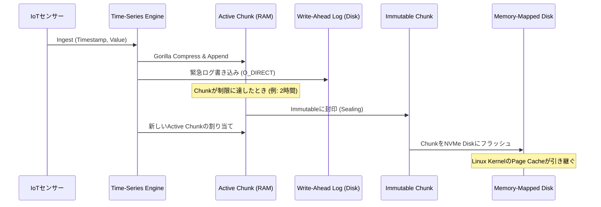

# テクニカルホワイトペーパー 第50回：Time-Series Databases (TSDB) - Gorilla圧縮アルゴリズムとChunking Memoryアーキテクチャの解剖

## エグゼクティブサマリー (Executive Summary)
Prometheus、InfluxDB、そして原型となったGorillaシステム——これら主要な時系列データベース(TSDB)が、IoTやマイクロサービスから押し寄せる膨大なデータをどう捌いているのかを見ていきます。中心となるのはGorilla圧縮アルゴリズムの数学的な仕組み(Delta-of-DeltaとIEEE-754のXOR演算)と、OSカーネルレベルで働くChunkingというメモリ管理戦略です。この二つが組み合わさることで、わずか数CPUクロックサイクルで64:1程度の圧縮率が実現します。リアルタイム分散システムを設計する上で応用できる教訓も一緒に整理します。

---

## はじめに：時系列データはなぜこれほど特殊なのか
クラウドとIoTの時代、機械は文字通り話し続けています。数十億のセンサー、サーバー、コンテナが絶え間なくテレメトリデータを吐き出し続けており、これらはまとめて時系列データ(Time-Series Data)と呼ばれます。

一般的なRDBMSやNoSQLのテーブルとは違い、TSDBにはいくつか際立った——そしてかなり厳しい——物理的特性があります。
1. **極端な書き込み負荷:** 毎秒数百万件の書き込みも珍しくありません。
2. **時間に対する単調増加性:** データは常に時間順に到着し、UPDATEはほぼ存在せず、ほぼすべてがAPPENDです。
3. **驚くほどシンプルなレコード構造:** 基本はタイムスタンプ(64ビット整数)とメトリック値(64ビット浮動小数点数)、それにいくつかの識別用タグだけです。

この単調さこそが、ストレージにとっては巨大な課題であると同時に、エンジニアがマイクロアーキテクチャレベルで思い切った最適化を仕掛けられる絶好のチャンスでもあります。

---

## コアとなる問題：IoTデータの津波

### 帯域幅、ディスクI/O、そしてRDBMSが崩れる理由
10万台のサーバーを監視するデータセンターを想像してください。各サーバーは毎秒100個のメトリクスを発信します。
合計すると $100,000 \times 100 = 10,000,000$ データポイント/秒。
1データポイントは16バイト(8バイトのタイムスタンプ+8バイトの浮動小数点値)。
生の取り込みレートはおよそ $160 \text{ MB/秒} \approx 13.8 \text{ TB/日}$になります。

このボリュームを素直に`INSERT`文でPostgreSQLやMySQLに流し込めば、B-Treeインデックスはロック競合であっという間に崩壊します。Cassandraのようなシステムを使ったとしても、1年分の保持期間で13.8TB/日、つまり約5ペタバイト分のNVMeストレージを買い揃えるコストは、どう考えても現実的ではありません。

### 辞書ベースの圧縮アルゴリズムが役に立たない理由
このプレッシャーに対して、エンジニアがまず思いつくのは圧縮です。しかしLZ77、Snappy、Gzip、Zstandardといった業界標準のアルゴリズムはすべて辞書検索方式で、繰り返されるバイト列を探すことを前提にしています。ところがタイムスタンプは単調増加する数値で決して繰り返さず、浮動小数点の値も小数部のビットが常に変化し続けます。SnappyやZstdはここではほとんど無力で、CPUを大量に消費するわりに圧縮率はさほど上がりません。

必要なのは、辞書を使わず、分岐もなく、CPUのマイクロコードレベルで直接動き、整数と浮動小数点数の列に特化して最適化されたアルゴリズムです。2015年にFacebook(現Meta)が発表したGorillaアルゴリズムは、まさにこの問題への答えとして生まれました。

---

## アルゴリズムによる解決策：Gorilla圧縮

Gorillaは問題をタイムスタンプの圧縮とメトリック値の圧縮という2つのストリームに分けて扱います。両方に共通する着眼点は、絶対値は常に変化し続けるものの、**隣り合う値同士の差(Delta)は驚くほど安定している**という点です。

### Delta-of-Deltaによるタイムスタンプ圧縮
メトリック収集は通常、10秒ごとといった固定周期で動きます。各タイムスタンプに64ビットをそのまま保存する代わりに、
$T = [1000, 1010, 1020, 1030]$
という並びから1次差分($D_n = T_n - T_{n-1}$)を計算します。
$D = [10, 10, 10]$
ネットワークのジッタがあると実際にはこうなることもあります。
$D = [10, 12, 9, 11]$
そこでさらに2次差分(Delta-of-Delta)を計算します。
$D^{(2)} = [2, -3, 2]$

ここがポイントです。安定したシステムでは、Delta-of-Deltaの値の約96%がちょうどゼロになります。Gorillaはこれを利用して可変長エンコーディング(発想としてはハフマン符号化に近い)を行います。
- DoD = 0の場合:ビット`0`を1つだけ書き込む。64ビットが1ビットに圧縮されます。
- DoDが[-63, 64]の範囲:`10`+7ビットのデータ(合計9ビット)。
- DoDが[-255, 256]の範囲:`110`+9ビットのデータ(合計12ビット)。
- それ以上の範囲についても同様に続きます。

### IEEE 754のXORによるメトリック圧縮
64ビット浮動小数点数は普通、圧縮にとって厄介な存在です。符号1ビット、指数部11ビット、仮数部52ビットで構成され、2.0から2.01への微小な変化でもビットパターンは丸ごと変わってしまいます。しかしGorillaはあることに気づきました。センサーの温度読み取り値(例えば37.5℃)は、サンプル間で急激に跳ねることはめったにありません。ビットレベルで見ると、隣接する値は符号、指数部、そして仮数部の上位ビットの多くを共有していることが多いのです。

そこでGorillaは減算ではなく、隣接する2つの値を直接XORします。
$$X_n = V_n \oplus V_{n-1}$$
結果は、先頭に連続したゼロ(Leading Zeros)、末尾に連続したゼロ(Trailing Zeros)、その間に小さな「意味のあるビット」のブロックを持つ64ビット値になります。
1. $X_n = 0$(値が変わっていない)場合:1ビットの`0`だけを記録。
2. $X_n \neq 0$の場合:LZ/TZのカウントを前の値と比較し、意味のあるビットのブロックが前回の範囲内に収まっていれば、制御ビット`10`を書き込み、差分ビットだけを記録して前回のLZ/TZ構造を再利用する。
3. 構造が変わった場合:`11`に続けて、新しいLZ長を表す5ビット、差分ブロック長を表す6ビット、そして差分ブロック本体を記録する。

### 実機で速い理由
Leading Zerosを数えるのに高価なループは必要ありません。C++、Rust、Goのコンパイラは、これをx86_64 CPUのネイティブ命令`LZCNT`や`TZCNT`に直接落とし込み、1クロックサイクルで完了します。分岐も最小限に抑えられているため、CPUの分岐予測器も乱れずに済みます。

---

## システムのマイクロアーキテクチャ：メモリページングとChunking

圧縮されたデータは1本の連続したビット列になります。しかし「昨日のデータ」だけを問い合わせたい場合、年初から順番に全部解凍するわけにはいきません。ここで登場するのがChunkingアーキテクチャです。

### Chunkingとは何か
終わりのない時系列データは「チャンク」に切り分けられます。チャンクは通常、時間の幅(例えば2時間)かバイト量(例えば4KB)のどちらかで区切られます。ある瞬間において、各時系列はちょうど1つのアクティブチャンクを持ちます——RAM上にあり、Append-onlyでデータを受け取り続けます。

### CPUコアのトレードオフ:False Sharing対TLBミス
チャンクを小さくしすぎる(4KB未満)と、1つの4KBメモリページに複数の異なる系列のチャンクが同居することになります。異なるCPUコアが同じページ上で隣接する別々の系列を更新すると、「False Sharing」が発生します。CPUのMESIプロトコルがコア間でL1/L2キャッシュの無効化メッセージを送り合い続け、スループットが一気に落ち込みます。

逆にチャンクを大きくしすぎる(例えば20MB)と、RAMが断片化します。TLBが追跡すべき物理アドレスの数に耐えきれなくなり、TLBミスが頻発します。
一般的な解決策は、jemallocのようなアロケータで管理されるHuge Page(2MB)を使い、チャンクを大きな「メモリアリーナ」にまとめてプールすることです。これによりキャッシュヒット率を高く保てます。

### データブロックのライフサイクル

---

## OSとの連携:Page CacheとMmap()

アクティブチャンクが封印されてイミュータブルチャンクになると、TSDBは仕事の大半をLinuxカーネルに委ねてしまいます。

### RAMとSSDの境界を曖昧にする
TSDBはイミュータブルチャンクを生のブロックストレージとしてNVMeにフラッシュします。自前でファイル読み取りを管理する——つまり`read()`呼び出しとカーネル/ユーザー空間間の絶え間ないコンテキストスイッチを抱え込む——代わりに、`mmap()`を使ってSSD上のブロックをプロセスの仮想アドレス空間に直接マッピングします。
- ユーザーが先月のグラフを問い合わせると、TSDBはメモリポインタを参照するだけで済みます。
- MMUがそのデータがRAM上にないことを検知し、ページフォールトを発生させます。
- カーネルがNVMeまで行って該当する4KBブロックをRAMに引き上げ、リードアヘッドのヒューリスティクスに従って後続ブロックもL3キャッシュに先読みすることがよくあります。

### ゼロコピーでのデシリアライズ
ディスク上のチャンク形式は、RAM上にあったときのGorillaビットストリームとバイト単位で完全に一致しているため、TSDBはデシリアライズにまったく手間をかけません。CPUはmmap経由でディスクから引き上げたばかりの圧縮ビットをRAMから直接読み、XOR/LZCNTのロジックに通してすぐにグラフを描画できます。

---

## 分散システム設計から得られる教訓

GorillaとChunkingの組み合わせを掘り下げてみると、いくつかの教訓が浮かび上がってきます。

1. **汎用ツールより、データドメインの理解が勝る場面がある。** 万能な圧縮アルゴリズムというものは存在しません。Zstandardはテキスト圧縮では優秀ですが、数値の時系列データに対しては惨敗します。Gorillaが示しているのは、データの物理的・統計的な性質——時間の単調性、隣接するセンサー値の相関——を正確に理解すれば、Delta-of-DeltaやXORのようなごくシンプルなアルゴリズムでも、汎用的な情報理論ベースの手法を上回れるということです。
2. **不変性(Immutability)がスケーリングを現実的にする。** イミュータブルチャンクを前提に設計すれば、ロック機構が不要になり、デッドロックを根本から回避でき、OSのページキャッシュを最大限に活用できます。封印済みのチャンクはダーティページになることがないため、メモリが逼迫すればカーネルはいつでも自由にRAMから追い出せます。
3. **ハードウェアとソフトウェアは共進化しなければならない。** このようなデータベースの設計は、正しいロジックを書くだけでは終わりません。キャッシュライン(64バイト)、L1/L2のヒット率とミス率、TLBの挙動、SIMD、そしてLZCNTのようなハードウェア命令を意識して考える必要があります。良いコードを書くだけでは不十分で、そのコードが動くシリコンの物理的な制約を尊重していることが求められます。

---

## 結論
高性能な時系列データベースを構築するということは、ネットワーク帯域、有限なCPUリソース、物理的なストレージ制限のバランスをいかに取るかという話に尽きます。Gorilla圧縮アルゴリズムとChunkingアーキテクチャは、最小限のブール演算、CPUマイクロアーキテクチャへの深い理解、そしてOSレベルのページング機構を組み合わせることで、今日のオブザーバビリティ・データベースの標準を作り上げました。この仕組みを理解しておくことは、現代のIoTフリートやWebスケールの監視システムを支えるデータ基盤を構築するエンジニアにとって、確かな土台になるはずです。
