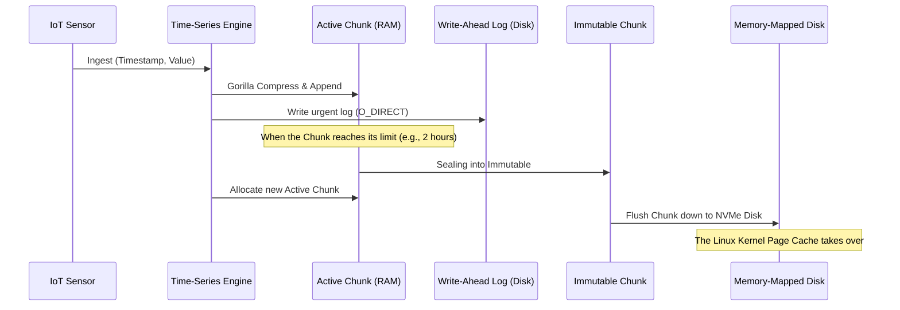

# Whitepaper Kỹ Thuật Tập 50: Time-Series Databases (TSDB) - Giải Phẫu Thuật Toán Nén Gorilla và Kiến Trúc Chunking Memory

## Tóm Tắt Điều Hành (Executive Summary)
Bài viết này đào sâu vào cách các time-series database hàng đầu — Prometheus, InfluxDB, và Gorilla, hệ thống khởi nguồn cho ý tưởng này — xử lý lượng dữ liệu khổng lồ đổ về từ IoT và microservices. Chúng ta sẽ đi qua phần toán học đứng sau thuật toán nén Gorilla (delta-of-delta và phép XOR trên số IEEE-754), chiến lược quản lý bộ nhớ Chunking ở tầng hệ điều hành, và cách hai kỹ thuật này kết hợp để đạt tỷ lệ nén khoảng 64:1 chỉ với vài chu kỳ CPU cho mỗi điểm dữ liệu. Kèm theo đó là vài bài học thiết kế đáng áp dụng cho bất kỳ hệ thống phân tán thời gian thực nào.

---

## Lời Mở Đầu: Vì Sao Dữ Liệu Chuỗi Thời Gian Lại Khác Biệt Đến Vậy
Trong kỷ nguyên điện toán đám mây và IoT, máy móc gần như không bao giờ ngừng "nói chuyện". Hàng tỷ cảm biến, máy chủ, container liên tục phát ra dữ liệu telemetry, và tất cả những thứ đó được gọi chung là dữ liệu chuỗi thời gian (time-series data).

Khác với bảng dữ liệu thông thường trong RDBMS hay NoSQL, một time-series database (TSDB) mang vài đặc tính vật lý khá đặc thù và khắt khe:
1. **Lưu lượng ghi cực lớn:** hàng triệu lượt ghi mỗi giây không phải chuyện hiếm.
2. **Thời gian luôn tăng dần:** dữ liệu luôn đến theo đúng thứ tự thời gian; gần như không có UPDATE, chỉ có APPEND.
3. **Cấu trúc bản ghi cực kỳ đơn giản:** thường chỉ gồm timestamp (số nguyên 64-bit) và giá trị metric (số thực 64-bit), cộng thêm vài tag để định danh.

Chính sự đơn điệu đó vừa là một bài toán lưu trữ khổng lồ, vừa là cơ hội để kỹ sư hệ thống áp dụng những tối ưu hóa rất cụ thể ở tầng vi kiến trúc.

---

## Bài Toán Cốt Lõi: Cơn Sóng Dữ Liệu IoT

### Băng Thông, I/O Đĩa, và Lý Do RDBMS Sụp Đổ
Hãy tưởng tượng một hệ thống giám sát datacenter theo dõi 100.000 máy chủ, mỗi máy phát ra 100 metric mỗi giây.
Tổng cộng: $100,000 \times 100 = 10,000,000$ điểm dữ liệu/giây.
Mỗi điểm dữ liệu nặng 16 byte (8 byte timestamp cộng 8 byte giá trị float).
Lưu lượng ghi thô: xấp xỉ $160 \text{ MB/giây} \approx 13.8 \text{ TB/ngày}$.

Đẩy khối lượng này vào PostgreSQL hay MySQL qua các câu lệnh `INSERT` thông thường, B-Tree index sẽ sụp đổ gần như ngay lập tức vì tranh chấp khóa. Ngay cả dùng Cassandra, chi phí mua đủ NVMe để chứa 13.8TB/ngày trong một năm — khoảng 5 petabyte — cũng là con số khiến bất kỳ ai lập ngân sách phải giật mình.

### Vì Sao Nén Theo Kiểu Từ Điển Không Giúp Được Gì
Phản xạ đầu tiên của kỹ sư là nghĩ đến nén dữ liệu. Nhưng các công cụ chuẩn như LZ77, Snappy, Gzip, Zstandard đều dựa trên nguyên lý từ điển — chúng tìm các chuỗi byte lặp lại. Vấn đề là timestamp là dãy số tăng dần không bao giờ lặp, còn số thực float thì liên tục thay đổi bit ở phần thập phân. Snappy hay Zstd gần như vô dụng ở đây, tốn không ít CPU mà tỷ lệ nén chẳng cải thiện bao nhiêu.

Cái cần thiết là một thuật toán nén không dùng từ điển, không rẽ nhánh, được tối ưu riêng cho chuỗi số nguyên và số thực. Đó chính xác là những gì thuật toán Gorilla — được Facebook (nay là Meta) giới thiệu năm 2015 — được sinh ra để giải quyết.

---

## Giải Pháp Thuật Toán: Nén Gorilla

Gorilla tách bài toán thành hai luồng: nén timestamp và nén giá trị metric. Ý tưởng chung đằng sau cả hai là: dù giá trị tuyệt đối cứ thay đổi liên tục, **độ chênh lệch giữa các giá trị liền kề lại rất ổn định.**

### Nén Timestamp Bằng Delta-of-Delta
Hệ thống thu thập metric thường chạy theo chu kỳ cố định, ví dụ mỗi 10 giây. Thay vì lưu 64 bit cho mỗi timestamp:
$T = [1000, 1010, 1020, 1030]$
ta tính delta bậc một ($D_n = T_n - T_{n-1}$):
$D = [10, 10, 10]$
Do độ trễ mạng (jitter), delta thực tế có thể trông như thế này:
$D = [10, 12, 9, 11]$
Thuật toán tiếp tục tính delta của delta:
$D^{(2)} = [2, -3, 2]$

Đây là điểm mấu chốt: trong một hệ thống ổn định, khoảng 96% giá trị delta-of-delta bằng đúng 0. Gorilla dùng mã hóa độ dài biến thiên (tinh thần gần giống mã Huffman) để tận dụng điều này:
- DoD = 0: ghi đúng 1 bit `0` — nén 64 bit xuống còn 1 bit.
- DoD trong khoảng [-63, 64]: ghi `10` cộng 7 bit dữ liệu (tổng 9 bit).
- DoD trong khoảng [-255, 256]: ghi `110` cộng 9 bit dữ liệu (tổng 12 bit).
- Cứ thế tiếp tục cho các dải rộng hơn.

### Nén Giá Trị Metric Bằng Phép XOR Trên IEEE 754
Số thực 64-bit thường là cơn ác mộng cho các thuật toán nén: 1 bit dấu, 11 bit số mũ, 52 bit định trị, và chỉ một thay đổi nhỏ (từ 2.0 lên 2.01) cũng đủ làm đảo lộn toàn bộ chuỗi bit. Nhưng Gorilla nhận ra một điều: giá trị đo từ cảm biến (chẳng hạn 37.5°C) hiếm khi nhảy vọt giữa hai lần đo liên tiếp. Ở mức bit, hai giá trị kề nhau thường chia sẻ cùng dấu, cùng số mũ, và một phần lớn các bit định trị phía đầu.

Thay vì trừ, Gorilla XOR trực tiếp hai giá trị kề nhau:
$$X_n = V_n \oplus V_{n-1}$$
Kết quả là một chuỗi 64-bit có một dải số 0 ở đầu (leading zeros), một dải số 0 ở cuối (trailing zeros), và ở giữa là một khối bit "có ý nghĩa" khá nhỏ.
1. Nếu $X_n = 0$ (giá trị không đổi): chỉ ghi 1 bit `0`.
2. Nếu $X_n \neq 0$: so sánh số lượng LZ/TZ với giá trị trước. Nếu khối bit có ý nghĩa nằm gọn trong phạm vi của khối trước, ghi bit điều khiển `10` và chỉ ghi những bit khác biệt, tái sử dụng cấu trúc LZ/TZ cũ.
3. Nếu cấu trúc thay đổi: ghi `11`, rồi 5 bit cho độ dài LZ mới, 6 bit cho độ dài khối khác biệt, và cuối cùng là khối khác biệt đó.

### Vì Sao Nó Chạy Nhanh Trên Phần Cứng Thật
Đếm số leading zero không cần một vòng lặp tốn kém — trình biên dịch của C++, Rust, Go ánh xạ thẳng phép này sang lệnh gốc `LZCNT` và `TZCNT` của CPU x86_64, hoàn tất trong đúng 1 chu kỳ xung nhịp. Việc rẽ nhánh được giữ ở mức tối thiểu, nên bộ dự đoán nhánh của CPU không bao giờ bị "đánh lừa".

---

## Vi Kiến Trúc Hệ Thống: Phân Trang Bộ Nhớ và Chunking

Dữ liệu sau khi nén trở thành một chuỗi bit liên tục. Nhưng nếu chỉ cần truy vấn dữ liệu "hôm qua", hệ thống không thể giải nén tuần tự từ đầu năm. Đây chính là lý do kiến trúc Chunking ra đời.

### Chunking Thực Chất Là Gì
Chuỗi thời gian vô tận được cắt thành các "chunk", thường được định nghĩa theo một khoảng thời gian (ví dụ 2 giờ) hoặc theo dung lượng byte (ví dụ 4KB). Tại bất kỳ thời điểm nào, mỗi time series chỉ có đúng một active chunk — nằm trên RAM, liên tục nhận dữ liệu mới theo kiểu append-only.

### Đánh Đổi Ở Tầng CPU: False Sharing Đối Đầu TLB Miss
Nếu chunk quá nhỏ (dưới 4KB), một trang bộ nhớ 4KB sẽ chứa chunk của nhiều series không liên quan nhau. Khi các lõi CPU khác nhau cập nhật những series nằm sát nhau trên cùng một trang, hiện tượng false sharing xảy ra — giao thức MESI của CPU cứ liên tục gửi thông điệp vô hiệu hóa cache giữa các lõi, và throughput rơi tự do.

Ngược lại, nếu chunk quá lớn (ví dụ 20MB), RAM bị phân mảnh nặng. TLB quá tải vì phải theo dõi quá nhiều địa chỉ vật lý, dẫn tới TLB miss xảy ra liên tục.
Cách khắc phục thường thấy là gom các chunk vào những "memory arena" lớn, dùng huge page (2MB), do một bộ cấp phát như jemalloc quản lý, giữ tỷ lệ cache hit luôn ở mức cao.

### Vòng Đời Của Một Khối Dữ Liệu

---

## Phối Hợp Với Hệ Điều Hành: Page Cache và Mmap()

Một khi active chunk được "niêm phong" thành immutable chunk, TSDB giao phần lớn công việc nặng nhọc còn lại cho kernel Linux.

### Xóa Nhòa Ranh Giới Giữa RAM và SSD
TSDB đẩy immutable chunk xuống NVMe dưới dạng block storage thô. Thay vì tự quản lý việc đọc file — nghĩa là phải gọi `read()` và liên tục chuyển ngữ cảnh giữa kernel space/user space — nó dùng `mmap()` để ánh xạ thẳng các block trên SSD vào không gian địa chỉ ảo của tiến trình.
- Khi người dùng truy vấn biểu đồ của tháng trước, TSDB chỉ cần giải tham chiếu một con trỏ bộ nhớ.
- MMU phát hiện dữ liệu chưa có trong RAM và kích hoạt page fault.
- Kernel đi xuống NVMe, kéo khối 4KB đó lên RAM, và thường prefetch luôn các khối tiếp theo vào L3 cache dựa trên cơ chế read-ahead.

### Giải Tuần Tự Hóa Không Tốn Copy (Zero-Copy Deserialization)
Vì định dạng chunk trên đĩa giống hệt từng byte với chuỗi bit Gorilla khi còn nằm trên RAM, TSDB không tốn chút công sức nào để giải tuần tự hóa. CPU đọc thẳng các bit đã nén từ RAM (vừa được mmap kéo lên từ đĩa), chạy qua logic XOR/LZCNT, và vẽ biểu đồ ngay lập tức.

---

## Bài Học Về Thiết Kế Hệ Thống Phân Tán

Sau khi mổ xẻ cách Gorilla và Chunking phối hợp với nhau, có vài điều đáng ghi nhớ.

1. **Hiểu đúng miền dữ liệu quan trọng hơn công cụ tổng quát.** Không có thuật toán nén nào là chìa khóa vạn năng. Zstandard rất mạnh với văn bản nhưng thua đau trước dữ liệu chuỗi thời gian dạng số. Gorilla chứng minh rằng khi hiểu đúng bản chất vật lý và thống kê của dữ liệu — tính đơn điệu của thời gian, mối tương quan giữa các giá trị cảm biến liền kề — một thuật toán đơn giản (delta-of-delta, XOR) hoàn toàn có thể vượt mặt mọi phương pháp lý thuyết thông tin tổng quát.
2. **Tính bất biến là thứ khiến việc mở rộng trở nên khả thi.** Xây dựng hệ thống xoay quanh các immutable chunk giúp loại bỏ nhu cầu khóa, tránh hoàn toàn deadlock, và cho phép hệ thống tận dụng tối đa OS page cache. Một chunk đã niêm phong không bao giờ trở thành dirty page, nghĩa là kernel có thể loại bỏ nó khỏi RAM bất cứ khi nào bộ nhớ căng thẳng.
3. **Phần cứng và phần mềm phải tiến hóa cùng nhau.** Thiết kế một database như thế này không chỉ là viết logic đúng — nó đòi hỏi tư duy ở mức cache line (64 byte), tỷ lệ hit/miss của L1/L2, hành vi của TLB, SIMD, và các lệnh phần cứng như LZCNT. Viết mã tốt thôi chưa đủ; mã đó còn phải tôn trọng những giới hạn vật lý của con chip nó chạy trên.

---

## Kết Luận
Xây dựng một time-series database hiệu năng cao, xét cho cùng, là bài toán cân bằng giữa băng thông mạng, ngân sách CPU có hạn, và giới hạn lưu trữ vật lý. Thuật toán nén Gorilla kết hợp với kiến trúc Chunking mang lại một sự pha trộn giữa toán học Boolean tối giản, hiểu biết thực sự về vi kiến trúc CPU, và các thủ thuật phân trang ở tầng hệ điều hành — và cùng nhau chúng đã định hình chuẩn mực cho các database observability ngày nay. Hiểu được cách những mảnh ghép này khớp với nhau là nền tảng vững chắc cho bất kỳ ai đang xây dựng hạ tầng dữ liệu phía sau các hệ thống IoT hay giám sát quy mô lớn hiện đại.
