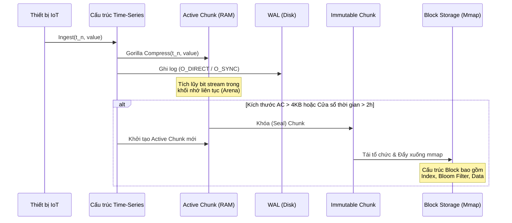

# Time-Series Databases (TSDB): Thuật toán nén Gorilla và Kiến trúc Chunking Memory

Cơ sở dữ liệu chuỗi thời gian (Time-Series Database - TSDB) đại diện cho một trong những hạ tầng phần mềm có yêu cầu khắt khe nhất về mặt thông lượng ghi và hiệu quả lưu trữ trong kỷ nguyên điện toán đám mây và vạn vật kết nối (IoT). Không giống như các hệ thống quản trị cơ sở dữ liệu quan hệ truyền thống (RDBMS) hay các giải pháp NoSQL chung chung, TSDB phải xử lý một khối lượng khổng lồ các điểm dữ liệu được sinh ra liên tục theo trục thời gian thực. Mỗi điểm dữ liệu thông thường bao gồm một nhãn thời gian (timestamp), một tập hợp các thẻ định danh (tags/labels), và một hoặc nhiều giá trị đo lường (metrics), thường là các số thực dấu phẩy động (floating-point numbers) có độ chính xác kép (64-bit). Với tần suất lấy mẫu có thể đạt đến mức mili-giây hoặc micro-giây trên hàng triệu thiết bị hoặc tiến trình phần mềm, lưu lượng dữ liệu thô đẩy vào hệ thống dễ dàng làm bão hòa băng thông mạng, tràn bộ nhớ đệm (RAM) và vắt kiệt không gian lưu trữ trên các ổ đĩa thể rắn (SSD). Do đó, việc thiết kế các kỹ thuật nén dữ liệu đặc thù không chỉ là một yêu cầu tối ưu hóa phụ trợ, mà là điều kiện tiên quyết mang tính sống còn để hệ thống có thể hoạt động ổn định và mở rộng theo chiều ngang. Trong bối cảnh này, bài báo khoa học về thuật toán nén Gorilla được công bố bởi các kỹ sư tại Facebook vào năm 2015 đã trở thành một chuẩn mực vàng, tái định hình toàn bộ cách tiếp cận của ngành công nghiệp đối với vấn đề lưu trữ dữ liệu chuỗi thời gian bộ nhớ chính. Hơn thế nữa, để thuật toán nén này phát huy tối đa sức mạnh trong môi trường đa luồng và khai thác hiệu quả hệ thống phân cấp bộ nhớ đệm của vi xử lý (CPU cache hierarchy), các cấu trúc dữ liệu lưu trữ phải được tổ chức theo mô hình phân mảnh (Chunking). Sự kết hợp giữa cơ chế nén luồng bit (bit-stream compression) tối ưu theo toán học và quản lý vòng đời khối nhớ (memory chunk lifecycle) tạo nên một hệ thống vi kiến trúc có khả năng xử lý hàng chục triệu thao tác ghi mỗi giây trên một node máy chủ duy nhất.

Mô hình dữ liệu chuỗi thời gian thể hiện các đặc trưng phân bố vật lý vô cùng đặc thù mà các thuật toán nén từ điển chuẩn như LZ77, Snappy hay Zstandard không thể khai thác tối đa một cách trực tiếp. Thứ nhất, nhãn thời gian (timestamps) là một chuỗi số nguyên đơn điệu tăng, khoảng cách giữa hai điểm dữ liệu liên tiếp thường xấp xỉ bằng một hằng số phụ thuộc vào chu kỳ lấy mẫu, ví dụ như 10 giây hoặc 1 phút. Thứ hai, các giá trị đo lường, cho dù là nhiệt độ của một cảm biến, mức độ sử dụng CPU, hay số lượng gói tin mạng, thường biến thiên rất chậm theo thời gian vật lý. Từ góc độ lý thuyết thông tin (Information Theory), tính tự tương quan (autocorrelation) cao giữa các mẫu dữ liệu kề nhau ngụ ý rằng entropy (độ bất định) của tín hiệu là rất thấp. Thuật toán Gorilla khai thác triệt để hai tính chất này bằng cách từ bỏ việc nén từng giá trị độc lập hay tra cứu từ điển toàn cục; thay vào đó, nó nén phần dư (residual) hay khoảng sai lệch (delta) giữa các điểm dữ liệu. Phương pháp luận này đòi hỏi các phép toán logic mức bit (bitwise operations) phải được tối ưu hóa sâu sắc để chúng có thể thực thi với số lượng chu kỳ máy (clock cycles) cực nhỏ, lý tưởng là chỉ yêu cầu một vài tập lệnh ALU cơ bản mà không gây ra bất kỳ sự phân nhánh điều kiện phức tạp nào có thể làm hỏng bộ tiên đoán rẽ nhánh (branch predictor) của CPU.

## Cơ chế nén Gorilla: Toán học, Phân tích Logic Bit và Vi kiến trúc

Trọng tâm cốt lõi của thuật toán Gorilla được chia thành hai luồng xử lý hoàn toàn tách biệt: nén nhãn thời gian (timestamps) và nén giá trị số thực (floating-point values). Đối với nhãn thời gian, thuật toán sử dụng phương pháp mã hóa Delta-of-Delta (sai số của sai số), một kỹ thuật dựa trên tính tuần hoàn của chu kỳ lấy mẫu. Giả sử chúng ta có một chuỗi các nhãn thời gian được biểu diễn bằng số nguyên dương 64-bit: $t_0, t_1, t_2, \dots, t_n$. Sai số bậc một (Delta) giữa nhãn thời gian hiện tại và nhãn thời gian trước đó được định nghĩa là $D_n = t_n - t_{n-1}$. Nếu hệ thống lấy mẫu dữ liệu một cách hoàn hảo với chu kỳ không đổi $\Delta t$, thì $D_n = \Delta t$ với mọi $n$. Tuy nhiên, trong thực tế viễn thông và hệ điều hành, các độ trễ mạng (network jitter) và sự gián đoạn lập lịch luồng (thread scheduling jitter) làm cho $D_n$ dao động nhẹ quanh giá trị $\Delta t$. Do đó, Gorilla tiến thêm một bước bằng cách tính sai số bậc hai, ký hiệu là $D^{(2)}_n$, được định nghĩa qua công thức toán học: $$D^{(2)}_n = D_n - D_{n-1} = (t_n - t_{n-1}) - (t_{n-1} - t_{n-2})$$. Giá trị $D^{(2)}_n$ biểu diễn độ lệch so với độ trễ dự kiến. Khi tín hiệu lấy mẫu ổn định, $D^{(2)}_n$ sẽ có giá trị bằng 0 hoặc rất gần 0. Thuật toán Gorilla áp dụng một cơ chế mã hóa độ dài biến thiên (variable-length encoding) tương tự như mã Huffman để lưu trữ giá trị $D^{(2)}_n$. Cụ thể, nếu $D^{(2)}_n$ bằng 0, hệ thống chỉ ghi lại chính xác 1 bit có giá trị '0'. Nếu $D^{(2)}_n$ nằm trong khoảng $[-63, 64]$, nó sẽ được mã hóa bằng 2 bit '10' theo sau là 7 bit dữ liệu thực tế. Nếu $D^{(2)}_n$ thuộc dải $[-255, 256]$, nó được biểu diễn bởi 3 bit '110' cộng với 9 bit dữ liệu. Các giới hạn tiếp theo mở rộng tới 12 bit và 32 bit cho những trường hợp ngoại lệ hiếm hoi (như mất kết nối thiết bị dẫn đến gián đoạn dài). Sơ đồ mã hóa phi tuyến tính này đảm bảo rằng trong 96% trường hợp thực tế, nhãn thời gian 64-bit nguyên thủy chỉ tiêu tốn 1 bit duy nhất để lưu trữ, mang lại tỷ lệ nén lên đến 64:1 cho siêu dữ liệu thời gian.

```mermaid
flowchart TD
    A[Nhãn thời gian mới: t_n] --> B{Tính D_n = t_n - t_n-1}
    B --> C{Tính Delta-of-Delta: D_n_2 = D_n - D_n-1}
    C --> D{D_n_2 == 0 ?}
    D -- Có --> E[Ghi bit '0']
    D -- Không --> F{D_n_2 thuộc [-63, 64] ?}
    F -- Có --> G[Ghi '10' + 7 bits]
    F -- Không --> H{D_n_2 thuộc [-255, 256] ?}
    H -- Có --> I[Ghi '110' + 9 bits]
    H -- Không --> J{D_n_2 thuộc [-2047, 2048] ?}
    J -- Có --> K[Ghi '1110' + 12 bits]
    J -- Không --> L[Ghi '1111' + 32 bits]
```

Đối với các giá trị đo lường, vấn đề trở nên phức tạp hơn đáng kể vì chúng là các số thực theo chuẩn IEEE 754 định dạng 64-bit (Double Precision). Khác với số nguyên, số thực lưu trữ dưới dạng một bit dấu (sign), 11 bit số mũ (exponent), và 52 bit phần định trị (fraction/mantissa). Một sự thay đổi cực nhỏ về mặt độ lớn thập phân có thể dẫn đến một sự thay đổi khổng lồ ở mức bit nếu chuỗi bit định trị tràn bộ nhớ qua số mũ. Tuy nhiên, hai điểm dữ liệu gần nhau về mặt vật lý thường sẽ có chung giá trị số mũ và các bit quan trọng nhất của phần định trị. Thay vì cố gắng bóc tách các thành phần IEEE 754, Gorilla sử dụng phép toán logic XOR ($\oplus$) trực tiếp trên cấu trúc bit 64-bit của hai số kề nhau: $X_n = V_n \oplus V_{n-1}$. Khi $V_n$ và $V_{n-1}$ có cấu trúc bit gần giống hệt nhau, kết quả của phép XOR $X_n$ sẽ là một chuỗi 64-bit bao gồm một lượng lớn các bit '0' ở phần đầu (leading zeros) và phần cuối (trailing zeros), kẹp ở giữa là một dải các bit '1' và '0' hỗn hợp đại diện cho sự khác biệt thực sự (meaningful bits). Ví dụ, nếu cả bộ đếm tăng lên một giá trị cực nhỏ, phần lớn các bit phía trên không đổi nên XOR sẽ sinh ra các số không ở đầu. Thuật toán phân tích chuỗi $X_n$ này. Nếu $X_n$ bằng 0 (nghĩa là giá trị không thay đổi, $V_n = V_{n-1}$), nó chỉ ghi 1 bit '0'. Nếu $X_n \neq 0$, hệ thống đếm số lượng bit 0 ở đầu (Leading Zeros - LZ) và số lượng bit 0 ở cuối (Trailing Zeros - TZ). Nếu số lượng LZ và TZ của $X_n$ lớn hơn hoặc bằng số lượng LZ và TZ của giá trị $X_{n-1}$ đã được ghi trước đó, thuật toán sẽ tận dụng lại thông tin về khối bit có nghĩa (meaningful block) của chu kỳ trước; nó ghi bit điều khiển '10', theo sau là chỉ các bit có nghĩa của $X_n$. Nếu cấu trúc bit thay đổi quá nhiều khiến việc dùng lại không khả thi, hệ thống sẽ ghi bit điều khiển '11', theo sau là 5 bit biểu diễn độ dài khối LZ mới, 6 bit biểu diễn số lượng bit có nghĩa mới, và cuối cùng là bản thân các bit có nghĩa đó. Kỹ thuật XOR kỳ diệu này lướt qua các cấu trúc bit phức tạp của IEEE 754 mà không cần thực hiện bất kỳ phép toán số học dấu phẩy động nào tốn kém, hoàn toàn chỉ sử dụng tập lệnh nguyên thủy của vi xử lý.

Để hiện thực hóa một cách tối ưu vi kiến trúc nén Gorilla, mã nguồn hệ thống (system code) thường được triển khai bằng C++ hoặc Rust nhằm làm chủ hoàn toàn các chỉ thị bộ nhớ. Chúng ta có thể mô phỏng một phần logic quản lý trạng thái luồng nén bằng đoạn mã Rust nguyên thủy dưới đây. Cấu trúc `GorillaCompressor` phải duy trì trạng thái của điểm dữ liệu gần nhất để tính toán các phép toán Delta và XOR một cách liền mạch, trong một vòng lặp sự kiện chặt chẽ mà không tạo ra overhead về mặt cấp phát vùng nhớ động.

```rust
pub struct GorillaCompressor {
    bit_writer: BitWriter,
    prev_timestamp: u64,
    prev_delta: i64,
    prev_value: u64,
    prev_leading_zeros: u8,
    prev_trailing_zeros: u8,
    is_first_point: bool,
}

impl GorillaCompressor {
    pub fn append(&mut self, timestamp: u64, value_f64: f64) {
        let value = value_f64.to_bits(); // Biến đổi f64 thành u64 raw bits

        if self.is_first_point {
            self.bit_writer.write_bits(timestamp, 64);
            self.bit_writer.write_bits(value, 64);
            self.prev_timestamp = timestamp;
            self.prev_value = value;
            self.is_first_point = false;
            return;
        }

        // 1. Mã hóa nhãn thời gian bằng Delta-of-Delta
        let delta = (timestamp - self.prev_timestamp) as i64;
        let delta_of_delta = delta - self.prev_delta;
        
        if delta_of_delta == 0 {
            self.bit_writer.write_bit(false); // Ghi bit 0
        } else if delta_of_delta >= -63 && delta_of_delta <= 64 {
            self.bit_writer.write_bits(0b10, 2);
            self.bit_writer.write_bits(delta_of_delta as u64, 7);
        } else {
            // Các dải phân vùng rộng hơn được tính toán thông qua cấu trúc bitwise logic tương tự
            // nhằm giới hạn triệt để số bit cần ghi trực tiếp xuống mảng buffer...
        }

        // 2. Mã hóa giá trị đo lường bằng XOR logic
        let xor_val = self.prev_value ^ value;
        if xor_val == 0 {
            self.bit_writer.write_bit(false);
        } else {
            self.bit_writer.write_bit(true);
            let current_lz = xor_val.leading_zeros() as u8;
            let current_tz = xor_val.trailing_zeros() as u8;

            if current_lz >= self.prev_leading_zeros && current_tz >= self.prev_trailing_zeros {
                self.bit_writer.write_bit(false); // Tái sử dụng giới hạn khối
                let meaningful_bits = 64 - self.prev_leading_zeros - self.prev_trailing_zeros;
                self.bit_writer.write_bits(xor_val >> self.prev_trailing_zeros, meaningful_bits);
            } else {
                self.bit_writer.write_bit(true); // Khởi tạo khối mới
                self.bit_writer.write_bits(current_lz as u64, 5);
                let meaningful_bits = 64 - current_lz - current_tz;
                self.bit_writer.write_bits(meaningful_bits as u64, 6);
                self.bit_writer.write_bits(xor_val >> current_tz, meaningful_bits);
                self.prev_leading_zeros = current_lz;
                self.prev_trailing_zeros = current_tz;
            }
        }
        
        self.prev_timestamp = timestamp;
        self.prev_delta = delta;
        self.prev_value = value;
    }
}
```

Mã Rust giả định này bộc lộ sức mạnh tuyệt đối của việc kiểm soát trực tiếp thanh ghi vi xử lý. Các hàm nhúng (intrinsics) của trình biên dịch LLVM như `leading_zeros()` và `trailing_zeros()` sẽ được ánh xạ trực tiếp thành các lệnh phần cứng cực nhanh trên nền tảng x86_64, cụ thể là các chỉ thị `LZCNT` (Leading Zero Count) và `TZCNT` (Trailing Zero Count) hoặc `BSR` (Bit Scan Reverse). Do đó, việc tìm ra các cấu trúc bit dư thừa không đòi hỏi bất kỳ vòng lặp phần mềm nào mà chỉ tiêu tốn 1 đến 2 chu kỳ nhịp đồng hồ máy tính (clock cycles), một tốc độ đủ sức xử lý các dòng thác dữ liệu tại biên độ của hàng triệu truy vấn ghi mỗi giây trên từng lõi vi xử lý vật lý, bảo toàn trọn vẹn thông lượng tối đa của thiết kế hệ thống nền tảng.

## Kiến trúc Chunking và Quản lý Phân trang Bộ nhớ Hệ điều hành

Tuy nhiên, một luồng bit nén tuyến tính kéo dài vô tận theo thời gian không mang lại bất kỳ cấu trúc truy xuất dữ liệu nào (random access). Quá trình giải nén Gorilla là quy trình bắt buộc tuần tự (strictly sequential), ngụ ý rằng để trích xuất điểm dữ liệu ở giây thứ 1 triệu, CPU sẽ phải giải mã tuần tự 999,999 điểm dữ liệu trước đó, tái tạo lại toàn bộ trạng thái của cây Delta-of-Delta và các cờ XOR. Sự thắt cổ chai về mặt giải mã này dẫn đến sự ra đời của mô hình quản lý bộ nhớ theo khối (Chunking Memory Architecture). Một hệ thống TSDB ở đẳng cấp sản xuất (production-grade) như Prometheus hay InfluxDB chia nhỏ trục thời gian thành các cửa sổ bất biến (immutable time windows), thường dao động từ vài giờ đến một ngày. Mỗi cửa sổ thời gian này quản lý cấu trúc hàng triệu luồng thời gian (time-series) tách biệt, nhưng ở mức độ thấp, mỗi chuỗi (series) lại phân chia dòng dữ liệu liên tục của nó thành vô số các phân đoạn nhỏ hơn gọi là Chunks. Một Chunk điển hình được giới hạn bởi kích thước vật lý (ví dụ: 1 KB, 4 KB hoặc 16 KB) hoặc giới hạn về mặt thời lượng (ví dụ: khoảng thời gian 2 giờ).

Sự phân bổ kích thước Chunk là một bài toán đánh đổi vi kiến trúc cực kỳ gay gắt giữa Tỷ lệ Cache Hit, Áp lực Phân trang (Page Fault Pressure), và Thông lượng I/O Disk. Hệ điều hành hiện đại như Linux quản lý bộ nhớ vật lý thông qua cơ chế bộ nhớ ảo (Virtual Memory), với các trang nhớ (Memory Pages) tiêu chuẩn có kích thước 4 KB. Nếu TSDB thiết kế kích thước một Chunk nhỏ hơn nhiều so với 4 KB, một trang nhớ vật lý sẽ chứa nhiều Chunks từ các khoảng thời gian khác nhau hoặc các luồng metrics khác nhau. Mặc dù điều này giúp giảm mức độ tiêu thụ RAM tức thời, nó có thể gây ra hiện tượng False Sharing ở cấp độ Cache Line (64 byte) trên bộ nhớ đệm L1/L2 của CPU khi nhiều luồng đồng thời (threads) cố gắng khóa và ghi vào các vùng nhớ kề sát nhau, vô hiệu hóa hoàn toàn cơ chế duy trì tính nhất quán bộ nhớ đệm (Cache Coherence Protocol) thông qua các thông điệp vô hiệu hóa MESI. Ngược lại, nếu Chunk được thiết kế quá lớn so với mức 4 KB, khi bộ cấp phát bộ nhớ (allocator) cần cấp thêm dung lượng cho các Chunk đang phình ra, nó có thể phải yêu cầu hàng loạt các trang nhớ không liên tục về mặt vật lý, làm tăng áp lực lên Translation Lookaside Buffer (TLB), dẫn đến hiện tượng TLB Misses liên tục khi CPU tra cứu địa chỉ vật lý. Để triệt tiêu vấn đề này, các nền tảng TSDB hiệu năng cao thường sử dụng cơ chế cấp phát Huge Pages (ví dụ: 2 MB) hoặc sử dụng các allocator đặc thù được tối ưu hóa như jemalloc hay tcmalloc để gom nhóm các Chunk thuộc cùng một block thời gian vào các vùng nhớ liên tục (contiguous memory arenas).



Vòng đời vi mô của một khối dữ liệu (Chunk Lifecycle) tuân theo một quy trình quản lý trạng thái máy tự động rất nghiêm ngặt. Khi một điểm dữ liệu mới đi vào, nó được định tuyến vào Active Chunk (hay Head Chunk) đang nằm hoàn toàn trong bộ nhớ RAM truy cập ngẫu nhiên. Active Chunk là một vùng nhớ chỉ cho phép ghi nối (append-only buffer). Nhờ đặc tính append-only, các thuật toán kiểm soát tương tranh không khóa (lock-free concurrency control) có thể được ứng dụng. Điểm yếu lớn nhất của Active Chunk là tính biến động (volatility) – nó sẽ bị xóa sổ ngay lập tức nếu server sụp đổ (crash) hoặc sập nguồn đột ngột. Do vậy, song song với việc ghi vào RAM, dữ liệu thô cũng được ghép vào cấu trúc Write-Ahead Log (WAL) lưu trữ trên đĩa từ (HDD) hoặc NVMe SSD bằng các lời gọi hệ thống ghi trực tiếp (Direct I/O hoặc O_SYNC). Khi Active Chunk đạt ngưỡng bão hòa – bị kịch trần dung lượng hoặc trôi qua ngưỡng thời gian thiết lập – nó trải qua quá trình "khóa kín" (sealing). Tại thời điểm này, Active Chunk chuyển đổi trạng thái (state transition) thành Immutable Chunk (Chunk bất biến). Dữ liệu bên trong Immutable Chunk hoàn toàn kết thúc quá trình chịu tác động chỉnh sửa. Tính bất biến này là chìa khóa vàng cho việc tận dụng Hệ thống phân cấp bộ nhớ đệm (Page Cache) của hệ điều hành Linux. Thay vì duy trì Immutable Chunk trong khu vực bộ nhớ do ứng dụng phân bổ (Heap Memory), hệ thống lưu trữ bắt đầu đẩy các Chunk này xuống cấu trúc tập tin trên SSD và giải phóng vùng nhớ trên không gian người dùng (User Space). Quá trình đọc dữ liệu trong quá khứ bây giờ được ủy thác cho kỹ thuật ánh xạ bộ nhớ Memory-Mapped Files (mmap syscall). Khi một truy vấn phân tích (ví dụ: vẽ biểu đồ xu hướng theo tuần) yêu cầu quét qua hàng ngàn Immutable Chunks, TSDB không thực hiện các lệnh đọc tốn kém như read() qua ranh giới giữa kernel-space và user-space. Thay vào đó, nó giao toàn quyền cho tiến trình Page Fault của hạt nhân Linux. Các tập tin block lưu trên NVMe SSD được ánh xạ phẳng vào không gian địa chỉ ảo, và kernel sẽ tự động nạp các khối 4KB từ SSD lên RAM một cách lười biếng (lazy loading), đồng thời khai thác cơ chế đọc trước (read-ahead heuristics) để kéo các Chunks tiếp theo vào L3 Cache trước cả khi ứng dụng TSDB kịp yêu cầu. Bằng cách thiết kế cấu trúc dữ liệu trên đĩa hoàn toàn song ánh (isomorphic) với cấu trúc Gorilla nén trên RAM, hệ thống lược bỏ được hoàn toàn các quá trình serialize/deserialize tốn kém vô ích. Vi xử lý có thể trực tiếp thiết lập các con trỏ (pointers) đọc bit-stream nén ngay trên vùng nhớ mmap, chạy thuật toán giải mã XOR và Delta-of-Delta với tốc độ của hàng rào nhịp xung đồng hồ CPU nguyên thủy, hiện thực hóa mục tiêu trích xuất biểu đồ trong thời gian tiệm cận thời gian thực dù cho cơ sở dữ liệu có quy mô đạt đến cấp độ hàng Petabyte. Sự hợp nhất sâu sắc giữa giải thuật toán học tối thiểu (Gorilla) và kiến trúc máy tính nền tảng (Chunking, Virtual Memory, mmap) chính là kiệt tác của ngành công nghệ phần mềm lưu trữ hiện đại.

## SEO Tags
* Time-Series Database Architecture
* Gorilla Compression Algorithm
* Memory Chunking and Page Cache
* Delta-of-Delta Timestamp Encoding
* IEEE 754 XOR Floating-Point Compression
* High-Performance System Design Memory Mapped Files
* TSDB Micro-Architecture and TLB Optimizations
* Rust C++ Lock-Free Data Structures
* Immutable Memory Arenas
* Huge Pages and Cache Coherence in Data Storage
