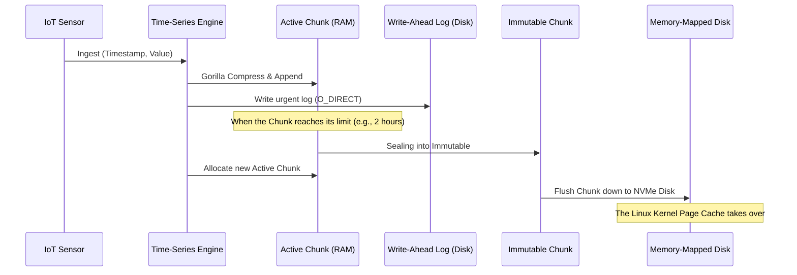

# Whitepaper Kỹ Thuật Tập 50: Time-Series Databases (TSDB) - Giải Phẫu Thuật Toán Nén Gorilla và Kiến Trúc Chunking Memory

## Tóm Tắt Điều Hành (Executive Summary)
Bài viết này mổ xẻ cách các time-series database hàng đầu — Prometheus, InfluxDB, và cả hệ thống Gorilla nguyên bản — xoay xở với lượng dữ liệu khổng lồ do IoT và microservices tạo ra mỗi giây. Trọng tâm là cấu trúc toán học đứng sau nén Gorilla (delta-of-delta và phép XOR trên số thực IEEE-754), cùng chiến lược Chunking để quản lý bộ nhớ ở tầng kernel. Bạn sẽ thấy vì sao chỉ với vài chu kỳ CPU, hệ thống có thể đạt tỷ lệ nén khoảng 64:1 — và rút ra được vài nguyên tắc thiết kế áp dụng được cho bất kỳ hệ phân tán thời gian thực nào.

---

## Mở Đầu: Đặc Thù Khó Lẫn Của Dữ Liệu Chuỗi Thời Gian
Trong thời đại điện toán đám mây và IoT, thiết bị gần như không bao giờ ngừng gửi dữ liệu. Hàng tỷ cảm biến, máy chủ, container liên tục phát tín hiệu telemetry — đó chính là dữ liệu chuỗi thời gian (time-series data).

Khác hẳn bảng dữ liệu của RDBMS hay NoSQL truyền thống, TSDB có những đặc điểm vật lý riêng, khá khắt khe:
1. **Ghi với lưu lượng cực lớn:** hàng triệu thao tác ghi mỗi giây là chuyện bình thường.
2. **Tính đơn điệu theo thời gian:** dữ liệu luôn đến với timestamp tăng dần, gần như không tồn tại UPDATE, chỉ có APPEND.
3. **Cấu trúc bản ghi tối giản:** chỉ gồm timestamp (số nguyên 64-bit) và giá trị metric (số thực 64-bit), cộng thêm vài tag định danh.

Sự đơn điệu này vừa là một thách thức lưu trữ lớn, vừa mở ra cơ hội để kỹ sư áp dụng những tối ưu hóa rất cụ thể ở tầng vi kiến trúc phần cứng.

---

## Bài Toán Cốt Lõi: Cơn Sóng Dữ Liệu IoT

### Băng Thông, I/O Đĩa, và Vì Sao RDBMS Không Chịu Nổi
Giả sử một hệ thống giám sát datacenter theo dõi 100.000 máy chủ, mỗi máy phát ra 100 metric mỗi giây.
Tổng cộng: $100,000 \times 100 = 10,000,000$ điểm dữ liệu mỗi giây.
Mỗi điểm nặng 16 byte (8 byte timestamp cộng 8 byte giá trị dạng float).
Lưu lượng ghi thô rơi vào khoảng $160 \text{ MB/giây} \approx 13.8 \text{ TB/ngày}$.

Nếu đẩy toàn bộ khối lượng đó vào PostgreSQL hay MySQL bằng câu lệnh `INSERT` thông thường, B-Tree index sẽ sụp gần như ngay lập tức vì tranh chấp khóa. Ngay cả dùng Cassandra, chi phí sắm đủ NVMe để giữ 13.8TB mỗi ngày trong suốt một năm — tương đương khoảng 5 petabyte — cũng là con số đủ để bất kỳ ai lập kế hoạch ngân sách phải cân nhắc lại.

### Vì Sao Nén Kiểu Từ Điển Không Giải Quyết Được Gì
Phản xạ đầu tiên khi gặp áp lực này là nghĩ tới nén dữ liệu. Nhưng những công cụ tiêu chuẩn như LZ77, Snappy, Gzip, Zstandard đều hoạt động theo nguyên lý tra từ điển — chúng đi tìm những chuỗi byte lặp lại. Vấn đề nằm ở chỗ timestamp là dãy số tăng dần không bao giờ lặp lại, còn giá trị float thì liên tục thay đổi bit ở phần thập phân. Snappy hay Zstd gần như bó tay ở đây, ngốn không ít CPU mà tỷ lệ nén chẳng cải thiện là bao.

Cái cần là một thuật toán không dựa vào từ điển, không rẽ nhánh, tối ưu chuyên biệt cho chuỗi số nguyên và số thực dấu phẩy động. Thuật toán Gorilla — do Facebook (nay là Meta) công bố năm 2015 — sinh ra chính là để giải bài toán này.

---

## Giải Pháp Thuật Toán: Nén Gorilla

Gorilla chia bài toán thành hai luồng riêng biệt: nén timestamp và nén giá trị metric. Cả hai đều dựa trên cùng một quan sát: dù giá trị tuyệt đối cứ biến động liên tục, **độ chênh lệch giữa các giá trị kề nhau lại cực kỳ ổn định.**

### Nén Timestamp Bằng Delta-of-Delta
Hệ thống thu thập số liệu thường chạy theo chu kỳ cố định, chẳng hạn mỗi 10 giây một lần. Thay vì lưu nguyên 64 bit cho từng timestamp:
$T = [1000, 1010, 1020, 1030]$
ta tính delta bậc một ($D_n = T_n - T_{n-1}$):
$D = [10, 10, 10]$
Vì mạng có độ trễ dao động (jitter), delta thực tế có thể trông như sau:
$D = [10, 12, 9, 11]$
Thuật toán đi thêm một bước, tính delta của delta:
$D^{(2)} = [2, -3, 2]$

Điểm mấu chốt nằm ở đây: trong một hệ thống ổn định, khoảng 96% giá trị delta-of-delta bằng đúng 0. Gorilla khai thác điều này bằng mã hóa độ dài biến thiên, tinh thần gần với mã Huffman:
- DoD = 0: chỉ ghi 1 bit `0` — nén 64 bit xuống còn 1 bit duy nhất.
- DoD nằm trong [-63, 64]: ghi `10` cộng 7 bit dữ liệu (tổng 9 bit).
- DoD nằm trong [-255, 256]: ghi `110` cộng 9 bit dữ liệu (tổng 12 bit).
- Và tiếp tục mở rộng dải cho các trường hợp lớn hơn.

### Nén Giá Trị Metric Bằng Phép XOR Trên IEEE 754
Số thực 64-bit vốn là nỗi ám ảnh của mọi thuật toán nén: 1 bit dấu, 11 bit số mũ, 52 bit định trị, và chỉ một thay đổi nhỏ (từ 2.0 sang 2.01) cũng đủ xáo trộn toàn bộ chuỗi bit. Nhưng Gorilla nhận ra một điều thú vị: giá trị đọc từ cảm biến (ví dụ nhiệt độ 37.5°C) hiếm khi nhảy vọt giữa hai lần đo liên tiếp. Ở mức bit, hai giá trị kề nhau thường có chung dấu, chung số mũ, và chia sẻ một phần lớn các bit định trị ở đầu.

Thay vì trừ, Gorilla XOR trực tiếp hai giá trị liền kề với nhau:
$$X_n = V_n \oplus V_{n-1}$$
Kết quả là một chuỗi 64-bit có dải số 0 ở đầu (leading zeros), dải số 0 ở cuối (trailing zeros), và ở giữa là một khối bit "khác biệt có ý nghĩa" khá nhỏ.
1. Nếu $X_n = 0$ (giá trị giữ nguyên): chỉ ghi 1 bit `0`.
2. Nếu $X_n \neq 0$: so sánh số LZ/TZ với giá trị trước đó. Nếu khối bit khác biệt nằm gọn trong phạm vi khối trước, ghi bit điều khiển `10` và chỉ lưu các bit khác biệt, tận dụng lại cấu trúc LZ/TZ cũ.
3. Nếu cấu trúc thay đổi: ghi `11`, tiếp theo 5 bit cho độ dài LZ mới, 6 bit cho độ dài khối khác biệt, rồi đến bản thân khối khác biệt đó.

### Vì Sao Chạy Nhanh Trên Phần Cứng Thật
Đếm số leading zero không đòi hỏi một vòng lặp tốn kém nào cả — trình biên dịch C++, Rust, Go ánh xạ trực tiếp phép này sang lệnh gốc `LZCNT` và `TZCNT` của CPU x86_64, hoàn thành chỉ trong 1 chu kỳ xung nhịp. Việc rẽ nhánh được giữ ở mức tối thiểu, giúp bộ dự đoán nhánh của CPU hoạt động trơn tru, không bị đánh lừa.

---

## Vi Kiến Trúc Hệ Thống: Phân Trang Bộ Nhớ và Chunking

Dữ liệu sau khi nén trở thành một chuỗi bit liên tục duy nhất. Nhưng nếu chỉ cần truy vấn dữ liệu của "hôm qua", hệ thống không thể giải nén tuần tự từ đầu năm tới giờ. Đó là lý do kiến trúc Chunking tồn tại.

### Chunking Là Gì, Thực Chất
Chuỗi thời gian vô tận được cắt nhỏ thành các "chunk", thường theo một khoảng thời gian cố định (ví dụ 2 giờ) hoặc theo dung lượng byte (ví dụ 4KB). Ở bất kỳ thời điểm nào, mỗi time series chỉ có đúng một active chunk duy nhất — nằm trên RAM, liên tục nhận dữ liệu mới theo kiểu append-only.

### Đánh Đổi Ở Tầng Lõi CPU: False Sharing Đối Đầu TLB Miss
Nếu chunk được thiết kế quá nhỏ (dưới 4KB), một trang bộ nhớ vật lý 4KB sẽ chứa chunk của nhiều series không liên quan tới nhau. Khi các lõi CPU khác nhau cùng cập nhật những series nằm sát cạnh nhau trên cùng một trang, hiện tượng false sharing xuất hiện — giao thức MESI của CPU liên tục gửi thông điệp vô hiệu hóa cache qua lại giữa các lõi, khiến throughput rơi thẳng đứng.

Ngược lại, nếu chunk quá lớn (chẳng hạn 20MB), RAM bị phân mảnh nghiêm trọng. TLB quá tải vì phải theo dõi quá nhiều địa chỉ vật lý cùng lúc, dẫn tới TLB miss xảy ra liên tục.
Giải pháp phổ biến là gom các chunk vào những "memory arena" lớn, dùng huge page (2MB) do một bộ cấp phát như jemalloc quản lý, nhờ đó giữ tỷ lệ cache hit luôn ở mức cao.

### Vòng Đời Của Một Khối Dữ Liệu

---

## Kết Hợp Với Hệ Điều Hành: Page Cache và Mmap()

Một khi active chunk được niêm phong thành immutable chunk, TSDB giao phần lớn phần việc còn lại cho kernel Linux xử lý.

### Xóa Nhòa Ranh Giới Giữa RAM Và SSD
TSDB đẩy immutable chunk xuống NVMe dưới dạng block storage thô. Thay vì tự quản lý việc đọc file — tức phải gọi `read()` và liên tục chuyển ngữ cảnh giữa kernel space và user space — nó dùng `mmap()` để ánh xạ trực tiếp các block trên SSD vào không gian địa chỉ ảo của tiến trình.
- Khi người dùng truy vấn biểu đồ dữ liệu của tháng trước, TSDB chỉ cần giải tham chiếu một con trỏ bộ nhớ.
- MMU phát hiện dữ liệu chưa nằm trong RAM và kích hoạt page fault.
- Kernel lập tức đi xuống NVMe, kéo khối 4KB đó lên RAM, và thường tự động prefetch cả các khối tiếp theo vào L3 cache dựa trên cơ chế read-ahead.

### Giải Tuần Tự Hóa Không Tốn Copy
Vì định dạng chunk trên đĩa giống hệt từng byte với chuỗi bit Gorilla khi còn ở trên RAM, TSDB gần như không tốn công sức nào để giải tuần tự hóa dữ liệu. CPU đọc thẳng các bit đã nén từ RAM (vừa được mmap kéo lên từ đĩa), đưa qua logic XOR/LZCNT, và hiển thị biểu đồ ngay tức thì.

---

## Bài Học Về Triết Lý Thiết Kế Hệ Thống Phân Tán

Sau khi phân tích kỹ cách Gorilla và Chunking phối hợp với nhau, có vài bài học đáng giữ lại.

1. **Hiểu đúng bản chất dữ liệu quan trọng hơn dùng công cụ tổng quát.** Không tồn tại thuật toán nén nào là chìa khóa vạn năng cho mọi loại dữ liệu. Zstandard rất mạnh với văn bản nhưng lại thua đậm trước dữ liệu chuỗi thời gian dạng số. Gorilla cho thấy: khi hiểu chính xác bản chất vật lý và thống kê của dữ liệu — tính đơn điệu của thời gian, mối tương quan giữa các phép đo cảm biến liên tiếp — một thuật toán đơn giản như delta-of-delta hay XOR hoàn toàn có thể vượt qua mọi phương pháp lý thuyết thông tin tổng quát.
2. **Tính bất biến là chìa khóa để mở rộng hệ thống một cách thực tế.** Xây dựng hệ thống xoay quanh các immutable chunk giúp loại bỏ hoàn toàn nhu cầu dùng khóa, tránh được deadlock, và cho phép hệ thống tận dụng tối đa OS page cache. Một chunk đã niêm phong sẽ không bao giờ trở thành dirty page, nghĩa là kernel có thể loại bỏ nó khỏi RAM bất cứ lúc nào khi bộ nhớ bị áp lực.
3. **Phần cứng và phần mềm buộc phải tiến hóa song song.** Thiết kế một database kiểu này không chỉ dừng ở viết logic đúng — nó đòi hỏi tư duy ở cấp độ cache line (64 byte), tỷ lệ hit/miss của L1/L2, hành vi của TLB, SIMD, và các lệnh phần cứng như LZCNT. Viết mã tốt là chưa đủ; mã đó còn phải tôn trọng những giới hạn vật lý của con chip nó đang chạy trên đó.

---

## Kết Luận
Xây dựng một time-series database hiệu năng cao, nói cho cùng, là bài toán cân bằng giữa băng thông mạng, ngân sách CPU có hạn, và giới hạn vật lý của lưu trữ. Thuật toán nén Gorilla kết hợp với kiến trúc Chunking mang lại một tổ hợp giữa toán học Boolean tối giản, sự am hiểu thực sự về vi kiến trúc CPU, và các thủ thuật phân trang ở tầng hệ điều hành — và cùng nhau, chúng đã định hình chuẩn mực cho các database observability hiện nay. Nắm được cách những mảnh ghép này ăn khớp với nhau là nền tảng vững chắc cho bất kỳ ai đang xây dựng hạ tầng dữ liệu đứng sau các đội thiết bị IoT hay hệ thống giám sát quy mô lớn ngày nay.
