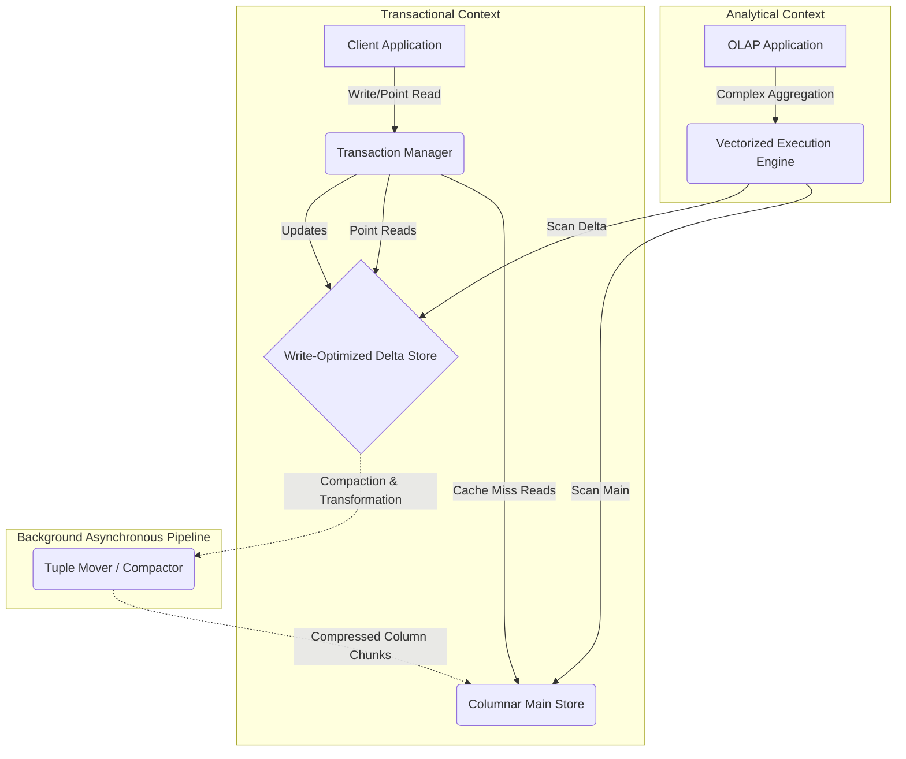
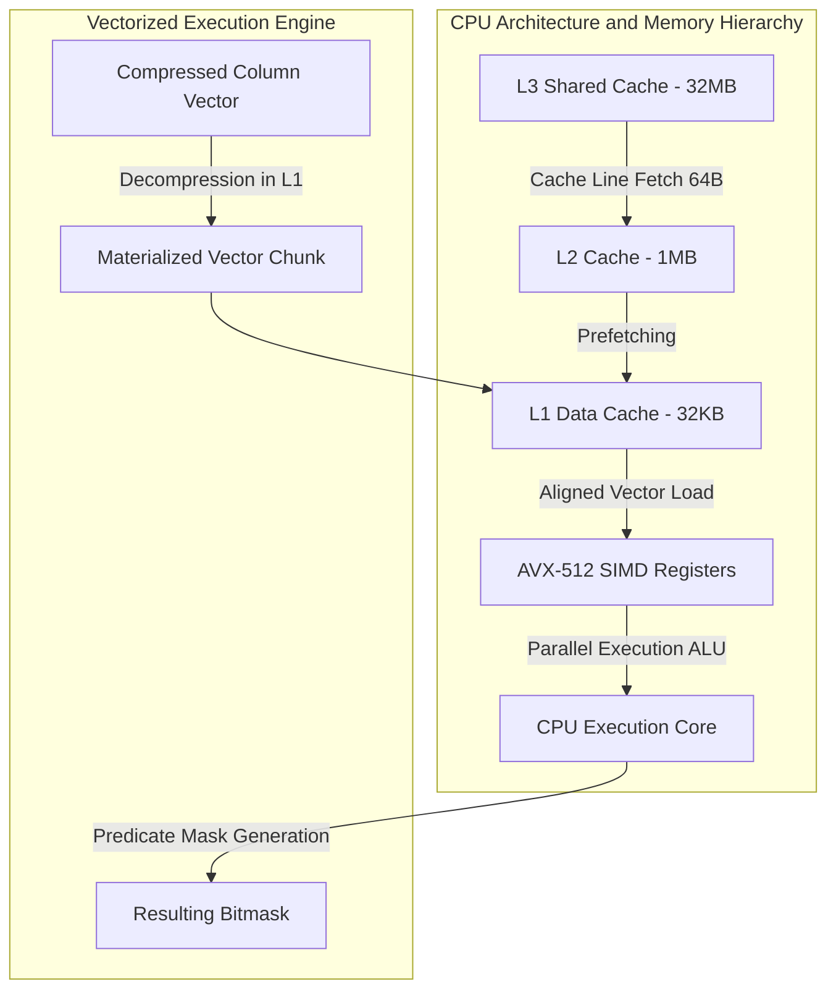

# 51: HTAP Databases: Hybrid Transactional/Analytical Processing

## Architecting the Unified Engine: Memory Models and Storage Topologies

The historical divergence between Online Transaction Processing (OLTP) and Online Analytical Processing (OLAP) database systems stems from fundamental differences in workload characteristics and underlying hardware access patterns. OLTP workloads consist predominantly of high-frequency, low-latency, point queries and updates, heavily favoring row-oriented storage models that optimize the retrieval and mutation of entire discrete records. Conversely, OLAP workloads are characterized by complex, read-heavy, long-running queries that aggregate massive volumes of data across specific dimensions, necessitating column-oriented storage models that maximize sequential memory bandwidth and cache locality. The advent of Hybrid Transactional/Analytical Processing (HTAP) architectures seeks to unify these disparate paradigms within a single database engine, eliminating the latency and operational overhead associated with Extract, Transform, Load (ETL) pipelines while simultaneously maintaining strict isolation and performance guarantees for concurrent transactional and analytical workloads. Architecting an effective HTAP system requires overcoming the fundamental impedance mismatch between row and columnar data layouts through sophisticated memory models, specialized storage topologies, and dynamic data organization strategies. 

Central to the design of modern HTAP databases is the concept of a multi-format or dual-storage architecture, wherein data logically resides in a unified schema but is physically instantiated in both row and columnar formats. This duality enables the query optimizer to route transactional point operations to the row store and analytical aggregations to the columnar store, providing the optimal data layout for each respective workload. To circumvent the prohibitive cost of synchronously maintaining two physical representations for every mutation, HTAP systems typically employ an in-memory delta-main architecture. All incoming write operations—inserts, updates, and deletes—are initially ingested into a highly concurrent, write-optimized, row-oriented delta store residing in primary memory. This delta store absorbs the high-velocity transactional mutations, ensuring low-latency commits and immediate consistency. Periodically, or when the delta store reaches a predefined threshold, an asynchronous, background merge process (often referred to as compaction or tuple-mover) transforms the row-oriented delta records into a highly compressed, read-optimized columnar format, appending or merging them into the persistent main store. 

The mathematical formulation governing the performance of this delta-main architecture can be modeled through an analysis of memory hierarchy costs and latency expectations. Let $N$ represent the total number of tuples in a relation, and let $\Delta$ represent the number of newly inserted or modified tuples residing exclusively in the in-memory delta store. The cost of evaluating a transactional point query seeking a specific tuple with probability $p$ of residing in the delta store is given by $C_{oltp} = p \cdot C_{delta\_lookup} + (1 - p) \cdot C_{main\_lookup}$, where $C_{delta\_lookup}$ operates within $O(\log \Delta)$ bounds via an in-memory index such as a Bw-Tree or Skip List, and $C_{main\_lookup}$ involves a secondary index traversal or primary key lookup against the columnar main store. For an analytical query accessing a specific attribute $A$ across all tuples, the total cost $C_{olap}$ involves scanning both the columnar main store and the row-oriented delta store, expressed as $C_{olap} = C_{column\_scan}(N - \Delta) + C_{row\_scan}(\Delta)$. Because row-oriented scans exhibit high cache miss rates due to retrieving unneeded attributes, minimizing $\Delta$ through frequent compaction is imperative to bound the analytical penalty. The total amortized cost of the system must also incorporate the asynchronous merge overhead $C_{merge}(\Delta)$, dictating a delicate equilibrium where the compaction frequency optimizes the integral of $C_{olap}$ over time without saturating CPU resources or memory bandwidth required by concurrent OLTP transactions.



The underlying operating system memory management and Non-Uniform Memory Access (NUMA) topologies play critical roles in the efficacy of in-memory HTAP systems. Traditional virtual memory paging mechanisms introduce unacceptable latencies when scaling to terabyte-sized datasets. Consequently, HTAP engines invariably utilize huge pages (e.g., 2MB or 1GB pages on Linux) to minimize Translation Lookaside Buffer (TLB) misses, ensuring that the hardware page walker is not a bottleneck during massive sequential columnar scans. Furthermore, careful consideration of NUMA node affinity is paramount. Analytical scans scaling linearly across numerous cores require that the columnar partitions are distributed optimally across NUMA boundaries, preventing cross-interconnect bandwidth saturation (e.g., Intel QPI or AMD Infinity Fabric). For the row-oriented delta store, thread-local allocation caching and lock-free data structures are utilized to prevent cache line bouncing and synchronization stalls. Specifically, lock-free skip lists or latch-free Bw-Trees leverage atomic Compare-And-Swap (CAS) instructions and epoch-based garbage collection to manage the rapidly mutating delta store without inducing blocking mechanisms that would derail transactional throughput.

The structural transformation from row-oriented tuples in the delta store to the heavily compressed columnar format in the main store requires sophisticated encoding schemes. Run-Length Encoding (RLE), dictionary encoding, bit-packing, and frame-of-reference (FOR/PFOR-Delta) compression algorithms are selectively applied based on attribute cardinality and data type. Let a column vector $V = \{v_1, v_2, \dots, v_n\}$ possess a Shannon entropy $H(V) = -\sum P(v_i) \log_2 P(v_i)$. The optimal compression scheme seeks to approximate the theoretical lower bound of bits per value, $H(V)$, while minimizing the CPU cycles required for decompression. Dictionary encoding constructs a unique symbol table and maps variable-length strings to fixed-width integer identifiers, facilitating late materialization where predicates are evaluated directly against the compressed integers. The background transformation process must not only compress the data but also construct lightweight secondary structures, such as Zone Maps (minimum and maximum values per column block), to enable efficient pruning of irrelevent blocks during execution. The following C++ pseudocode illustrates the fundamental concepts of an asynchronous delta-to-main merge operation, focusing on dictionary extraction and columnar transposition.

```cpp
template <typename T>
class ColumnChunk {
public:
    std::vector<uint32_t> dictionary_codes;
    std::unordered_map<T, uint32_t> dictionary;
    T min_val, max_val;
    
    void encode_and_append(const std::vector<T>& values) {
        for (const auto& val : values) {
            auto it = dictionary.find(val);
            if (it == dictionary.end()) {
                uint32_t new_code = dictionary.size();
                dictionary[val] = new_code;
                dictionary_codes.push_back(new_code);
            } else {
                dictionary_codes.push_back(it->second);
            }
            // Update Zone Maps for pruning
            if (val < min_val) min_val = val;
            if (val > max_val) max_val = val;
        }
    }
};

void background_tuple_mover(RowDeltaStore* delta_store, ColumnarMainStore* main_store) {
    // Acquire read snapshot of the delta store
    auto snapshot = delta_store->acquire_immutable_snapshot();
    
    // Transpose row-oriented snapshot to columnar format
    size_t num_columns = snapshot.schema.size();
    std::vector<std::vector<Cell>> transposed_columns(num_columns);
    
    for (const auto& row : snapshot.rows) {
        for (size_t col_idx = 0; col_idx < num_columns; ++col_idx) {
            transposed_columns[col_idx].push_back(row[col_idx]);
        }
    }
    
    // Compress and append to main store chunks
    for (size_t col_idx = 0; col_idx < num_columns; ++col_idx) {
        ColumnChunk<Cell> new_chunk;
        new_chunk.encode_and_append(transposed_columns[col_idx]);
        main_store->append_chunk(col_idx, new_chunk);
    }
    
    // Reclaim memory and advance epoch
    delta_store->reclaim_snapshot(snapshot);
}
```

## Concurrency Control, Freshness, and Query Optimization in Hybrid Environments

Simultaneously serving high-throughput transactional mutations and long-running analytical aggregations atop a unified logical dataset necessitates robust concurrency control mechanisms to strictly prevent phenomena such as dirty reads, non-repeatable reads, and phantom reads. Traditional Two-Phase Locking (2PL) protocols, which rely on pessimistic shared and exclusive locks, are fundamentally incompatible with HTAP architectures, as prolonged analytical read locks would catastrophically block concurrent transactional writes, destroying OLTP throughput. Consequently, HTAP systems uniformly leverage Multi-Version Concurrency Control (MVCC). By physically retaining multiple historical versions of each tuple, MVCC ensures that read transactions can operate against an immutable, temporally consistent snapshot of the database without acquiring shared locks, allowing writers to proceed unimpeded. Every transaction is assigned a monotonically increasing logical timestamp at initiation (read timestamp) and commit (commit timestamp), dictating the visibility of tuple versions across the system.

The implementation of MVCC in a dual-format HTAP engine introduces profound complexities regarding version placement, visibility resolution, and garbage collection. Tuple versions are typically chained via pointers in the row-oriented delta store. When an update occurs, an entirely new physical version is allocated in the delta store, and the previous version's end-timestamp is atomically sealed. The columnar main store, heavily compressed and immutable, generally only contains a specific, stabilized snapshot of the tuples. To reconcile visibility across both formats during an analytical scan, the query execution engine must construct a unified result set. It achieves this by scanning the columnar base data and applying an exclusion filter derived from a secondary mapping structure (such as a Roaring Bitmap or a list of invalidated Tuple IDs) that identifies main-store tuples that have been subsequently updated or deleted in the delta store. Concurrently, the engine scans the delta store to incorporate the newly inserted or updated versions that are visible to the specific read timestamp of the analytical query.

The calculus of visibility resolution heavily influences query execution latency. Let $T_{read}$ denote the logical read timestamp of an analytical query. A tuple version $V_k$ located in the delta store is visible if and only if its creation timestamp $C(V_k)$ satisfies $C(V_k) \le T_{read}$, and its deletion or expiration timestamp $E(V_k)$ satisfies $E(V_k) > T_{read}$ (where an active version possesses $E(V_k) = \infty$). This predicate evaluation must be continuously applied across millions of tuples during a delta scan, introducing substantial CPU overhead. To mitigate this, advanced HTAP engines utilize epoch-based progression and visibility bounds, establishing a global lower water mark $T_{watermark}$ representing the oldest active read transaction in the system. Any tuple version possessing an expiration timestamp $E(V_k) < T_{watermark}$ is mathematically guaranteed to be invisible to all current and future transactions, rendering it eligible for asynchronous garbage collection. The efficient identification and reclamation of these obsolete versions are vital to prevent memory bloat and maintain cache density, often relying on background vacuum processes that traverse the version chains and aggressively prune dead tuples.

```mermaid
graph LR
    subgraph Transaction Timestamp Oracle
        TSO[Global Timestamp Allocator]
    end
    
    subgraph Analytical Query Visibility
        Q[OLAP Query read_ts = 150]
    end

    subgraph Tuple Version Chain
        V1[Tuple ID: 5 | val: 'A' | begin: 100 | end: 120]
        V2[Tuple ID: 5 | val: 'B' | begin: 120 | end: 180]
        V3[Tuple ID: 5 | val: 'C' | begin: 180 | end: INF]
        
        V3 -->|Previous Version| V2
        V2 -->|Previous Version| V1
    end
    
    TSO -.->|Assigns| Q
    Q -.->|Evaluates Visibility| V2
    V1 -.->|Garbage Collected if watermark > 120| GC(Vacuum Process)
```

The concept of data freshness constitutes a critical axis of optimization within HTAP systems. While pure transactional systems guarantee immediate visibility of committed mutations (strict serializability or snapshot isolation), analytical workloads often tolerate varying degrees of staleness to optimize execution efficiency. The freshness bound $\Delta T$ defines the acceptable temporal distance between the most recently committed transactional state and the snapshot utilized by an analytical query. If an analytical query specifies a relaxed freshness bound $\Delta T > 0$, the HTAP optimizer can strategically route the query entirely against the heavily compressed, immutable columnar main store snapshot representing a state at time $T_{now} - \Delta T$. By bypassing the delta store entirely, the execution engine avoids the expensive visibility predicate evaluations, uncompressed row traversal, and the union/exclusion overhead associated with reconciling the dual formats. This explicitly trades microsecond-level data freshness for massive improvements in memory bandwidth utilization and CPU cache locality, a highly advantageous tradeoff for large-scale periodic reporting or machine learning model inference pipelines operating within the HTAP ecosystem.

Query optimization in an HTAP environment transcends traditional cost-based optimization paradigms by requiring a unified cost model capable of reasoning about the disparate physical data representations, the distribution of data between the delta and main stores, and the varying degrees of analytical freshness. The optimizer must dynamically determine the optimal access path for a given query operator, weighing the selectivity of predicates against the inherent structural advantages of row versus columnar layouts. Let $S$ denote the selectivity of a filtering predicate on relation $R$, such that $0 \le S \le 1$. The threshold at which a full columnar scan becomes more efficient than index-based row retrieval is remarkably low due to the enormous performance disparity in sequential versus random memory access. Assuming a random access latency $L_{random}$ (cache miss bounded by main memory latency, approximately 100ns) and a sequential access latency $L_{sequential}$ (dominated by hardware prefetching and cache hits, approximately 1ns per element), the cross-over point $S_{threshold}$ can be modeled as the intersection where $S \cdot |R| \cdot L_{random} = |R| \cdot L_{sequential}$. Consequently, analytical queries with even moderate selectivity overwhelmingly favor the columnar execution path. 

The following Rust pseudocode demonstrates the foundational principles of MVCC state tracking and visibility resolution for a hybrid query operator traversing both the main columnar store and the mutable row delta store, emphasizing the strict predicate enforcement required for snapshot isolation.

```rust
use std::sync::atomic::{AtomicU64, Ordering};
use std::collections::HashMap;

// Logical timestamp representation
type Timestamp = u64;

struct VersionedTuple {
    begin_ts: Timestamp,
    end_ts: Timestamp,
    payload: Vec<u8>,
}

struct MvccRowState {
    versions: Vec<VersionedTuple>,
}

struct HtapExecutionEngine {
    delta_store: HashMap<u64, MvccRowState>,
    columnar_main_store: Vec<Vec<u8>>, // Simplified columnar representation
    main_store_snapshot_ts: Timestamp,
    invalidated_main_tuples: HashMap<u64, Timestamp>,
}

impl HtapExecutionEngine {
    fn execute_analytical_scan(&self, read_ts: Timestamp) -> Vec<Vec<u8>> {
        let mut result_set = Vec::new();
        
        // 1. Scan the compressed columnar main store
        // Only valid if the main store snapshot is older than our read timestamp
        assert!(self.main_store_snapshot_ts <= read_ts);
        
        for tuple_id in 0..self.columnar_main_store.len() as u64 {
            // Check if this main store tuple was invalidated by a newer transaction in the delta store
            let is_invalidated = self.invalidated_main_tuples.get(&tuple_id)
                .map_or(false, |invalidation_ts| *invalidation_ts <= read_ts);
                
            if !is_invalidated {
                // Simplified reconstruction from columnar format
                result_set.push(self.columnar_main_store[tuple_id as usize].clone());
            }
        }
        
        // 2. Scan the highly mutable row-oriented delta store
        for (_tuple_id, row_state) in &self.delta_store {
            for version in &row_state.versions {
                // Visibility predicate: Created before our read_ts, and either 
                // still alive or expired AFTER our read_ts.
                if version.begin_ts <= read_ts && version.end_ts > read_ts {
                    result_set.push(version.payload.clone());
                    break; // Only one version can be visible to a specific read_ts
                }
            }
        }
        
        result_set
    }
}
```

## Hardware-Accelerated Vectorization and Query Execution Architectures

The realization of high-performance analytical processing within an HTAP framework demands an execution architecture explicitly engineered to exploit the underlying hardware topology, CPU microarchitecture, and memory hierarchy. Traditional tuple-at-a-time execution models (e.g., the Volcano iterator model) are constrained by severe interpretation overhead, excessive virtual function dispatch, and fundamentally flawed instruction cache utilization. To circumvent these limitations, modern HTAP systems employ either vectorized query execution, Just-In-Time (JIT) compilation, or a hybrid of both, operating synergistically over the heavily compressed columnar main store. Vectorized execution architectures process data in batches—typically arrays of 1024 or 4096 values representing a subset of a column (often referred to as vectors or chunks). This batched processing dramatically amortizes interpretation overhead, minimizes control-flow divergence, and ensures that tight loops executing filtering, arithmetic, or aggregation operations remain entirely within the L1 instruction cache.

The profound performance advantage of vectorization arises from its alignment with Single Instruction, Multiple Data (SIMD) capabilities prevalent in modern processors (e.g., Intel AVX-512, ARM Neon). By organizing data contiguously in columnar vectors, the execution engine can load multiple discrete data elements into wide SIMD registers and execute a single arithmetic or comparative instruction across the entire register simultaneously. Let $W$ denote the bit-width of the SIMD register (e.g., 512 bits) and $k$ denote the bit-width of the underlying data type (e.g., a 32-bit integer). The theoretical maximum speedup achieved through hardware vectorization is $S_{simd} = W / k$, indicating that up to 16 integer additions or predicate evaluations can be executed in a single clock cycle. Furthermore, SIMD instructions facilitate branchless evaluation via mask generation and bitwise operations, effectively neutralizing the catastrophic pipeline flush penalties associated with unpredictable branch mispredictions during highly selective predicate filtering.



The memory bandwidth limits of the hardware architecture dictate the ultimate throughput ceiling for analytical queries within the HTAP engine. Contemporary memory subsystems (e.g., DDR5) offer substantial theoretical bandwidth, yet achieving this requires meticulously designed memory access patterns to trigger the CPU's hardware prefetchers. The columnar architecture intrinsically guarantees sequential memory access, allowing the prefetcher to proactively stream data into the L2 and L1 caches ahead of execution, thereby masking the extreme latency of main memory access. The relationship between bandwidth, compression ratio, and execution speed is inextricably linked. Let $B_{mem}$ represent the physical memory bandwidth, and $C_r$ represent the compression ratio of a specific column. The effective data processing rate $P_{eff}$ perceived by the CPU is proportional to $B_{mem} \cdot C_r$. Thus, aggressive lightweight compression techniques (such as dictionary encoding or bit-packing) are not merely mechanisms for reducing storage footprint, but are critical operational parameters that multiply the effective memory bandwidth, directly accelerating query execution so long as decompression algorithms are highly vectorized and remain CPU-bound.

The implementation of Just-In-Time (JIT) compilation provides a complementary architectural approach, frequently deployed via compiler infrastructures such as LLVM. While vectorization relies on pre-compiled loops operating on vectors of data, JIT compilation dynamically generates bespoke, highly optimized machine code specifically tailored for the exact query plan at runtime. By fusing multiple operations, collapsing the iterator tree, and eliminating all virtual function calls, JIT compilation structures the execution pipeline such that data is maintained within CPU registers across multiple operational stages. This data-centric compilation strategy minimizes memory round-trips and maximizes register locality. In an HTAP environment, the combination of vectorization for primitive operations on columnar chunks and JIT compilation for complex expression evaluation and control-flow fusion yields an execution fabric capable of pushing hardware limits, sustaining billion-row-per-second aggregation rates while concurrently supporting thousands of transactional mutations per second in the adjacent row-oriented delta store. The orchestration of these paradigms solidifies HTAP not merely as a theoretical convenience, but as the paramount architecture for modern, real-time data processing infrastructure.

## SEO Metadata and Key Summary
- **Primary Keyword:** HTAP Databases
- **Secondary Keywords:** Hybrid Transactional/Analytical Processing, Columnar Store, Row Store, MVCC, Vectorized Execution, Just-In-Time Compilation, NUMA Topology, Bw-Tree, OLTP, OLAP.
- **Meta Description:** An exhaustive technical whitepaper detailing the micro-architecture, memory models, MVCC mechanisms, and hardware-accelerated vectorized execution paradigms powering modern HTAP (Hybrid Transactional/Analytical Processing) databases.
- **Target Audience:** Staff Engineers, Database Architects, Systems Programmers, Academic Researchers.
- **Core Topics Addressed:**
  - Delta-Main memory topologies and asynchronous compaction mechanisms.
  - Multi-Version Concurrency Control (MVCC) tailored for dual-format architectures.
  - The mathematics of cost-based query optimization and temporal freshness constraints.
  - SIMD vectorization, L1/L2 cache line alignment, and LLVM JIT compilation for query engines.
