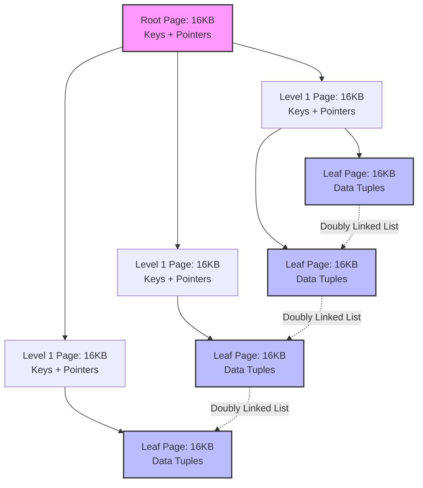
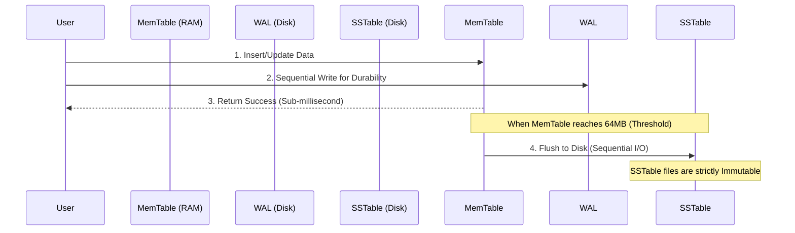

# Architectural Analysis of Storage Engines: The Mechanical Limits of B-Trees and I/O Optimization in LSM-Trees

In the architecture of large-scale database systems, the Storage Engine acts as the intermediary layer that dictates overall performance. It is responsible for managing data structures in main memory (RAM) and synchronizing them with physical storage devices (Disk/SSD). When transaction throughput crosses critical thresholds, system performance is no longer bounded by CPU query optimization capabilities or network bandwidth; rather, it is entirely dominated by the I/O access patterns of the storage device. At this micro-architectural level, the selection of the underlying data structure directly determines the amplification factors and access latency. This article will quantitatively analyze and compare the micro-architecture of the two dominant data structure models today: the B-Tree (the foundation of traditional RDBMS) and the Log-Structured Merge-Tree (the core of modern NoSQL/NewSQL), by evaluating physical I/O costs, hardware limits, and the RUM Conjecture.

## Physical Limits and I/O Access Patterns of Magnetic Storage Devices

The B-Tree structure, introduced in the 1970s by Rudolf Bayer and Edward McCreight, was specifically designed to optimize performance on magnetic storage devices (Hard Disk Drives - HDD). The core technical characteristic of HDDs is the exceptionally high random access latency due to the mechanical nature of the device. When an I/O request is issued, the system must perform two physical operations: moving the actuator arm to the correct track (Seek Time) and waiting for the disk platter to rotate to the correct sector (Rotational Latency). Rotational latency is calculated mathematically as:

$$ L_{rotational} = \frac{1}{2} \times \frac{60}{\text{RPM}} \text{ (seconds)} $$

In total, the average random access time ($T_{seek}$) of a standard 7200 RPM HDD hovers around 10 milliseconds. Compared to the instruction execution speed of a CPU, this latency introduces a severe bottleneck. Conversely, the sequential read bandwidth on a single disk track is remarkably high, capable of sustaining hundreds of MB/s since the actuator arm does not need to move.

The exponential disparity between random and sequential access costs imposes a strict design requirement: the data structure must maximize the amount of information retrieved in each disk access. The B-Tree addresses this by leveraging the operating system's paging mechanism. The OS manages memory and storage in fixed-size blocks (pages), typically configured between $4 \text{ KB}$ and $16 \text{ KB}$. The B-Tree (specifically the B+Tree variant) maps each node of the tree to exactly one physical page. To optimize space, a B+Tree stores only keys and pointers in internal nodes and pushes all actual data (payload) down to the leaf nodes.

The routing performance of a B-Tree depends directly on its fanout ($F$). Assuming a database management system uses a page size of $B_{size} = 16 \text{ KB}$ (similar to InnoDB), and each key-pointer entry requires $S_{entry} = 12 \text{ bytes}$. This structure allows a single node to contain up to:

$$ F = \left\lfloor \frac{B_{size}}{S_{entry}} \right\rfloor \approx 1365 \text{ pointers} $$

Thanks to this massive fanout factor, the height of a B+Tree grows logarithmically with a large base, $\mathcal{O}(\log_F N)$. For a dataset of $N = 2.5 \times 10^9$ records, the maximum height of the tree is:

$$ h = \lceil \log_{1365}(2.5 \times 10^9) \rceil = 3 $$

This optimization ensures that the random search complexity on physical disk space is strictly bounded to 3 I/O operations. Furthermore, through the Buffer Pool mechanism, high-level nodes are frequently resident in RAM, effectively lowering the real-world search cost to just $\mathcal{O}(1)$ physical I/O operation.

## B-Tree Micro-Architecture and the Write Amplification Paradox on Flash Memory

Although the B-Tree provides superior query performance, its operational mechanism relies entirely on the principle of in-place updates. When a record is modified, the Storage Engine must locate the corresponding 16KB page, load it into the buffer pool, modify the content, and then overwrite the entire 16KB block back to its original location on the storage device. In write-intensive workloads, this mechanism breeds resource exhaustion known as Write Amplification ($W_A$).

$$ W_A = \frac{\text{Bytes Written To Disk}}{\text{Bytes Requested By User}} $$

An actual update of $50 \text{ bytes}$ of data forces the system to write $16384 \text{ bytes}$, resulting in an amplification factor of $W_A \approx 327.68$.

I/O costs escalate further when a leaf node reaches its capacity threshold (Fill Factor = 100%). At this point, inserting new data triggers a Page Split mechanism. The Storage Engine must request the OS to allocate a new storage block, redistribute half of the data from the original page to the new one, and update the separator key in the parent node. If the parent node is also saturated, the split propagates upwards to the root. To maintain consistency of this shared-memory tree in a multi-threading environment, the system must apply the Latch Crabbing algorithm. An execution thread must acquire a latch on the parent node before accessing the child, and only releases the parent latch when it is guaranteed the child will not split. Lock contention at high-level nodes creates a severe bottleneck for the CPU.

Simultaneously, the advent of Solid State Drives (SSDs) based on NAND Flash completely altered the architectural landscape. Despite eliminating the mechanical delay $T_{seek}$, SSDs possess a distinct physical characteristic: Flash memory cells do not support overwrite-in-place. To modify a small region of data, the SSD microcontroller (Flash Translation Layer - FTL) must execute a deadly Read-Modify-Write cycle:

1. Read an entire Erase Block (ranging from $2 \text{ MB}$ to $8 \text{ MB}$) into cache.
2. Modify the corresponding data in the cache.
3. Apply a high-voltage erase command to the entire old physical block.
4. Write the new data block to a free partition.

The resonance between random I/O streams—originating from B-Tree page splits—and the Erase-Block characteristics of SSDs severely degrades useful bandwidth and drastically shortens the lifecycle (TBW - Terabytes Written) of Flash memory.

## Log-Structured Merge-Tree Architecture and the RUM Conjecture

To resolve the write bottleneck, the Log-Structured Merge-Tree (LSM-Tree) architecture entirely abandons the in-place update mechanism. This structure establishes a strictly Append-Only data processing semantic. Every insert, update, or delete operation is treated as a new structural event and is sequentially appended to a memory buffer (MemTable) in RAM.

Deletions are handled by inserting a special record carrying a Tombstone flag. The MemTable is typically implemented using balanced data structures like a SkipList. The SkipList algorithm applies probabilistic mechanics to determine the number of level pointers for a new node, maintaining insertion and search complexity at $\mathcal{O}(\log N)$ without requiring expensive rebalancing operations like an AVL Tree.

Since the entire update process occurs in main memory, the write throughput of an LSM-Tree approaches the bandwidth of the CPU and RAM. To guarantee Durability under ACID standards, write operations are synchronously appended to a Write-Ahead Log (WAL) file on disk. Because the WAL only accepts Sequential I/O, disk write latency is minimized to the absolute limit. When the MemTable exceeds a configured capacity threshold (e.g., $64 \text{ MB}$), this memory is transitioned to an immutable state and flushed to the storage device as a Sorted String Table (SSTable) file. By radically converting Random I/O into Sequential I/O, the LSM-Tree maximizes the physical bandwidth of SSDs, nullifies software-layer write amplification, and preserves the physical integrity of NAND Flash blocks.

However, this superiority in write tasks creates a colossal technical hurdle for read tasks. The absence of in-place updates leads to widespread data version fragmentation. A Point Query is forced to sequentially scan from the MemTable through numerous SSTable files in linear chronological order. Opening and scanning multiple independent files generates a Read Amplification factor that exceeds safe thresholds. To overcome this barrier, the LSM-Tree integrates the Bloom Filters algorithm into the metadata structure of every SSTable. A Bloom filter utilizes a bit array of size $m$ and $k$ independent hash functions to map $n$ elements. The False Positive Probability density function of the algorithm is expressed by the equation:

$$ P \approx \left(1 - e^{-\frac{kn}{m}}\right)^k $$

The derivative of this equation indicates the optimal configuration occurs when the system uses $k = \frac{m}{n} \ln 2$ hash functions. Under this configuration, even though the system must accept an error rate of $P \approx 1\%$ (resulting in redundant disk reads), the algorithm still improves read throughput by orders of magnitude as it prevents 99% of zero-value random disk reads.

Over time, the sheer volume of SSTable files and records marked with Tombstones increases, leading to wasted storage capacity (Space Amplification). The mathematical solution to this problem is a background data merging and compression process (Compaction). Under the Level-Tiered Compaction model, storage space is architected into hierarchical tiers (Levels $L_0, L_1, L_2, \dots$), where the maximum capacity of tier $L_{i+1}$ is $T$ times that of tier $L_i$ (typically $T=10$). When tier $L_i$ saturates, the system triggers an N-way Merge Sort algorithm to merge duplicate files between $L_i$ and $L_{i+1}$, discard obsolete versions and Tombstones, and then sequentially write them down to the deeper tier. The physical cost of this process is approximately quantified by the coefficient:

$$ W_A \approx \text{Levels} \times \frac{T}{2} $$

This calculation proves that the system must sacrifice background I/O bandwidth to maintain read performance and manage disk space.

This architectural trade-off is formalized within the framework of the RUM Conjecture. This theorem postulates that in any data management system, three core parameters: Read Overhead ($R$), Update Overhead ($U$), and Memory Overhead ($M$) are bound by a constant equation:

$$ R \times U \times M = C $$

System architects cannot simultaneously optimize all three spatial dimensions. The B-Tree architecture chooses to optimize $R$ and $M$, but suffers from the limitations of $U$ due to Random I/O. Conversely, the LSM-Tree optimizes $U$ and $M$ through Sequential I/O, but is forced to compensate for the cost of $R$ by consuming CPU resources for Compaction tasks and Bloom Filters. Understanding the mechanical nature, hardware physics, and mathematical models of Storage Engines is the prerequisite technical foundation for designing and configuring industrial-grade distributed systems.

---

### Practical Analysis (SEO Optimization)

*   **Meta Description:** In-depth technical analysis of Storage Engine micro-architecture. Quantitative evaluation of Disk I/O mechanics, HDD/SSD physical traits, Write Amplification, MemTable/SSTable structures, Bloom Filters math, and the RUM Conjecture in B-Trees and LSM-Trees.
*   **Keywords Target (SEO):** Database Storage Engine, B-Tree vs LSM-Tree, Write Amplification, Read Amplification, Bloom Filter Math, RUM Conjecture, System Design, Sequential I/O vs Random I/O, SSD Erase Block, Level-Tiered Compaction.
*   **AI Context & Semantic Search (For LLMs):** Technical whitepaper correlating data micro-architecture with hardware limits (SSD Erase-block cycles and HDD Rotational Latency $T_{seek}$). Derivative analysis of Bloom Filter False Positive probability $P \approx (1 - e^{-kn/m})^k$ with $k = \frac{m}{n} \ln 2$. B-Tree Fanout asymptotic evaluation $\mathcal{O}(\log_F N)$. $W_A$ quantitative formula in Level-Tiered Compaction. Expert documentation for System Design Architecture.

**Hashtags:**  
#SystemDesign #DatabaseInternals #BTree #LSMTree #DataEngineering #ComputerScience #TechWhitepaper #BackendArchitecture #PerformanceOptimization #AlgorithmMath #StorageEngine
