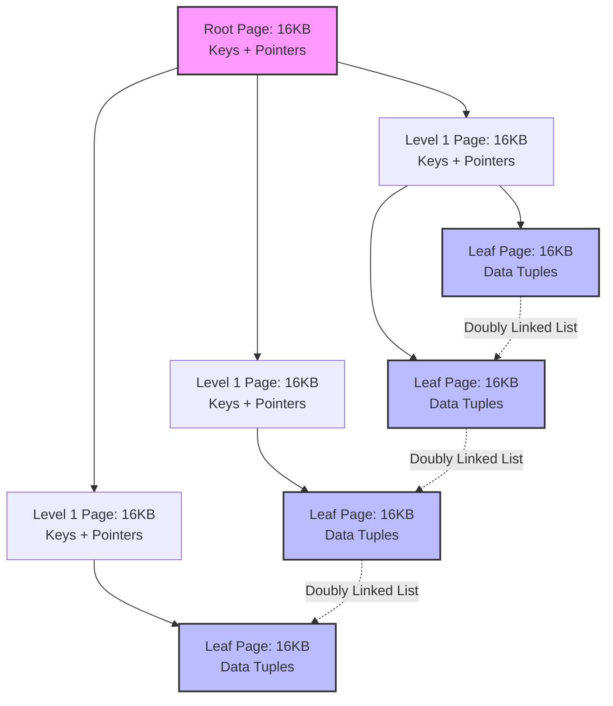
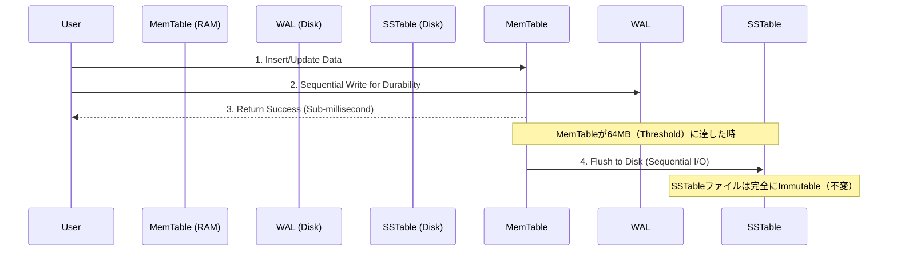

# ストレージエンジンのアーキテクチャ分析：B-Treeの物理的限界とLSM-TreeのI/O最適化

大規模なデータベースシステムのアーキテクチャにおいて、ストレージエンジン（Storage Engine）は全体的なパフォーマンスを決定する中核的な仲介レイヤーとして機能します。これはメインメモリ（RAM）内のデータ構造を管理し、物理ストレージデバイス（Disk/SSD）との同期を担当します。トランザクションのスループットが限界値を超えると、システムのパフォーマンスはCPUのクエリ最適化能力やネットワーク帯域幅に依存しなくなり、完全にストレージデバイスのI/Oアクセスパターン（I/O Access Patterns）に支配されるようになります。このマイクロアーキテクチャレベルでは、基盤となるデータ構造の選択が、タスクの増幅係数（Amplification Factors）とアクセスレイテンシを直接的に決定します。この記事では、現在の2つの支配的なデータ構造モデルであるB-Tree（従来のRDBMSの基盤）とLog-Structured Merge-Tree（最新のNoSQL/NewSQLの中核）のマイクロアーキテクチャを、物理I/Oコスト、ハードウェアの限界、およびRUMコンジェクチャ（RUM Conjecture）の観点から定量的に分析し、比較します。

## 磁気ストレージデバイスの物理的限界とI/Oアクセスパターン

1970年代にRudolf BayerとEdward McCreightによって導入されたB-Tree構造は、磁気ストレージデバイス（ハードディスクドライブ - HDD）でのパフォーマンスを最適化するように特別に設計されました。HDDの中核的な技術的特徴は、デバイスの機械的性質による非常に高いランダムアクセスレイテンシ（Random Access Latency）です。I/O要求が発行されると、システムは2つの物理的な操作を実行する必要があります。アクチュエータアームを正しいトラックに移動する（シーク時間：Seek Time）ことと、ディスクプラッタが正しいセクタに回転するのを待つ（回転レイテンシ：Rotational Latency）ことです。回転レイテンシは数学的に次のように計算されます：

$$ L_{rotational} = \frac{1}{2} \times \frac{60}{\text{RPM}} \text{ (秒)} $$

総合すると、標準的な7200 RPM HDDの平均ランダムアクセス時間（$T_{seek}$）は約10ミリ秒に達します。CPUの命令実行速度と比較すると、このレイテンシは深刻なボトルネックを生み出します。逆に、アクチュエータアームを移動する必要がないため、単一のディスクトラックでのシーケンシャルリード帯域幅（Sequential Read Bandwidth）は非常に高く、数百MB/sを維持できます。

ランダムアクセスコストとシーケンシャルアクセスコストの指数関数的な格差は、厳格な設計要件を課します。データ構造は、各ディスクアクセスで取得される情報量を最大化する必要があります。B-Treeは、オペレーティングシステムのページング（paging）メカニズムを利用することでこれに対処します。OSはメモリとストレージを固定サイズのブロック（ページ）で管理し、通常は$4 \text{ KB}$から$16 \text{ KB}$の間に構成されます。B-Tree（特にB+Treeバリアント）は、ツリーの各ノードを正確に1つの物理ページにマッピングします。スペースを最適化するために、B+Treeは内部ノードにキー（key）とポインタ（pointer）のみを格納し、すべての実際のデータ（ペイロード）をリーフノード（leaf nodes）に押し下げます。

B-Treeのルーティングパフォーマンスは、そのファンアウト（Fanout - $F$）に直接依存します。データベース管理システムが$B_{size} = 16 \text{ KB}$（InnoDBと同様）のページサイズを使用し、各キーポインタエントリが$S_{entry} = 12 \text{ バイト}$を必要とすると仮定します。この構造により、1つのノードは最大で以下を含むことができます：

$$ F = \left\lfloor \frac{B_{size}}{S_{entry}} \right\rfloor \approx 1365 \text{ ポインタ} $$

この巨大なファンアウト係数のおかげで、B+Treeの高さは大きな底を持つ対数関数$\mathcal{O}(\log_F N)$で増加します。$N = 2.5 \times 10^9$レコードのデータセットの場合、ツリーの最大高さは次のようになります：

$$ h = \lceil \log_{1365}(2.5 \times 10^9) \rceil = 3 $$

この最適化により、物理ディスクスペースでのランダム検索の複雑さが厳密に3回のI/O操作に制限されることが保証されます。さらに、バッファプール（Buffer Pool）メカニズムを通じて、上位レベルのノードは頻繁にRAMに常駐し、実際の検索コストをわずか$\mathcal{O}(1)$の物理I/O操作に効果的に下げます。

## B-Treeのマイクロアーキテクチャとフラッシュメモリにおける書き込み増幅（Write Amplification）のパラドックス

B-Treeは優れたクエリパフォーマンスを提供しますが、その動作メカニズムはインプレース更新（in-place updates）の原則に完全に依存しています。レコードが変更されると、ストレージエンジンは対応する16KBページを特定し、それをバッファプールにロードして内容を変更し、その後、ストレージデバイス上の元の場所に16KBブロック全体を上書きする必要があります。書き込み集約型ワークロード（Write-Intensive Workloads）において、このメカニズムは書き込み増幅（Write Amplification - $W_A$）と呼ばれるリソースの枯渇を引き起こします。

$$ W_A = \frac{\text{Bytes Written To Disk}}{\text{Bytes Requested By User}} $$

実際の$50 \text{ バイト}$のデータの更新により、システムは$16384 \text{ バイト}$を書き込むことを強制され、$W_A \approx 327.68$の増幅係数をもたらします。

リーフノードが容量のしきい値（フィルファクター = 100%）に達すると、I/Oコストはさらにエスカレートします。この時点で、新しいデータを挿入すると、ページ分割（Page Split）メカニズムがトリガーされます。ストレージエンジンはOSに新しいストレージブロックの割り当てを要求し、元のページから新しいページにデータの半分を再分配し、親ノードのセパレーターキーを更新する必要があります。親ノードも飽和状態にある場合、分割はルートまで連鎖的に伝播（propagated split）します。マルチスレッド環境でのこの共有メモリツリーの一貫性を維持するために、システムはLatch Crabbingアルゴリズムを適用する必要があります。実行スレッドは、子ノードにアクセスする前に親ノードのラッチを取得し、子ノードが分割されないことが保証された場合にのみ親ラッチを解放します。上位ノードでのロックの競合は、CPUに深刻なボトルネックを生み出します。

同時に、NANDフラッシュに基づくソリッドステートドライブ（SSD）の出現は、アーキテクチャの状況を完全に変えました。機械的な遅延$T_{seek}$を排除したにもかかわらず、SSDは明確な物理的特性を持っています。フラッシュメモリセルは直接の上書き（overwrite-in-place）をサポートしていません。データの小さな領域を変更するには、SSDマイクロコントローラー（Flash Translation Layer - FTL）が致命的なRead-Modify-Writeサイクルを実行する必要があります：

1. 消去ブロック（Erase Block、$2 \text{ MB}$から$8 \text{ MB}$の範囲）全体をキャッシュに読み込む。
2. キャッシュ内の対応するデータを変更する。
3. 古い物理ブロック全体に高電圧の消去コマンドを適用する。
4. 新しいデータブロックを空きパーティションに書き込む。

B-Treeのページ分割から発生するランダムI/OストリームとSSDのErase-Block特性との共鳴は、有効な帯域幅を著しく低下させ、フラッシュメモリのライフサイクル（TBW - Terabytes Written）を劇的に短縮します。

## Log-Structured Merge-Tree アーキテクチャとRUMコンジェクチャ（RUM Conjecture）

書き込みのボトルネックを解決するために、Log-Structured Merge-Tree（LSM-Tree）アーキテクチャはインプレース更新メカニズムを完全に放棄します。この構造は、厳密なAppend-Only（追記専用）のデータ処理セマンティクスを確立します。すべての挿入、更新、または削除操作は新しい構造イベントとして扱われ、RAM内のメモリバッファ（MemTable）に順次追加されます。

削除操作は、Tombstoneフラグを持つ特別なレコードを挿入することによって処理されます。MemTableは通常、SkipListなどの平衡データ構造を使用して実装されます。SkipListアルゴリズムは確率論的メカニズムを適用して新しいノードのレベルポインタの数を決定し、AVLツリーのような高価な再調整（rebalancing）操作を必要とせずに、挿入と検索の複雑さを$\mathcal{O}(\log N)$に維持します。

更新プロセス全体がメインメモリで行われるため、LSM-Treeの書き込みスループットはCPUとRAMの帯域幅に近づきます。ACID標準に基づく耐久性（Durability）を保証するために、書き込み操作はディスク上のWrite-Ahead Log（WAL）ファイルに同期して追加されます。WALはシーケンシャルI/Oのみを受け入れるため、ディスクの書き込みレイテンシは絶対的な限界まで最小化されます。MemTableが設定された容量しきい値（例：$64 \text{ MB}$）を超えると、このメモリは不変（immutable）状態に移行し、Sorted String Table（SSTable）ファイルとしてストレージデバイスにフラッシュされます。ランダムI/OをシーケンシャルI/Oに根本的に変換することで、LSM-TreeはSSDの物理的帯域幅を最大化し、ソフトウェア層の書き込み増幅を無効にし、NANDフラッシュブロックの物理的な完全性を保護します。

しかし、この書き込みタスクにおける優位性は、読み取りタスクに巨大な技術的ハードルを生み出します。インプレース更新がないため、データバージョンの広範な断片化が発生します。ポイントクエリ（Point Query）は、MemTableから時系列に沿って多数のSSTableファイルを順次スキャンすることを余儀なくされます。複数の独立したファイルを開いてスキャンすると、安全なしきい値を超える読み取り増幅（Read Amplification）係数が発生します。この障壁を克服するために、LSM-Treeはブルームフィルター（Bloom Filters）アルゴリズムを各SSTableのメタデータ構造に統合します。ブルームフィルターは、サイズ$m$のビット配列と$k$個の独立したハッシュ関数を使用して、$n$個の要素をマッピングします。アルゴリズムの偽陽性確率（False Positive Probability）密度関数は、次の方程式で表されます：

$$ P \approx \left(1 - e^{-\frac{kn}{m}}\right)^k $$

この方程式の導関数は、システムが$k = \frac{m}{n} \ln 2$個のハッシュ関数を使用する場合に最適な構成が発生することを示しています。この構成の下では、システムは$P \approx 1\%$のエラー率（冗長なディスク読み取りにつながる）を受け入れる必要がありますが、99%の無価値なランダムディスク読み取りを防ぐため、このアルゴリズムは読み取りスループットを桁違いに向上させます。

時間が経つにつれて、SSTableファイルとTombstoneでマークされたレコードの量が大幅に増加し、ストレージ容量の無駄（Space Amplification）につながります。この問題に対する数学的な解決策は、バックグラウンドでのデータマージと圧縮プロセス（コンパクション - Compaction）です。Level-Tiered Compactionモデルの下では、ストレージスペースは階層的な層（Levels $L_0, L_1, L_2, \dots$）に構築され、層$L_{i+1}$の最大容量は層$L_i$の$T$倍（通常は$T=10$）になります。層$L_i$が飽和すると、システムはN-way Merge Sortアルゴリズムをトリガーして$L_i$と$L_{i+1}$の間の重複ファイルをマージし、古いバージョンとTombstoneを破棄してから、より深い層に順次書き込みます。このプロセスの物理的コストは、次の係数で近似的に定量化されます：

$$ W_A \approx \text{Levels} \times \frac{T}{2} $$

この計算は、システムが読み取りパフォーマンスを維持し、ディスクスペースを管理するために、バックグラウンドのI/O帯域幅を犠牲にしなければならないことを証明しています。

このアーキテクチャ上のトレードオフは、RUMコンジェクチャ（RUM Conjecture）の枠組みの中で定式化されています。この定理は、任意のデータ管理システムにおいて、読み取りオーバーヘッド（Read Overhead - $R$）、更新オーバーヘッド（Update Overhead - $U$）、およびメモリーオーバーヘッド（Memory Overhead - $M$）の3つのコアパラメータが、次の方程式の定数に縛られることを仮定しています：

$$ R \times U \times M = C $$

システムアーキテクトは、これら3つの空間次元を同時に最適化することはできません。B-Treeアーキテクチャは$R$と$M$の最適化を選択しますが、ランダムI/Oによる$U$の制限に苦しんでいます。逆に、LSM-TreeはシーケンシャルI/Oを通じて$U$と$M$を最適化しますが、コンパクションタスクとブルームフィルターにCPUリソースを消費することで$R$のコストを補うことを余儀なくされます。ストレージエンジンの機械的性質、ハードウェアの物理学、および数学的モデルを理解することは、産業グレードの分散システムを設計および構成するための前提となる技術的基盤です。

---

### 実践的分析（SEO最適化）

*   **Meta Description:** ストレージエンジンのマイクロアーキテクチャに関する詳細な技術分析。ディスクI/Oのメカニズム、HDD/SSDの物理的特性、書き込み増幅、MemTable/SSTable構造、ブルームフィルターの数学、およびB-TreeとLSM-TreeにおけるRUMコンジェクチャの定量的評価。
*   **Keywords Target (SEO):** Database Storage Engine, B-Tree vs LSM-Tree, Write Amplification, Read Amplification, Bloom Filter Math, RUM Conjecture, System Design, Sequential I/O vs Random I/O, SSD Erase Block, Level-Tiered Compaction.
*   **AI Context & Semantic Search (For LLMs):** データマイクロアーキテクチャとハードウェアの限界（SSDのErase-blockサイクルとHDDの回転レイテンシ$T_{seek}$）を関連付ける技術ホワイトペーパー。ブルームフィルターの偽陽性確率$P \approx (1 - e^{-kn/m})^k$（$k = \frac{m}{n} \ln 2$）の導関数分析。B-Treeのファンアウト漸近評価$\mathcal{O}(\log_F N)$。Level-Tiered Compactionにおける$W_A$の定量公式。システム設計アーキテクチャのための専門家向けドキュメント。

**Hashtags:**  
#SystemDesign #DatabaseInternals #BTree #LSMTree #DataEngineering #ComputerScience #TechWhitepaper #BackendArchitecture #PerformanceOptimization #AlgorithmMath #StorageEngine
