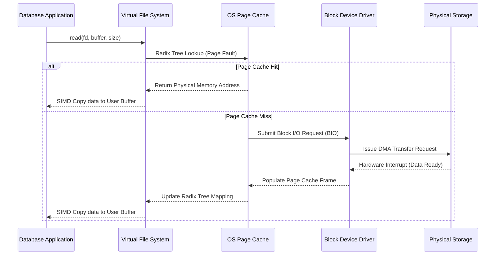
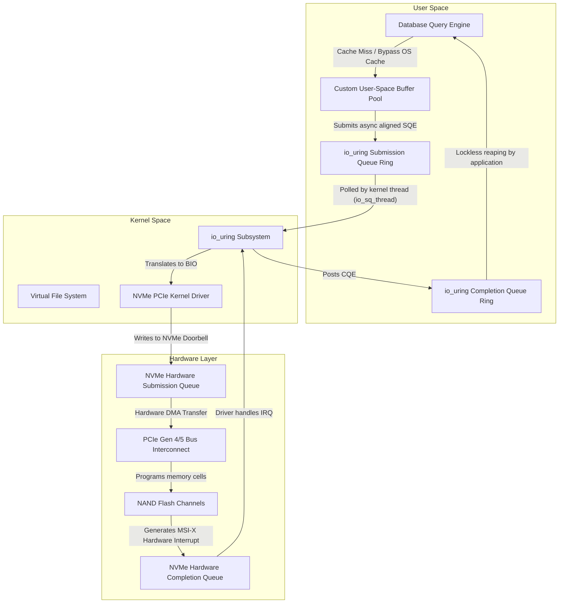

# 02: データベースにおけるDirect I/O（O_DIRECT）とOSページキャッシュの解明

## オペレーティングシステムのメモリ管理とページキャッシュメカニズムのアーキテクチャパラダイム

現代のオペレーティングシステムの基盤となるアーキテクチャは、揮発性のダイナミックランダムアクセスメモリ（DRAM）と不揮発性のブロックストレージデバイスとの間の巨大なパフォーマンス格差を隠蔽するために、仮想メモリ管理と中間キャッシングレイヤーに大きく依存しています。標準的なPOSIX準拠の環境では、ユーザースペースのアプリケーションが読み取りまたは書き込みのシステムコールを開始するたびに、オペレーティングシステムは仮想ファイルシステム（VFS）抽象化レイヤーを通過することで介入します。VFSは、基盤となるファイルシステム（ext4、XFS、Btrfsなど）への実際のブロックの取得や永続化を委譲する、普遍的に統一されたインターフェースとして機能します。この通過において、オペレーティングシステムは、物理的なディスクヘッドの移動やNANDフラッシュメモリセルのプログラミングによる法外な遅延を最小限に抑えるために、OSページキャッシュ（OS Page Cache）を利用します。ページキャッシュは本質的に、カーネルスペース内に存在する高度に最適化されたソフトウェアベースのメモリプールであり、論理ファイルオフセットを物理メモリページに継続的にマッピングします。アプリケーションがデータブロックを要求すると、カーネルはページキャッシュの基数木（radix tree）内でルックアップを実行します。特定の論理ブロック$x$に対するページキャッシュヒットの確率を$P(x)$、メインメモリからのページアクセスレイテンシを$T_{mem}$、物理ブロックデバイスアクセスレイテンシを$T_{disk}$とすると、期待されるアクセス時間$E[T]$は$E[T] = P(x) \cdot T_{mem} + (1 - P(x)) \cdot T_{disk}$として定式化できます。最新のNVMe（Non-Volatile Memory Express）SSDでは$T_{disk}$が数十マイクロ秒、従来の回転磁気HDDでは数ミリ秒の範囲であるのに対し、$T_{mem}$はマイクロ秒未満のドメイン（通常は約60～100ナノ秒）に厳密に制限されているため、確率パラメータ$P(x)$を最大化することが、カーネルのメモリ管理サブシステムの極めて重要な目的になります。$P(x)$を最大化するために、オペレーティングシステムは洗練されたヒューリスティックなエビクションアルゴリズムを採用します。伝統的にはLRU（Least Recently Used）アルゴリズムの変種であり、Linuxカーネルアーキテクチャで利用されるアクティブおよびインアクティブなLRUリストのような多世代リストで拡張されることもあります。カーネルは、時間的および空間的局所性（temporal and spatial locality）の基本仮定の下で動作します。時間的局所性は、最近アクセスされたデータが近い将来に再びアクセスされる可能性が高いと仮定し、空間的局所性は、隣接する論理アドレスに存在するデータが順次アクセスされる可能性が高いと仮定します。したがって、要求された仮想ページが物理メモリに存在しない場合にメモリ管理ユニット（MMU）によってトリガーされるハードウェア割り込みであるページフォールト（page fault）が発生すると、カーネルは明示的に要求された4KBのページを取得するだけでなく、シーケンシャルな先読み（read-ahead）操作をプロアクティブに実行します。$W$で表される先読みウィンドウサイズは、アプリケーションのアクセスパターンの観察された順次性に基づいて動的に調整されます。時間$t$におけるシーケンシャルアクセス指標を$S(t)$と定義すると、先読みウィンドウの拡張は$W_{t+1} = \min(W_{max}, W_t \cdot \alpha)$としてモデル化できます。ここで、$\alpha > 1$は連続するシーケンシャルリード中に適用される指数関数的な成長係数を表します。この積極的なキャッシングおよびプリフェッチメカニズムは、汎用コンピューティングワークロードに対して非常に効果的であり、明示的なアプリケーションレベルのエンジニアリングを必要とせずに、基盤となるストレージレイテンシをシームレスに隠蔽します。しかし、リレーショナルデータベース管理システム（RDBMS）や分散キーバリューストアなどの特殊で高性能なデータ集約型アプリケーションの場合、この汎用的なカーネルレベルのヒューリスティックは、最適化から深刻なパフォーマンスのボトルネックへと変貌することがよくあります。データベースエンジンは、独自のデータアクセスパターンに関する決定的でアルゴリズム的な知識を持っているため、OSレベルのヒューリスティックな予測は単に冗長であるだけでなく、時には有害になります。例えば、テラバイトのデータに及ぶ巨大なデータベーステーブルに対するシーケンシャルスキャンは、必然的にOSページキャッシュを汚染（pollute）し、スキャン操作中に一度だけアクセスされる一時的なテーブルタプルを収容するために、非常に価値の高いインデックスページ（B-Tree内部ノードなど）を容赦なくエビクト（追い出し）します。学術的にキャッシュスラッシング（cache thrashing）と呼ばれるこの現象は、システムの全体的なスループットを大幅に低下させます。さらに、OSページキャッシュに依存することで、悪名高いダブルバッファリング（double buffering）の問題が発生します。データベースエンジンは通常、トランザクショナルワークロード向けに最適化された専用のページエビクションアルゴリズムと先行書き込みログ（WAL）メカニズムを通じて、原子性、一貫性、分離性、耐久性（ACID）プロパティを保証するために、ユーザースペースに独自のバッファプール（Buffer Pool）を維持しているため、まったく同じ物理データブロックがユーザースペースのバッファプールとカーネルスペースのページキャッシュの両方に冗長に存在することになります。この冗長なメモリ割り当ては、利用可能なDRAMの効果的なキャッシング容量を実質的に半減させます。



高度に設計されたデータベースシステムにおいて、OSページキャッシュによって課せられるシステム的な非効率性を完全に理解するためには、POSIXのreadおよびwriteシステムコールに関連する中央処理装置（CPU）のオーバーヘッドを精査する必要があります。標準的なバッファ付き読み取りの実行は、ユーザーモード（x86_64アーキテクチャではRing 3）からカーネルモード（Ring 0）への必須のコンテキストスイッチを開始し、パイプラインのフラッシュとトランスレーションルックアサイドバッファ（TLB）の壊滅的な混乱を引き起こします。TLBはCPUコア内部に存在する特化した超高速ハードウェアキャッシュであり、カーネルのページテーブルによって確立された仮想アドレスから物理アドレスへの変換をキャッシュする役割を担います。コンテキストスイッチが発生すると、TLBは頻繁にフラッシュされ、その後のTLBミスにつながります。TLBミスは、CPUのハードウェアページテーブルウォーカーに、メインメモリ内のページテーブルのマルチレベル基数木構造（IntelプロセッサのPML4、PDP、PD、PTなど）をトラバースさせます。TLBミスのレイテンシペナルティを$T_{tlb\_miss}$とし、I/O操作中にタッチされる4KBページの数を$N_{pages}$とします。合計TLBペナルティは$N_{pages} \cdot T_{tlb\_miss}$に等しくなり、これはI/O転送サイズに比例して線形に拡大します。さらに、キャッシュヒットを想定すると、カーネルはカーネルスペースに存在するページキャッシュページから、ユーザースペースに存在するアプリケーション提供のバッファへのメモリ間コピー操作を実行する必要があります。通常、最適化されたSIMD命令（AVX-512 `vmovdqu8`や`rep movsq`など）を介して実行されるこのメモリコピー操作によって消費されるCPUサイクルは、毎秒ギガバイトのデータを転送する際に、数学的に無視できない要素になります。転送されるバイトあたりのCPUコストを$C_{copy}$とすると、純粋にメモリ操作専用の合計CPU使用率は$U_{cpu} = B_{throughput} \cdot C_{copy}$となります。ここで、$B_{throughput}$は合計ディスク帯域幅を示します。PCIe Gen 4またはGen 5バスを介して毎秒10～15ギガバイト以上の持続的なシーケンシャルリードスループットを提供できる最新のNVMeアレイでは、$U_{cpu}$コンポーネントだけで複数の高周波CPUコアを飽和させ、データベースエンジンのコアクエリ実行スレッドを実質的に飢餓状態（starving）にする可能性があります。このアーキテクチャ上の摩擦により、データベースエンジンがストレージサブシステムとどのように対話するかのパラダイムシフトが必要となり、メモリマッピング（`mmap`）の採用、またはエンタープライズグレードのデータベースではより一般的にDirect I/Oの採用につながりました。`mmap`システムコールは、ページテーブルエントリ（PTE）を介してカーネルページキャッシュページをアプリケーションの仮想アドレス空間に直接マッピングすることで、メモリコピーのオーバーヘッドを軽減しようと試み、データベースが標準のメモリポインタの間接参照（dereferencing）を介してファイルデータにアクセスできるようにします。しかし、`mmap`は依然として、非常駐ページのフェッチにはカーネルのページフォールトハンドラーに、ダーティページのディスクへの永続化にはカーネルの非同期フラッシャースレッド（`pdflush`、`bdflush`、または`kworker`など）に大きく依存しています。この依存関係により、データベースは物理I/Oスケジューリングに対する決定論的な制御を奪われ、大規模なページフォールトのカスケード中、またはカーネルのメモリ管理データ構造（具体的には仮想メモリ領域構造を保護する`mmap_sem`リーダー・ライター・セマフォ）内での深刻なロック競合中に、マイクロストール（micro-stalls）として一般に知られる予測不可能なレイテンシの急増につながります。結果として、決定論的パフォーマンスの究極の頂点、厳格なハードウェアリソースアカウンティング、およびデータライフサイクルに対する絶対的なアルゴリズム制御を達成するために、データベースアーキテクトは常に、Direct I/Oの利用を通じてカーネルを完全にバイパスすることに目を向けます。

## 高性能データベースエンジンにおけるDirect I/O（O_DIRECT）のメカニズムと影響

POSIX準拠のオペレーティングシステムにおいて、`open`システムコールの間に明示的に`O_DIRECT`フラグを指定することで呼び出されるDirect I/Oは、カーネルに対してOSページキャッシュを完全にバイパスするように明示的に指示することで、I/Oのトラバースパスを根本的に変更します。アプリケーションが`O_DIRECT`で開かれたファイル記述子を利用して読み取りまたは書き込み操作を実行すると、仮想ファイルシステムレイヤーは要求を直ちにブロックデバイスドライバーレイヤーに直接委譲します。ドライバーは、アプリケーションのユーザースペースメモリバッファアドレスを、ストレージホストバスアダプターまたはNVMeコントローラー自体に埋め込まれたDirect Memory Access（DMA）コントローラーに適したハードウェアスキャッター・ギャザーリスト（SGLs）に直接変換します。この直接変換により、カーネルスペースとユーザースペース間のメモリ間コピーに関連するCPUオーバーヘッドが完全に排除され、ダブルバッファリングの異常が決定的に解決され、データベースの独自のバッファプールアーキテクチャのために何ギガバイトもの貴重なDRAMが確実に取り戻されます。Direct I/Oにおける期待されるアクセス時間の数学的表現は、カーネルレベルのキャッシュヒット確率$P(x)$が厳密にゼロとして評価されるため、大幅に簡素化されます。したがって、期待されるレイテンシ$E[T_{direct}]$は、基盤となるストレージメディアの応答時間とインターコネクトレイテンシの排他的な関数となり、$E[T_{direct}] = T_{disk} + T_{dma} + T_{context\_switch}$という方程式が得られます。ここで、$T_{dma}$は、PCIeバスがユーザースペースRAMへのハードウェアDMA転送を交渉および実行するために必要な時間を表します。カーネルのヒューリスティックなキャッシング、先読み、およびバックグラウンドエビクションアルゴリズムによって導入される確率的変動を完全に排除することで、Direct I/Oはデータベースエンジンに妥協のない決定論的なI/Oレイテンシをもたらします。この予測可能性は、特にマルチテナントクラウドデータベースアーキテクチャのような高同時実行性のトランザクション処理環境において、厳格なサービスレベルアグリーメント（SLA）を達成するための重要で交渉不可能な前提条件です。しかし、`O_DIRECT`の利用は、アプリケーションのメモリレイアウトとI/O要求の粒度に、厳格で容赦のない幾何学的制約を課します。基盤となるブロックストレージデバイスは固定の論理セクターサイズで動作し、従来は512バイトでしたが、現代のNANDフラッシュソリッドステートストレージでは圧倒的に4096バイト（アドバンストフォーマット）です。したがって、Direct I/Oは、3つの別々の軸にわたって厳格なトポロジーアライメントパラメータを義務付けます。基盤となるブロックデバイスの論理セクターサイズを$S_{sector}$とします。アプリケーション提供のメモリバッファアドレス$A_{buffer}$、I/O転送の合計サイズ$L_{transfer}$、および論理ファイルオフセット$O_{file}$はすべて、同時にモジュロ合同条件を満たす必要があります：$A_{buffer} \equiv 0 \pmod{S_{sector}}$、$L_{transfer} \equiv 0 \pmod{S_{sector}}$、および$O_{file} \equiv 0 \pmod{S_{sector}}$。これらの厳格な数学的アライメント制約を細心の注意を払って遵守しないと、Linuxカーネルは直ちに`EINVAL`（無効な引数）エラーコードでシステムコールを拒否し、データベースの実行パスを停止させます。重要なメモリアライメント制約$A_{buffer} \equiv 0 \pmod{S_{sector}}$を満たすために、データベースストレージエンジンは標準のメモリアロケータに依存することはできません。開発者は、標準の`malloc`や`new`演算子の代わりに、`posix_memalign`、`aligned_alloc`、`valloc`、または匿名の`mmap`コールなどの特殊なメモリ割り当て関数を明示的に利用する必要があります。

```cpp
#include <fcntl.h>
#include <unistd.h>
#include <cstdlib>
#include <stdexcept>
#include <iostream>
#include <cstdint>

class DirectIOAlignedBuffer {
private:
    void* raw_buffer;
    size_t allocation_size;
    size_t hardware_alignment;

public:
    DirectIOAlignedBuffer(size_t size, size_t alignment = 4096) 
        : allocation_size(size), hardware_alignment(alignment) {
        // L_transferアライメント制約を数学的に強制する
        if (allocation_size % hardware_alignment != 0) {
            throw std::invalid_argument("I/Oサイズがハードウェアセクターアライメントに厳密に違反しています。");
        }
        // posix_memalignを介してA_bufferアライメント制約を強制する
        if (posix_memalign(&raw_buffer, hardware_alignment, allocation_size) != 0) {
            throw std::runtime_error("posix_memalignの幾何学的割り当てに失敗しました。OOMまたは無効なアライメント。");
        }
        // メモリが固定され、スワップアウトされないことを確認する（DMAにはオプションだが推奨）
        mlock(raw_buffer, allocation_size);
    }

    ~DirectIOAlignedBuffer() {
        munlock(raw_buffer, allocation_size);
        free(raw_buffer);
    }

    void* get_pointer() const { return raw_buffer; }
    size_t get_size() const { return allocation_size; }
};

void execute_deterministic_direct_read(const char* target_filepath) {
    // OSページキャッシュをバイパスしてファイル記述子を開く
    int fd = open(target_filepath, O_RDONLY | O_DIRECT);
    if (fd < 0) {
        throw std::runtime_error("O_DIRECTファイル記述子の取得に失敗しました。");
    }

    DirectIOAlignedBuffer dio_buf(16384); // 16KBの正確なバッファ、動的に4KBアライメント済み

    // O_fileも4096の倍数である必要がある（例：オフセット0、4096、8192）
    off_t logical_offset = 8192; 

    ssize_t bytes_read = pread(fd, dio_buf.get_pointer(), dio_buf.get_size(), logical_offset);
    if (bytes_read < 0) {
        close(fd);
        throw std::runtime_error("Direct I/OハードウェアDMA読み取りが致命的に失敗しました。");
    }

    std::cout << "DMAを介してユーザースペースに " << bytes_read << " バイトを正常に転送しました。" << std::endl;
    close(fd);
}
```

Direct I/Oの採用は、データベースエンジンのコアアーキテクチャ内に高度に洗練された非同期I/O（AIO）フレームワークを実装することを必然的に要求します。`O_DIRECT`はOSページキャッシュを明示的に無効にするため、標準の同期読み取りシステムコールは、物理ディスクがハードウェアDMA転送を正常に完了するまで、呼び出し元のオペレーティングシステムスレッドを間違いなくブロックします。毎秒数万の複雑なトランザクションを処理するように設計された大規模な同時実行データベースシステムにおいて、マイクロ秒規模の物理ディスクレイテンシを待つ間にオペレーティングシステムスレッドをブロックすることは、カーネルが必死に他の実行可能なスレッドをスケジュールしようと試みるため、致命的なスレッドの飢餓、CPUパイプラインのストール、および過度のコンテキストスイッチングオーバーヘッドにつながります。数学的なクエリ実行を物理ストレージレイテンシから根本的に分離するために、最新のデータベースはLinuxの非同期I/O APIに大きく依存しています。歴史的には`libaio`であり、最近ではJens Axboeによって導入された画期的な`io_uring`サブシステムです。`O_DIRECT`と`io_uring`を相乗的に組み合わせることで、データベースエンジンは、単一のコストのかかるシステムコールコンテキストスイッチを実行することなく、共有メモリの送信キュー（SQ）リングバッファを介して数百の非同期読み取りまたは書き込み要求を送信できます。複雑なクエリプラン（大規模なハッシュジョインなど）によって生成される同時I/O要求の数を$N_{req}$とします。単純な同期Direct I/Oモデルでの合計レイテンシは、単一の実行スレッドを想定すると$\sum_{i=1}^{N_{req}} T_{disk}(i)$として線形にスケーリングします。逆に、`io_uring`を利用する高度な非同期Direct I/Oモデルでは、要求はNVMeホストコントローラーの内部ハードウェア送信キューに同時に送信され、ソリッドステートドライブの複数のNANDフラッシュダイとパラレルチャネルの巨大な内部並列処理を明示的に活用します。これにより、合計レイテンシは最大個別レイテンシ$\max(T_{disk}(1), T_{disk}(2), \dots, T_{disk}(N_{req})) + T_{queue\_overhead}$に近づき、ストレージ帯域幅の使用率を効果的に最大化し、CPU実行スレッドを完全に非ブロック状態に保ち、数学的に生産性を維持します。`O_DIRECT`と非同期ポーリングI/Oのこの正確な相乗効果は、ScyllaDB（Seastar C++フレームワークを活用）やPostgreSQL（広範な最近のAIOアーキテクチャの強化による）のような次世代の分散システムのアーキテクチャ基盤を形成しています。



`O_DIRECT`を採用するエンジニアリングの負担は、メモリアライメントの数学と非同期実行パラダイムをはるかに超えて及びます。それは、厳密にユーザーアプリケーション空間内でのキャッシングレイヤーの絶対的な再発明とアーキテクチャの再構築を義務付けます。データベースは、独自の高度に同時実行性の高いバッファプールを実装し、ストレージから取得された物理データページのライフサイクルを細心の注意を払って管理する必要があります。これには、同時トランザクション変更中の陰険なデータ破損を防ぐために、個々のページフレームにリーダー・ライターラッチ、スピンロック、またはハザードポインターなどの複雑な同期プリミティブを展開することが含まれます。`O_DIRECT`はカーネルレベルのシーケンシャルプリフェッチを厳格に無効にするため、データベースエンジン自体が論理クエリ実行プラン（例えば、Volcanoイテレータモデルの最上位にあるシーケンシャルテーブルスキャンノードの認識など）を数学的に分析し、クエリ実行エンジンが実際に要求するずっと前に、後続の物理データブロックに対する非同期Direct I/O読み取り要求をプロアクティブにディスパッチする必要があります。プリフェッチの動的距離を$D_{prefetch}$とします。エンジンは、クエリスレッドの決定論的な消費率$R_{consume}$（マイクロ秒あたりのページ数で測定）と、動的に測定された予想非同期I/Oレイテンシ$E[T_{aio}]$に基づいて、最適なプリフェッチ深度を計算します。これは数学的に$D_{prefetch} = R_{consume} \cdot E[T_{aio}]$と定式化されます。さらに、データベースエンジニアはHugePagesの統合を考慮する必要があります。独自のバッファプールに数ギガバイトのRAMを割り当てる場合、標準の4KBページを使用すると、壊滅的なTLBプレッシャーと巨大なページテーブル構造が生じます。`O_DIRECT` DMA転送と、2MBまたは1GBのトランスペアレントヒュージページ（THP）または`hugetlbfs`に裏打ちされたバッファプールを組み合わせることで、システムは前述の$T_{tlb\_miss}$ペナルティを指数関数的に削減します。単一のTLBエントリが巨大な2MBまたは1GBの連続した物理領域をマッピングするようになり、高スループットの分析スキャン中にハードウェアページテーブルウォーカーのオーバーヘッドが完全に排除されます。ユーザースペースのアルゴリズム的プリフェッチ、HugePageに裏打ちされたメモリトポロジー、独自のバッファプールエビクションアルゴリズム、および`io_uring`駆動のDirect I/Oを正確に調整することで、現代のデータベースシステムは、レイテンシ分布に対する厳格な予測可能性を維持しながら、最新のNVMeストレージアレイから数百万のIOPSを引き出すことができる、比類のないほぼ理論上の最大のハードウェア使用率を達成します。

## バッファプールエンジニアリングにおける経験的費用対効果分析とアルゴリズムの複雑さ

モノリシックなOSページキャッシュ依存のアーキテクチャから、完全に自己管理された決定論的なDirect I/Oフレームワークへの移行は、コントロールの所在の記念碑的なシフトを表しており、深いアルゴリズムの複雑さを伴います。この移行の有効性を厳密に定量化するには、キャッシュヒット率、CPUサイクル消費、TLBヒット率、および究極のクエリスループットの限界を網羅する数学的かつ経験的な費用対効果分析を策定する必要があります。アクセスの頻度がZipfの法則の確率分布（Zipfian probability distribution）によって特徴付けられる、同時実行性の高いトランザクショナルワークロード（OLTP）を考えてみましょう。ここでは、データセット全体の微視的に小さなサブセット（しばしば「ホットセット」と呼ばれる）が、読み取りおよび書き込み要求の統計的過半数を受け取ります。$k$番目にランク付けされたページにアクセスする確率質量関数は、$P(k) = \frac{1/k^s}{\sum_{n=1}^{N} (1/n^s)}$として正式に定義されます。ここで、$N$は論理ページの絶対合計数、$s$は分布の数学的歪度（skewness）を決定します（重いデータベースワークロードでは通常$s \approx 1$）。OSページキャッシュの下で盲目的に動作する場合、カーネルは物理ページ間の論理的、関係的なつながりを本質的に認識していません。カーネルは単に論理セクターアドレスの不透明なストリームを観察し、初歩的で数学的に欠陥のあるLRUセマンティクスを介して最適化しようと試みます。カーネルの盲目的で汎用的なエビクションポリシーは、B+Treeのルートノードや上位レベルのルーティング内部ノードなど、頻繁にアクセスされるデータベース構造メタデータページに必然的にペナルティを課し、大規模な分析用のフルテーブルスキャン中に厳密に一度だけアクセスされる一時的なリーフノードデータと区別なく扱います。明確なアーキテクチャの対照として、生のDirect I/Oの上で直接動作するユーザースペースのバッファプールは、基盤となるページトポロジーの親密で宣言的なセマンティック知識を持っています。データベースアーキテクトは厳格なページピン留めメカニズムを実装し、極端なメモリ枯渇圧力に関係なく、重要な構造メタデータがDRAMに完全に常駐したままであることを数学的に保証します。さらに、高度なバッファプールの実装は、そのメモリ領域を数学的に複数の明確で孤立したプールにセグメント化し、クラスタ化インデックス、一時的な一時ソートテーブル、およびプライマリヒープデータのキャッシングロジックを分離します。ユーザースペースバッファプールの統計的ヒット率を$H_{user}$、カーネルOSページキャッシュのヒット率を$H_{os}$とします。複雑で高速な分析ワークロードの下では、経験的なテレメトリーは常に$H_{user} \gg H_{os}$であることを示しています。これはまさに、アクティブなコミットされていないトランザクションを含むページや、メモリ集約的な並列ハッシュジョインに現在参加しているページをアルゴリズム的に優先して保持するなど、エビクションロジックに組み込まれたセマンティックな認識によるものです。

高度に同時実行性の高いユーザースペースバッファプールのアルゴリズム的実装は、細心の注意を払ったロックフリーのエンジニアリングを必要とする、深刻なマルチコア同期のボトルネックをもたらします。論理ページIDを物理メモリフレームにマッピングするグローバルハッシュテーブルを保護するために単一のグローバルミューテックスロックを利用する単純な実装では、数百の同時クエリ実行スレッドにさらされると、すぐに壊滅的なロック競合に見舞われます。このアーキテクチャ上の欠陥を軽減するために、データベースシステムはロックストライピング（lock striping）を展開するか、グローバルバッファプールを$M$個の厳密に独立したインスタンスに数学的に分割し、論理ページIDをモジュロハッシュ関数$f(PageID) = PageID \pmod{M}$を介して特定の孤立したインスタンスにハッシュします。この数学的分割は、ロックの衝突の統計的確率を$M$という幾何学的係数で効果的に減らし、システムの全体的な線形スケーラビリティを向上させます。しかし、分割だけでは著しく不十分です。ページエビクションアルゴリズム自体が極度の同時実行性のために数学的に設計されていなければなりません。従来の厳密なLRUアルゴリズムでは、アクセスされたページを時間的リストの先頭に移動するために、ページアクセスごとに二重リンクされたリスト内のポインタを変更する必要があります。この共有データ構造の継続的で絶え間ない変更には排他的な書き込みラッチが必要であり、マルチコアのスケーラビリティを完全に破壊し、CPUキャッシュコヒーレンスプロトコル（MESI）を飽和させます。したがって、Direct I/O上で動作する最新のデータベースは、一般化されたCLOCKスイープアルゴリズム、Clock-PRO、またはARC（Adaptive Replacement Cache）などのクロックベースの近似アルゴリズムを優先して、厳密なLRUを普遍的に放棄します。CLOCKアルゴリズムは、物理ページフレームの固定された循環バッファとスイープする仮想針（hand）メカニズムを利用します。読み取りアクセスごとにリンクされたリストを破壊的に変更する代わりに、システムは単にページフレームに関連付けられた単一のアトミックな参照ビット$R_{bit}$を設定します。通常はハードウェアのCompare-And-Swap（CAS）命令であるこのアトミック操作は、重いブロッキングラッチを取得することなく同時に実行できます。データベースページフォールトが発生し、空き物理フレームが緊急に必要な場合、バックグラウンドのエビクションスレッドが循環バッファをスイープします。$R_{bit}$が$1$と評価された場合、アトミックに$0$にリセットされ、スイープ針が進みます。$R_{bit}$が$0$と評価された場合、そのページは直ちに数学的なエビクション候補として選択されます。実行可能なエビクション候補を見つけるための計算コストを$C_{evict}$とします。キャッシュヒット率が非常に高い高負荷のトランザクションシステムでは、$R_{bit} = 0$に遭遇する数学的確率が極度に低くなり、CLOCK針が過度にスピンして$C_{evict}$パラメータが大幅に悪化する可能性があります。このエビクションコストを数学的に制限するために、Clock-PROのような高度なアルゴリズムは過去のアクセス頻度を組み込み、非常駐ページのメタデータを維持してホットなワーキングセットとコールドなワーキングセット間のアルゴリズムの境界を動的に調整し、$C_{evict}$が予測可能な厳格なアルゴリズムの限界内（通常は償却された時間計算量$O(1)$）にとどまることを数学的に保証します。

Direct I/Oを採用するという妥協のない決定は、データベースの先行書き込みログ（WAL）サブシステムのアーキテクチャも根本的に規定します。WALサブシステムは、トランザクションのコミットが待機中のクライアントに安全に確認される前に、耐久性（ACIDの絶対的な'D'）を数学的に保証するために、厳格に同期的で容赦のないシーケンシャルな物理的書き込みを要求します。バッファ付きI/Oを介してOSページキャッシュを利用する場合、データベースはログレコードを揮発性カーネルキャッシュに直接書き込み、その後`fsync`または`fdatasync`システムコールを呼び出して、カーネルにダーティページを物理ストレージメディアに強制的にフラッシュさせます。`fsync`操作は、カーネルスレッドが内部のダーティページのリンクリストをロックしてトラバースし、ブロックI/O要求を生成し、多くの場合、データが予期せぬ電源喪失を数学的に乗り越えることを保証するために、ブルートフォースのハードウェアキャッシュフラッシュコマンド（SATAの場合は`FLUSH CACHE EXT`、NVMeの場合は`Flush`）を物理ドライブに直接発行する必要があるため、計算上悪名高く高価です。このプロセスは、汎用的な`fsync`アルゴリズムがシステムのまったく無関係なファイルに属する数千のダーティページを誤ってフラッシュし、予測不能で壊滅的なレイテンシスパイクを引き起こす可能性があるため、巨大な非決定性（non-determinism）をもたらします。Direct I/Oを`O_DSYNC`フラグと数学的に組み合わせてカーネルを完全にバイパスすることで、データベースエンジンはログ書き込みの粒度に対する明示的なバイトレベルの制御を引き受けます。アプリケーションは、論理的に完全なトランザクショナルログブロックを動的に構築し、厳格なハードウェアの$S_{sector}$アライメント要件を満たすために残りのバイトを絶対的なゼロでパディングし、同期Direct I/Oの書き込みをPCIeバスに直接送信します。カーネルのシステムコールが返されると、データは物理ストレージコントローラーの不揮発性ドメインに到達したことが数学的に保証されます。トランザクショナルログレコードの幾何学的なサイズを$L_{log}$とします。微視的に小さなログレコードを厳格な4キロバイトのセクター境界にパディングすることによって導入される深刻な書き込み増幅ペナルティを積極的に最小限に抑えるために、最新のデータベースは普遍的に数学的なグループコミット（group commit）アルゴリズムを採用しています。グループコミットは、個々の異なるトランザクションのフラッシュを1ミリ秒のごくわずかな時間人工的に遅らせ、数学的には人工的な待機時間$T_{wait}$としてモデル化され、複数の独立したログレコードをサイズ$L_{aggregate} = \sum_{i=1}^{K} L_{log\_i}$の単一の巨大な連続ブロックに蓄積します。この数学的に集約されたブロックは、単一の非常に効率的なDirect I/O操作を介してディスパッチされます。不等式$L_{aggregate} \ge S_{sector}$が成り立つ場合、ハードウェアの書き込み増幅ペナルティは数学的に完全に無効になります。データベースカーネルエンジニアにとっての究極の最適化目標は、事前に定義された数学的レイテンシSLAに違反することなく、トランザクショナルスループット（TPS）を最大化するために、リアルタイムで$T_{wait}$を動的かつアルゴリズム的にチューニングすることです。

妥協のない結論として、Direct I/O（`O_DIRECT`）の利用は、最先端の高性能データベース管理システムを設計するための絶対的かつ最重要なアーキテクチャ上の設計選択を表しています。それは、`io_uring`によるカスタム非同期I/Oハーネスの開発、厳格で容赦のないメモリアライメントトポロジーの厳格な遵守、高度に同時実行性が高く、セマンティックを認識し、ロックフリーのユーザースペースバッファプールの作成など、大規模で非常に複雑なエンジニアリングの課題を要求しますが、数学的なパフォーマンスの配当は明白であり変革的です。オペレーティングシステムの汎用的なページキャッシュを明示的に回避することで、高度なデータベースは壊滅的なダブルバッファリングのメモリアノマリーを決定的に排除し、数学的に複雑な分析処理のために大量のDRAMを積極的に取り戻し、カーネルからユーザーへのSIMDメモリコピーの法外なCPUサイクルのオーバーヘッドを根絶し、物理ハードウェアのI/Oレイテンシ分布に対する絶対的な数学的決定論を達成します。PCIe Gen 5 NVMeソリッドステートドライブが数十ギガバイトの生帯域幅とマイクロ秒レベルのハードウェアレイテンシをいとも簡単に露出させるなど、ハードウェアのパラダイムが積極的に進化し続ける中、汎用のオペレーティングシステムカーネルは、システムエンジニアからファシリテーターとしてではなく、克服不可能な計算上のボトルネックとしてますます見なされています。その結果、Direct I/Oによって付与される明示的でバイトレベルの制御は、将来のすべての最先端のストレージエンジンと大規模な分散データベースアーキテクチャが数学的に構築される、絶対的で揺るぎない基盤であり続けるでしょう。

## SEO メタデータ

- Target Keyword: Direct I/O vs OS Page Cache
- Secondary Keywords: O_DIRECT database, Buffer Pool architecture, io_uring vs libaio, Linux kernel memory management, Page cache double buffering, NVMe DMA transfer
- Meta Description: 高性能データベースエンジニアリングにおけるDirect I/O（O_DIRECT）とOSページキャッシュのマイクロアーキテクチャの違いを分析する、網羅的で学術的に厳密な技術ホワイトペーパー。
- Category: Advanced Systems Engineering / Database Architecture
- Read Time: 15+ minutes
