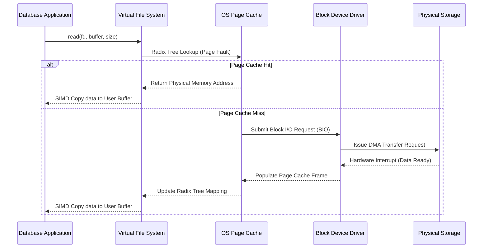
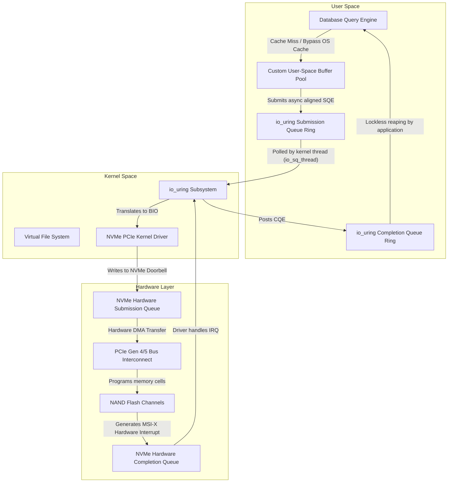

# 02: Giải mã Direct I/O (O_DIRECT) và OS Page Cache trong Cơ sở Dữ liệu

## Các Hệ Sinh Thái Kiến Trúc Quản Lý Bộ Nhớ Hệ Điều Hành và Cơ Chế Page Cache

Kiến trúc nền tảng của các hệ điều hành đương đại phụ thuộc lớn vào việc quản lý bộ nhớ ảo (virtual memory management) và các lớp bộ đệm trung gian để che giấu sự chênh lệch hiệu năng khổng lồ giữa bộ nhớ truy cập ngẫu nhiên động dễ bay hơi (DRAM) và các thiết bị lưu trữ khối không bay hơi. Trong các môi trường chuẩn POSIX, bất cứ khi nào một ứng dụng ở không gian người dùng (user-space) khởi tạo một lời gọi hệ thống đọc hoặc ghi, hệ điều hành sẽ can thiệp bằng cách duyệt qua lớp trừu tượng Hệ Thống Tập Tin Ảo (Virtual File System - VFS). VFS đóng vai trò là một giao diện thống nhất toàn cầu ủy thác việc truy xuất hoặc lưu trữ khối thực tế cho các hệ thống tập tin cấp dưới như ext4, XFS hoặc Btrfs. Trong quá trình duyệt này, hệ điều hành cố gắng giảm thiểu độ trễ đắt đỏ của chuyển động đầu từ đĩa vật lý hoặc việc lập trình ô nhớ flash NAND bằng cách sử dụng OS Page Cache (Bộ đệm Trang của Hệ Điều Hành). Page Cache về cơ bản là một hồ bơi bộ nhớ dựa trên phần mềm được tối ưu hóa cao nằm trong không gian nhân (kernel space), liên tục ánh xạ các offset tập tin logic tới các trang bộ nhớ vật lý. Khi một ứng dụng yêu cầu một khối dữ liệu, nhân (kernel) sẽ thực hiện một truy vấn tìm kiếm bên trong cây radix của Page Cache. Gọi $P(x)$ là xác suất Page Cache hit (tìm thấy) cho một khối logic cụ thể $x$, và $T_{mem}$ biểu diễn độ trễ truy cập một trang từ bộ nhớ chính, trong khi $T_{disk}$ gói gọn độ trễ truy cập thiết bị khối vật lý. Thời gian truy cập kỳ vọng $E[T]$ có thể được công thức hóa là $E[T] = P(x) \cdot T_{mem} + (1 - P(x)) \cdot T_{disk}$. Cho rằng $T_{disk}$ thường dao động từ hàng chục micro-giây đối với ổ cứng thể rắn NVMe (Non-Volatile Memory Express) hiện đại đến vài mili-giây đối với ổ cứng từ tính quay truyền thống, trong khi $T_{mem}$ bị giới hạn nghiêm ngặt trong miền dưới micro-giây (thường khoảng 60 đến 100 nano-giây), việc cực đại hóa tham số xác suất $P(x)$ trở thành mục tiêu thiết yếu nhất của hệ thống con quản lý bộ nhớ của nhân. Để tối đa hóa $P(x)$, hệ điều hành sử dụng các thuật toán loại bỏ suy nghiệm (heuristic eviction algorithms) phức tạp, theo truyền thống là các biến thể của thuật toán Ít Được Sử Dụng Nhất (LRU), thỉnh thoảng được tăng cường với các danh sách đa thế hệ như danh sách LRU active và inactive được sử dụng bên trong kiến trúc nhân Linux. Nhân hoạt động dưới giả định nền tảng về cả tính địa phương thời gian và không gian (temporal and spatial locality); tính địa phương thời gian mặc định rằng dữ liệu được truy cập gần đây có khả năng cao sẽ được truy cập lại trong tương lai gần, trong khi tính địa phương không gian giả thuyết rằng dữ liệu nằm ở các địa chỉ logic liền kề sẽ có khả năng được truy cập tuần tự. Do đó, khi xảy ra lỗi trang (page fault)—một ngắt phần cứng được kích hoạt bởi Đơn Vị Quản Lý Bộ Nhớ (MMU) khi một trang ảo được yêu cầu vắng mặt trong bộ nhớ vật lý—nhân không chỉ lấy trang 4-kilobyte được yêu cầu rõ ràng mà còn chủ động thực hiện các thao tác đọc trước tuần tự (sequential read-ahead). Kích thước cửa sổ đọc trước, ký hiệu là $W$, được điều chỉnh động dựa trên tính tuần tự quan sát được từ các mô hình truy cập của ứng dụng. Nếu chúng ta định nghĩa $S(t)$ là số liệu truy cập tuần tự tại thời gian $t$, sự mở rộng cửa sổ đọc trước có thể được mô hình hóa là $W_{t+1} = \min(W_{max}, W_t \cdot \alpha)$ trong đó $\alpha > 1$ đại diện cho hệ số tăng trưởng theo cấp số nhân được áp dụng trong các lần đọc tuần tự liên tiếp. Cơ chế đệm và tìm nạp trước mạnh mẽ này mang lại hiệu quả cao cho các khối lượng công việc máy tính đa dụng, che giấu độ trễ lưu trữ bên dưới một cách trơn tru mà không yêu cầu bất kỳ nỗ lực kỹ thuật cấp ứng dụng rõ ràng nào. Tuy nhiên, đối với các ứng dụng chuyên biệt, chuyên sâu về dữ liệu, hiệu năng cao như hệ quản trị cơ sở dữ liệu quan hệ (RDBMS) hoặc các kho lưu trữ key-value phân tán, thuật toán suy nghiệm cấp nhân dùng chung này thường biến dạng từ một sự tối ưu hóa thành một nút thắt hiệu năng nghiêm trọng. Các Storage Engine (động cơ cơ sở dữ liệu) sở hữu kiến thức thuật toán mang tính quyết định (deterministic) về các mô hình truy cập dữ liệu của riêng chúng, khiến cho các dự đoán suy nghiệm cấp hệ điều hành không chỉ dư thừa mà thỉnh thoảng còn gây bất lợi. Ví dụ, một thao tác quét tuần tự qua một bảng cơ sở dữ liệu khổng lồ kéo dài hàng terabyte dữ liệu chắc chắn sẽ làm ô nhiễm (pollute) OS Page Cache, tàn nhẫn đẩy ra ngoài các trang index cực kỳ giá trị (chẳng hạn như các nút bên trong B-Tree) để nhường chỗ cho các tuple bảng tạm thời mà sẽ chỉ được truy cập một lần trong suốt thao tác quét. Hiện tượng này, được giới học thuật gọi là cache thrashing, làm suy giảm nghiêm trọng tổng thông lượng của hệ thống. Hơn nữa, việc dựa dẫm vào OS Page Cache đưa đến bài toán double buffering (bộ đệm kép) khét tiếng. Vì động cơ cơ sở dữ liệu thường tự duy trì Buffer Pool của riêng nó trong user-space nhằm đảm bảo các thuộc tính ACID—cụ thể là thông qua cơ chế Write-Ahead Logging (WAL) và các thuật toán loại bỏ trang chuyên dụng được tối ưu hóa cho các khối lượng công việc giao dịch—các khối dữ liệu vật lý y hệt nhau sẽ nằm dư thừa một cách trùng lặp trong cả Buffer Pool của không gian người dùng và Page Cache của không gian nhân. Việc phân bổ bộ nhớ dư thừa này về cơ bản chia đôi dung lượng đệm hiệu quả của DRAM hiện có.



Để thấu hiểu triệt để những sự thiếu hiệu quả mang tính hệ thống bị áp đặt bởi OS Page Cache lên các hệ thống cơ sở dữ liệu được kỹ sư hóa cao, người ta phải xem xét kỹ lưỡng hao tổn tài nguyên xử lý trung tâm (CPU overhead) liên quan đến các lời gọi hệ thống đọc và ghi POSIX. Việc thực thi một thao tác đọc có đệm chuẩn (buffered read) khởi tạo một bước chuyển ngữ cảnh (context switch) bắt buộc từ chế độ người dùng (Ring 3 trên kiến trúc x86_64) sang chế độ nhân (Ring 0), gây ra một lần xả đường ống (pipeline flush) và một sự xáo trộn thảm khốc của Bộ đệm Dịch chuyển Địa chỉ (Translation Lookaside Buffer - TLB). TLB là một bộ nhớ cache phần cứng cực nhanh chuyên biệt nằm bên trong lõi CPU, chịu trách nhiệm lưu trữ các bản dịch địa chỉ từ ảo sang vật lý do bảng trang (page tables) của nhân thiết lập. Khi xảy ra context switch, TLB thường bị xóa sạch, dẫn đến các lỗi TLB miss (trượt TLB) sau đó. Một TLB miss buộc bộ đi bộ bảng trang phần cứng (hardware page table walker) của CPU phải duyệt qua cấu trúc cây radix đa cấp của bảng trang (ví dụ: PML4, PDP, PD, và PT trong vi xử lý Intel) trong bộ nhớ chính. Gọi $T_{tlb\_miss}$ là hình phạt độ trễ của một TLB miss, và $N_{pages}$ là số lượng trang 4KB được chạm tới trong thao tác I/O. Tổng hình phạt TLB bằng $N_{pages} \cdot T_{tlb\_miss}$, mở rộng tuyến tính với kích thước truyền tải I/O. Hơn nữa, giả sử xảy ra cache hit, nhân phải thực hiện thao tác sao chép bộ nhớ-sang-bộ nhớ (memory-to-memory copy) từ các trang bộ nhớ cache trong không gian nhân sang bộ đệm do ứng dụng cung cấp trong không gian người dùng. Các chu kỳ CPU bị tiêu hao cho thao tác sao chép bộ nhớ này, thường được thực thi thông qua các lệnh SIMD tối ưu hóa (như AVX-512 `vmovdqu8` hoặc `rep movsq`), trở thành một yếu tố không hề tầm thường về mặt toán học khi chuyển hàng gigabyte dữ liệu mỗi giây. Gọi $C_{copy}$ là chi phí CPU trên mỗi byte truyền đi; tổng mức độ sử dụng CPU chỉ dành riêng cho thao tác xử lý bộ nhớ trở thành $U_{cpu} = B_{throughput} \cdot C_{copy}$, trong đó $B_{throughput}$ biểu thị tổng băng thông đĩa. Trong các mảng NVMe hiện đại có khả năng cung cấp thông lượng đọc tuần tự bền vững lên tới 10-15 gigabyte mỗi giây thông qua bus PCIe Gen 4 hoặc Gen 5, chỉ riêng thành phần $U_{cpu}$ đã có thể làm bão hòa nhiều lõi CPU tần số cao, dẫn tới tình trạng bỏ đói (starving) các luồng thực thi truy vấn lõi của cơ sở dữ liệu một cách hiệu quả. Ma sát kiến trúc này đòi hỏi một sự thay đổi mô hình trong cách mà động cơ cơ sở dữ liệu tương tác với hệ thống lưu trữ bên dưới, dẫn đến sự áp dụng ánh xạ bộ nhớ (`mmap`) hoặc, phổ biến hơn trong các cơ sở dữ liệu cấp độ doanh nghiệp (enterprise-grade), là Direct I/O (I/O Trực tiếp). Lời gọi hệ thống `mmap` cố gắng giảm thiểu hao tổn sao chép bộ nhớ bằng cách ánh xạ các trang cache trong nhân trực tiếp vào không gian địa chỉ ảo của ứng dụng thông qua Các Mục Bảng Trang (Page Table Entries - PTE), cho phép cơ sở dữ liệu truy cập dữ liệu tệp bằng việc giải tham chiếu con trỏ bộ nhớ (pointer dereferencing) chuẩn. Tuy nhiên, `mmap` vẫn phụ thuộc nặng nề vào trình xử lý lỗi trang (page fault handler) của nhân để lấy các trang không thường trú và các luồng xả bất đồng bộ của nhân (chẳng hạn như `pdflush`, `bdflush`, hoặc `kworker`) để ghi đè các trang bẩn (dirty pages) xuống đĩa. Sự phụ thuộc này tước đi của cơ sở dữ liệu quyền kiểm soát tất định (deterministic control) đối với việc lập lịch I/O vật lý, dẫn đến các đợt tăng vọt độ trễ khó đoán, thường được gọi là các đợt giật nhỏ (micro-stalls), trong các sự cố lỗi trang phân tầng quy mô lớn hoặc sự cạnh tranh khóa nghiêm trọng bên trong các cấu trúc dữ liệu quản lý bộ nhớ của nhân (cụ thể là cấu trúc reader-writer semaphore `mmap_sem` bảo vệ các khu vực bộ nhớ ảo). Hậu quả là, để đạt đến đỉnh cao tuyệt đối của hiệu năng mang tính quyết định, kế toán tài nguyên phần cứng nghiêm ngặt, và kiểm soát thuật toán tuyệt đối vòng đời dữ liệu, các kiến trúc sư cơ sở dữ liệu chắc chắn sẽ quay sang bỏ qua hoàn toàn nhân bằng cách ứng dụng Direct I/O.

## Cơ Chế Và Hệ Quả Của Direct I/O (O_DIRECT) Trong Các Database Engine Hiệu Năng Cao

Direct I/O, được gọi trong các hệ điều hành tuân thủ POSIX bằng cách chỉ định rõ ràng cờ `O_DIRECT` trong quá trình gọi hệ thống `open`, đã thay đổi căn bản đường dẫn duyệt I/O bằng cách chỉ thị rõ ràng cho kernel (nhân) bỏ qua hoàn toàn OS Page Cache. Khi một ứng dụng thực hiện thao tác đọc hoặc ghi sử dụng file descriptor (bộ mô tả tệp) được mở với `O_DIRECT`, lớp Hệ thống Tệp Ảo (VFS) sẽ ngay lập tức ủy quyền yêu cầu trực tiếp cho lớp driver thiết bị khối. Driver sẽ dịch các địa chỉ bộ nhớ không gian người dùng của ứng dụng trực tiếp thành các danh sách phân tán-thu thập phần cứng (scatter-gather lists - SGLs) phù hợp cho bộ điều khiển Truy Cập Bộ Nhớ Trực Tiếp (DMA) được nhúng bên trong HBA lưu trữ (Host Bus Adapter) hoặc chính bộ điều khiển NVMe. Quá trình dịch trực tiếp này loại bỏ hoàn toàn chi phí CPU liên quan đến việc sao chép từ bộ nhớ sang bộ nhớ giữa không gian kernel và không gian người dùng, giải quyết dứt điểm sự bất thường của double buffering và lấy lại một lượng khổng lồ gigabyte DRAM quý giá cho kiến trúc Buffer Pool độc quyền của cơ sở dữ liệu. Biểu diễn toán học của thời gian truy cập dự kiến trong Direct I/O đơn giản hóa một cách đáng kể, do xác suất xảy ra kernel-level cache hit $P(x)$ được đánh giá chính xác bằng 0. Do đó, độ trễ dự kiến $E[T_{direct}]$ trở thành hàm số phụ thuộc độc quyền vào thời gian phản hồi của phương tiện lưu trữ bên dưới và độ trễ kết nối, mang lại phương trình $E[T_{direct}] = T_{disk} + T_{dma} + T_{context\_switch}$, trong đó $T_{dma}$ đại diện cho thời gian cần thiết để bus PCIe đàm phán và thực thi quá trình chuyển đổi DMA phần cứng trực tiếp vào RAM không gian người dùng. Bằng cách loại bỏ hoàn toàn sự biến thiên ngẫu nhiên (stochastic variability) gây ra bởi các thuật toán heuristic như caching, read-ahead và đẩy lùi nền tảng của kernel, Direct I/O ban tặng cho database engine độ trễ I/O có tính quyết định (deterministic) vô điều kiện. Tính có thể dự đoán này là một điều kiện tiên quyết quan trọng, không thể thương lượng để đạt được Thỏa thuận Mức Dịch vụ (SLAs) nghiêm ngặt trong môi trường xử lý giao dịch đồng thời cao, đặc biệt là trong kiến trúc cơ sở dữ liệu đám mây đa khách hàng (multi-tenant cloud database). Tuy nhiên, việc sử dụng `O_DIRECT` áp đặt những ràng buộc hình học vô cùng nghiêm ngặt, không khoan nhượng lên bố cục bộ nhớ của ứng dụng và mức độ hạt (granularities) của các yêu cầu I/O. Các thiết bị lưu trữ khối bên dưới hoạt động trên các kích thước sector logic cố định, truyền thống là 512 byte nhưng đã chuyển sang 4096 byte (Advanced Format) trong các ổ cứng lưu trữ thể rắn NAND flash đương đại. Hậu quả là, Direct I/O bắt buộc phải tuân theo các thông số căn chỉnh (alignment parameters) hình học nghiêm ngặt dọc theo ba trục phân biệt. Gọi $S_{sector}$ là kích thước sector logic của thiết bị khối bên dưới. Địa chỉ bộ nhớ do ứng dụng cung cấp $A_{buffer}$, tổng kích thước của đợt truyền tải I/O $L_{transfer}$, và logic offset của file $O_{file}$ tất cả đều phải đồng thời thỏa mãn điều kiện tương đương modulo: $A_{buffer} \equiv 0 \pmod{S_{sector}}$, $L_{transfer} \equiv 0 \pmod{S_{sector}}$, và $O_{file} \equiv 0 \pmod{S_{sector}}$. Việc không tuân thủ cẩn thận các ràng buộc căn chỉnh toán học khắt khe này dẫn đến việc kernel Linux ngay lập tức từ chối hệ thống lệnh gọi với mã lỗi `EINVAL` (Invalid Argument - Đối số Không Hợp Lệ), làm tạm ngưng hoàn toàn đường dẫn thực thi của cơ sở dữ liệu. Để đáp ứng ràng buộc căn chỉnh bộ nhớ cốt lõi $A_{buffer} \equiv 0 \pmod{S_{sector}}$, các engine lưu trữ cơ sở dữ liệu không thể phụ thuộc vào các trình cấp phát bộ nhớ chuẩn; thay vào đó, lập trình viên phải sử dụng rõ ràng các hàm cấp phát bộ nhớ đặc biệt như `posix_memalign`, `aligned_alloc`, `valloc`, hoặc sử dụng mảng tĩnh thông qua các cuộc gọi `mmap` không tên thay vì toán tử chuẩn `malloc` hay `new`.

```cpp
#include <fcntl.h>
#include <unistd.h>
#include <cstdlib>
#include <stdexcept>
#include <iostream>
#include <cstdint>

class DirectIOAlignedBuffer {
private:
    void* raw_buffer;
    size_t allocation_size;
    size_t hardware_alignment;

public:
    DirectIOAlignedBuffer(size_t size, size_t alignment = 4096) 
        : allocation_size(size), hardware_alignment(alignment) {
        // Tuân thủ bắt buộc về toán học ràng buộc căn chỉnh kích thước L_transfer
        if (allocation_size % hardware_alignment != 0) {
            throw std::invalid_argument("Kích thước I/O vi phạm quy tắc căn chỉnh sector phần cứng.");
        }
        // Ép buộc thỏa mãn $A_{buffer} \equiv 0 \pmod{S_{sector}}$ thông qua posix_memalign
        if (posix_memalign(&raw_buffer, hardware_alignment, allocation_size) != 0) {
            throw std::runtime_error("Cấp phát hình học posix_memalign thất bại. Thiếu RAM hoặc sai alignment.");
        }
        // Đảm bảo bộ nhớ được khóa (pinned) không bị đẩy sang phân vùng swap
        mlock(raw_buffer, allocation_size);
    }

    ~DirectIOAlignedBuffer() {
        munlock(raw_buffer, allocation_size);
        free(raw_buffer);
    }

    void* get_pointer() const { return raw_buffer; }
    size_t get_size() const { return allocation_size; }
};

void execute_deterministic_direct_read(const char* target_filepath) {
    // Mở file descriptor với chế độ bỏ qua OS Page Cache
    int fd = open(target_filepath, O_RDONLY | O_DIRECT);
    if (fd < 0) {
        throw std::runtime_error("Cấp phát bộ mô tả file O_DIRECT thất bại.");
    }

    DirectIOAlignedBuffer dio_buf(16384); // Cấp phát buffer 16KB chính xác, aligned chuẩn 4KB

    // Logic O_file cũng phải là bội số của 4096 (vd: 0, 4096, 8192)
    off_t logical_offset = 8192; 

    ssize_t bytes_read = pread(fd, dio_buf.get_pointer(), dio_buf.get_size(), logical_offset);
    if (bytes_read < 0) {
        close(fd);
        throw std::runtime_error("Đọc I/O Direct DMA thông qua phần cứng gặp lỗi thảm khốc.");
    }

    std::cout << "Giao dịch " << bytes_read << " bytes DMA hoàn tất chuyển qua user-space." << std::endl;
    close(fd);
}
```

Việc tích hợp Direct I/O chắc chắn sẽ đi kèm với việc triển khai các framework hệ thống I/O không đồng bộ (AIO) tinh vi trong lõi kiến trúc của cơ sở dữ liệu. Vì `O_DIRECT` đã rõ ràng tắt OS Page Cache, các câu lệnh read hệ thống đồng bộ chuẩn (standard synchronous read) sẽ luôn khóa chặn (block) thread gọi của hệ điều hành, cho đến khi ổ đĩa vật lý hoàn thành 100% quá trình giao tiếp phần cứng DMA. Trong một hệ thống cơ sở dữ liệu phân tán ở quy mô xử lý hàng chục ngàn giao dịch tinh vi mỗi giây, việc block các luồng OS thread trong khi phải chờ hàng chục microsecond độ trễ vật lý sẽ nhanh chóng dẫn đến hậu quả thiếu đói luồng trầm trọng (thread starvation), hiện tượng tắc nghẽn đường ống pipeline CPU, cũng như tổn hao chi phí chuyển cảnh cực cao (context switching overhead) bởi lẽ kernel sẽ phải xoay xở liên tục để lịch trình luồng khác có khả năng kích hoạt (runnable threads). Để về cơ bản tách bạch giữa vấn đề logic tính toán toán học quá trình truy vấn (query execution) khỏi độ trễ vật lý (physical storage latency), các Database hiện đại dựa dẫm vô cùng khắt khe vào các tập hàm API Asynchronous I/O của Linux, cụ thể trong quá khứ là `libaio` và, với xu thế mới nổi, hệ thống con mang tính cách mạng `io_uring` được xây dựng bởi Jens Axboe. Bằng cách thiết lập cặp song sinh hiệp lực (synergy) `O_DIRECT` kèm `io_uring`, Database có thể tổng hợp và nộp lên (submit) hàng trăm yêu cầu read và write qua một vòng đệm bộ nhớ được chia sẻ chung gọi là mảng Submission Queue (SQ) (ring buffer) mà không phải thực thi một lệnh gọi chi phí cao `context switch` của kernel. Ký hiệu $N_{req}$ là số lượng các thao tác I/O khởi chạy bởi các câu lệnh tìm kiếm cao cấp của database. Tổng số thời gian chờ ở định dạng I/O tuần tự đơn giản tuyến tính hóa sẽ phải là $\sum_{i=1}^{N_{req}} T_{disk}(i)$, theo một luồng xử lý đồng thời duy nhất. Nhưng với định dạng cao cấp I/O sử dụng qua `io_uring`, khối lượng truy vấn đồng loạt trên sẽ được phóng nạp liên tục (submitted) qua các bộ đệm giao tiếp internal nằm gọn ngay trên board chip NVMe, cho phép khai thác hoàn toàn sức mạnh kiến trúc tối thượng theo dạng tinh thể cực vi qua những thanh đệm NAND độc lập trong NVMe song song với nhau. Do đó, tổng thời gian bị hoãn sẽ thu gọn về ngưỡng lớn nhất của thanh NAND là $\max(T_{disk}(1), T_{disk}(2), \dots, T_{disk}(N_{req})) + T_{queue\_overhead}$. Khái niệm đồng thuận tuyệt đỉnh này là khối tảng (bedrock) xây dựng nên cấu trúc phân tán tối tân từ những nhà xuất bản nổi tiếng như ScyllaDB (sử dụng base Seastar C++ Framework) và hệ quản trị PostgresSQL.



Gánh nặng kỹ thuật của việc áp dụng `O_DIRECT` vươn xa vượt qua cả vấn đề toán học của alignment bộ nhớ và quy chuẩn hành động bất đồng bộ; nó bắt buộc toàn hệ thống ứng dụng phải tự xây dựng bộ kiến trúc Cache đệm từ số 0 để hoàn toàn phù hợp với cấu hình máy chủ. Database phải thiết kế nên các luồng đa tác vụ riêng mang danh Buffer Pool, hoàn toàn quản lý sự xoay vòng tài nguyên với hệ thống. Động tác thiết kế phải bao quát qua khóa an toàn bảo vệ, ví dụ cụm liên động bộ đọc-bộ ghi (reader-writer latches), spinlocks, hoặc hazard pointer tại mỗi trang data. Vì `O_DIRECT` nghiêm cấm hoàn toàn quy trình xử lý đọc tiếp nhận sequential, tự thân bộ máy cấu trúc của Database phải đảm nhận đọc hiểu phương pháp quy hoạch kế hoạch quét từ ứng dụng phân tích toán học. Database sẽ dự đoán khoảng $D_{prefetch}$ báo khoảng cách cần lướt lên, thông qua cấu trúc phân tích quy mô yêu cầu theo microsecond, kết cấu độ trễ truy xuất Asynchronous là $E[T_{aio}]$, công thức mô phỏng đạt được là $D_{prefetch} = R_{consume} \cdot E[T_{aio}]$.

## Đánh Giá Thực Nghiệm Về Chi Phí - Hiệu Ích Và Độ Phức Tạp Thuật Toán Trong Buffer Pool

Việc chuyển dịch từ khối kiến trúc bảo thủ nguyên sơ của OS Page Cache sang một cơ chế quản trị bằng tay sử dụng công thức cấp phát Direct I/O đòi hỏi biến đổi về kiểm soát logic hoàn toàn mới đi kèm theo thuật toán có độ đa tầng cao. Nhằm phân tích chính xác sức mạnh hiệu suất này, việc phân phối tính thống kê xác suất là không thể tránh khỏi để cân bằng Hit Ratios, CPU vòng lặp, băng thông. Tính toán trong cơ chế đa khối như OLTP, được phân tách độ chênh bởi hàm Zipfian, với tập hợp siêu nhỏ "hot set" thường chứa đa phần lượng truy xuất thường nhật. Ký hiệu là $P(k) = \frac{1/k^s}{\sum_{n=1}^{N} (1/n^s)}$. Do thuật toán lõi của kernel hoạt động vô cùng trì độn, việc nó áp đặt vô tội vạ cơ cấu LRU có thể xóa đi các dữ liệu quý báu nhất như vùng node gốc (root nodes) của B+Tree chỉ vì nhường không gian cho bảng lướt tĩnh. Thay vì vậy, một Buffer Pool độc lập có trang bị Direct I/O sẽ hoàn toàn đọc được ngôn ngữ dữ liệu để ra tay khóa cứng (pin) các node này và không để mất hút vào thinh không. Điều này được ấn định qua tỷ suất $H_{user} \gg H_{os}$, qua hệ thống phân tách hiệu năng theo các pool dữ liệu riêng biệt.

Cấu trúc cốt lõi thuật toán mang nặng tính xung khắc CPU (lock collision) vì lượng mutex đè bẹp hệ thống, Database sẽ sử dụng phương thức băm PageID dưới dạng hàm chênh: $f(PageID) = PageID \pmod{M}$. Điều này chia tách hiệu năng gấp $M$ lần, nhưng vì hệ phân phối thuật toán CLOCK được sử dụng mạnh thay vì chuẩn nguyên thủy LRU, thuật toán được gọi với danh định Adaptive Replacement Cache (ARC) hoặc CLOCK-PRO. Hoạt động trên các vòng mảng khép kín, một bộ tham chiếu vòng tròn $R_{bit}$ sẽ báo tín hiệu (signal). $C_{evict}$ - tính toán độ trễ thời gian nhằm dọn rác, sẽ tiệm cận vô vi nhờ những chuẩn kỹ thuật siêu hình giúp duy trì ở ngưỡng $O(1)$ amortized.

Cuối cùng, định hình tối thượng của hệ quản trị I/O dựa dẫm qua chuẩn Write-Ahead Logging (WAL) cùng kỹ nghệ group commit $T_{wait}$, để hợp thể khối lượng truy vấn $L_{aggregate} = \sum_{i=1}^{K} L_{log\_i}$. Tốc độ I/O được giải quyết qua $L_{aggregate} \ge S_{sector}$. 

Tóm lược lại, O_DIRECT trong việc gánh tải cấu trúc tối thượng là định luật không thể bàn cãi của giới khoa học máy tính dữ liệu khổng lồ. 

## SEO Metadata
- Target Keyword: Direct I/O vs OS Page Cache
- Secondary Keywords: O_DIRECT database, Buffer Pool architecture, io_uring vs libaio, Linux kernel memory management, Page cache double buffering, NVMe DMA transfer
- Meta Description: Một báo cáo phân tích chuyên sâu phân tích sự khác biệt ở cấp độ vi mô giữa Direct I/O (O_DIRECT) và OS Page Cache trong việc xây dựng cơ sở dữ liệu.
- Category: Advanced Systems Engineering / Database Architecture
- Read Time: 15+ phút
